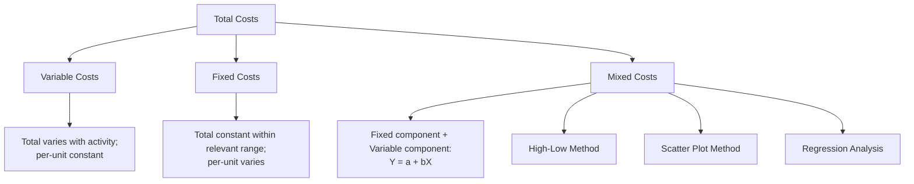

## Variable, Fixed, and Mixed Cost Behavior

### Definition

Cost behavior refers to how a cost changes in total in response to changes in a related activity level or **cost driver** (e.g., units produced, machine hours, sales volume). Understanding cost behavior is foundational to managerial accounting because it enables cost prediction, budgeting, cost-volume-profit (CVP) analysis, and relevant costing for decision-making. Costs are classified by behavior into three primary categories: **variable**, **fixed**, and **mixed (semi-variable)**.

This classification is independent of the direct/indirect classification (which is based on traceability) — a cost can simultaneously be, for example, both indirect and variable.

### Variable Costs

**Definition:** Costs that change in **total** in direct proportion to changes in activity level, while remaining constant on a **per-unit** basis.

**Behavior**

$$\text{Total Variable Cost} = \text{Variable Cost per Unit} \times \text{Activity Level}$$

| Activity Level | Total Variable Cost | Variable Cost per Unit |
| --- | --- | --- |
| Increases | Increases proportionally | Stays constant |
| Decreases | Decreases proportionally | Stays constant |

**Examples**

- Direct materials (more units produced = proportionally more material cost)
- Direct labor (in a piece-rate or hourly-production-linked system)
- Sales commissions (a percentage of each sale)
- Packaging and shipping costs per unit sold

**Graphical Behavior**

Total variable cost forms a straight line through the origin when plotted against activity level; variable cost per unit forms a horizontal line.

### Fixed Costs

**Definition:** Costs that remain constant in **total** within a relevant range of activity, regardless of changes in activity level, while **decreasing per unit** as activity increases (and increasing per unit as activity decreases).

**Behavior**

$$\text{Total Fixed Cost} = \text{Constant, regardless of activity level (within the relevant range)}$$

| Activity Level | Total Fixed Cost | Fixed Cost per Unit |
| --- | --- | --- |
| Increases | Stays constant | Decreases |
| Decreases | Stays constant | Increases |

**Examples**

- Factory rent or lease payments
- Straight-line depreciation on equipment
- Salaried supervisor or manager compensation
- Property taxes and insurance on the factory

**The Relevant Range**

Fixed costs are only fixed within a **relevant range** — the span of activity over which the assumed cost behavior pattern holds true. Outside this range, fixed costs can change in "step" fashion (see step costs, below). For example, factory rent is fixed for production between 0 and 10,000 units per month using the current facility, but if production exceeds facility capacity, an additional facility (and additional rent) would be required.

**Graphical Behavior**

Total fixed cost forms a horizontal line when plotted against activity level; fixed cost per unit forms a downward-sloping curve (a hyperbola) that never reaches zero.

### Mixed (Semi-Variable) Costs

**Definition:** Costs that contain both a fixed component and a variable component — a fixed baseline amount that must be paid regardless of activity, plus a variable amount that changes with activity level.

**Behavior**

$$Y = a + bX$$

Where:

- $Y$ = total mixed cost
- $a$ = total fixed cost component (the intercept)
- $b$ = variable cost per unit of activity (the slope)
- $X$ = activity level (the cost driver)

**Examples**

- Utility bills (a fixed base charge plus a variable usage-based charge)
- Equipment rental with a base fee plus a per-hour usage charge
- Sales representative compensation (a base salary plus commission)
- Maintenance costs (a fixed inspection cost plus variable cost tied to machine hours used)

### Methods to Separate Mixed Costs into Fixed and Variable Components

Since mixed costs combine both behaviors, several techniques exist to estimate the fixed and variable portions:

**High-Low Method**

Uses the highest and lowest activity levels (and their associated costs) to estimate the variable rate and fixed component:

$$\text{Variable Cost per Unit} = \frac{\text{Cost at Highest Activity} - \text{Cost at Lowest Activity}}{\text{Highest Activity Level} - \text{Lowest Activity Level}}$$

Once the variable rate is known, the fixed component is found by substituting either data point into the equation $Y = a + bX$ and solving for $a$.

**Scatter Plot (Scattergraph) Method**

Plots cost data against activity level visually, allowing an analyst to fit a line by inspection and assess whether a linear relationship reasonably describes the data.

**Regression Analysis (Least-Squares Method)**

Uses statistical regression to determine the best-fit line through all data points, minimizing the sum of squared deviations — generally considered the most statistically rigorous of the three methods, since it uses all available data points rather than only two extremes.

### Comparison Table

| Cost Type | Total Cost Behavior | Per-Unit Cost Behavior | Example |
| --- | --- | --- | --- |
| Variable | Changes proportionally with activity | Constant | Direct materials |
| Fixed | Constant within relevant range | Decreases as activity increases | Factory rent |
| Mixed | Increases with activity, but not proportionally (has a fixed base) | Decreases as activity increases (approaching the variable rate) | Utility bills |

### Step (Step-Variable / Step-Fixed) Costs

A related behavior pattern worth noting: **step costs** remain fixed over a narrow range of activity but jump to a new fixed level once a threshold is crossed — for example, hiring an additional supervisor once production exceeds a certain number of units. Step costs are sometimes treated as approximately fixed (if the "steps" are wide relative to the relevant range) or approximately variable (if the steps are narrow).

### Why This Classification Matters

**Cost-Volume-Profit (CVP) Analysis**

Accurate separation of costs into fixed and variable components is a prerequisite for CVP analysis, break-even calculations, and contribution margin analysis — a mixed cost that isn't properly separated will distort these calculations.

**Budgeting and Forecasting**

Flexible budgets rely on understanding cost behavior to project costs accurately at different anticipated activity levels, rather than using a single static budget figure.

**Relevant Costing for Decisions**

Fixed costs are often (though not always) irrelevant to short-term decisions since they typically do not change regardless of the decision made, whereas variable costs typically do change and are more often relevant to decisions such as special orders or make-or-buy analysis.

**Pricing and Profitability Analysis**

Understanding how costs behave at different volumes helps managers set prices that cover both fixed and variable costs appropriately across a range of expected sales volumes.

### Illustrative Example

A bakery incurs the following costs in a month, analyzed against units of bread produced:

| Cost Item | Behavior | Data |
| --- | --- | --- |
| Flour and yeast | Variable | $0.50 per loaf |
| Factory rent | Fixed | $3,000/month regardless of volume |
| Electricity bill | Mixed | $500 base charge + $0.10 per loaf baked |

If the bakery produces 4,000 loaves in a month:

$$\text{Variable Cost (Flour)} = 4{,}000 \times \$0.50 = \$2{,}000$$

$$\text{Fixed Cost (Rent)} = \$3{,}000 \text{ (unchanged regardless of volume)}$$

$$\text{Mixed Cost (Electricity)} = \$500 + (4{,}000 \times \$0.10) = \$500 + \$400 = \$900$$

$$\text{Total Cost} = \$2{,}000 + \$3{,}000 + \$900 = \$5{,}900$$

If production instead rises to 5,000 loaves, flour cost rises proportionally to $2,500 and electricity rises to $1,000, but rent remains fixed at $3,000 — illustrating the three distinct behaviors within a single cost structure.

### Conceptual Diagram

### Key Points

- **Variable costs**: constant per unit, total changes proportionally with activity.
- **Fixed costs**: constant in total within the relevant range, per-unit cost decreases as activity increases.
- **Mixed costs** combine both behaviors and must be separated into fixed and variable components using the **high-low method, scatter plot method, or regression analysis** before use in most managerial calculations.
- Fixed costs are only fixed within a **relevant range**; outside that range, they may behave as **step costs**, jumping to a new level.
- Correctly classifying cost behavior is a **prerequisite** for CVP analysis, flexible budgeting, and relevant costing — misclassifying a mixed cost as purely fixed or purely variable will distort these analyses.

### Related Topics

- Cost-Volume-Profit (CVP) Analysis
- High-Low Method for Cost Estimation
- Regression Analysis in Cost Estimation
- Contribution Margin and Break-Even Analysis
- Flexible Budgeting
- Relevant Costs and Short-Term Decision-Making
- Direct Costs versus Indirect Costs