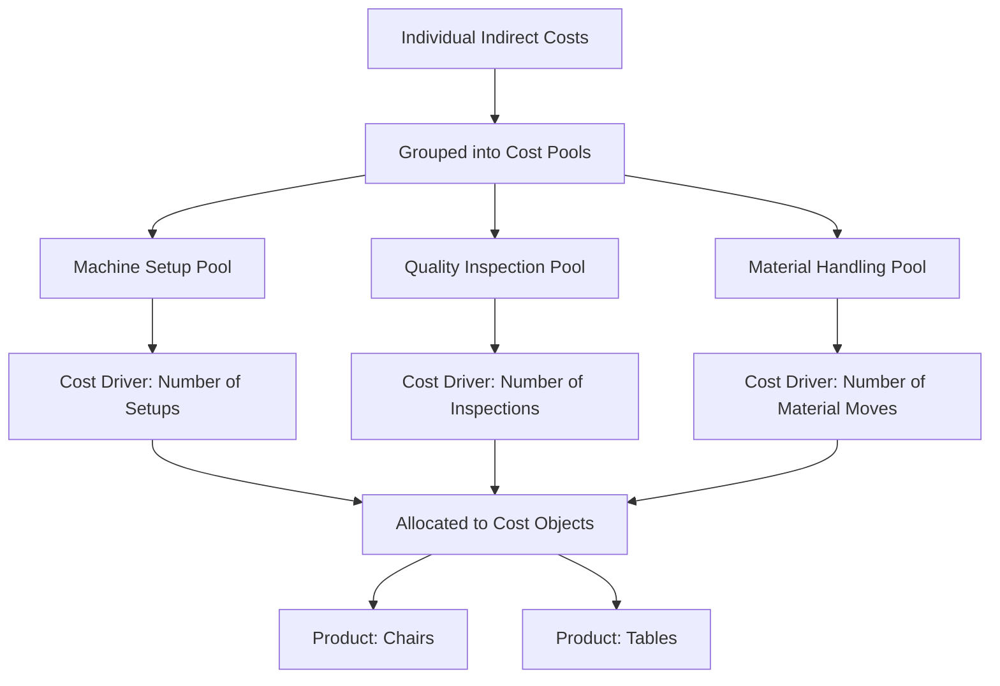

## Cost Objects, Cost Pools, and Cost Drivers

### Definition

Cost objects, cost pools, and cost drivers are three foundational concepts that structure how costs are accumulated and assigned within a costing system. Together they answer three sequential questions: **What are we costing?** (cost object), **How do we group the costs?** (cost pool), and **What causes those costs to be incurred?** (cost driver). These concepts underlie every costing methodology, from simple traditional overhead allocation to activity-based costing (ABC).

### Cost Objects

**Definition:** Anything for which a separate measurement of cost is desired.

A cost object is the target of the costing exercise — the item, activity, or entity whose cost management wants to know. Cost objects can exist at many levels of granularity, and a single organization typically tracks costs for multiple cost objects simultaneously, depending on the decision being supported.

**Common Types of Cost Objects**

| Cost Object Type | Example |
| --- | --- |
| Product | A specific model of chair |
| Service | A consulting engagement for a client |
| Project | Construction of a new building |
| Customer | A specific major account |
| Department | The marketing department |
| Activity | Machine setup for a production run |
| Geographic region | The European sales territory |

**Why It Matters**

The choice of cost object determines which costs are classified as direct versus indirect (see *Direct Costs versus Indirect Costs*). A cost that is indirect relative to one cost object (e.g., a factory supervisor's salary relative to an individual unit) may be direct relative to a broader cost object (that same salary relative to the factory as a whole).

### Cost Pools

**Definition:** A grouping of individual costs that are accumulated together, typically because they are caused by the same or similar underlying factors, before being assigned to cost objects.

A cost pool is essentially a "bucket" of related indirect costs that is easier to manage and allocate collectively than by tracking each individual cost item separately.

**Common Examples of Cost Pools**

- **Manufacturing overhead pool** — combining factory rent, indirect labor, utilities, and depreciation into a single pool for allocation to products
- **Machine setup cost pool** — combining all costs related to setting up equipment for a production run (labor, calibration, materials testing)
- **Quality inspection cost pool** — combining inspector salaries, testing equipment depreciation, and quality-related supplies
- **Customer service cost pool** — combining call center staffing, CRM software costs, and support materials

**Single Pool vs. Multiple Pools**

- **Traditional costing systems** often use a **single, plant-wide cost pool** for all manufacturing overhead, allocated using one broad cost driver (e.g., direct labor hours). This is simple but can distort product costs when different products consume overhead resources disproportionately.
- **Activity-based costing (ABC)** systems use **multiple, activity-specific cost pools**, each allocated using its own cost driver most closely tied to what actually causes that cost pool's expenses — improving costing accuracy at the expense of increased complexity.

### Cost Drivers

**Definition:** A factor that causes, or is strongly correlated with, changes in the cost of an activity or cost pool. Cost drivers are used as the **allocation base** to assign pooled indirect costs to cost objects.

**Characteristics of a Good Cost Driver**

- Has a plausible **cause-and-effect relationship** with the cost being allocated
- Is measurable and practical to track
- Provides a reasonably accurate basis for allocation

**Common Cost Drivers by Cost Pool**

| Cost Pool | Common Cost Driver |
| --- | --- |
| Manufacturing overhead (traditional) | Direct labor hours, machine hours |
| Machine setup costs | Number of setups |
| Material handling costs | Number of material moves, weight of materials moved |
| Quality inspection costs | Number of inspections, number of defects found |
| Purchasing department costs | Number of purchase orders |
| Customer service costs | Number of service calls |

**Volume-Based vs. Activity-Based Drivers**

- **Volume-based drivers** (direct labor hours, machine hours, units produced) assume overhead costs vary primarily with production volume — the traditional costing assumption.
- **Activity-based drivers** (number of setups, number of purchase orders, number of inspections) recognize that many overhead costs are driven by the complexity and diversity of activities, not simply by volume — the foundation of activity-based costing.

### How the Three Concepts Work Together

The relationship between cost objects, cost pools, and cost drivers forms the backbone of the cost assignment process:

1. Individual costs are incurred and classified as either **directly traceable** to a cost object or **indirect**, requiring allocation.
2. Indirect costs with similar cause-and-effect relationships are grouped into **cost pools**.
3. A **cost driver** is selected for each cost pool, based on what most plausibly causes the costs within that pool.
4. The cost pool is allocated to cost objects in proportion to each cost object's consumption of the cost driver.

$$\text{Cost Allocated to Object} = \left(\frac{\text{Cost Pool Total}}{\text{Total Cost Driver Volume}}\right) \times \text{Cost Object's Driver Consumption}$$

### Illustrative Example

A furniture manufacturer wants to determine the cost of producing chairs and tables (the **cost objects**).

**Step 1 — Identify indirect costs and group into cost pools:**

| Cost Pool | Costs Included | Total |
| --- | --- | --- |
| Machine Setup Pool | Setup labor, calibration | $12,000 |
| Quality Inspection Pool | Inspector salaries, testing supplies | $8,000 |
| Material Handling Pool | Forklift operator wages, fuel | $6,000 |

**Step 2 — Select a cost driver for each pool:**

| Cost Pool | Cost Driver | Total Driver Volume |
| --- | --- | --- |
| Machine Setup Pool | Number of setups | 60 setups |
| Quality Inspection Pool | Number of inspections | 400 inspections |
| Material Handling Pool | Number of material moves | 300 moves |

**Step 3 — Allocate to cost objects based on consumption:**

If chairs require 40 of the 60 setups, the Machine Setup Pool allocation to chairs is:

$$\left(\frac{\$12{,}000}{60 \text{ setups}}\right) \times 40 \text{ setups} = \$200 \text{ per setup} \times 40 = \$8{,}000 \text{ allocated to chairs}$$

The remaining $4,000 would be allocated to tables (20 setups), and similar calculations would apply to the other two pools using their respective drivers.

### Conceptual Diagram

### Key Points

- A **cost object** is anything for which a separate cost measurement is desired — products, services, customers, departments, or activities.
- A **cost pool** groups related indirect costs together, typically because they share a common underlying cause, simplifying allocation.
- A **cost driver** is the factor used to allocate a cost pool to cost objects, ideally reflecting a genuine cause-and-effect relationship.
- **Traditional costing** typically uses a single, broad cost pool and volume-based driver; **activity-based costing** uses multiple, narrower cost pools with drivers tailored to each activity, improving accuracy at the cost of complexity.
- Poor cost driver selection — one with a weak cause-and-effect relationship to the cost pool — undermines the accuracy of the entire cost allocation process, regardless of how carefully the pools themselves are constructed.

### Related Topics

- Direct Costs versus Indirect Costs
- Activity-Based Costing (ABC)
- Manufacturing Overhead and Overhead Allocation
- Job Order Costing vs. Process Costing
- Predetermined Overhead Rates and Allocation Bases
- Activity-Based Management (ABM)