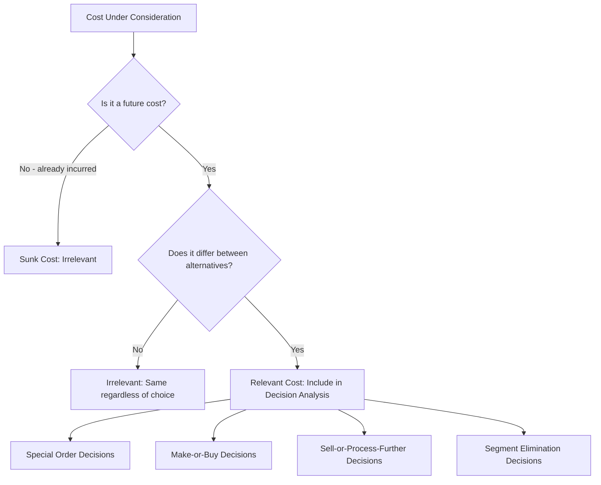

## Relevant Costs versus Irrelevant Costs

### Definition

Relevant costs and irrelevant costs form a classification based on **decision usefulness** — whether a cost (or revenue) differs between the alternatives being considered in a specific decision. This classification is central to short-term managerial decision-making, since including irrelevant information in a decision analysis can lead to incorrect conclusions, while omitting relevant information produces an incomplete analysis.

- **Relevant costs** are future costs that differ between decision alternatives.
- **Irrelevant costs** are costs that either have already been incurred (sunk) or will not differ between alternatives, and therefore should be excluded from the decision analysis.

### The Relevance Criteria

A cost qualifies as relevant to a specific decision if, and only if, it satisfies **both** of the following conditions:

1. **It is a future cost** — it has not yet been incurred and will be affected by the decision
2. **It differs between the alternatives** being evaluated

If either condition fails, the cost is irrelevant to that particular decision, even if it is a real and significant cost to the business overall.

### Sunk Costs

**Definition:** Costs that have already been incurred and cannot be changed or recovered by any future decision.

**Why They're Irrelevant**

Sunk costs fail the first relevance criterion — they are not future costs, since they have already occurred regardless of which alternative is chosen going forward. No decision made today can undo a cost already paid.

**Common Examples**

- The original purchase price of equipment already owned
- Money already spent on research and development for a project under evaluation
- The book value of an asset being considered for replacement

**A Common Decision-Making Trap**

Managers frequently and incorrectly factor sunk costs into decisions — a pattern sometimes called the "sunk cost fallacy." For example, continuing to invest in a failing project because of how much has already been spent, rather than evaluating the project based solely on its future prospects, represents a misapplication of sunk cost reasoning to a forward-looking decision.

### Future Costs That Do Not Differ Between Alternatives

Even future costs can be irrelevant if they will be incurred **regardless of which alternative is chosen**.

**Example:** A factory's rent will be paid whether the company chooses to make a component in-house or buy it from an outside supplier — the same total rent is paid either way, so it is irrelevant to the make-or-buy decision, even though it is a real, ongoing future cost.

### Relevant Cost Examples

| Cost Type | Relevant When... |
| --- | --- |
| Incremental (differential) costs | They arise only under one alternative and not another |
| Avoidable costs | They can be eliminated by choosing a particular alternative |
| Opportunity costs | The benefit forgone by choosing one alternative over another |
| Differential revenues | Revenue that would differ between alternatives |

### Opportunity Costs

**Definition:** The potential benefit that is given up when one alternative is chosen over another.

Opportunity costs are a distinctive category because they represent **forgone benefits rather than actual cash outflows**, yet they are just as relevant to decision-making as explicit costs. Since opportunity costs are not recorded in the accounting system (they represent what didn't happen), they must be explicitly identified and estimated by the decision-maker.

**Example:** If a factory uses idle floor space to produce a special order, the opportunity cost is the profit that could have been earned by using that same space for another purpose (e.g., renting it out, or producing a different product).

### Common Decision Types Using Relevant Cost Analysis

**Special Order Decisions**

Evaluating whether to accept a one-time order at a reduced price, focusing on whether the order's incremental revenue exceeds its incremental (relevant) costs, while ignoring fixed costs that will be incurred regardless.

**Make-or-Buy Decisions**

Comparing the relevant costs of producing a component in-house against the cost of purchasing it externally, including consideration of avoidable fixed costs and any opportunity cost of freed-up capacity.

**Sell-or-Process-Further Decisions**

Determining whether to sell a product at a current stage of production or process it further, based on whether the incremental revenue from further processing exceeds the incremental processing costs — the costs already incurred to reach the current stage (joint costs) are sunk and irrelevant.

**Segment or Product Line Elimination**

Evaluating whether to discontinue a product line or business segment, focusing on which costs are actually avoidable if the segment is eliminated, versus common/shared costs that would continue regardless.

**Equipment Replacement Decisions**

Comparing the future costs of continuing to use existing equipment versus replacing it, where the book value (undepreciated cost) of the old equipment is sunk and irrelevant, though its current disposal value is relevant.

### Comparison Table

| Dimension | Relevant Costs | Irrelevant Costs |
| --- | --- | --- |
| Timing | Future | Past (sunk) or unaffected future |
| Differs between alternatives? | Yes | No |
| Include in decision analysis? | Yes | No (exclude) |
| Examples | Incremental materials, avoidable fixed costs, opportunity costs | Sunk costs, allocated common fixed costs that don't change |

### Illustrative Example

A company is deciding whether to accept a special one-time order for 500 units at $18 per unit, below its normal selling price of $25. The company has idle production capacity.

| Cost Item | Amount | Relevant? | Reasoning |
| --- | --- | --- | --- |
| Direct materials ($6/unit) | $3,000 | Yes | Will be incurred only if the order is accepted |
| Direct labor ($4/unit) | $2,000 | Yes | Will be incurred only if the order is accepted |
| Variable overhead ($2/unit) | $1,000 | Yes | Varies with the order |
| Fixed factory overhead (allocated) | $2,500 | No | Will be incurred regardless of this decision (idle capacity used) |
| Original equipment purchase cost | N/A | No | Sunk cost; already incurred |

**Relevant Cost Analysis:**

$$\text{Incremental Revenue} = 500 \times \$18 = \$9{,}000$$

$$\text{Relevant Costs} = \$3{,}000 + \$2{,}000 + \$1{,}000 = \$6{,}000$$

$$\text{Incremental Profit} = \$9{,}000 - \$6{,}000 = \$3{,}000$$

Since incremental revenue exceeds relevant costs, accepting the order increases profit by $3,000 — a conclusion that would be obscured if the irrelevant allocated fixed overhead ($2,500) or the sunk equipment cost were incorrectly included in the analysis.

### Conceptual Diagram

### Key Points

- A cost is relevant only if it is **both a future cost and differs between the alternatives** being evaluated — failing either test makes it irrelevant to that specific decision.
- **Sunk costs are always irrelevant** to future decisions, since they cannot be changed regardless of which alternative is chosen — despite this, they are commonly and incorrectly factored into decisions (the sunk cost fallacy).
- **Opportunity costs** are relevant even though they represent forgone benefits rather than actual cash outflows, and must be explicitly identified since they don't appear in the accounting records.
- Relevance is **decision-specific** — the same cost can be relevant to one decision and irrelevant to another, depending on whether it changes under the alternatives being compared.
- Relevant cost analysis underlies major managerial decisions including **special orders, make-or-buy, sell-or-process-further, segment elimination, and equipment replacement**.

### Related Topics

- Cost Objects, Cost Pools, and Cost Drivers
- Variable, Fixed, and Mixed Cost Behavior
- Special Order Decisions
- Make-or-Buy Decisions
- Sell-or-Process-Further Decisions
- Segment Reporting and Elimination Decisions
- Opportunity Cost in Managerial Decision-Making