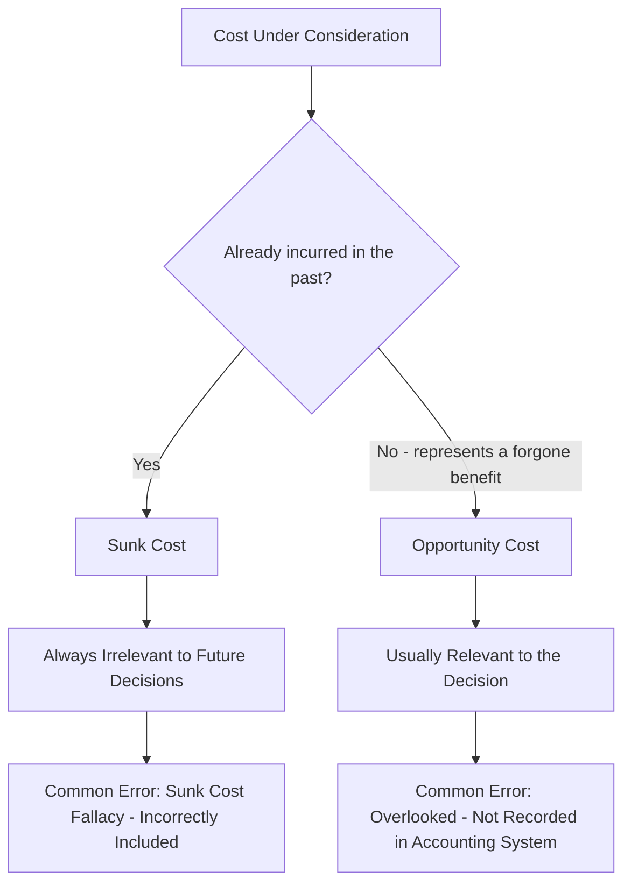

## Sunk Costs and Opportunity Costs

### Definition

Sunk costs and opportunity costs are two specialized cost concepts central to managerial decision-making, each representing an extreme end of the relevance spectrum. **Sunk costs** are always irrelevant to future decisions because they have already been incurred and cannot be changed. **Opportunity costs**, by contrast, are frequently relevant despite never appearing in the formal accounting records, because they represent real economic sacrifices tied directly to the decision at hand. Understanding both concepts — and the common errors surrounding them — is essential for sound short-term decision analysis.

### Sunk Costs

**Definition:** Costs that have already been incurred in the past and cannot be recovered or altered by any current or future decision.

**Core Characteristic**

Sunk costs fail the fundamental test of relevance: they are not future costs. Regardless of which alternative a manager chooses going forward, a sunk cost has already been paid and will remain the same — it appears identically under every alternative being considered, including the choice to do nothing.

**Common Examples**

- The original purchase price of equipment currently owned
- Money already spent on research and development for a project under review
- The historical (book) value of an asset being evaluated for replacement or disposal
- Costs already incurred on a partially completed project

**Sunk Costs and Book Value**

A frequent point of confusion involves the **book value of an asset** in a replacement decision. The book value itself is sunk and irrelevant — it cannot be changed by keeping or replacing the asset. However, related figures such as the **current disposal (salvage) value** of the old asset and the **purchase price of the new asset** are relevant, since they are future cash flows that differ between the alternatives.

**The Sunk Cost Fallacy**

The sunk cost fallacy is the common behavioral tendency to let past, unrecoverable expenditures influence a current decision, even though rational decision-making should be based solely on future costs and benefits. Typical manifestations include:

- Continuing to fund a failing project because of how much has already been invested ("we can't stop now, we've already spent so much")
- Finishing a movie or event already paid for, even when abandoning it would produce a better outcome
- Retaining underperforming equipment because of its high original purchase price, rather than evaluating replacement purely on future cost and benefit

The correct managerial response is to evaluate every decision based only on relevant future costs and benefits, deliberately excluding sunk costs from the analysis regardless of their emotional or psychological pull.

### Opportunity Costs

**Definition:** The value of the best forgone alternative — the benefit that is given up when one course of action is chosen over another.

**Core Characteristic**

Unlike sunk costs, opportunity costs are almost always **relevant** to a decision, since they represent a real economic consequence that differs specifically because of the choice being made. However, opportunity costs are unusual in that they **do not appear as actual transactions in the accounting records** — no invoice or ledger entry documents a forgone benefit. They must be explicitly identified and estimated by the decision-maker.

**Common Examples**

- The profit forgone by using idle factory capacity to fulfill a special order instead of a different production run
- The interest income forgone by holding cash rather than investing it
- The salary forgone by a business owner who works in their own company instead of taking outside employment
- The rental income forgone by using owned space for internal operations instead of leasing it to a third party

**Why Opportunity Costs Are Easy to Overlook**

Because opportunity costs never generate a recorded transaction, they are the type of relevant cost most likely to be omitted from a decision analysis by mistake — not because they are conceptually difficult, but because there is no natural accounting trigger prompting the analyst to consider them. Rigorous relevant cost analysis requires actively asking: "What am I giving up by choosing this alternative?"

### Comparison Table

| Dimension | Sunk Costs | Opportunity Costs |
| --- | --- | --- |
| Timing | Past — already incurred | Represents a forgone future benefit |
| Recorded in accounting system? | Yes (as a past transaction) | No (never recorded as a transaction) |
| Relevance to decisions | Always irrelevant | Usually relevant |
| Common error | Being incorrectly included in decision analysis (sunk cost fallacy) | Being overlooked entirely (since not recorded) |
| Example | Original equipment purchase price | Profit forgone by not using capacity for an alternative purpose |

### Illustrative Example: Sunk Cost

A company purchased a specialized machine two years ago for $50,000, which now has a book value of $20,000. A new, more efficient machine is available for $30,000 with lower operating costs.

| Item | Relevant? | Reasoning |
| --- | --- | --- |
| $50,000 original purchase price | No | Sunk — already spent |
| $20,000 current book value | No | Sunk — an accounting artifact, not a future cash flow |
| $30,000 cost of new machine | Yes | A future cash outflow that differs between alternatives |
| Current disposal value of old machine (e.g., $5,000) | Yes | A future cash inflow only available if the old machine is replaced |
| Future operating cost savings from the new machine | Yes | Differs between the two alternatives |

The decision should be based entirely on the future cash flows — the $30,000 new machine cost, the $5,000 disposal proceeds, and the operating cost savings — never on the sunk $50,000 or $20,000 figures.

### Illustrative Example: Opportunity Cost

A furniture company has idle factory capacity and receives two mutually exclusive options for using it this month:

- **Option A:** Accept a special order generating $8,000 in incremental profit
- **Option B:** Use the same capacity to produce a batch of a regular product line generating $6,000 in incremental profit

If the company chooses Option A, the opportunity cost of that decision is the $6,000 in profit forgone by not pursuing Option B. This $6,000 never appears in the accounting records as an actual cost — no cash changes hands for it — but it is a real, relevant consideration in evaluating whether Option A is truly the best choice, and it must be weighed against Option A's own incremental benefit.

### Conceptual Diagram

### Key Points

- **Sunk costs** are always irrelevant to future decisions because they cannot be changed regardless of the alternative chosen — the most common analytical error is incorrectly including them (the sunk cost fallacy).
- **Opportunity costs** represent the value of the best forgone alternative and are typically relevant, but the most common error is overlooking them entirely, since they never appear as recorded transactions.
- In asset replacement decisions, the **book value of an existing asset is sunk and irrelevant**, while its **current disposal value** and the **cost of the replacement** are relevant future cash flows.
- Rigorous relevant cost analysis requires deliberately **excluding all sunk costs** and deliberately **identifying all opportunity costs**, since each carries an opposite risk of misapplication.
- Both concepts reinforce the core principle of relevant costing: decisions should be based only on **future costs and benefits that differ between the alternatives** under consideration.

### Related Topics

- Relevant Costs versus Irrelevant Costs
- Make-or-Buy Decisions
- Special Order Decisions
- Equipment Replacement Decisions
- Behavioral Biases in Managerial Decision-Making
- Capital Budgeting Techniques (NPV, IRR, Payback)