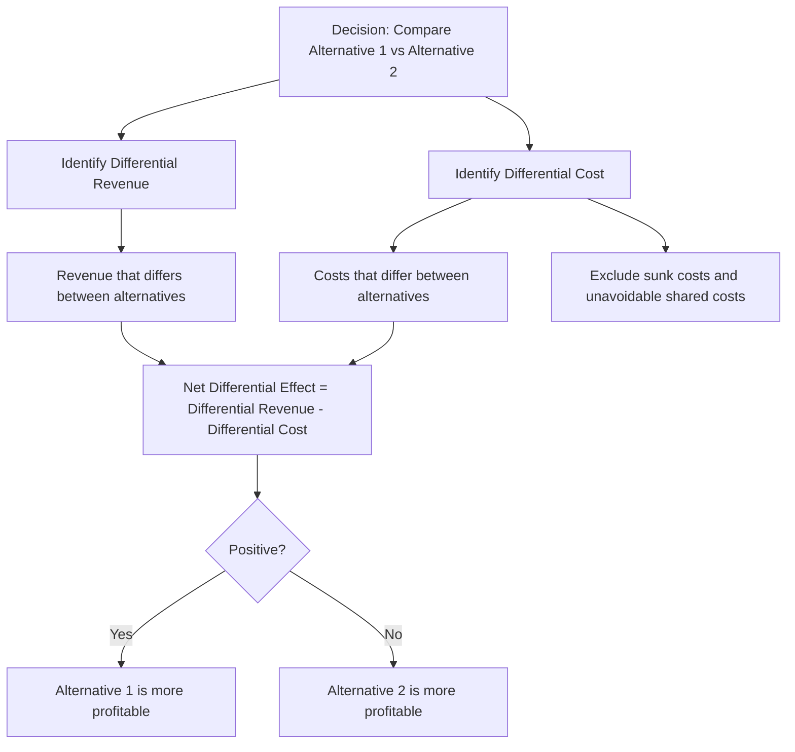

## Differential and Incremental Costs and Revenues

### Definition

Differential costs and revenues (also called incremental costs and revenues) represent the **difference in total cost or total revenue between two decision alternatives**. This concept is the quantitative engine behind relevant cost analysis — while relevant costing identifies *which* costs matter to a decision, differential analysis calculates the actual *net difference* those relevant items produce, enabling a direct comparison between alternatives.

$$\text{Differential Cost} = \text{Total Cost of Alternative A} - \text{Total Cost of Alternative B}$$

$$\text{Differential Revenue} = \text{Total Revenue of Alternative A} - \text{Total Revenue of Alternative B}$$

### Terminology Clarification

The terms "differential" and "incremental" are frequently used interchangeably in managerial accounting, though a subtle distinction is sometimes drawn:

- **Differential** is the broader, more general term, referring to any difference between alternatives (which could be positive or negative).
- **Incremental** technically refers specifically to an *increase* — the additional cost or revenue associated with a higher level of activity or a new alternative — though it is very commonly used as a synonym for "differential" in practice, including when the change is actually a decrease. [Inference — this distinction is a matter of textbook convention rather than a universally enforced rule; many sources use the terms fully interchangeably regardless of direction.]

For practical purposes in managerial decision analysis, both terms are used to describe the **net change in cost or revenue resulting from choosing one alternative over another**.

### Differential Cost

**Definition:** The difference in total cost between two alternatives being compared.

Differential cost analysis isolates the **relevant costs** — those that differ between alternatives — while excluding costs that remain identical regardless of which choice is made (irrelevant costs, including sunk costs and unavoidable shared costs).

**Formula**

$$\text{Differential Cost} = \text{Cost Under Alternative 1} - \text{Cost Under Alternative 2}$$

A positive differential cost means Alternative 1 costs more than Alternative 2; a negative differential cost means Alternative 1 costs less.

### Differential Revenue

**Definition:** The difference in total revenue between two alternatives being compared.

Differential revenue analysis is particularly important in decisions where alternatives generate different sales volumes or price points, such as special order decisions or sell-or-process-further decisions.

**Formula**

$$\text{Differential Revenue} = \text{Revenue Under Alternative 1} - \text{Revenue Under Alternative 2}$$

### The Differential Analysis Framework

Differential analysis combines differential cost and differential revenue into a single net comparison:

$$\text{Net Differential Effect} = \text{Differential Revenue} - \text{Differential Cost}$$

A positive net differential effect indicates that the alternative under consideration is more profitable than the comparison alternative; a negative result indicates it is less profitable.

### Relationship to Other Relevant Costing Concepts

| Concept | Relationship to Differential Analysis |
| --- | --- |
| Relevant costs | The specific cost items that, when compared across alternatives, produce the differential cost |
| Sunk costs | Excluded entirely from differential analysis, since they don't differ between alternatives (they're identical — already spent — under both) |
| Opportunity costs | Incorporated into differential analysis as part of the cost of the alternative that forgoes them |
| Contribution margin | Differential analysis on price/volume decisions often reduces to a contribution margin comparison |

### Common Applications

**Special Order Decisions**

Comparing the differential revenue (the special order price times quantity) against the differential cost (the incremental variable costs of fulfilling the order) to determine whether the order should be accepted.

**Make-or-Buy Decisions**

Comparing the differential cost of manufacturing a component internally against the differential cost of purchasing it externally, including any avoidable costs and opportunity costs of freed capacity.

**Sell-or-Process-Further Decisions**

Comparing the differential revenue gained from further processing against the differential cost of that additional processing, while excluding joint costs already incurred (which are sunk).

**Adding or Dropping a Product Line**

Comparing the differential revenue lost and differential (avoidable) costs saved by discontinuing a product line.

**Equipment Replacement Decisions**

Comparing the differential operating costs and differential cash flows between keeping existing equipment and acquiring new equipment.

### Illustrative Example

A company is deciding whether to process a partially finished product further before selling it, or sell it as-is at the current stage.

| Item | Sell As-Is | Process Further | Differential |
| --- | --- | --- | --- |
| Selling price per unit | $40 | $55 | +$15 (Differential Revenue) |
| Additional processing cost per unit | $0 | $10 | +$10 (Differential Cost) |
| Joint cost already incurred (sunk) | $25 | $25 | $0 (irrelevant — identical under both) |

**Differential Analysis:**

$$\text{Differential Revenue} = \$55 - \$40 = \$15 \text{ per unit}$$

$$\text{Differential Cost} = \$10 - \$0 = \$10 \text{ per unit}$$

$$\text{Net Differential Effect} = \$15 - \$10 = \$5 \text{ per unit}$$

Since the net differential effect is positive ($5 per unit in favor of processing further), the company should process the product further. Note that the $25 joint cost per unit is entirely excluded from the analysis, since it is sunk and identical under both alternatives — it does not appear anywhere in the differential calculation.

### Illustrative Example: Special Order Decision

A manufacturer normally sells a product for $50 per unit, with variable costs of $30 per unit and allocated fixed costs of $12 per unit (based on normal volume). A customer offers to buy 1,000 units at $38 per unit, and the company has idle capacity.

| Item | Amount |
| --- | --- |
| Differential Revenue (1,000 × $38) | $38,000 |
| Differential Cost (1,000 × $30 variable cost) | $30,000 |
| Fixed costs (unaffected — irrelevant, excluded) | Not included |

$$\text{Net Differential Effect} = \$38{,}000 - \$30{,}000 = \$8{,}000 \text{ increase in profit}$$

Even though $38 per unit is below the normal $50 selling price and even below the $42 "full cost" ($30 variable + $12 allocated fixed), the order should be accepted because it generates a positive net differential effect — the allocated fixed cost of $12 per unit is irrelevant, since total fixed costs do not change based on this decision.

### Conceptual Diagram

### Key Points

- Differential (incremental) cost and revenue represent the **numerical difference** between two alternatives — the quantitative output of relevant cost analysis.
- The **net differential effect** (differential revenue minus differential cost) determines which alternative is more profitable.
- Costs and revenues that are **identical under both alternatives** — including sunk costs and unavoidable shared/allocated costs — are excluded entirely from differential analysis, since they contribute nothing to the difference.
- Differential analysis is the core analytical technique underlying **special order, make-or-buy, sell-or-process-further, and product line decisions**.
- A common pitfall is comparing "full cost" (including allocated fixed costs) rather than differential cost, which can lead to rejecting profitable opportunities — as illustrated by special order decisions where a price below full cost may still be profitable on a differential basis.

### Related Topics

- Relevant Costs versus Irrelevant Costs
- Sunk Costs and Opportunity Costs
- Special Order Decisions
- Sell-or-Process-Further Decisions
- Make-or-Buy Decisions
- Contribution Margin and Break-Even Analysis
- Variable, Fixed, and Mixed Cost Behavior