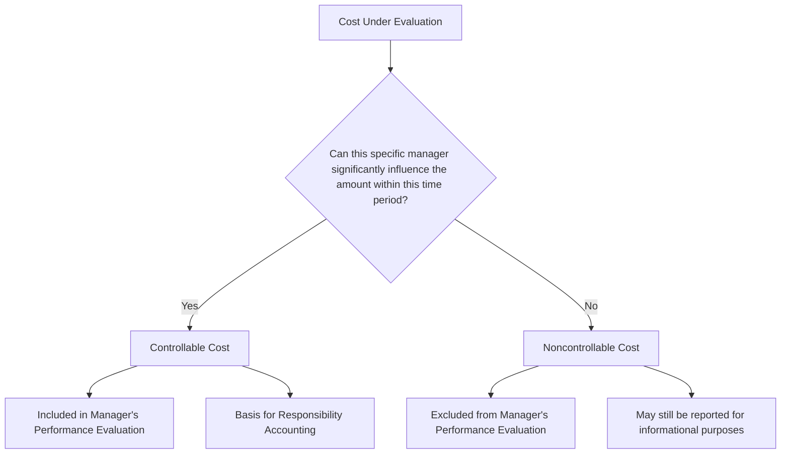

## Controllable versus Noncontrollable Costs

### Definition

Controllable versus noncontrollable cost classification is based on **whether a specific manager has the authority to influence or determine the amount of a cost** within a defined time period. This classification underlies responsibility accounting, where managers are evaluated based on the costs and revenues they can actually influence, rather than on costs over which they have no authority.

- **Controllable costs** can be significantly influenced by a given manager within a given time period.
- **Noncontrollable costs** cannot be significantly influenced by a given manager within that time period, regardless of how much the manager might want to change them.

### The Relativity Principle

Like the direct/indirect classification, controllability is always defined **relative to a specific manager and a specific time period** — the same cost can be controllable by one manager and noncontrollable by another, and a cost noncontrollable in the short term may become controllable over a longer horizon.

**Relative to the Manager**

- A production supervisor may control direct materials usage and overtime labor within their department, but cannot control the allocated portion of corporate headquarters rent charged to their department.
- The plant manager, one level up, may be able to influence broader facility decisions (e.g., consolidating operations) that the production supervisor cannot.
- The CEO may be able to influence corporate overhead structure entirely, which is noncontrollable to virtually everyone below them.

**Relative to the Time Period**

- Fixed costs arising from long-term contracts (e.g., a five-year equipment lease) are typically noncontrollable in the short term, since the manager cannot unilaterally exit the contract.
- Over a longer time horizon, however, that same manager (or their successor) may have the opportunity to renegotiate, decline renewal, or select a different arrangement, making the cost controllable in the long run.

### Comparison Table

| Dimension | Controllable Costs | Noncontrollable Costs |
| --- | --- | --- |
| Manager's authority | Can significantly influence the amount | Cannot significantly influence the amount |
| Common examples | Direct materials usage, overtime hours, discretionary department spending | Allocated corporate overhead, long-term lease commitments, depreciation on centrally-purchased assets |
| Time sensitivity | May become noncontrollable if authority is removed | May become controllable over a longer time horizon |
| Role in performance evaluation | Appropriate basis for evaluating the manager | Inappropriate basis for evaluating the manager |

### Why This Distinction Matters

**Responsibility Accounting**

Controllability is the foundational principle behind **responsibility accounting**, a system that assigns accountability for costs, revenues, and profits to the managers who have the authority to influence them. Responsibility reports are structured to separate controllable costs (the basis for evaluating a manager's performance) from noncontrollable costs (which should be excluded from that manager's performance evaluation, even if they still appear in the department's total cost report for informational purposes).

**Fair Performance Evaluation**

Holding a manager accountable for noncontrollable costs is widely considered poor management practice, since it evaluates the manager on factors outside their influence, which can:

- Demotivate managers who feel unfairly judged
- Distort incentives, potentially causing managers to focus on the wrong priorities
- Undermine the credibility of the performance evaluation system itself

**Budget Variance Analysis**

When evaluating whether actual costs exceeded budgeted costs, distinguishing controllable from noncontrollable variances helps identify whether a manager's decisions actually caused a variance, or whether the variance resulted from factors beyond their control (e.g., a corporate-wide allocation formula change).

### Controllable vs. Related Classifications

It is important to distinguish controllability from other cost classifications, since they answer different questions and do not always align:

| Classification | Question Answered |
| --- | --- |
| Direct vs. Indirect | Can the cost be traced to a specific cost object? |
| Fixed vs. Variable | How does the cost behave relative to activity level? |
| Controllable vs. Noncontrollable | Can a specific manager influence the cost? |

A cost can be **direct but noncontrollable** — for example, a specific department's allocated share of a corporate insurance policy might be traceable to that department (direct) but entirely outside the department manager's authority to change (noncontrollable). Conversely, a cost can be **indirect but controllable** at a higher organizational level — a plant manager overseeing multiple product lines may control total factory overhead spending even though that overhead is indirect to any individual product.

### Common Examples by Organizational Level

| Cost | Controllable By | Noncontrollable By |
| --- | --- | --- |
| Direct materials usage in a department | Department supervisor | — |
| Overtime labor scheduling | Department supervisor | — |
| Allocated corporate IT overhead | — | Department supervisor |
| Depreciation on centrally-purchased equipment | Corporate/plant management (purchase decision) | Individual department supervisor (no authority over the purchase) |
| Property taxes on the facility | — | Most operational managers (set externally by government) |
| Discretionary training and development budget | Department manager (within approved budget) | — |

### Illustrative Example

A regional sales manager's monthly performance report includes the following costs:

| Cost Item | Amount | Controllable by Regional Manager? |
| --- | --- | --- |
| Sales commissions (based on regional sales) | $15,000 | Yes — driven by regional sales activity they manage |
| Regional travel and entertainment expenses | $4,000 | Yes — discretionary spending within their authority |
| Allocated share of corporate marketing campaign | $8,000 | No — decided and executed at the corporate level |
| Allocated share of CEO's salary | $3,000 | No — entirely outside the regional manager's influence |

For performance evaluation purposes, the regional manager should be assessed based on the $19,000 in controllable costs ($15,000 + $4,000), not the full $30,000 total, since the $11,000 in allocated corporate costs would appear on their report regardless of any decision the regional manager makes.

### Conceptual Diagram

### Key Points

- Controllability is defined **relative to a specific manager and a specific time period** — the same cost can be controllable by one manager (or over a longer horizon) and noncontrollable by another (or in the short term).
- The distinction underlies **responsibility accounting**, which structures performance evaluation around costs a manager can actually influence.
- Holding managers accountable for **noncontrollable costs** is considered poor practice, since it can demotivate managers and distort decision-making incentives.
- Controllability is **independent** of the direct/indirect and fixed/variable classifications — a cost can be direct yet noncontrollable, or indirect yet controllable, depending on the specific manager and cost object involved.
- Responsibility reports typically **separate controllable from noncontrollable costs**, using the controllable portion as the basis for evaluating a manager's performance while still disclosing noncontrollable allocations for informational completeness.

### Related Topics

- Direct Costs versus Indirect Costs
- Responsibility Accounting and Cost, Profit, and Investment Centers
- Variance Analysis and Standard Costing
- Segment Reporting and Elimination Decisions
- Performance Evaluation and the Balanced Scorecard
- Budgeting and Budget Variance Analysis