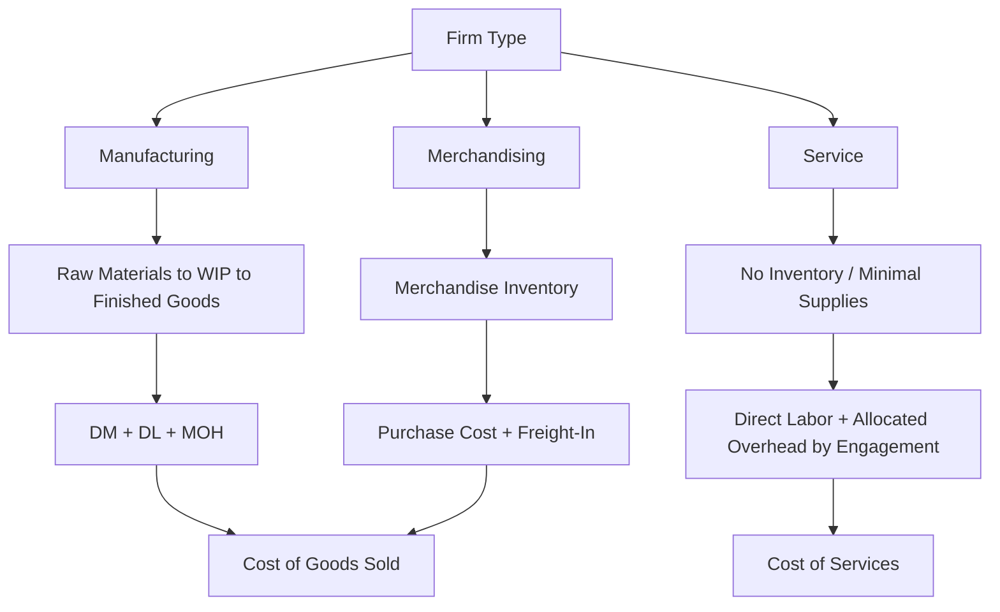

## Cost Classification Across Manufacturing, Merchandising, and Service Firms

### Overview

While the fundamental cost classification concepts covered elsewhere (direct/indirect, fixed/variable, product/period, controllable/noncontrollable) apply universally, their **practical application differs significantly** across the three major types of business organizations: manufacturing firms, merchandising firms, and service firms. Understanding these differences is essential because financial statement structure, inventory accounts, and cost accumulation systems vary substantially by business type.

### The Three Firm Types

| Firm Type | Core Activity | Example |
| --- | --- | --- |
| Manufacturing | Converts raw materials into finished products | Automobile manufacturer, furniture maker |
| Merchandising | Purchases finished goods and resells them without further transformation | Retail store, wholesale distributor |
| Service | Provides intangible services rather than physical products | Consulting firm, hospital, law firm |

### Manufacturing Firms

**Cost Structure**

Manufacturing firms incur the full range of manufacturing costs covered in this chapter's product costing concepts:

$$\text{Total Manufacturing Cost} = \text{Direct Materials} + \text{Direct Labor} + \text{Manufacturing Overhead}$$

**Inventory Accounts**

Manufacturing firms maintain **three distinct inventory accounts** on the balance sheet, reflecting the stages of production:

- **Raw Materials Inventory** — materials purchased but not yet placed into production
- **Work in Process (WIP) Inventory** — partially completed products, with accumulated DM, DL, and MOH costs
- **Finished Goods Inventory** — completed products awaiting sale

**Product vs. Period Costs**

The product/period cost distinction is most elaborate in manufacturing, since product costs pass through all three inventory stages before finally becoming Cost of Goods Sold upon sale.

### Merchandising Firms

**Cost Structure**

Merchandising firms do not manufacture products — they purchase finished goods for resale. As a result, they have no direct materials, direct labor, or manufacturing overhead in the manufacturing sense.

**Cost of Goods Purchased**

Instead of Cost of Goods Manufactured, merchandising firms calculate **Cost of Goods Purchased**, which becomes the basis for Cost of Goods Sold:

$$\text{Cost of Goods Purchased} = \text{Net Purchases} + \text{Freight-In}$$

Where net purchases typically account for purchase discounts and purchase returns/allowances.

**Inventory Accounts**

Merchandising firms maintain only **one inventory account**: **Merchandise Inventory**, representing goods purchased but not yet sold. There is no equivalent to Raw Materials or Work in Process, since no transformation of the product occurs.

**Product Costs in Merchandising**

The "product cost" for a merchandising firm is essentially the purchase price paid to the supplier, plus any costs necessary to bring the goods to a resalable condition and location (such as freight-in). Selling and administrative costs remain period costs, just as in manufacturing.

### Service Firms

**Cost Structure**

Service firms sell intangible services rather than physical products, which fundamentally changes how "cost of the product" is conceived. There is typically no direct materials category in the traditional manufacturing sense, though some service businesses do have materials or supplies directly consumed in service delivery (e.g., medical supplies used treating a patient).

**No Inventory of Finished Product**

Because services are consumed at the point of delivery rather than stored, service firms generally have **no finished goods inventory** and often no inventory accounts at all — though they may carry supplies inventory for materials used in service delivery.

**Direct Costs in Service Firms**

Direct costs in a service context typically consist primarily of **direct labor** — the time of professionals or service workers directly traceable to a specific client, patient, case, or engagement. Examples include:

- Billable consultant hours on a specific client engagement
- Nursing and physician time treating a specific patient
- Attorney hours worked on a specific case

**Overhead in Service Firms**

Service firms still incur indirect/overhead costs — office rent, administrative staff, technology systems, firm-wide marketing — which must be allocated to service "jobs" or engagements using an appropriate cost driver (e.g., billable hours), similar in concept to manufacturing overhead allocation.

### Comparative Summary

| Dimension | Manufacturing | Merchandising | Service |
| --- | --- | --- | --- |
| Core cost elements | DM + DL + MOH | Purchase cost + freight-in | Primarily direct labor + overhead |
| Inventory accounts | Raw Materials, WIP, Finished Goods (3) | Merchandise Inventory (1) | Typically none (or minimal supplies inventory) |
| Cost of Goods Sold basis | Cost of Goods Manufactured | Cost of Goods Purchased | Often replaced by "Cost of Services" |
| Direct materials category | Yes, central | N/A (goods already finished) | Rare; typically supplies only |
| Product vs. period cost complexity | Highest — passes through 3 inventory stages | Moderate — single inventory stage | Lowest — often minimal or no inventory stage |
| Typical costing method | Job order or process costing | Retail/purchase cost tracking | Job order-style costing by engagement/case |

### Why This Comparison Matters

**Costing System Design**

The type of firm strongly influences which costing methodology is most appropriate — manufacturing firms typically use job order costing (customized products) or process costing (homogeneous, continuous production), while service firms most often use a job-order-style approach tracking costs by client, case, or engagement, since each service delivery is often distinct.

**Financial Statement Structure**

The income statement and balance sheet differ meaningfully by firm type — particularly the inventory section of the balance sheet, where manufacturing firms show three inventory accounts, merchandising firms show one, and service firms often show none.

**Cross-Industry Comparability**

Understanding these structural differences prevents misapplication of manufacturing-specific concepts (like manufacturing overhead allocation) to firms where they don't directly apply, while recognizing that the underlying logic (tracing direct costs, allocating indirect costs via cost drivers) transfers conceptually across all three firm types.

### Illustrative Example

**Manufacturing Firm (Furniture Maker):**

- Direct Materials: Lumber — $8,000
- Direct Labor: Assembly wages — $6,000
- Manufacturing Overhead: Factory rent, depreciation — $4,000
- Total Manufacturing Cost: $18,000 → flows through WIP → Finished Goods → COGS upon sale

**Merchandising Firm (Furniture Retailer):**

- Purchase cost of chairs from supplier: $15,000
- Freight-in to bring chairs to the store: $500
- Cost of Goods Purchased: $15,500 → flows directly into Merchandise Inventory → COGS upon sale
- No production costs at all — the retailer adds no physical transformation

**Service Firm (Furniture Assembly and Installation Service):**

- Direct Labor: Installer hours billed to a specific customer job — $300
- Overhead: Allocated share of office rent, scheduling software, vehicle costs — $100 (allocated using billable hours as the cost driver)
- Total Cost of Service: $400 — no inventory involved; the "product" is consumed as it is delivered

### Conceptual Diagram

### Key Points

- **Manufacturing firms** incur the full DM + DL + MOH cost structure and maintain three inventory accounts (Raw Materials, WIP, Finished Goods).
- **Merchandising firms** purchase already-finished goods, maintain a single Merchandise Inventory account, and compute Cost of Goods Purchased rather than Cost of Goods Manufactured.
- **Service firms** typically have no finished goods inventory, with direct costs centered on labor traceable to a specific client or engagement, and overhead allocated using a driver such as billable hours.
- The underlying **cost classification logic (direct/indirect, product/period, fixed/variable) applies across all three firm types**, even though its practical expression — particularly inventory accounts and cost structure — differs substantially.
- Costing methodology choice (job order, process, or engagement-based costing) is strongly influenced by firm type, since it reflects how uniquely each unit of product or service is produced or delivered.

### Related Topics

- Manufacturing Costs (Direct Materials, Direct Labor, Manufacturing Overhead)
- Product Costs versus Period Costs
- Job Order Costing vs. Process Costing
- Cost of Goods Manufactured and Cost of Goods Sold
- Cost Objects, Cost Pools, and Cost Drivers
- Inventory Valuation Methods