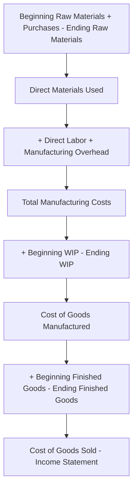

## Schedule of Cost of Goods Manufactured

### Definition

The Schedule of Cost of Goods Manufactured (COGM) is a formal supporting financial statement, prepared exclusively by manufacturing firms, that calculates the total cost of goods **completed** during a period. It summarizes the flow of manufacturing costs through the Work in Process (WIP) Inventory account, ultimately feeding directly into the Cost of Goods Sold calculation on the income statement. It serves as the manufacturing-sector equivalent of the "Purchases" figure used by merchandising firms.

### Purpose

The schedule answers a specific question: **"What did it cost to finish the goods that were completed this period?"** — distinct from the amount spent on production during the period (which may differ due to changes in Work in Process inventory) and distinct from the cost of goods actually sold (which may differ due to changes in Finished Goods inventory).

### Structure and Formula

The schedule is built in three layered stages, culminating in the Cost of Goods Manufactured figure:

**Stage 1 — Direct Materials Used**

$$\text{Direct Materials Used} = \text{Beginning Raw Materials Inventory} + \text{Raw Materials Purchased} - \text{Ending Raw Materials Inventory}$$

**Stage 2 — Total Manufacturing Costs Incurred**

$$\text{Total Manufacturing Costs} = \text{Direct Materials Used} + \text{Direct Labor} + \text{Manufacturing Overhead}$$

**Stage 3 — Cost of Goods Manufactured**

$$\text{COGM} = \text{Beginning WIP Inventory} + \text{Total Manufacturing Costs} - \text{Ending WIP Inventory}$$

### Full Schedule Format

| Line Item | Amount |
| --- | --- |
| Beginning Raw Materials Inventory | $X |
| Add: Raw Materials Purchased | $X |
| Raw Materials Available for Use | $X |
| Less: Ending Raw Materials Inventory | ($X) |
| **Direct Materials Used** | **$X** |
| Add: Direct Labor | $X |
| Add: Manufacturing Overhead | $X |
| **Total Manufacturing Costs** | **$X** |
| Add: Beginning Work in Process Inventory | $X |
| Total Cost of Work in Process | $X |
| Less: Ending Work in Process Inventory | ($X) |
| **Cost of Goods Manufactured** | **$X** |

### Distinguishing COGM from Related Figures

| Term | Definition | Relationship |
| --- | --- | --- |
| Total Manufacturing Costs | Costs *incurred* during the current period (DM + DL + MOH) | Adjusted for WIP changes to become COGM |
| Cost of Goods Manufactured (COGM) | Cost of goods *completed* during the period | Adjusted for Finished Goods changes to become COGS |
| Cost of Goods Sold (COGS) | Cost of goods *sold* during the period | Appears on the income statement |

A common point of confusion is assuming Total Manufacturing Costs equals COGM — they are equal **only if Beginning WIP equals Ending WIP** (i.e., no change in partially completed inventory during the period). In virtually all real operating periods, these figures differ.

### The Flow from COGM to COGS

Once COGM is calculated, it flows into the calculation of Cost of Goods Sold on the income statement:

$$\text{COGS} = \text{Beginning Finished Goods Inventory} + \text{COGM} - \text{Ending Finished Goods Inventory}$$

This mirrors the same three-part logic used within the schedule itself: beginning balance, plus additions, minus ending balance, equals the amount that "moved out" during the period — the same structural pattern used at each of the three inventory stages (Raw Materials, WIP, Finished Goods).

### Why This Schedule Matters

**Financial Reporting Support**

COGM is a required intermediate calculation supporting the Cost of Goods Sold line on a manufacturing firm's income statement, ensuring inventory costs are properly matched to the period in which the related goods are sold (consistent with the matching principle covered in *Product Costs versus Period Costs*).

**Operational Insight**

Because the schedule separates direct materials, direct labor, and manufacturing overhead, it gives management visibility into the composition of production costs — useful for cost control, budgeting comparisons, and identifying cost trends across periods.

**Distinguishing Production Activity from Sales Activity**

The schedule makes clear that a company can complete more (or fewer) goods than it produces in raw cost terms due to changes in WIP, and separately, can sell more (or fewer) goods than it completes due to changes in Finished Goods — three independent inventory buffers that decouple production, completion, and sale timing.

### Illustrative Example

A furniture manufacturer's records for the month show:

| Item | Amount |
| --- | --- |
| Beginning Raw Materials Inventory | $5,000 |
| Raw Materials Purchased | $20,000 |
| Ending Raw Materials Inventory | $3,000 |
| Direct Labor | $18,000 |
| Manufacturing Overhead | $12,000 |
| Beginning Work in Process Inventory | $6,000 |
| Ending Work in Process Inventory | $4,000 |

**Step 1 — Direct Materials Used:**

$$\$5{,}000 + \$20{,}000 - \$3{,}000 = \$22{,}000$$

**Step 2 — Total Manufacturing Costs:**

$$\$22{,}000 + \$18{,}000 + \$12{,}000 = \$52{,}000$$

**Step 3 — Cost of Goods Manufactured:**

$$\$6{,}000 + \$52{,}000 - \$4{,}000 = \$54{,}000$$

**Completed Schedule:**

| Line Item | Amount |
| --- | --- |
| Beginning Raw Materials Inventory | $5,000 |
| Add: Raw Materials Purchased | $20,000 |
| Raw Materials Available for Use | $25,000 |
| Less: Ending Raw Materials Inventory | ($3,000) |
| **Direct Materials Used** | **$22,000** |
| Add: Direct Labor | $18,000 |
| Add: Manufacturing Overhead | $12,000 |
| **Total Manufacturing Costs** | **$52,000** |
| Add: Beginning Work in Process Inventory | $6,000 |
| Total Cost of Work in Process | $58,000 |
| Less: Ending Work in Process Inventory | ($4,000) |
| **Cost of Goods Manufactured** | **$54,000** |

This $54,000 figure would then flow into the Cost of Goods Sold calculation, combined with the firm's Beginning and Ending Finished Goods Inventory balances.

### Conceptual Diagram

### Key Points

- The Schedule of Cost of Goods Manufactured calculates the cost of goods **completed** during a period, distinct from costs *incurred* (Total Manufacturing Costs) and costs of goods **sold** (COGS).
- The schedule is built in **three sequential stages**: Direct Materials Used, Total Manufacturing Costs, and finally COGM — each stage adjusting for the relevant beginning/ending inventory balance.
- COGM equals Total Manufacturing Costs **only when Beginning and Ending WIP are equal** — in virtually all real periods, they differ, making this an important distinction to avoid confusing the two figures.
- The schedule is exclusive to **manufacturing firms**, since merchandising and service firms do not have a Work in Process stage requiring this three-tier calculation.
- COGM is the critical link between the manufacturing cost schedule and the **Cost of Goods Sold** calculation on the income statement, following the same beginning-plus-additions-minus-ending logic used throughout inventory accounting.

### Related Topics

- Manufacturing Costs (Direct Materials, Direct Labor, Manufacturing Overhead)
- Product Costs versus Period Costs
- Cost Classification Across Manufacturing, Merchandising, and Service Firms
- Job Order Costing vs. Process Costing
- Inventory Valuation Methods
- Cost of Goods Sold and the Income Statement