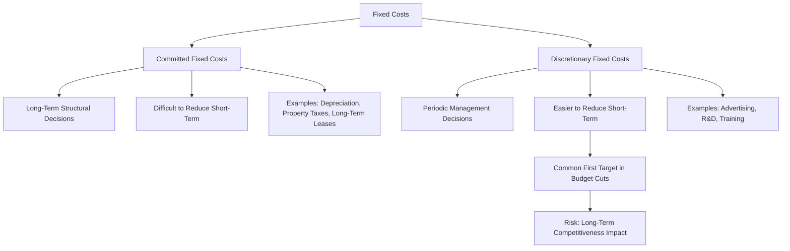

## Fixed Cost Behavior (Committed versus Discretionary)

### Definition

While fixed costs are broadly defined as costs that remain constant in total within a relevant range of activity, not all fixed costs share the same underlying nature or management flexibility. Fixed costs are further subdivided into two categories based on **how easily and quickly management can change them**: **committed fixed costs** and **discretionary fixed costs**. This distinction matters significantly for short-term cost control and budget flexibility, even though both categories share the same total-cost-behavior pattern relative to activity level.

### Committed Fixed Costs

**Definition:** Fixed costs arising from an organization's ownership or use of facilities, equipment, and basic organizational structure — costs that cannot be significantly reduced in the short run, even during a temporary downturn in activity, without fundamentally impairing the organization's operating capability or long-term goals.

**Characteristics**

- Typically the result of **long-term investment decisions** made in the past
- Difficult or costly to change in the short term (often locked in by contracts, ownership, or structural commitments)
- Relate to maintaining basic organizational capacity and infrastructure
- Generally have a **long planning horizon** — once committed to, they persist for multiple years or even decades

**Common Examples**

- Depreciation on buildings and major equipment
- Property taxes on owned facilities
- Long-term lease payments
- Insurance premiums on facilities and equipment
- Salaries of key management personnel with long-term employment agreements

**Why They Resist Short-Term Reduction**

Committed fixed costs typically involve substantial exit costs, contractual obligations, or would require abandoning capacity the organization needs for future operations. For example, a company cannot meaningfully reduce building depreciation mid-year simply because sales have slowed, nor can it easily exit a multi-year facility lease without incurring penalty costs.

### Discretionary Fixed Costs

**Definition:** Fixed costs arising from annual management decisions to spend in particular areas — costs that can be changed relatively easily in the short run through management's discretionary spending decisions, without immediately or severely impairing the organization's short-term operating capability.

**Characteristics**

- Result from **periodic (often annual) budgeting decisions**, rather than long-term structural commitments
- Can be increased, decreased, or eliminated relatively quickly if management chooses
- Have a **short planning horizon** — typically reset or reconsidered each budget cycle
- Often relate to activities that support long-term organizational health but are not immediately tied to current-period output

**Common Examples**

- Advertising and marketing budgets
- Research and development spending
- Employee training and professional development programs
- Charitable contributions
- Management consulting engagements
- Public relations expenditures

**Why They Can Be Adjusted More Readily**

Because discretionary fixed costs stem from a management decision about how much to spend in a given period — rather than a binding external contract or asset ownership — they can typically be reduced, delayed, or eliminated without an immediate operational consequence, making them a common target during cost-cutting efforts in economic downturns.

### Comparison Table

| Dimension | Committed Fixed Costs | Discretionary Fixed Costs |
| --- | --- | --- |
| Origin | Long-term investment/structural decisions | Periodic (often annual) management decisions |
| Ease of short-term reduction | Difficult — often contractually or structurally locked in | Relatively easy — can be adjusted or eliminated by management choice |
| Planning horizon | Long-term (years to decades) | Short-term (typically one budget cycle) |
| Examples | Building depreciation, property taxes, long-term leases | Advertising, R&D, training programs |
| Risk of short-term cutting | Generally impractical or costly to reduce | Practical to reduce, but may harm long-term competitiveness if overcut |

### Strategic and Managerial Implications

**Cost-Cutting Behavior in Downturns**

Because discretionary fixed costs are easier to reduce quickly, they are frequently the **first target during budget cuts or economic downturns** — advertising budgets, training programs, and R&D spending are commonly reduced before committed fixed costs like facility leases, since committed costs are structurally harder to change in the short run.

**The Long-Term Risk of Over-Cutting Discretionary Costs**

While discretionary fixed costs are easier to cut, doing so is not without consequence. Reducing R&D, training, or advertising spending may preserve short-term profitability but can **undermine long-term competitiveness** — a classic tension between short-term financial performance and long-term strategic health. Effective managers weigh this trade-off carefully rather than defaulting to discretionary cost cuts as a reflexive response to short-term pressure.

**Budgeting Approach Differences**

- Committed fixed costs are often budgeted using a straightforward **continuation approach**, since they are largely predetermined by existing contracts and asset bases.
- Discretionary fixed costs are more amenable to **zero-based budgeting**, where each period's spending must be justified from a baseline of zero, rather than simply adjusting the prior period's figure — precisely because management has genuine discretion over the amount.

**Relevance to Capacity Decisions**

Committed fixed costs are closely tied to an organization's **capacity** — how much the organization is structurally equipped to produce or serve. Decisions to increase committed fixed costs (e.g., building a new facility) are effectively long-term capacity decisions that should be evaluated using capital budgeting techniques (NPV, IRR), since they lock in fixed cost obligations for an extended period.

### Illustrative Example

A mid-sized manufacturing company facing a temporary sales downturn reviews its fixed cost structure to identify potential savings:

| Fixed Cost | Type | Short-Term Reduction Feasible? |
| --- | --- | --- |
| Factory building depreciation | Committed | No — asset already owned, depreciation continues regardless |
| Ten-year facility lease payment | Committed | No (without penalty) — contractually locked in |
| Annual advertising campaign | Discretionary | Yes — can be reduced or paused with management approval |
| Employee training program | Discretionary | Yes — can be postponed to a future period |
| Salaries of long-term senior executives under contract | Committed | Limited — contractual obligations restrict short-term reduction |

Facing reduced sales, management reduces the advertising budget by 30% and postpones the training program to the following year, generating immediate cost savings. The facility lease and building depreciation remain unchanged, since neither can be meaningfully altered within the current budget period. Management notes internally that the training postponement carries a longer-term risk to employee skill development, which will need to be revisited once conditions improve.

### Conceptual Diagram

### Key Points

- Both committed and discretionary fixed costs share the same **total-cost behavior pattern** (constant within the relevant range), but differ in **how easily management can change them in the short run**.
- **Committed fixed costs** arise from long-term structural decisions (facility ownership, major equipment, long-term contracts) and are difficult to reduce quickly without impairing operating capability.
- **Discretionary fixed costs** arise from periodic management decisions (advertising, R&D, training) and can be adjusted relatively easily in the short term.
- Discretionary fixed costs are the **common first target** during cost-cutting efforts, but reducing them carries a risk of undermining long-term competitiveness if not carefully managed.
- The distinction supports different **budgeting approaches** — committed costs are often projected via continuation of existing obligations, while discretionary costs are well suited to zero-based budgeting, which requires fresh justification each period.

### Related Topics

- Variable, Fixed, and Mixed Cost Behavior
- Zero-Based Budgeting
- Capital Budgeting Techniques (NPV, IRR, Payback)
- Controllable versus Noncontrollable Costs
- Cost-Volume-Profit (CVP) Analysis
- Budgeting and Budget Variance Analysis