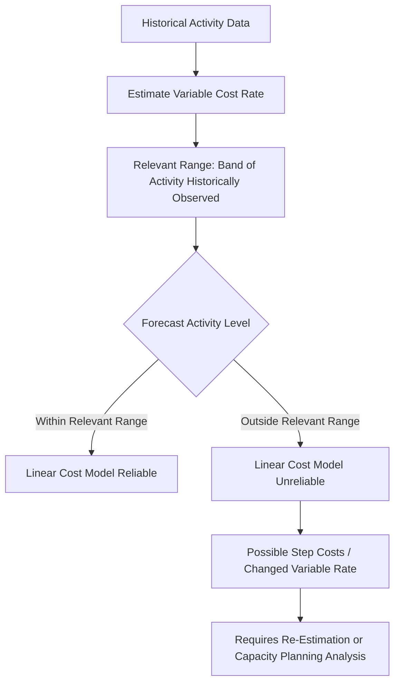

## Variable Cost Behavior and the Relevant Range

### Definition

Variable cost behavior describes how total variable costs change in direct proportion to changes in activity level, while remaining constant on a per-unit basis. The **relevant range** is the span of activity level over which this assumed cost behavior pattern — along with fixed cost behavior — is expected to hold true. Together, these two concepts form a critical qualifier on all cost behavior analysis: cost behavior assumptions are not universal laws but approximations valid only within a bounded, empirically observed range of activity.

### Variable Cost Behavior

**Core Pattern**

$$\text{Total Variable Cost} = \text{Variable Cost per Unit} \times \text{Activity Level}$$

As activity increases, total variable cost increases proportionally; as activity decreases, total variable cost decreases proportionally. The variable cost **per unit**, however, remains constant regardless of activity level — this per-unit constancy is the defining characteristic that distinguishes variable costs from fixed costs (where the reverse per-unit pattern holds).

**Assumption of Linearity**

Traditional cost-volume-profit (CVP) and budgeting models assume variable costs behave in a **strictly linear** fashion — a straight line through the origin when total variable cost is plotted against activity level. This linearity assumption is a simplification of real-world cost behavior, which is where the relevant range concept becomes essential.

### The Relevant Range Concept

**Definition:** The band of activity level within which a company has actually operated in the past, or expects to operate in the near future, and within which assumptions about fixed and variable cost behavior are considered reasonably valid.

**Why Cost Behavior Isn't Truly Linear Across All Activity Levels**

In reality, few costs behave in a perfectly linear fashion across the entire theoretically possible range of activity, from zero to maximum capacity. Costs often exhibit different behavior patterns at very low or very high activity levels:

- **At very low activity**, a company might benefit from bulk purchasing discounts becoming unavailable, or fixed costs being spread over so few units that the "fixed" cost assumption becomes practically meaningless.
- **At very high activity**, approaching or exceeding practical capacity, a company might need to pay overtime premiums for labor, incur higher per-unit costs for rush-ordered materials, or require additional equipment/facility investment (causing fixed costs to "step" to a new level).

**The Relevant Range Resolves This**

By restricting cost behavior assumptions (linear variable costs, constant fixed costs) to the **relevant range** — the realistic band of activity the company has actually experienced or reasonably anticipates — the linear cost behavior model becomes a **reasonable approximation** even though it would not hold true across the entire theoretical range of possible activity.

### Visualizing the Relevant Range

Within the relevant range, the assumed linear relationship between total variable cost and activity level is treated as accurate. Outside the relevant range (both below and above), actual cost behavior may deviate substantially from the straight-line assumption — variable cost per unit might actually be higher at very low volumes (losing bulk discounts) or higher at very high volumes (overtime premiums), even though the simplified model assumes a constant per-unit rate throughout.

### Implications of the Relevant Range for Variable Costs

**Budget and Forecast Validity**

Cost estimates and budgets built using variable cost assumptions are only reliable **within the relevant range** used to derive them. Extrapolating a variable cost rate far beyond the range of historical data used to estimate it (e.g., using a cost equation derived from 1,000–5,000 units of monthly production to forecast costs at 20,000 units) risks significant estimation error.

**Cost Estimation Techniques and the Relevant Range**

Methods used to estimate variable cost rates — the high-low method, scatter plot analysis, and regression analysis (see *Variable, Fixed, and Mixed Cost Behavior*) — are all built from historical data points that, by definition, fall within the company's historically observed relevant range. Applying the resulting cost equation outside that range is a form of extrapolation that carries increased risk of inaccuracy.

**Step Costs at the Boundary of the Relevant Range**

When activity moves beyond the current relevant range — for example, production growth requiring a second shift, additional supervisors, or a new facility — costs previously treated as fixed may "step" to a new, higher fixed level, and the variable cost rate itself may shift due to new capacity constraints or efficiencies. This reinforces that the relevant range is not a fixed universal boundary but is specific to a company's current operating and capacity structure.

### Comparison: Cost Behavior Within vs. Outside the Relevant Range

| Aspect | Within the Relevant Range | Outside the Relevant Range |
| --- | --- | --- |
| Variable cost per unit | Assumed constant | May increase or decrease due to volume discounts, overtime, capacity constraints |
| Fixed cost in total | Assumed constant | May "step" to a new level (e.g., new facility, additional supervisors) |
| Reliability of linear cost model | High — grounded in actual historical experience | Low — model becomes an unreliable extrapolation |
| Appropriate use | Budgeting, CVP analysis, short-term forecasting | Requires re-estimation or specialized capacity planning analysis |

### Illustrative Example

A bakery has historically operated between 2,000 and 6,000 loaves of bread per month using its current single oven and staff of three bakers. Within this range, flour cost behaves as a variable cost of $0.50 per loaf, based on regression analysis of the past 12 months of production data.

| Scenario | Activity Level | Reliable Estimate? |
| --- | --- | --- |
| Forecast at 4,500 loaves | Within relevant range (2,000–6,000) | Yes — reliably estimated at $4{,}500 \times \$0.50 = \$2{,}250$ |
| Forecast at 5,800 loaves | Within relevant range | Yes — $5{,}800 \times \$0.50 = \$2{,}900$ |
| Forecast at 12,000 loaves | Outside relevant range | No — this would likely require a second oven (new fixed cost "step") and possibly overtime baker wages (higher variable rate), invalidating the $0.50/loaf assumption |

The $0.50 per loaf figure, though mathematically simple to extrapolate, would likely understate the true cost of producing 12,000 loaves, since achieving that volume would require capacity investments and operational changes not reflected in the historical data used to derive the estimate.

### Conceptual Diagram

### Key Points

- Variable costs are assumed to behave **linearly** — constant per unit, proportional in total — but this assumption only holds reliably within the **relevant range** of activity.
- The relevant range reflects the **band of activity a company has actually experienced or reasonably expects**, not the full theoretical range from zero to maximum capacity.
- Cost behavior can differ meaningfully **outside the relevant range** — variable cost per unit may rise or fall, and fixed costs may "step" to new levels due to capacity constraints.
- Cost estimation techniques (high-low method, scatter plots, regression) derive their results from historical data that is, by construction, confined to the relevant range — extrapolating beyond that range increases estimation risk.
- Recognizing the relevant range is essential for producing **credible budgets and forecasts**, particularly when planning for significant growth or contraction in activity that may exceed historically observed levels.

### Related Topics

- Variable, Fixed, and Mixed Cost Behavior
- Fixed Cost Behavior (Committed versus Discretionary)
- High-Low Method for Cost Estimation
- Regression Analysis in Cost Estimation
- Cost-Volume-Profit (CVP) Analysis
- Capacity Planning and Step Costs