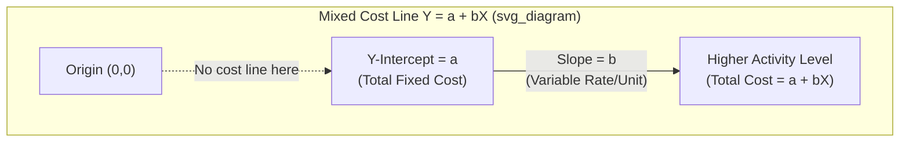

## Mixed Cost Behavior and the Linear Cost Function

### Definition and Core Concept

A mixed cost (also called a semi-variable cost) is a cost that contains both a fixed component and a variable component within the relevant range. The fixed portion represents the cost incurred simply to have the capacity or ability to operate, regardless of activity level, while the variable portion changes in direct proportion to a chosen activity driver (also called a cost driver or independent variable).

Common real-world examples include:

- **Utility costs**: a fixed monthly service/connection charge plus a per-kilowatt-hour or per-unit charge based on consumption
- **Sales compensation**: a fixed base salary plus a variable commission tied to sales volume
- **Equipment maintenance**: a fixed annual service contract fee plus variable per-hour-of-use charges
- **Vehicle costs**: fixed insurance and depreciation plus variable fuel and mileage-based maintenance
- **Telephone/mobile plans**: fixed base plan cost plus variable per-minute or per-gigabyte overage charges

Because mixed costs blend two behaviors, they cannot be classified as purely fixed or purely variable, and management accountants must separate (or "split") them into their fixed and variable elements before the cost data can be used reliably for planning, budgeting, and decision-making.

### The Linear Cost Function

Mixed costs are modeled using a linear cost function, which assumes cost behaves according to the equation of a straight line:

$$Y = a + bX$$

Where:

- $Y$ = total mixed cost (dependent variable) — the value being predicted
- $a$ = total fixed cost component (the $y$-intercept) — the estimated cost when activity $X = 0$
- $b$ = variable cost per unit of activity (the slope) — the rate at which cost changes per unit of the cost driver
- $X$ = level of activity (independent variable) — e.g., units produced, machine hours, labor hours

This is structurally identical to the slope-intercept form of a linear equation from algebra, $y = mx + b$, but relabeled with accounting terminology. The linearity assumption implies that within the **relevant range** — the span of activity over which the assumed cost relationship is expected to hold — the variable cost per unit ($b$) remains constant and the fixed cost ($a$) remains unchanged in total.

**Key Points**

- $a$ (intercept) represents total fixed costs, not a per-unit amount
- $b$ (slope) represents the variable cost rate per unit of activity, not a total
- Total cost $Y$ changes only because $X$ changes, since $a$ and $b$ are treated as constants within the relevant range
- Outside the relevant range, the linear assumption may break down (e.g., due to step-fixed costs, capacity constraints, or volume discounts), so extrapolating far beyond observed data is risky

### Why the Relevant Range Matters

The relevant range is the band of activity levels (e.g., between 1,000 and 8,000 units produced per month) within which the fixed cost total and variable cost per unit are assumed stable, based on historical observation. Cost estimates derived from a linear function are only valid for predicting costs *within* this range. If activity is projected to fall outside historical bounds:

- Fixed costs may "step" to a new level (e.g., renting a second warehouse once capacity is exceeded)
- Variable cost per unit may change (e.g., bulk purchase discounts reduce per-unit material cost at very high volumes, or overtime premiums increase per-unit labor cost at very high volumes)

[Inference] Analysts commonly flag any prediction generated by extrapolating a linear cost function beyond the historical relevant range as having elevated risk of error, since the underlying linearity assumption was never tested at those activity levels.

### Graphical Representation

On a cost-volume graph (vertical axis = total cost $Y$, horizontal axis = activity level $X$), a mixed cost appears as an upward-sloping straight line that does **not** pass through the origin. The line intersects the $Y$-axis at the fixed cost amount $a$, and its steepness (slope) equals the variable rate $b$.

Below is a static SVG rendering of the same concept, plotting total cost against activity level:

<svg xmlns="http://www.w3.org/2000/svg" viewBox="0 0 500 350">
<text x="250" y="20" font-size="14" font-weight="bold" text-anchor="middle" fill="#1a1a1a">Mixed Cost Behavior: Y = a + bX (svg_diagram)</text>
<line x1="60" y1="300" x2="460" y2="300" stroke="#333" stroke-width="2" />
<line x1="60" y1="300" x2="60" y2="40" stroke="#333" stroke-width="2" />
<text x="260" y="330" font-size="12" text-anchor="middle" fill="#333">Activity Level (X)</text>
<text x="20" y="170" font-size="12" text-anchor="middle" fill="#333" transform="rotate(-90 20 170)">Total Cost (Y)</text>
<line x1="60" y1="250" x2="460" y2="80" stroke="#2563eb" stroke-width="3" />
<line x1="60" y1="250" x2="60" y2="300" stroke="#dc2626" stroke-width="3" stroke-dasharray="4" />
<circle cx="60" cy="250" r="4" fill="#dc2626" />
<text x="70" y="245" font-size="11" fill="#dc2626">a = Fixed Cost (intercept)</text>
<line x1="200" y1="300" x2="200" y2="184" stroke="#16a34a" stroke-width="1" stroke-dasharray="3" />
<text x="205" y="200" font-size="11" fill="#16a34a">slope = b (variable rate)</text>
<text x="60" y="315" font-size="10" fill="#333">0</text>
</svg>

### Methods of Separating Mixed Costs

Because financial records report only the total mixed cost ($Y$) at each observed activity level ($X$), accountants use estimation techniques to solve for $a$ and $b$. The three most common methods, in increasing order of statistical rigor, are:

#### 1. High-Low Method

The simplest approach, using only the two extreme data points (highest and lowest activity levels) from a set of observations.

**Steps:**

1. Identify the period with the **highest activity level** and the period with the **lowest activity level** (based on $X$, not $Y$)
2. Calculate the variable cost per unit ($b$):

$$b = \frac{Y_{high} - Y_{low}}{X_{high} - X_{low}}$$

3. Calculate total fixed cost ($a$) by substituting back into the cost equation using either the high or low point:

$$a = Y_{high} - (b \times X_{high})$$

or equivalently:

$$a = Y_{low} - (b \times X_{low})$$

**Example:**

A company records the following machine hours ($X$) and maintenance costs ($Y$):

| Month | Machine Hours | Maintenance Cost |
| --- | --- | --- |
| Jan | 1,200 | $5,400 |
| Feb | 1,800 | $6,600 |
| Mar | 900 | $4,800 |
| Apr | 2,100 | $7,200 |

- Highest activity: April, $X = 2{,}100$, $Y = \$7{,}200$
- Lowest activity: March, $X = 900$, $Y = \$4{,}800$

$$b = \frac{7{,}200 - 4{,}800}{2{,}100 - 900} = \frac{2{,}400}{1{,}200} = \$2.00 \text{ per machine hour}$$

$$a = 7{,}200 - (2.00 \times 2{,}100) = 7{,}200 - 4{,}200 = \$3{,}000$$

**Resulting cost function:** $Y = 3{,}000 + 2.00X$

**Key Points**

- Uses only 2 of the available data points, ignoring all others
- Fast and easy to compute manually, requiring no special software
- Highly sensitive to outliers, since an unusually high or low observation distorts both $a$ and $b$
- [Inference] Because it discards the majority of available data, the high-low method is generally regarded in cost accounting practice as the least statistically reliable of the three separation techniques, and is typically used only for quick estimates or when detailed data is unavailable

#### 2. Scatter Graph (Scattergraph) Method

A visual approach where all historical data points are plotted on a graph (cost on the $Y$-axis, activity on the $X$-axis), and a line is drawn by visual judgment to best fit the pattern of points.

**Steps:**

1. Plot each period's $(X, Y)$ pair as a point on the graph
2. Visually inspect the pattern for a linear relationship and identify/discard outliers
3. Draw a straight line through the data that appears to best represent the trend (typically passing through or near the average of the points)
4. Read the $Y$-intercept directly off the graph to estimate $a$
5. Calculate the slope ($b$) using two convenient points on the fitted line (not necessarily actual data points)

**Key Points**

- Allows visual identification of outliers and non-linear patterns before committing to a linear model
- More representative than high-low because it considers all data points visually
- Still subjective, since two different people may draw the line differently, producing different estimates of $a$ and $b$
- Best used as a diagnostic step before regression, to confirm that a linear relationship is reasonable

#### 3. Least-Squares Regression Analysis

The most statistically rigorous method, using all available data points and minimizing the sum of squared deviations between actual costs and the costs predicted by the fitted line.

The regression line is derived using the following formulas (for simple linear regression with one independent variable):

$$b = \frac{n\sum{XY} - \sum{X}\sum{Y}}{n\sum{X^2} - (\sum{X})^2}$$

$$a = \frac{\sum{Y} - b\sum{X}}{n}$$

Where $n$ = number of observations.

**Key Points**

- Uses every data point, giving it the strongest statistical foundation of the three methods
- Produces an objectively determined single best-fit line (no two analysts get different answers from the same data)
- Can be paired with the **coefficient of determination ($R^2$)** to assess how well the cost driver explains the variation in cost; an $R^2$ closer to 1.0 indicates a stronger linear relationship
- Typically computed using spreadsheet software (e.g., Excel's `SLOPE`, `INTERCEPT`, and `RSQ` functions, or the regression toolpack) rather than by hand
- [Unverified] Whether a given regression result is *economically* meaningful (versus merely statistically significant) still requires managerial judgment about the underlying cost driver's causal relationship to the cost

**Example (conceptual):**

Using the same machine hours/maintenance cost data across many more observed months than the high-low method's 2 points, regression might yield:

$$Y = 3{,}150 + 1.95X$$

Note this differs slightly from the high-low result ($Y = 3{,}000 + 2.00X$) because regression incorporates the full dataset rather than just the two extreme points — the high-low estimate is more exposed to distortion from a single unusual month.

### Comparing the Three Methods

| Criterion | High-Low | Scatter Graph | Least-Squares Regression |
| --- | --- | --- | --- |
| Data points used | 2 (extremes only) | All (visually) | All (mathematically) |
| Objectivity | High (formulaic) | Low (subjective line-fitting) | High (formulaic) |
| Outlier sensitivity | Very high | Moderate (visible, can be excluded) | Moderate (can distort slope if not screened) |
| Statistical rigor | Low | Low-Moderate | High |
| Ease of manual computation | Very easy | Easy | Difficult without software |
| Best use case | Quick estimate, limited data | Preliminary visual check | Formal budgeting, forecasting |

### Using the Linear Cost Function for Prediction

Once $a$ and $b$ are estimated by any method, the cost function $Y = a + bX$ is used to forecast total costs at any activity level within the relevant range. For example, using the high-low result above ($Y = 3{,}000 + 2.00X$), predicted maintenance cost at 1,500 machine hours would be:

$$Y = 3{,}000 + (2.00 \times 1{,}500) = 3{,}000 + 3{,}000 = \$6{,}000$$

This predictive capability underlies several core managerial accounting applications:

- **Flexible budgeting**: adjusting budgeted costs to match actual activity levels
- **Cost-volume-profit (CVP) analysis**: requires costs to be split into fixed and variable components before break-even and target-profit calculations can be performed
- **Variance analysis**: comparing actual costs to flexible-budget costs derived from the linear function
- **Short-term decision-making**: e.g., special order pricing, make-or-buy decisions, which rely on knowing the variable cost per unit

### Common Pitfalls and Limitations

- **Assuming linearity holds indefinitely**: costs may behave non-linearly outside the relevant range (e.g., step costs, curvilinear costs due to learning curves or diminishing returns)
- **Choosing an inappropriate cost driver**: the independent variable $X$ must have a plausible causal relationship to the cost; regression can produce a statistically fitted line even for a driver that doesn't economically explain the cost
- **Ignoring outliers**: unusual events (e.g., a strike, a one-time repair, a natural disaster) can distort all three estimation methods if not identified and excluded
- **Overreliance on high-low with volatile data**: if the highest or lowest activity period happens to be atypical, the resulting $a$ and $b$ estimates can be materially wrong
- **Confusing correlation with causation**: a high $R^2$ in regression indicates a strong statistical fit, not proof that the activity driver *causes* the cost

### Worked Comprehensive Example

A factory tracks total factory overhead ($Y$) against direct labor hours ($X$) over six months:

| Month | Direct Labor Hours (X) | Factory Overhead (Y) |
| --- | --- | --- |
| 1 | 4,000 | $32,000 |
| 2 | 5,000 | $36,000 |
| 3 | 3,500 | $29,500 |
| 4 | 6,000 | $40,000 |
| 5 | 4,500 | $34,000 |
| 6 | 5,500 | $38,000 |

**High-Low Method:**

- High: $X = 6{,}000$, $Y = \$40{,}000$ (Month 4)
- Low: $X = 3{,}500$, $Y = \$29{,}500$ (Month 3)

$$b = \frac{40{,}000 - 29{,}500}{6{,}000 - 3{,}500} = \frac{10{,}500}{2{,}500} = \$4.20 \text{ per DLH}$$

$$a = 40{,}000 - (4.20 \times 6{,}000) = 40{,}000 - 25{,}200 = \$14{,}800$$

**Cost function:** $Y = 14{,}800 + 4.20X$

**Verification using the low point:**

$$a = 29{,}500 - (4.20 \times 3{,}500) = 29{,}500 - 14{,}700 = \$14{,}800 \checkmark$$

**Prediction at 5,200 direct labor hours:**

$$Y = 14{,}800 + (4.20 \times 5{,}200) = 14{,}800 + 21{,}840 = \$36{,}640$$

**Conclusion**

The linear cost function $Y = a + bX$ is the foundational model management accountants use to describe, estimate, and predict mixed cost behavior. While the high-low method offers a fast approximation using only two data points, the scatter graph method adds visual context and outlier detection, and least-squares regression provides the most statistically defensible estimate by incorporating all available observations. The choice of method involves a trade-off between computational simplicity and statistical precision, and all three remain valid only within the relevant range of activity on which they were based.

**Related Topics**

- High-Low Method: Detailed Computation and Outlier Adjustment
- Least-Squares Regression and the Coefficient of Determination ($R^2$)
- Cost-Volume-Profit (CVP) Analysis and Break-Even Point
- Flexible Budgets and Variance Analysis
- Step-Fixed (Step-Variable) Cost Behavior
- Curvilinear Costs and the Learning Curve Effect
- Contribution Margin Income Statement Format
- Relevant Range Assumptions in Cost Behavior Analysis