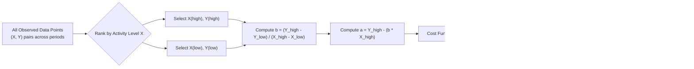

## High-Low Method

### Definition and Purpose

The high-low method is a technique used in managerial accounting to separate a mixed cost into its fixed and variable components using only two data points: the period with the highest level of activity and the period with the lowest level of activity. It produces estimates for both the variable cost per unit ($b$) and total fixed cost ($a$) that fit within the linear cost function:

$$Y = a + bX$$

Where $Y$ is total mixed cost, $a$ is total fixed cost, $b$ is variable cost per unit of activity, and $X$ is the activity level (cost driver).

The method's defining characteristic — and its main limitation — is that it relies on exactly two observations, discarding all other available data points regardless of how many periods were actually recorded.

### Critical Rule: Select by Activity Level, Not by Cost

The most important — and most commonly misapplied — rule of the high-low method is that the high and low points must be selected based on the **activity level ($X$)**, not the total cost ($Y$).

In most datasets, the period with the highest activity also has the highest cost, and the period with the lowest activity has the lowest cost, so this distinction goes unnoticed. However, if a mixed cost includes irregular variable components (e.g., overtime premiums, spoilage, or a one-time repair), it is possible for the period with the highest cost to *not* correspond to the period with the highest activity. In such cases, the accountant must still choose the high and low points using $X$, since the method is designed to isolate how cost responds to changes in activity.

**Key Points**

- Always rank observations by $X$ (activity), then select the two extremes
- Only after selecting by $X$ do you read off the corresponding $Y$ values
- Choosing points by $Y$ instead of $X$ produces an invalid or misleading cost function

### Step-by-Step Procedure

**Step 1: Identify the highest and lowest activity levels**

Scan all available data and select the observation with the maximum $X$ value ($X_{high}$, $Y_{high}$) and the observation with the minimum $X$ value ($X_{low}$, $Y_{low}$).

**Step 2: Calculate the variable cost per unit ($b$)**

The variable rate is the slope of the line connecting the two chosen points — the change in cost divided by the change in activity:

$$b = \frac{Y_{high} - Y_{low}}{X_{high} - X_{low}}$$

**Step 3: Calculate total fixed cost ($a$)**

Substitute either point back into $Y = a + bX$ and solve for $a$. Using the high point:

$$a = Y_{high} - (b \times X_{high})$$

Or using the low point (both should yield the same result, since both points lie exactly on the fitted line by construction):

$$a = Y_{low} - (b \times X_{low})$$

**Step 4: Write the cost function**

Express the result as $Y = a + bX$, substituting the numeric values of $a$ and $b$.

**Step 5 (optional but recommended): Verify**

Plug the *other* point into the equation to confirm both the high and low observations satisfy the derived formula exactly.

### Worked Example 1: Standard Case

A company observes the following units produced and total production costs over six months:

| Month | Units Produced (X) | Total Cost (Y) |
| --- | --- | --- |
| Jan | 800 | $14,000 |
| Feb | 1,200 | $18,000 |
| Mar | 600 | $11,000 |
| Apr | 1,500 | $21,500 |
| May | 950 | $15,500 |
| Jun | 1,100 | $17,000 |

**Step 1:** Highest activity = April ($X = 1{,}500$); Lowest activity = March ($X = 600$)

**Step 2:**

$$b = \frac{21{,}500 - 11{,}000}{1{,}500 - 600} = \frac{10{,}500}{900} = \$11.67 \text{ per unit (rounded)}$$

**Step 3:**

$$a = 21{,}500 - (11.67 \times 1{,}500) = 21{,}500 - 17{,}505 = \$3{,}995$$

**Verification using the low point:**

$$a = 11{,}000 - (11.67 \times 600) = 11{,}000 - 7{,}002 = \$3{,}998$$

The small $3 discrepancy between $3,995 and $3,998 arises from rounding $b$ to two decimal places; carrying more decimal precision in $b$ (e.g., $11.6667) resolves the difference. This rounding sensitivity is a routine feature of hand-calculated high-low results.

**Cost function:** $Y \approx 3{,}997 + 11.67X$

### Worked Example 2: The High-Cost-Is-Not-High-Activity Trap

Consider a maintenance cost dataset where one low-activity month had an unusual emergency repair:

| Month | Machine Hours (X) | Maintenance Cost (Y) |
| --- | --- | --- |
| Jan | 500 | $3,200 |
| Feb | 700 | $4,000 |
| Mar | 300 | $5,500 *(emergency repair)* |
| Apr | 900 | $5,200 |

Here, March has the **lowest activity** (300 hours) but the **highest cost** ($5,500) due to the emergency repair. A common error would be to select March as the "high" point because its cost is largest. The correct approach ranks by activity:

- Highest activity: April, $X = 900$, $Y = \$5{,}200$
- Lowest activity: March, $X = 300$, $Y = \$5{,}500$

$$b = \frac{5{,}200 - 5{,}500}{900 - 300} = \frac{-300}{600} = -\$0.50 \text{ per machine hour}$$

This produces a **negative variable cost per unit**, which is not economically meaningful for a normal mixed cost — variable costs should rise with activity, not fall. This result signals that March is an outlier driven by a non-recurring event and should be **excluded** from the high-low calculation. The correct treatment is to remove the anomalous observation and reselect from the remaining data:

- Highest activity (excluding March): April, $X = 900$, $Y = \$5{,}200$
- Lowest activity (excluding March): January, $X = 500$, $Y = \$3{,}200$

$$b = \frac{5{,}200 - 3{,}200}{900 - 500} = \frac{2{,}000}{400} = \$5.00 \text{ per machine hour}$$

$$a = 5{,}200 - (5.00 \times 900) = 5{,}200 - 4{,}500 = \$700$$

**Cost function:** $Y = 700 + 5.00X$

**Key Points**

- A negative or economically implausible $b$ is a diagnostic signal of an outlier, not a valid result to report
- Outliers should be identified and excluded, with the high-low points then reselected from the remaining data
- [Inference] In practice, analysts typically cross-check any high-low result with a quick scatter plot of all data before finalizing the cost function, precisely to catch situations like this one

### Graphical Interpretation

The high-low method effectively draws a straight line through only two points on the cost-activity graph, ignoring every other observation's position relative to that line.

The following SVG illustrates how the high-low line (drawn through just two extreme points) can diverge from where a full regression line would sit if all six data points were used:

<svg xmlns="http://www.w3.org/2000/svg" viewBox="0 0 520 360">
<text x="260" y="20" font-size="14" font-weight="bold" text-anchor="middle" fill="#1a1a1a">High-Low Line vs. All Data Points (svg_diagram)</text>
<line x1="60" y1="310" x2="480" y2="310" stroke="#333" stroke-width="2" />
<line x1="60" y1="310" x2="60" y2="40" stroke="#333" stroke-width="2" />
<text x="270" y="335" font-size="12" text-anchor="middle" fill="#333">Activity Level (X)</text>
<text x="20" y="180" font-size="12" text-anchor="middle" fill="#333" transform="rotate(-90 20 180)">Total Cost (Y)</text>
<circle cx="120" cy="230" r="5" fill="#555" />
<circle cx="180" cy="205" r="5" fill="#555" />
<circle cx="100" cy="260" r="5" fill="#dc2626" />
<text x="80" y="278" font-size="10" fill="#dc2626">Low point</text>
<circle cx="260" cy="150" r="5" fill="#555" />
<circle cx="230" cy="190" r="5" fill="#555" />
<circle cx="400" cy="90" r="5" fill="#dc2626" />
<text x="370" y="80" font-size="10" fill="#dc2626">High point</text>
<line x1="100" y1="260" x2="400" y2="90" stroke="#2563eb" stroke-width="2.5" />
<text x="330" y="115" font-size="10" fill="#2563eb">High-Low line</text>
<line x1="90" y1="255" x2="420" y2="70" stroke="#16a34a" stroke-width="2" stroke-dasharray="5,4" />
<text x="330" y="65" font-size="10" fill="#16a34a">Illustrative full-data trend</text>
</svg>

### Advantages and Disadvantages

| Aspect | Detail |
| --- | --- |
| **Advantage** | Simple to compute manually with no software required |
| **Advantage** | Requires minimal data (only two observations needed) |
| **Advantage** | Provides a quick, directionally useful estimate for preliminary analysis |
| **Disadvantage** | Ignores all data points except the two extremes |
| **Disadvantage** | Highly sensitive to outliers at either the high or low end |
| **Disadvantage** | Extreme points may not be representative of typical operations |
| **Disadvantage** | Provides no statistical measure of fit (unlike regression's $R^2$) |
| **Disadvantage** | Two analysts using different (but equally extreme) outlier-exclusion judgment can reach different results |

### Relationship to Other Cost Estimation Methods

The high-low method is one of three standard techniques for separating mixed costs, alongside the scatter graph method and least-squares regression analysis. It is generally positioned as the fastest but least statistically robust of the three, since regression uses every observation and the scatter graph at least visually incorporates all points before a line is judgmentally fitted. High-low is often used as a quick first-pass estimate, with regression preferred for formal budgeting or forecasting where accuracy matters more than speed.

**Key Points**

- All three methods estimate the same underlying linear cost function $Y = a + bX$
- High-low and regression are both formulaic (objective); the scatter graph is visual (subjective)
- Results from the three methods will generally differ somewhat, since they use different subsets or weightings of the data

### Practical Application: Using the Result

Once $a$ and $b$ are derived, the cost function is used to predict total cost at any activity level within the relevant range — the span of activity between (and reasonably near) the original high and low observations. For Example 1's result ($Y \approx 3{,}997 + 11.67X$), predicted cost at 1,000 units:

$$Y = 3{,}997 + (11.67 \times 1{,}000) = 3{,}997 + 11{,}670 = \$15{,}667$$

This predicted-cost capability supports flexible budgeting, cost-volume-profit analysis, and short-term decisions such as special order pricing, all of which require costs to be expressed in fixed-plus-variable form rather than as an undifferentiated total.

**Conclusion**

The high-low method offers the fastest, simplest way to estimate a linear cost function from historical mixed-cost data, using only the highest and lowest activity observations to solve for fixed cost ($a$) and variable cost per unit ($b$). Its simplicity comes at the cost of ignoring most available data and high sensitivity to outliers, making it best suited for quick estimates or situations with limited data, while more comprehensive methods like least-squares regression are preferred when precision and statistical defensibility are required. Correctly applying the method requires strict attention to selecting points by activity level (not cost) and recognizing when an implausible result (such as a negative variable rate) signals an outlier that must be excluded and the calculation redone.

**Related Topics**

- Mixed Cost Behavior and the Linear Cost Function
- Scatter Graph (Scattergraph) Method of Cost Estimation
- Least-Squares Regression and the Coefficient of Determination ($R^2$)
- Identifying and Handling Outliers in Cost Data
- Relevant Range and Its Effect on Cost Estimation Validity
- Flexible Budgets Using Estimated Cost Functions
- Cost-Volume-Profit (CVP) Analysis