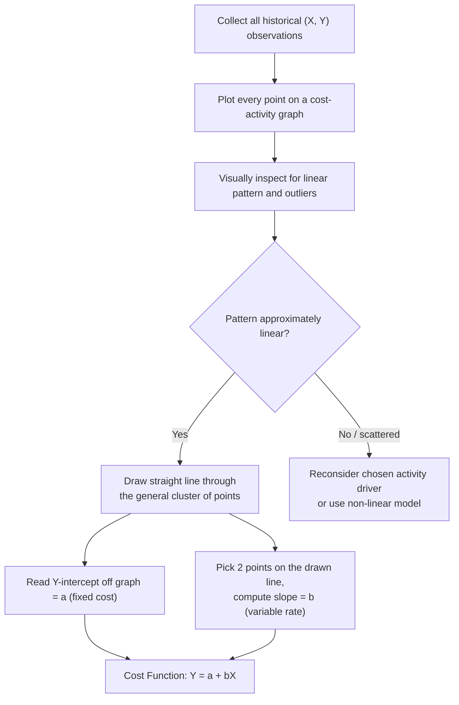

## Scattergraph and Visual Fit Method

### Definition and Purpose

The scattergraph method (also called the scatter diagram or visual fit method) is a technique for separating a mixed cost into its fixed and variable components by plotting historical cost data on a graph and visually fitting a straight line through the pattern of points. Unlike the high-low method, which uses only two extreme observations, the scattergraph method incorporates **every available data point** into the analysis, at least for the purpose of visual inspection before a line is drawn.

The resulting line is used to estimate the same linear cost function as other cost estimation techniques:

$$Y = a + bX$$

Where $Y$ = total mixed cost, $a$ = total fixed cost (Y-intercept), $b$ = variable cost per unit of activity (slope), and $X$ = activity level (cost driver).

The scattergraph method sits conceptually between the high-low method (fast but data-poor) and least-squares regression (data-complete but computationally heavier), serving primarily as a visual, judgment-based approach and as a diagnostic step before applying more rigorous statistical techniques.

### Step-by-Step Procedure

**Step 1: Plot the data**

For each historical period, plot a point on a graph with the activity level ($X$) on the horizontal axis and the corresponding total cost ($Y$) on the vertical axis. Every observation in the dataset is plotted, not just the extremes.

**Step 2: Visually inspect the pattern**

Examine the scatter of points to determine:

- Whether the relationship between cost and activity appears approximately linear
- Whether any points appear to be outliers (unusually far from the general pattern, often due to one-time events)
- Whether the relationship might instead be non-linear or show no clear pattern (indicating the chosen activity driver may be a poor predictor of the cost)

**Step 3: Draw a fitted line**

Using a ruler (or judgment), draw a single straight line through the data that appears to best represent the overall trend, positioned so that roughly as many points fall above the line as below it. Obvious outliers identified in Step 2 may be excluded from consideration when positioning the line.

**Step 4: Determine the fixed cost ($a$)**

Read the value directly off the graph where the fitted line intersects the $Y$-axis (i.e., where $X = 0$). This point represents the estimated total fixed cost.

**Step 5: Determine the variable cost per unit ($b$)**

Select any two convenient points that lie *on the fitted line itself* (these do not need to be actual data points — they can be any two points along the drawn line, ideally far apart for accuracy) and calculate the slope:

$$b = \frac{Y_2 - Y_1}{X_2 - X_1}$$

**Step 6: Write the cost function**

Combine the values from Steps 4 and 5 into the form $Y = a + bX$.

### Worked Example

A company records indirect labor cost against machine hours over eight months:

| Month | Machine Hours (X) | Indirect Labor Cost (Y) |
| --- | --- | --- |
| 1 | 1,000 | $8,200 |
| 2 | 1,400 | $9,600 |
| 3 | 1,800 | $11,000 |
| 4 | 900 | $7,900 |
| 5 | 2,200 | $12,800 |
| 6 | 1,600 | $10,300 |
| 7 | 2,500 | $14,000 *(rush order overtime)* |
| 8 | 1,200 | $8,800 |

**Step 1-2:** Plotting all eight points shows a generally upward, roughly linear trend. Month 7 sits noticeably above where the rest of the pattern would predict, consistent with the noted rush-order overtime — this is flagged as a candidate outlier and given less weight when positioning the fitted line, though it is not necessarily deleted from the dataset outright.

**Step 3:** A line is drawn through the main cluster of points (excluding heavy influence from Month 7), visually anchored near the middle of the data.

**Step 4:** The line appears to intersect the $Y$-axis at approximately $a = \$3{,}000$.

**Step 5:** Two convenient points on the drawn line are read as $(1{,}000, \$8{,}200)$ and $(2{,}200, \$12{,}600)$ (this second point is on the line itself, not necessarily an exact match to Month 5's actual $12,800):

$$b = \frac{12{,}600 - 8{,}200}{2{,}200 - 1{,}000} = \frac{4{,}400}{1{,}200} = \$3.67 \text{ per machine hour (rounded)}$$

**Cost function:** $Y \approx 3{,}000 + 3.67X$

[Speculation] Because this method depends on where an individual analyst chooses to draw the line, a different analyst working from the identical eight data points could reasonably draw a slightly different line and arrive at, for example, $a = \$3{,}200$ and $b = \$3.50$ — both would be defensible visual fits, illustrating the method's inherent subjectivity.

### Graphical Illustration

The core mechanic of the scattergraph method — plotting all points, then drawing a single representative line — is shown below.

The SVG below shows a representative scatter of data points with a visually fitted line drawn through them, including one point set apart as a likely outlier.

<svg xmlns="http://www.w3.org/2000/svg" viewBox="0 0 520 360">
<text x="260" y="20" font-size="14" font-weight="bold" text-anchor="middle" fill="#1a1a1a">Scattergraph: Visually Fitted Line (svg_diagram)</text>
<line x1="60" y1="310" x2="480" y2="310" stroke="#333" stroke-width="2" />
<line x1="60" y1="310" x2="60" y2="40" stroke="#333" stroke-width="2" />
<text x="270" y="335" font-size="12" text-anchor="middle" fill="#333">Activity Level (X) — e.g., Machine Hours</text>
<text x="20" y="180" font-size="12" text-anchor="middle" fill="#333" transform="rotate(-90 20 180)">Total Cost (Y)</text>
<circle cx="100" cy="255" r="5" fill="#2563eb" />
<circle cx="140" cy="235" r="5" fill="#2563eb" />
<circle cx="180" cy="215" r="5" fill="#2563eb" />
<circle cx="220" cy="200" r="5" fill="#2563eb" />
<circle cx="260" cy="180" r="5" fill="#2563eb" />
<circle cx="300" cy="160" r="5" fill="#2563eb" />
<circle cx="340" cy="150" r="5" fill="#2563eb" />
<circle cx="400" cy="90" r="6" fill="#dc2626" />
<text x="360" y="80" font-size="10" fill="#dc2626">Outlier (excluded from fit)</text>
<line x1="70" y1="270" x2="360" y2="140" stroke="#16a34a" stroke-width="2.5" stroke-dasharray="0" />
<text x="200" y="130" font-size="10" fill="#16a34a">Visually fitted line</text>
<circle cx="70" cy="270" r="3" fill="#16a34a" />
<text x="30" y="290" font-size="10" fill="#16a34a">a (Y-intercept)</text>
</svg>

### Comparison with High-Low Method and Regression

| Criterion | High-Low Method | Scattergraph Method | Least-Squares Regression |
| --- | --- | --- | --- |
| Data points used | 2 (extremes only) | All (visually considered) | All (mathematically weighted) |
| Objectivity | High (formulaic) | Low (subjective line placement) | High (formulaic) |
| Outlier handling | No visibility into other data; outliers among the 2 chosen points distort results heavily | Outliers are visible and can be judgmentally down-weighted or excluded before fitting | Outliers can distort the regression line unless screened out beforehand |
| Precision | Low | Moderate | High |
| Computation effort | Very low (manual) | Low-moderate (manual plotting and eyeballing) | Higher (typically requires software) |
| Best role | Quick estimate | Preliminary visual diagnostic; used to sanity-check assumption of linearity before regression | Formal cost estimation for budgeting/forecasting |

**Key Points**

- The scattergraph method's main strength relative to high-low is that it reveals the *shape* of the entire dataset, not just two points
- Its main weakness relative to regression is that two people can draw different lines from the same data, since there is no single mathematically "correct" fitted line
- It is frequently used as a first diagnostic step: if the plotted points look scattered with no discernible pattern, this signals that the chosen activity driver ($X$) may not be a good explanatory variable for the cost, and a different driver should be considered before proceeding to regression

### When to Use the Scattergraph Method

- **As a preliminary diagnostic**: before running least-squares regression, plotting the data helps confirm that a linear relationship is a reasonable assumption
- **For outlier detection**: visually scanning a scatter plot often reveals anomalous points (e.g., a strike month, an equipment breakdown, a one-time bulk purchase) that should be investigated and potentially excluded from any subsequent formal calculation
- **For driver selection**: when uncertain whether direct labor hours or machine hours (for example) is the better cost driver, plotting the mixed cost against each candidate driver and comparing how tightly the points cluster around a line can help identify the stronger predictor
- **For quick, low-stakes estimates**: when formal regression software is unavailable, a carefully drawn scattergraph can provide a reasonable approximation

### Limitations

- **Subjectivity**: the position and slope of the fitted line depend entirely on the individual analyst's judgment; there is no unique, reproducible answer
- **No statistical measure of fit**: unlike regression's $R^2$, the scattergraph method provides no quantitative indication of how well the line actually represents the data
- **Precision limits of manual plotting**: reading the Y-intercept and slope off a hand-drawn or hand-read graph introduces measurement imprecision, especially for graphs not drawn to a fine scale
- **Not suitable as a final, defensible estimate for formal reporting**: because of its subjectivity, the scattergraph method is generally treated as a stepping stone toward, rather than a substitute for, regression-based estimates in contexts requiring rigor (e.g., cost audits, formal budget justification)

**Conclusion**

The scattergraph method separates mixed costs into fixed and variable components by plotting all historical data points and visually fitting a straight line through the pattern, then reading the Y-intercept as fixed cost and calculating the line's slope as the variable rate. It improves on the high-low method by considering the full dataset and enabling visual outlier detection, but remains inherently subjective compared to the mathematically objective least-squares regression method. In practice, it is most valuable as a diagnostic and outlier-screening step that precedes and informs more rigorous statistical cost estimation.

**Related Topics**

- High-Low Method
- Least-Squares Regression and the Coefficient of Determination ($R^2$)
- Mixed Cost Behavior and the Linear Cost Function
- Identifying and Handling Outliers in Cost Data
- Selecting an Appropriate Cost Driver (Activity Base)
- Relevant Range and Its Effect on Cost Estimation Validity