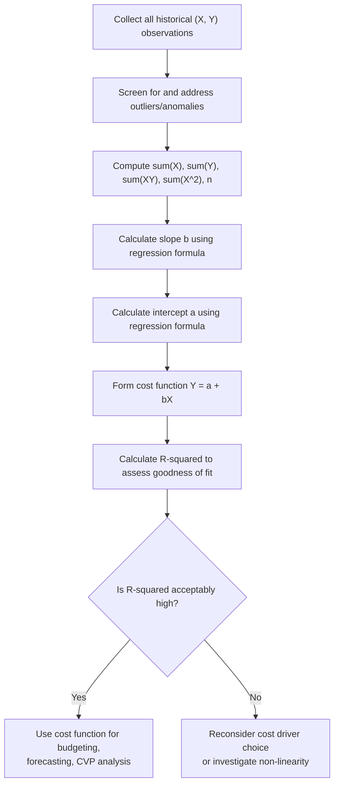

## Least Squares Regression Analysis

### Definition and Purpose

Least-squares regression analysis is a statistical technique used to separate a mixed cost into its fixed and variable components by fitting a straight line to **all** available historical data points, chosen specifically to minimize the sum of the squared vertical distances between each actual data point and the fitted line. It is the most statistically rigorous of the three standard mixed-cost estimation methods (high-low, scattergraph, and regression) because it uses the complete dataset and produces a single, mathematically determined, objectively reproducible result.

The method estimates the same underlying linear cost function used throughout cost behavior analysis:

$$Y = a + bX$$

Where $Y$ = total mixed cost (dependent variable), $a$ = total fixed cost (Y-intercept), $b$ = variable cost per unit of activity (slope), and $X$ = activity level or cost driver (independent variable).

### The "Least Squares" Criterion

For any given dataset, infinitely many straight lines could be drawn through or near the scattered points. The least-squares criterion selects the *one specific line* that minimizes the sum of squared **residuals** — the vertical distances between each actual observed cost ($Y_i$) and the cost predicted by the line at that same activity level ($\hat{Y}_i$):

$$\text{Minimize} \sum_{i=1}^{n} (Y_i - \hat{Y}_i)^2$$

Squaring the residuals serves two purposes: it prevents positive and negative deviations from canceling out, and it disproportionately penalizes larger deviations, which pulls the fitted line toward minimizing the largest errors. This is what distinguishes regression from the scattergraph method, where the line's position is chosen by eye rather than by a defined mathematical criterion.

### Regression Formulas

For simple linear regression with a single independent variable, the slope ($b$) and intercept ($a$) are calculated as:

$$b = \frac{n\sum{XY} - \sum{X}\sum{Y}}{n\sum{X^2} - \left(\sum{X}\right)^2}$$

$$a = \frac{\sum{Y} - b\sum{X}}{n} = \bar{Y} - b\bar{X}$$

Where:

- $n$ = number of observations (data points)
- $\sum{XY}$ = sum of the products of each period's $X$ and $Y$
- $\sum{X}$, $\sum{Y}$ = sums of all $X$ values and all $Y$ values, respectively
- $\sum{X^2}$ = sum of each $X$ value squared
- $\bar{X}$, $\bar{Y}$ = the means (averages) of $X$ and $Y$

These formulas are derived using calculus (setting the partial derivatives of the sum-of-squared-residuals function with respect to $a$ and $b$ equal to zero and solving simultaneously), though the derivation itself is rarely required in a managerial accounting context — the formulas are typically applied directly or computed via spreadsheet functions.

### Step-by-Step Manual Calculation

**Step 1:** Tabulate all observations of $X$ and $Y$.

**Step 2:** Compute five running totals: $\sum{X}$, $\sum{Y}$, $\sum{XY}$, $\sum{X^2}$, and $n$ (count of observations).

**Step 3:** Substitute these totals into the formula for $b$ and solve.

**Step 4:** Substitute $b$ and the totals into the formula for $a$ and solve.

**Step 5:** Write the final cost function $Y = a + bX$.

### Worked Example

A company tracks total factory overhead ($Y$) against machine hours ($X$) over five months:

| Month | X (Machine Hrs) | Y (Overhead $) | XY | X² |
| --- | --- | --- | --- | --- |
| 1 | 400 | 8,000 | 3,200,000 | 160,000 |
| 2 | 600 | 10,500 | 6,300,000 | 360,000 |
| 3 | 800 | 12,500 | 10,000,000 | 640,000 |
| 4 | 500 | 9,000 | 4,500,000 | 250,000 |
| 5 | 700 | 11,000 | 7,700,000 | 490,000 |
| **Σ (Sum)** | **3,000** | **51,000** | **31,700,000** | **1,900,000** |

With $n = 5$:

$$b = \frac{n\sum{XY} - \sum{X}\sum{Y}}{n\sum{X^2} - (\sum{X})^2} = \frac{5(31{,}700{,}000) - (3{,}000)(51{,}000)}{5(1{,}900{,}000) - (3{,}000)^2}$$

$$b = \frac{158{,}500{,}000 - 153{,}000{,}000}{9{,}500{,}000 - 9{,}000{,}000} = \frac{5{,}500{,}000}{500{,}000} = 11.00$$

$$a = \frac{\sum{Y} - b\sum{X}}{n} = \frac{51{,}000 - (11.00)(3{,}000)}{5} = \frac{51{,}000 - 33{,}000}{5} = \frac{18{,}000}{5} = 3{,}600$$

**Cost function:** $Y = 3{,}600 + 11.00X$

**Interpretation:** Total fixed factory overhead is estimated at $3,600 per month, and variable overhead is estimated at $11.00 per machine hour.

**Prediction at 650 machine hours:**

$$Y = 3{,}600 + (11.00 \times 650) = 3{,}600 + 7{,}150 = \$10{,}750$$

### The Coefficient of Determination ($R^2$)

Regression analysis is typically accompanied by the **coefficient of determination**, denoted $R^2$, which measures the proportion of the total variation in the dependent variable ($Y$) that is explained by variation in the independent variable ($X$).

$$R^2 = \frac{\text{Explained variation}}{\text{Total variation}}$$

$R^2$ ranges from 0 to 1 (or is sometimes expressed as 0% to 100%):

- $R^2 = 1.0$ (100%) indicates the activity driver perfectly explains all variation in cost (all data points lie exactly on the line)
- $R^2 = 0$ indicates the activity driver explains none of the variation in cost (the chosen $X$ has no linear relationship with $Y$)
- Higher $R^2$ values indicate a stronger linear relationship and greater confidence that the chosen cost driver is a good predictor

**Key Points**

- $R^2$ evaluates *goodness of fit*, not whether the relationship is causal
- A high $R^2$ does not prove that $X$ *causes* changes in $Y$ — it only shows they move together in a way well-described by a straight line
- [Inference] In practice, cost analysts often treat an $R^2$ above roughly 0.70–0.80 as evidence of a reasonably strong linear relationship suitable for cost estimation purposes, though no single universal threshold applies across all industries or cost types, and the appropriate cutoff is a matter of professional judgment specific to the context
- A low $R^2$ suggests the chosen activity driver may be the wrong variable to use, that multiple drivers may be needed (multiple regression), or that the cost behaves non-linearly

### Regression vs. High-Low vs. Scattergraph

| Criterion | High-Low | Scattergraph | Least-Squares Regression |
| --- | --- | --- | --- |
| Data points used | 2 (extremes only) | All (visually) | All (mathematically) |
| Objectivity | High (formulaic) | Low (subjective) | High (formulaic) |
| Statistical fit measure | None | None | $R^2$ available |
| Outlier sensitivity | Very high | Moderate (visible, can exclude) | Moderate (can distort $b$ if not screened first) |
| Computational effort | Very low | Low | Higher (typically requires spreadsheet/software) |
| Reproducibility | Fully reproducible | Not reproducible (subjective line) | Fully reproducible |
| Best use case | Quick, low-data estimate | Preliminary visual diagnostic | Formal budgeting and forecasting |

### Using Spreadsheet Software

In practice, least-squares regression is rarely computed by hand beyond illustrative examples; it is typically performed using spreadsheet functions or dedicated statistical software. Common approaches include:

- **Microsoft Excel built-in functions**:
  - `=SLOPE(known_Y's, known_X's)` returns $b$
  - `=INTERCEPT(known_Y's, known_X's)` returns $a$
  - `=RSQ(known_Y's, known_X's)` returns $R^2$
- **Excel's Data Analysis Toolpak (Regression tool)**: provides a full regression output including coefficients, $R^2$, standard errors, and significance statistics in one operation
- **Statistical software** (e.g., R, Python's `statsmodels` or `scikit-learn`, Minitab): used for more advanced analysis, including multiple regression with several independent variables (e.g., both machine hours and number of setups as joint predictors of overhead cost)

[Unverified] Behavior of specific spreadsheet functions (e.g., handling of blank cells, exact rounding behavior displayed) can vary slightly by software version, so results should always be sanity-checked against the manual formula, especially in graded coursework or audit contexts.

### Process Flow

### Graphical Representation

The least-squares line is positioned so that the sum of the squared vertical gaps (residuals) between it and every data point is as small as mathematically possible — smaller than for any other line that could be drawn through the same data.

<svg xmlns="http://www.w3.org/2000/svg" viewBox="0 0 520 360">
<text x="260" y="20" font-size="14" font-weight="bold" text-anchor="middle" fill="#1a1a1a">Least-Squares Regression Line and Residuals (svg_diagram)</text>
<line x1="60" y1="310" x2="480" y2="310" stroke="#333" stroke-width="2" />
<line x1="60" y1="310" x2="60" y2="40" stroke="#333" stroke-width="2" />
<text x="270" y="335" font-size="12" text-anchor="middle" fill="#333">Activity Level (X)</text>
<text x="20" y="180" font-size="12" text-anchor="middle" fill="#333" transform="rotate(-90 20 180)">Total Cost (Y)</text>
<line x1="80" y1="270" x2="440" y2="90" stroke="#2563eb" stroke-width="2.5" />
<text x="330" y="105" font-size="10" fill="#2563eb">Fitted regression line</text>
<circle cx="120" cy="245" r="5" fill="#555" />
<line x1="120" y1="245" x2="120" y2="258" stroke="#dc2626" stroke-width="1.5" />
<circle cx="180" cy="200" r="5" fill="#555" />
<line x1="180" y1="200" x2="180" y2="220" stroke="#dc2626" stroke-width="1.5" />
<circle cx="260" cy="170" r="5" fill="#555" />
<line x1="260" y1="170" x2="260" y2="163" stroke="#dc2626" stroke-width="1.5" />
<circle cx="340" cy="130" r="5" fill="#555" />
<line x1="340" y1="130" x2="340" y2="118" stroke="#dc2626" stroke-width="1.5" />
<circle cx="400" cy="100" r="5" fill="#555" />
<line x1="400" y1="100" x2="400" y2="98" stroke="#dc2626" stroke-width="1.5" />
<text x="130" y="290" font-size="10" fill="#dc2626">Residuals (squared and summed = minimized)</text>
</svg>

### Assumptions and Limitations

Least-squares regression relies on several assumptions that should hold reasonably well for the resulting cost function to be reliable:

- **Linearity**: the true relationship between cost and activity is assumed to be a straight line within the relevant range
- **Constant variance (homoscedasticity)**: the scatter of actual costs around the fitted line is assumed to be roughly consistent across all activity levels, not wider at high activity and narrower at low activity (or vice versa)
- **Independence of observations**: each period's cost is assumed not to be systematically influenced by a prior period's cost (e.g., no autocorrelation)
- **A single relevant cost driver**: simple linear regression assumes one independent variable adequately explains cost behavior; if multiple factors materially drive cost, multiple regression (with more than one $X$ variable) may be more appropriate
- **No material outliers**: extreme, non-representative observations (e.g., a strike, a natural disaster, a one-time bulk discount) can distort the fitted line if not identified and addressed before running the regression

**Key Points**

- Regression does not automatically detect or exclude outliers — the analyst must still review the underlying data and residuals for anomalies
- A statistically strong regression ($R^2$ close to 1) built on flawed or outlier-contaminated data can still produce a misleading cost function
- [Inference] Best practice generally treats regression output as a starting point that should be reviewed against operational knowledge of the business, since a mathematically "best fit" line is not automatically an economically sensible one

**Conclusion**

Least-squares regression analysis provides the most statistically defensible method for separating a mixed cost into its fixed and variable components, using all available historical data to compute a slope ($b$) and intercept ($a$) that minimize the sum of squared deviations between actual and predicted costs. Its ability to be paired with $R^2$ — a quantitative measure of goodness of fit — distinguishes it from both the high-low method and the scattergraph method, neither of which offers a statistical basis for assessing reliability. While more computationally demanding and typically requiring spreadsheet or statistical software, regression is the preferred method for formal budgeting, forecasting, and any cost analysis where precision and reproducibility matter.

**Related Topics**

- High-Low Method
- Scattergraph and Visual Fit Method
- Mixed Cost Behavior and the Linear Cost Function
- Coefficient of Determination ($R^2$) and Correlation vs. Causation
- Multiple Regression Analysis for Cost Estimation
- Identifying and Handling Outliers in Cost Data
- Cost-Volume-Profit (CVP) Analysis Using Estimated Cost Functions