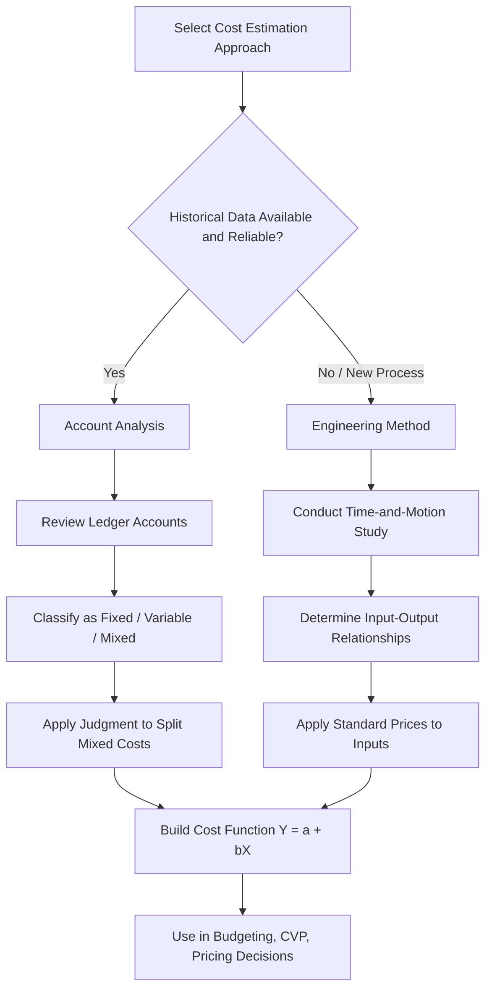

## Account Analysis and Engineering Methods

### Overview

Account analysis and the engineering approach (also called industrial engineering method) are two of the primary techniques managers use to estimate cost behavior — that is, to classify costs as fixed, variable, or mixed, and to quantify how they respond to changes in activity level. Both are foundational tools within cost estimation, used alongside quantitative methods such as the high-low method and regression analysis.

### Purpose of Cost Estimation

Before examining the two methods, it helps to recall why cost estimation matters. Managers need reliable cost functions of the general form:

$$Y = a + bX$$

where $Y$ is total mixed cost, $a$ is the fixed cost component, $b$ is the variable cost per unit of activity, and $X$ is the level of the cost driver (activity). Estimating $a$ and $b$ accurately supports budgeting, CVP analysis, pricing, and performance evaluation.

---

### Account Analysis Method

**Definition**

Account analysis (sometimes called the "classification method") is a technique in which a knowledgeable person — typically the accountant, controller, or department manager — reviews each account in the general ledger and classifies it as fixed, variable, or mixed based on professional judgment and knowledge of operations.

**How It Works**

1. Pull the chart of accounts (or a relevant subset, such as manufacturing overhead accounts) for a period.
2. For each account, examine the underlying nature of the cost and how it has historically moved relative to the activity driver (e.g., machine hours, units produced, labor hours).
3. Classify each account:
   - **Variable** — cost varies proportionally with activity (e.g., direct materials, sales commissions).
   - **Fixed** — cost remains constant regardless of activity within the relevant range (e.g., factory rent, supervisor salaries).
   - **Mixed** — cost has both fixed and variable elements (e.g., utilities, equipment maintenance).
4. For mixed accounts, the analyst may further split the cost into its fixed and variable pieces using judgment, historical ratios, or supplementary analysis.
5. Sum all variable-classified amounts (per unit or in total) and all fixed-classified amounts to build the aggregate cost function.

**Example**

A factory controller reviews the monthly overhead ledger:

| Account | Monthly Amount | Classification |
| --- | --- | --- |
| Indirect materials | $18,000 | Variable |
| Factory supervisor salary | $6,500 | Fixed |
| Equipment depreciation (straight-line) | $4,000 | Fixed |
| Electricity | $9,200 | Mixed |
| Machine lubricants | $2,300 | Variable |

The controller further estimates that of the $9,200 electricity cost, $3,000 is a fixed base charge and the remainder varies with machine hours. If 4,400 machine hours were run that month, the variable rate is:

$$b = \frac{\$9,200 - \$3,000}{4,400 \text{ hours}} = \$1.41 \text{ per machine hour (rounded)}$$

Total fixed cost = $6,500 + $4,000 + $3,000 = $13,500

Total variable cost per unit driver = combined per-unit rates from indirect materials, lubricants, and the variable electricity component.

**Key Points**

- Relies heavily on subjective judgment; results depend on the analyst's familiarity with operations.
- Fast and inexpensive relative to statistical methods — no need for extensive historical data.
- Useful when historical data is unavailable, unreliable, or when operations have recently changed (making past data non-representative).
- Often used as a cross-check or supplement to quantitative methods like regression.
- Risk of inconsistency: different analysts may classify the same account differently.

---

### Engineering (Industrial Engineering) Method

**Definition**

The engineering method estimates cost behavior by analyzing the physical relationship between inputs and outputs — essentially building a cost estimate "from the ground up" based on what a process *should* cost, rather than what it *has* cost historically.

**How It Works**

1. **Process study** — industrial engineers or analysts conduct time-and-motion studies, observe workflows, and document each step of a production or service process.
2. **Input-output relationships are established** — for each unit of output, engineers determine the required quantities of materials, labor time, machine time, and energy.
3. **Prices are applied** — standard prices/rates (material cost per unit, wage rate per hour, utility rate per kWh) are applied to the physical input quantities to derive a cost per unit of output.
4. **Cost function is built** without needing historical cost data at all — it is essentially a bottom-up standard cost estimate.

**Example**

An engineer studying a furniture assembly line determines that producing one wooden chair requires:

- 3.5 board-feet of lumber at $4.00 per board-foot
- 0.75 direct labor hours at $22.00 per hour
- 0.10 machine hours of sanding/finishing equipment at $15.00 per machine hour

Variable cost per chair:

$$b = (3.5 \times \$4.00) + (0.75 \times \$22.00) + (0.10 \times \$15.00)$$

$$b = \$14.00 + \$16.50 + \$1.50 = \$32.00 \text{ per chair}$$

If fixed overhead (supervision, depreciation on the line) is separately budgeted at $50,000 per month regardless of chair volume, the full cost function becomes:

$$Y = \$50,000 + \$32.00X$$

**Key Points**

- Does not require historical cost data — ideal for new products, new processes, or situations with no cost history.
- Highly accurate for direct, easily measurable inputs (materials, direct labor) because it is grounded in physical/technical relationships.
- Time-consuming and expensive — requires detailed engineering studies, time-and-motion analysis, and technical expertise.
- Less effective for estimating indirect or overhead costs that don't have a clear physical input-output relationship (e.g., administrative costs).
- Commonly used in manufacturing settings to set standard costs, which then feed into standard costing systems and variance analysis.

---

### Comparing Account Analysis and Engineering Methods

| Criterion | Account Analysis | Engineering Method |
| --- | --- | --- |
| Data source | Historical accounting records | Physical process study (no history needed) |
| Basis | Professional judgment | Technical/scientific measurement |
| Cost | Low cost, quick | High cost, time-intensive |
| Best suited for | Ongoing operations with existing ledgers | New products/processes, no cost history |
| Objectivity | Lower (subjective) | Higher (based on measurable inputs) |
| Precision | Approximate | Detailed and precise for direct costs |
| Common users | Accountants, controllers | Industrial/manufacturing engineers |

### Relationship to Other Cost Estimation Methods

Account analysis and engineering methods are considered **qualitative/judgmental approaches**, in contrast to **quantitative approaches** like:

- **High-low method** — uses only the highest and lowest activity observations to estimate $a$ and $b$ algebraically.
- **Scatter-graph (visual fit) method** — plots cost against activity and visually fits a line.
- **Regression analysis (least-squares)** — statistically fits a line to minimize the sum of squared residuals, producing the most statistically rigorous estimate.

In practice, organizations often use account analysis or the engineering method as a **starting point or sanity check**, then validate or refine estimates with regression analysis once sufficient historical data accumulates.

### Process Flow Diagram

### Diagram: Account Analysis vs. Engineering Method Inputs (svg_diagram)

<svg xmlns="http://www.w3.org/2000/svg" viewBox="0 0 720 340">
<text x="360" y="25" font-size="16" font-weight="bold" text-anchor="middle" fill="#1a1a1a">Account Analysis vs. Engineering Method (svg_diagram)</text>
<rect x="30" y="60" width="290" height="240" rx="8" fill="#eef4fb" stroke="#3a6ea5" stroke-width="1.5" />
<text x="175" y="90" font-size="14" font-weight="bold" text-anchor="middle" fill="#1a3a5c">Account Analysis</text>
<text x="50" y="120" font-size="12" fill="#1a1a1a">Input: General Ledger Accounts</text>
<text x="50" y="145" font-size="12" fill="#1a1a1a">Method: Judgment-based review</text>
<text x="50" y="170" font-size="12" fill="#1a1a1a">Analyst: Accountant / Controller</text>
<text x="50" y="195" font-size="12" fill="#1a1a1a">Classifies: Fixed, Variable, Mixed</text>
<text x="50" y="220" font-size="12" fill="#1a1a1a">Speed: Fast, low cost</text>
<text x="50" y="245" font-size="12" fill="#1a1a1a">Best for: Ongoing operations</text>
<text x="50" y="270" font-size="12" fill="#1a1a1a">Weakness: Subjective bias</text>
<rect x="400" y="60" width="290" height="240" rx="8" fill="#fbeeee" stroke="#a53a3a" stroke-width="1.5" />
<text x="545" y="90" font-size="14" font-weight="bold" text-anchor="middle" fill="#5c1a1a">Engineering Method</text>
<text x="420" y="120" font-size="12" fill="#1a1a1a">Input: Physical process study</text>
<text x="420" y="145" font-size="12" fill="#1a1a1a">Method: Time-and-motion analysis</text>
<text x="420" y="170" font-size="12" fill="#1a1a1a">Analyst: Industrial Engineer</text>
<text x="420" y="195" font-size="12" fill="#1a1a1a">Classifies: Input-output ratios</text>
<text x="420" y="220" font-size="12" fill="#1a1a1a">Speed: Slow, high cost</text>
<text x="420" y="245" font-size="12" fill="#1a1a1a">Best for: New products/processes</text>
<text x="420" y="270" font-size="12" fill="#1a1a1a">Weakness: Time-intensive setup</text>
<line x1="320" y1="180" x2="400" y2="180" stroke="#555" stroke-width="2" marker-end="url(#arrow)" />
<text x="360" y="170" font-size="10" text-anchor="middle" fill="#555">feeds</text>
<text x="360" y="330" font-size="12" text-anchor="middle" fill="#1a1a1a">Both output a cost function: Y = a + bX</text>
</svg>

### Strengths and Limitations Summary

**Account Analysis**

- Strength: Simple, quick, leverages existing accounting expertise and ledger detail.
- Limitation: Subject to bias; different analysts may reach different conclusions on the same account. [Inference] Reliability tends to improve when the analyst has deep operational knowledge, though this is not formally measurable.

**Engineering Method**

- Strength: Objective, grounded in physical measurement; does not depend on potentially distorted historical data.
- Limitation: Expensive and slow to conduct; less practical for costs without clear physical input-output linkages (e.g., many administrative or discretionary fixed costs).

### Next Steps

**Related Topics**

- High-Low Method for Cost Estimation
- Scatter-Graph (Visual Fit) Method
- Least-Squares Regression Analysis
- Mixed Costs and the Cost Equation (Y = a + bX)
- Relevant Range and Its Effect on Cost Behavior
- Standard Costing and Variance Analysis
- Cost-Volume-Profit (CVP) Analysis
- Coefficient of Determination (R²) in Cost Estimation Reliability