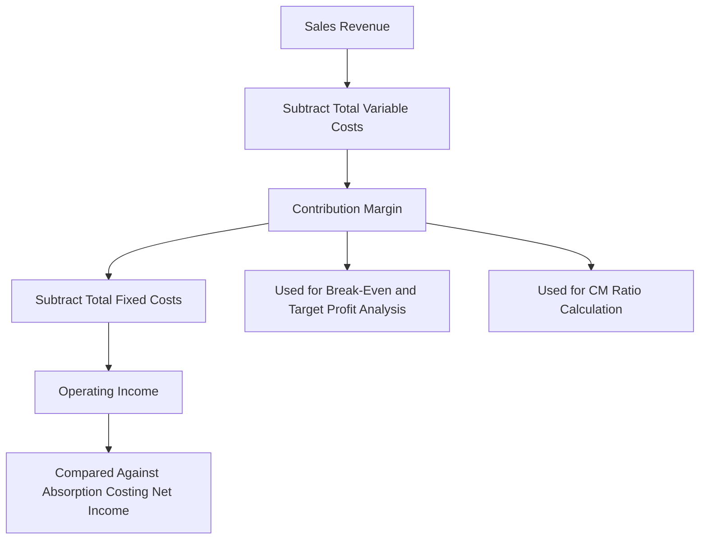

## Contribution Margin Income Statement

### Overview

The contribution margin income statement (also called the variable costing income statement) reorganizes revenue and cost information by **cost behavior** (fixed vs. variable) rather than by **business function** (manufacturing vs. selling/administrative), as used in the traditional (absorption/functional) income statement. It is the primary internal reporting format used for cost-volume-profit (CVP) analysis, break-even calculations, and short-term decision making.

### Purpose and Use

Unlike the traditional income statement — which is required for external (GAAP/IFRS) reporting — the contribution margin format is used exclusively for **internal management purposes**. It isolates the contribution margin, a figure critical to profitability analysis, decision-making (e.g., special orders, make-or-buy, product mix), and break-even/target profit calculations.

### Structure and Format

The contribution margin income statement follows this general layout:



```
Sales Revenue
Less: Variable Costs (Variable COGS + Variable Selling & Admin)
= Contribution Margin
Less: Fixed Costs (Fixed Manufacturing Overhead + Fixed Selling & Admin)
= Operating Income (Net Operating Income)
```

**Key Points**

- All variable costs (both manufacturing and non-manufacturing) are grouped together and subtracted from sales first.
- Contribution margin (CM) is the intermediate subtotal representing the amount remaining to cover fixed costs and contribute to profit.
- All fixed costs (both manufacturing and non-manufacturing) are grouped together and subtracted from contribution margin to arrive at operating income.
- This contrasts with the traditional format, which separates costs into Cost of Goods Sold (mixing fixed and variable manufacturing costs) and Operating Expenses (mixing fixed and variable selling/admin costs), then computes gross margin, not contribution margin.

### Formula

$$\text{Contribution Margin} = \text{Sales} - \text{Total Variable Costs}$$


$$\text{Operating Income} = \text{Contribution Margin} - \text{Total Fixed Costs}$$

Contribution margin can also be expressed:

- **Per unit**: $CM_{\text{per unit}} = \text{Selling Price per Unit} - \text{Variable Cost per Unit}$
- **As a ratio (CM ratio)**:

$$\text{CM Ratio} = \frac{\text{Contribution Margin}}{\text{Sales}}$$

The CM ratio expresses what percentage of each sales dollar remains after variable costs to contribute toward fixed costs and profit.

### Example

Assume a company, BrightDesk Co., sells desk lamps. Data for the month:

- Units sold: 10,000
- Selling price per unit: $40
- Variable manufacturing cost per unit: $14
- Variable selling cost per unit: $3
- Fixed manufacturing overhead: $90,000
- Fixed selling and administrative expense: $45,000

**Contribution Margin Income Statement**

| Line Item | Amount |
| --- | --- |
| Sales (10,000 × $40) | $400,000 |
| Less: Variable Costs |  |
| — Variable manufacturing costs (10,000 × $14) | ($140,000) |
| — Variable selling costs (10,000 × $3) | ($30,000) |
| **Contribution Margin** | **$230,000** |
| Less: Fixed Costs |  |
| — Fixed manufacturing overhead | ($90,000) |
| — Fixed selling and administrative expense | ($45,000) |
| **Operating Income** | **$95,000** |

Supplementary calculations:

$$CM_{\text{per unit}} = \$40 - (\$14 + \$3) = \$23 \text{ per unit}$$


$$CM \text{ Ratio} = \frac{\$230,000}{\$400,000} = 57.5\%$$

This means every additional $1 of sales revenue contributes $0.575 toward covering fixed costs and generating profit, once break-even is reached.

### Comparison: Contribution Margin vs. Traditional (Absorption) Income Statement

| Feature | Contribution Margin Format | Traditional (Absorption) Format |
| --- | --- | --- |
| Cost classification basis | By behavior (fixed vs. variable) | By function (product vs. period) |
| Key subtotal | Contribution Margin | Gross Margin (Gross Profit) |
| Fixed manufacturing overhead | Treated as a period cost, expensed in full | Allocated to units produced (product cost) |
| Use | Internal decision-making, CVP analysis | External financial reporting (GAAP/IFRS) |
| Inventory valuation | Excludes fixed MOH (variable costing) | Includes fixed MOH (absorption costing) |
| Net income (varying inventory) | Differs from absorption when production ≠ sales | Differs from variable costing when production ≠ sales |

**Key Points**

- The two formats can produce different operating income figures when units produced differ from units sold, because absorption costing defers some fixed manufacturing overhead in ending inventory, while variable costing expenses all fixed MOH in the period incurred.
- If units produced = units sold, both methods report the same operating income.

### Side-by-Side Statement Comparison

|  | Contribution Margin Format | Traditional Format |
| --- | --- | --- |
| Sales | $400,000 | $400,000 |
| Variable COGS | ($140,000) | — |
| Variable Selling Exp. | ($30,000) | — |
| **Contribution Margin** | **$230,000** | — |
| Fixed MOH | ($90,000) | Included in COGS |
| Fixed Selling & Admin | ($45,000) | — |
| COGS (Var. + Fixed MOH combined) | — | ($230,000)* |
| **Gross Margin** | — | **$170,000** |
| Operating Expenses (Var. + Fixed Selling) | — | ($75,000) |
| **Operating Income** | **$95,000** | **$95,000** |

*Assumes all units produced equal units sold, so fixed MOH is fully expensed in both formats and figures reconcile.

### Uses in Managerial Decision-Making

1. **Break-even analysis** — Break-even point in units is calculated using contribution margin per unit:

$$\text{Break-even (units)} = \frac{\text{Total Fixed Costs}}{CM_{\text{per unit}}}$$

Using the example: $\frac{\$135,000}{\$23} \approx 5,870$ units.

2. **Target profit analysis** — extends the break-even formula by adding a target operating income to fixed costs in the numerator.
3. **Special order decisions** — because fixed costs are already separated out, managers can quickly assess whether an order's price exceeds variable cost (contributing to profit), without fixed-cost allocation distorting the decision.
4. **Product-line and segment profitability** — CM statements are often prepared by segment (product, region, customer) to evaluate which lines generate the most contribution toward covering common fixed costs.
5. **What-if / sensitivity analysis** — because costs are cleanly split by behavior, it is straightforward to model the effect of volume changes on profit.

### Segmented Contribution Margin Statement (Multi-Product Example)

|  | Product A | Product B | Total |
| --- | --- | --- | --- |
| Sales | $250,000 | $150,000 | $400,000 |
| Variable Costs | ($100,000) | ($70,000) | ($170,000) |
| **Contribution Margin** | **$150,000** | **$80,000** | **$230,000** |
| Traceable Fixed Costs | ($60,000) | ($40,000) | ($100,000) |
| **Segment Margin** | **$90,000** | **$40,000** | **$130,000** |
| Common Fixed Costs (unallocated) |  |  | ($35,000) |
| **Operating Income** |  |  | **$95,000** |

This layered format introduces the **segment margin**, calculated after subtracting only costs traceable to that specific segment, before subtracting common (untraceable) fixed costs at the company level. This avoids arbitrary allocation of shared fixed costs across product lines.

### Statement Flow Diagram



### Contribution Margin Statement Structure Diagram (svg_diagram)

<svg xmlns="http://www.w3.org/2000/svg" viewBox="0 0 700 380">
<text x="350" y="25" font-size="16" font-weight="bold" text-anchor="middle" fill="#1a1a1a">Contribution Margin Income Statement Flow (svg_diagram)</text>
<rect x="220" y="50" width="260" height="40" rx="6" fill="#dbe9f6" stroke="#3a6ea5" stroke-width="1.5" />
<text x="350" y="75" font-size="13" text-anchor="middle" fill="#1a3a5c">Sales Revenue</text>
<line x1="350" y1="90" x2="350" y2="115" stroke="#555" stroke-width="2" marker-end="url(#arrow2)" />
<text x="440" y="105" font-size="11" fill="#555">(–) Variable Costs</text>
<rect x="220" y="115" width="260" height="40" rx="6" fill="#dcf0dc" stroke="#3a7a3a" stroke-width="1.5" />
<text x="350" y="140" font-size="13" font-weight="bold" text-anchor="middle" fill="#1a4a1a">Contribution Margin</text>
<line x1="350" y1="155" x2="350" y2="180" stroke="#555" stroke-width="2" marker-end="url(#arrow2)" />
<text x="440" y="170" font-size="11" fill="#555">(–) Fixed Costs</text>
<rect x="220" y="180" width="260" height="40" rx="6" fill="#f6e9db" stroke="#a5723a" stroke-width="1.5" />
<text x="350" y="205" font-size="13" font-weight="bold" text-anchor="middle" fill="#5c3a1a">Operating Income</text>
<line x1="220" y1="135" x2="80" y2="135" stroke="#888" stroke-width="1.5" stroke-dasharray="4" />
<rect x="20" y="240" width="180" height="60" rx="6" fill="#f5f5f5" stroke="#888" stroke-width="1" />
<text x="110" y="265" font-size="11" text-anchor="middle" fill="#333">Break-Even Point =</text>
<text x="110" y="282" font-size="11" text-anchor="middle" fill="#333">Fixed Costs / CM per unit</text>
<line x1="480" y1="135" x2="620" y2="135" stroke="#888" stroke-width="1.5" stroke-dasharray="4" />
<rect x="520" y="240" width="180" height="60" rx="6" fill="#f5f5f5" stroke="#888" stroke-width="1" />
<text x="610" y="265" font-size="11" text-anchor="middle" fill="#333">CM Ratio =</text>
<text x="610" y="282" font-size="11" text-anchor="middle" fill="#333">CM / Sales</text>
</svg>

### Limitations

- Not permitted for external financial reporting under GAAP or IFRS, since it excludes fixed manufacturing overhead from product costs (a violation of the full-absorption costing requirement).
- Requires accurate classification of every cost into fixed and variable components, which relies on the cost estimation methods (account analysis, high-low, regression) covered separately — misclassification of mixed costs can distort the contribution margin and downstream decisions.
- [Inference] Because contribution margin statements assume a linear cost-volume relationship within the relevant range, results become less reliable outside that range, though the extent of distortion depends on the specific cost structure of the business.

### Next Steps

**Related Topics**

- Cost-Volume-Profit (CVP) Analysis
- Break-Even Point and Target Profit Calculations
- Variable Costing vs. Absorption Costing
- Segment Margin and Traceable vs. Common Fixed Costs
- Degree of Operating Leverage
- Sales Mix and Multi-Product Break-Even Analysis
- High-Low Method and Regression Analysis (for classifying mixed costs)
- Special Order and Make-or-Buy Decision Analysis