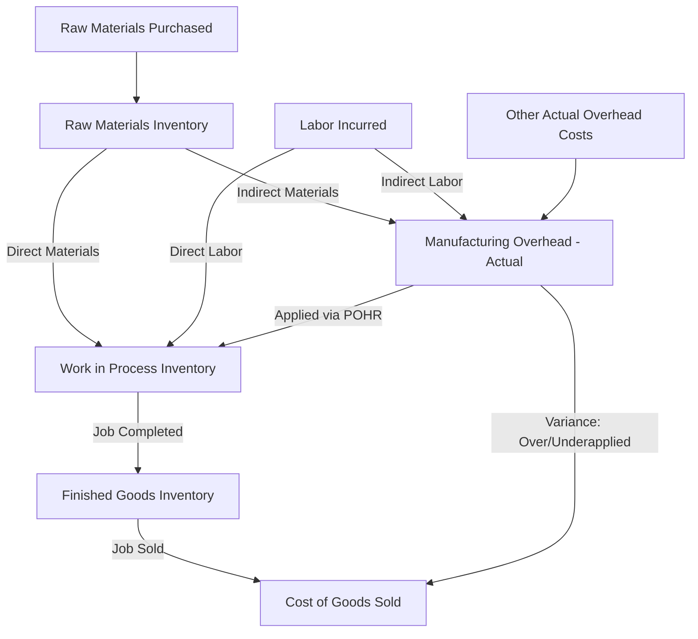

## Cost Flows in a Job Order Costing System


### Overview

Job order costing is a product costing system used by companies that produce unique, distinct products or batches (jobs) — such as custom furniture, construction projects, printing jobs, or specialized manufacturing. The cost flow describes how manufacturing costs move through the accounting system: from raw materials, labor, and overhead, through Work in Process (WIP), into Finished Goods, and finally to Cost of Goods Sold (COGS) upon sale.

### The Three Manufacturing Cost Elements

Every job accumulates three categories of cost:

1. **Direct Materials (DM)** — raw materials that are directly and conveniently traceable to a specific job.
2. **Direct Labor (DL)** — wages of workers directly involved in producing a specific job.
3. **Manufacturing Overhead (MOH)** — indirect costs that cannot be directly traced to a specific job (e.g., indirect materials, indirect labor, factory utilities, depreciation on factory equipment), applied to jobs using a **predetermined overhead rate (POHR)**.

### The Job Cost Sheet

Each job has a **job cost sheet** (or job cost record) that accumulates DM, DL, and applied MOH specific to that job. It serves as a subsidiary ledger supporting the WIP control account.

**Key Points**

- The sum of all job cost sheets for uncompleted jobs must equal the balance in the WIP Inventory control account.
- The sum of all job cost sheets for completed but unsold jobs must equal the balance in Finished Goods Inventory.

### Overview of the Cost Flow Sequence



```
Raw Materials Purchased → Raw Materials Inventory
Raw Materials Used (Direct) → Work in Process Inventory
Raw Materials Used (Indirect) → Manufacturing Overhead (actual)
Direct Labor Incurred → Work in Process Inventory
Indirect Labor Incurred → Manufacturing Overhead (actual)
Other Actual Overhead Costs → Manufacturing Overhead (actual)
Overhead Applied (POHR × Actual Activity) → Work in Process Inventory
Completed Jobs → Finished Goods Inventory
Jobs Sold → Cost of Goods Sold
```

### Step 1: Purchase of Raw Materials

Materials are purchased and recorded in the Raw Materials Inventory account (an asset).

**Journal Entry**



```
Dr. Raw Materials Inventory       XX
    Cr. Accounts Payable / Cash        XX
```

### Step 2: Issuance of Materials to Production

Materials requisitioned from the storeroom are classified as either direct or indirect.

- **Direct materials** flow into Work in Process Inventory, traced to specific jobs via materials requisition forms.
- **Indirect materials** (e.g., glue, lubricants, shop supplies) flow into Manufacturing Overhead as an actual (incurred) overhead cost, since they cannot be traced to a single job.

**Journal Entry**



```
Dr. Work in Process Inventory     XX  (direct materials)
Dr. Manufacturing Overhead        XX  (indirect materials)
    Cr. Raw Materials Inventory        XX
```

### Step 3: Recording Labor Costs

Labor costs are captured via time tickets, which identify how many hours each employee spent on each job.

- **Direct labor** is traced to specific jobs and flows into Work in Process Inventory.
- **Indirect labor** (e.g., supervisors, maintenance staff, janitorial) flows into Manufacturing Overhead.

**Journal Entry**



```
Dr. Work in Process Inventory     XX  (direct labor)
Dr. Manufacturing Overhead        XX  (indirect labor)
    Cr. Wages Payable / Salaries Payable   XX
```

### Step 4: Recording Actual Manufacturing Overhead

All actual overhead costs incurred during the period — factory utilities, depreciation on factory equipment, factory insurance, property taxes on the plant, indirect materials, and indirect labor — are accumulated on the **debit side** of the Manufacturing Overhead account (a temporary clearing account).

**Journal Entry**



```
Dr. Manufacturing Overhead        XX
    Cr. Accumulated Depreciation       XX
    Cr. Utilities Payable              XX
    Cr. Prepaid Insurance              XX
    Cr. Property Taxes Payable         XX
```

### Step 5: Applying Manufacturing Overhead to Jobs

Because actual overhead costs are often not known until period-end, companies apply overhead to jobs throughout the period using a **predetermined overhead rate (POHR)**, calculated before the period begins:

$$POHR = \frac{\text{Estimated Total Manufacturing Overhead Cost}}{\text{Estimated Total Amount of Allocation Base}}$$

Common allocation bases include direct labor hours, direct labor cost, or machine hours.

Overhead applied to a specific job:

$$\text{Overhead Applied} = POHR \times \text{Actual Amount of Allocation Base Used by the Job}$$

**Journal Entry**



```
Dr. Work in Process Inventory     XX  (applied overhead)
    Cr. Manufacturing Overhead         XX
```

This entry moves applied overhead onto the credit side of the Manufacturing Overhead account, while actual overhead remains on the debit side — creating the potential for over- or underapplied overhead.

### Example: Computing and Applying POHR

Estimated total manufacturing overhead for the year: $450,000

Estimated total direct labor hours: 30,000 DLH

$$POHR = \frac{\$450,000}{30,000 \text{ DLH}} = \$15 \text{ per DLH}$$

Job #205 used 120 direct labor hours during the month.

$$\text{Overhead Applied to Job \#205} = \$15 \times 120 = \$1,800$$

This $1,800 is added to Job #205's job cost sheet, alongside its direct materials and direct labor costs.

### Step 6: Completing a Job — Transfer to Finished Goods

When a job is completed, its total accumulated cost (DM + DL + Applied MOH) is transferred out of Work in Process Inventory and into Finished Goods Inventory.

**Journal Entry**



```
Dr. Finished Goods Inventory      XX
    Cr. Work in Process Inventory      XX
```

### Step 7: Sale of a Job — Transfer to Cost of Goods Sold

When the finished job is sold, its cost is transferred from Finished Goods Inventory to Cost of Goods Sold, and revenue is recognized separately.

**Journal Entry**



```
Dr. Accounts Receivable / Cash    XX
    Cr. Sales Revenue                  XX

Dr. Cost of Goods Sold            XX
    Cr. Finished Goods Inventory       XX
```

### Comprehensive Example

Job #310 (a custom cabinetry order) incurs the following costs:

| Cost Element | Amount |
| --- | --- |
| Direct materials | $3,200 |
| Direct labor (80 hours × $25/hr) | $2,000 |
| Applied overhead (80 hours × $15 POHR) | $1,200 |
| **Total job cost** | **$6,400** |

Cost flow through the accounts:

1. $3,200 direct materials requisitioned → Dr. WIP $3,200 / Cr. Raw Materials $3,200
2. $2,000 direct labor incurred → Dr. WIP $2,000 / Cr. Wages Payable $2,000
3. $1,200 overhead applied → Dr. WIP $1,200 / Cr. Manufacturing Overhead $1,200
4. Job completed → Dr. Finished Goods $6,400 / Cr. WIP $6,400
5. Job sold for $9,000 → Dr. A/R $9,000 / Cr. Sales $9,000; Dr. COGS $6,400 / Cr. Finished Goods $6,400

Gross profit on Job #310 = $9,000 − $6,400 = **$2,600**

### Over- and Underapplied Overhead

Because applied overhead (based on the POHR and *estimated* costs/activity) rarely equals actual overhead incurred, a difference — the **overhead variance** — typically remains in the Manufacturing Overhead account at period-end.

- **Underapplied overhead**: Actual MOH > Applied MOH (debit balance remains) — overhead was under-assigned to jobs.
- **Overapplied overhead**: Actual MOH < Applied MOH (credit balance remains) — overhead was over-assigned to jobs.

**Disposition of the Variance**

1. **Immaterial amount** — closed directly to Cost of Goods Sold.



```
Underapplied (close to COGS):
Dr. Cost of Goods Sold            XX
    Cr. Manufacturing Overhead         XX

Overapplied (close to COGS):
Dr. Manufacturing Overhead        XX
    Cr. Cost of Goods Sold             XX
```

2. **Material amount** — prorated among Work in Process, Finished Goods, and Cost of Goods Sold based on their relative overhead balances, providing a more accurate approximation of actual costs in each account.

### Example: Over/Underapplied Overhead

Actual manufacturing overhead incurred during the year: $460,000

Total overhead applied to jobs during the year: $450,000

$$\text{Underapplied Overhead} = \$460,000 - \$450,000 = \$10,000$$

Since actual exceeded applied, this is **underapplied** overhead (a debit balance in the MOH account). If immaterial, it is closed with:



```
Dr. Cost of Goods Sold            \$10,000
    Cr. Manufacturing Overhead         \$10,000
```

### T-Account Flow Summary

| Account | Debit (Increases) | Credit (Decreases) |
| --- | --- | --- |
| Raw Materials Inventory | Purchases | Materials issued (DM + indirect) |
| Work in Process Inventory | DM, DL, Applied MOH | Cost of completed jobs |
| Manufacturing Overhead | Actual OH costs incurred | Applied OH (POHR × activity) |
| Finished Goods Inventory | Cost of completed jobs | Cost of jobs sold (COGS) |
| Cost of Goods Sold | Cost of jobs sold | Overapplied OH adjustment (if any) |

### Cost Flow Diagram



### Cost Flow Structure Diagram (svg_diagram)

<svg xmlns="http://www.w3.org/2000/svg" viewBox="0 0 760 420">
<text x="380" y="25" font-size="16" font-weight="bold" text-anchor="middle" fill="#1a1a1a">Job Order Costing: Cost Flow Structure (svg_diagram)</text>
<rect x="20" y="60" width="160" height="50" rx="6" fill="#dbe9f6" stroke="#3a6ea5" stroke-width="1.5" />
<text x="100" y="90" font-size="12" text-anchor="middle" fill="#1a3a5c">Raw Materials Inventory</text>
<rect x="300" y="60" width="160" height="50" rx="6" fill="#dcf0dc" stroke="#3a7a3a" stroke-width="1.5" />
<text x="380" y="90" font-size="12" text-anchor="middle" fill="#1a4a1a">Work in Process</text>
<rect x="300" y="150" width="160" height="50" rx="6" fill="#f6e9db" stroke="#a5723a" stroke-width="1.5" />
<text x="380" y="180" font-size="12" text-anchor="middle" fill="#5c3a1a">Manufacturing Overhead</text>
<rect x="580" y="60" width="160" height="50" rx="6" fill="#dcf0dc" stroke="#3a7a3a" stroke-width="1.5" />
<text x="660" y="90" font-size="12" text-anchor="middle" fill="#1a4a1a">Finished Goods</text>
<rect x="580" y="150" width="160" height="50" rx="6" fill="#f6dbdb" stroke="#a53a3a" stroke-width="1.5" />
<text x="660" y="180" font-size="12" text-anchor="middle" fill="#5c1a1a">Cost of Goods Sold</text>
<rect x="20" y="250" width="160" height="50" rx="6" fill="#eee" stroke="#888" stroke-width="1.5" />
<text x="100" y="275" font-size="12" text-anchor="middle" fill="#333">Direct/Indirect Labor</text>
<rect x="20" y="330" width="160" height="50" rx="6" fill="#eee" stroke="#888" stroke-width="1.5" />
<text x="100" y="355" font-size="12" text-anchor="middle" fill="#333">Other Actual OH Costs</text>
<line x1="180" y1="85" x2="300" y2="85" stroke="#555" stroke-width="2" marker-end="url(#arrow3)" />
<text x="240" y="78" font-size="9" fill="#555">Direct Mat.</text>
<line x1="180" y1="95" x2="300" y2="175" stroke="#555" stroke-width="2" marker-end="url(#arrow3)" />
<text x="200" y="140" font-size="9" fill="#555">Indirect Mat.</text>
<line x1="100" y1="250" x2="360" y2="110" stroke="#555" stroke-width="2" marker-end="url(#arrow3)" />
<text x="180" y="200" font-size="9" fill="#555">Direct Labor</text>
<line x1="180" y1="270" x2="300" y2="180" stroke="#555" stroke-width="2" marker-end="url(#arrow3)" />
<text x="190" y="250" font-size="9" fill="#555">Indirect Labor</text>
<line x1="180" y1="355" x2="300" y2="185" stroke="#555" stroke-width="2" marker-end="url(#arrow3)" />
<text x="200" y="320" font-size="9" fill="#555">Actual OH</text>
<line x1="380" y1="150" x2="380" y2="110" stroke="#555" stroke-width="2" marker-end="url(#arrow3)" />
<text x="390" y="130" font-size="9" fill="#555">Applied OH (POHR)</text>
<line x1="460" y1="85" x2="580" y2="85" stroke="#555" stroke-width="2" marker-end="url(#arrow3)" />
<text x="500" y="78" font-size="9" fill="#555">Job Completed</text>
<line x1="660" y1="110" x2="660" y2="150" stroke="#555" stroke-width="2" marker-end="url(#arrow3)" />
<text x="670" y="135" font-size="9" fill="#555">Job Sold</text>
<line x1="460" y1="175" x2="580" y2="175" stroke="#555" stroke-width="2" stroke-dasharray="4" marker-end="url(#arrow3)" />
<text x="480" y="200" font-size="9" fill="#555">Variance (Over/Under)</text>
</svg>

### Limitations and Practical Considerations

- The accuracy of applied overhead depends entirely on how well the estimated overhead and estimated allocation base (used to compute the POHR) reflect actual results; large forecasting errors lead to significant over/underapplied balances.
- [Inference] Companies with more stable, predictable overhead and activity levels generally experience smaller period-end variances, though this depends on the specific volatility of each company's cost structure and industry.
- Job order costing requires detailed record-keeping (job cost sheets, time tickets, materials requisitions) and is generally more administratively costly than process costing, which is why it is typically reserved for heterogeneous, custom, or batch production rather than continuous, homogeneous manufacturing.

### Next Steps

**Related Topics**

- Predetermined Overhead Rate (POHR) Calculation
- Job Cost Sheets and Source Documents (Materials Requisitions, Time Tickets)
- Over- and Underapplied Overhead: Proration vs. Direct Write-Off to COGS
- Process Costing vs. Job Order Costing
- Activity-Based Costing (ABC) as an Overhead Allocation Refinement
- Multiple Predetermined Overhead Rates (Departmental Rates)
- Normal Costing vs. Actual Costing vs. Standard Costing
- Schedule of Cost of Goods Manufactured