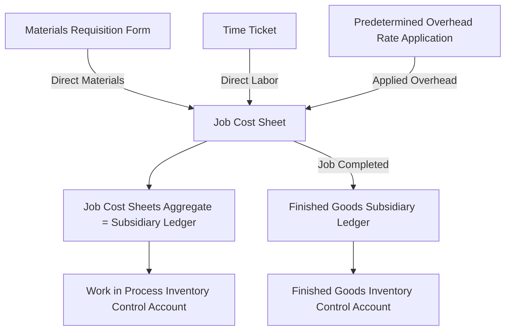

## Job Cost Sheets and Subsidiary Ledgers

### Overview

Job cost sheets and subsidiary ledgers form the detailed record-keeping infrastructure that supports a job order costing system. While the general ledger control accounts (Work in Process, Finished Goods, Manufacturing Overhead) show summarized totals, the subsidiary ledgers — anchored by individual job cost sheets — provide the detailed, job-by-job breakdown that supports and reconciles to those control account balances.

### The Job Cost Sheet

**Definition**

A job cost sheet (also called a job cost record or job order cost card) is a document — physical or digital — that accumulates all manufacturing costs assigned to a single, specific job as it moves through production. It is the core subsidiary record in a job order costing system.

**Contents of a Job Cost Sheet**

A typical job cost sheet includes:

- Job number and customer/description
- Date started and date completed
- Direct materials used (traced via materials requisition forms)
- Direct labor incurred (traced via time tickets)
- Manufacturing overhead applied (using the predetermined overhead rate)
- Total cost of the job
- Unit cost (total cost ÷ units produced, if applicable)

**Example Job Cost Sheet**

| Job Cost Sheet — Job #418 |  |
| --- | --- |
| Customer | Meridian Interiors |
| Date Started | March 3 |
| Date Completed | March 18 |
| **Direct Materials** |  |
| — Requisition #2201 (lumber) | $1,450 |
| — Requisition #2214 (hardware) | $320 |
| **Total Direct Materials** | **$1,770** |
| **Direct Labor** |  |
| — Time ticket #556 (32 hrs × $24) | $768 |
| — Time ticket #571 (18 hrs × $24) | $432 |
| **Total Direct Labor** | **$1,200** |
| **Manufacturing Overhead Applied** |  |
| — 50 DLH × $15 POHR | $750 |
| **Total Manufacturing Overhead** | **$750** |
| **Total Job Cost** | **$3,720** |
| Units Produced | 10 units |
| **Cost per Unit** | **$372.00** |

### Source Documents Feeding the Job Cost Sheet

Three source documents populate the job cost sheet:

1. **Materials Requisition Form** — authorizes and records the release of raw materials from the storeroom to production, specifying the job number, quantity, and cost of materials used. This is the source document for direct materials entries.
2. **Time Ticket (Labor Time Record)** — records the hours an employee spends working on a specific job, along with the labor rate, used to charge direct labor to the correct job.
3. **Predetermined Overhead Rate (POHR) Application** — overhead is not traced from a source document directly but is *applied* using the POHR multiplied by the actual amount of the allocation base (e.g., direct labor hours) consumed by the job, as recorded on the time ticket or a separate overhead application worksheet.

### The Concept of Subsidiary Ledgers

**Definition**

A subsidiary ledger is a detailed set of individual records that, in total, support and reconcile to the balance of a single general ledger control account. Job cost sheets function as the subsidiary ledger for the Work in Process Inventory control account (and, once completed, feed into the subsidiary ledger for Finished Goods Inventory).

**Key Relationship**

$$\text{Sum of all job cost sheets for jobs in progress} = \text{Work in Process Inventory (control account balance)}$$

$$\text{Sum of all job cost sheets for completed, unsold jobs} = \text{Finished Goods Inventory (control account balance)}$$

This relationship allows the general ledger to remain at a summarized level for financial statement preparation, while the subsidiary ledger retains the granular detail needed for job costing, pricing, and profitability analysis.

### Control Account vs. Subsidiary Ledger Structure

| General Ledger (Control Account) | Subsidiary Ledger (Detail) |
| --- | --- |
| Work in Process Inventory — $18,500 | Job #416: $6,200 |
|  | Job #417: $8,580 |
|  | Job #418: $3,720 |
|  | **Total: $18,500** |

**Key Points**

- The control account and its subsidiary ledger must always reconcile; any discrepancy signals a posting error.
- This two-tier structure (summary + detail) mirrors how Accounts Receivable is supported by individual customer subsidiary ledgers, and Accounts Payable by individual vendor subsidiary ledgers — a general internal control and reporting principle in accounting systems.

### Flow of Source Documents into the Job Cost Sheet

### Example: Multiple Jobs Reconciling to the Control Account

At month-end, three jobs remain in production:

| Job # | Direct Materials | Direct Labor | Applied Overhead | Total Job Cost |
| --- | --- | --- | --- | --- |
| 416 | $2,800 | $2,100 | $1,300 | $6,200 |
| 417 | $3,900 | $2,800 | $1,880 | $8,580 |
| 418 | $1,770 | $1,200 | $750 | $3,720 |
| **Total** | **$8,470** | **$6,100** | **$3,930** | **$18,500** |

This total, $18,500, must equal the ending balance of the Work in Process Inventory control account in the general ledger. If it does not, an error exists — either a posting error to the general ledger, a math error in a job cost sheet, or a transaction improperly recorded (e.g., materials issued but not recorded on a job cost sheet).

### Subsidiary Ledger Flow Through Completion and Sale

1. **In production** → Job cost sheet detail supports the **Work in Process Inventory** control account.
2. **Job completed** → The completed job's total cost moves from the WIP subsidiary ledger to the **Finished Goods Inventory** subsidiary ledger (the job cost sheet is essentially "transferred" in classification, though the document itself is retained for reference).
3. **Job sold** → The cost moves out of the Finished Goods subsidiary ledger and is recognized in **Cost of Goods Sold**; the job cost sheet becomes a permanent historical record used for cost analysis, pricing evaluation, and profitability review of that specific job.

### Job Cost Sheet as a Management Tool

Beyond its bookkeeping function, the job cost sheet supports several managerial uses:

- **Pricing decisions** — actual accumulated cost data from past job cost sheets informs bids and quotes for similar future jobs.
- **Profitability analysis** — comparing total job cost to the job's selling price reveals gross profit by job, useful for evaluating which types of jobs are most profitable.
- **Cost control** — significant cost overruns on a job cost sheet (relative to a bid or budget) can be investigated for causes (e.g., material waste, labor inefficiency).
- **Job costing audits** — the detailed trail of requisitions and time tickets supports internal control and audit verification of reported job costs.

### Subsidiary Ledger Structure Diagram (svg_diagram)

<svg xmlns="http://www.w3.org/2000/svg" viewBox="0 0 720 360">
<text x="360" y="25" font-size="16" font-weight="bold" text-anchor="middle" fill="#1a1a1a">Job Cost Sheets as Subsidiary Ledger (svg_diagram)</text>
<rect x="270" y="50" width="180" height="45" rx="6" fill="#dbe9f6" stroke="#3a6ea5" stroke-width="1.5" />
<text x="360" y="78" font-size="13" font-weight="bold" text-anchor="middle" fill="#1a3a5c">WIP Inventory (GL Control)</text>
<line x1="360" y1="95" x2="360" y2="125" stroke="#555" stroke-width="2" marker-end="url(#arrow4)" />
<text x="420" y="115" font-size="10" fill="#555">must equal sum of</text>
<rect x="60" y="140" width="150" height="50" rx="6" fill="#dcf0dc" stroke="#3a7a3a" stroke-width="1.5" />
<text x="135" y="160" font-size="12" text-anchor="middle" fill="#1a4a1a">Job #416</text>
<text x="135" y="178" font-size="11" text-anchor="middle" fill="#1a4a1a">\$6,200</text>
<rect x="285" y="140" width="150" height="50" rx="6" fill="#dcf0dc" stroke="#3a7a3a" stroke-width="1.5" />
<text x="360" y="160" font-size="12" text-anchor="middle" fill="#1a4a1a">Job #417</text>
<text x="360" y="178" font-size="11" text-anchor="middle" fill="#1a4a1a">\$8,580</text>
<rect x="510" y="140" width="150" height="50" rx="6" fill="#dcf0dc" stroke="#3a7a3a" stroke-width="1.5" />
<text x="585" y="160" font-size="12" text-anchor="middle" fill="#1a4a1a">Job #418</text>
<text x="585" y="178" font-size="11" text-anchor="middle" fill="#1a4a1a">\$3,720</text>
<line x1="135" y1="140" x2="330" y2="95" stroke="#888" stroke-width="1.5" stroke-dasharray="3" />
<line x1="360" y1="140" x2="360" y2="95" stroke="#888" stroke-width="1.5" stroke-dasharray="3" />
<line x1="585" y1="140" x2="390" y2="95" stroke="#888" stroke-width="1.5" stroke-dasharray="3" />
<rect x="230" y="230" width="260" height="60" rx="6" fill="#f6e9db" stroke="#a5723a" stroke-width="1.5" />
<text x="360" y="255" font-size="12" text-anchor="middle" fill="#5c3a1a">Each Job Cost Sheet built from:</text>
<text x="360" y="273" font-size="11" text-anchor="middle" fill="#5c3a1a">Materials Req. + Time Tickets + Applied OH</text>

<text x="360" y="330" font-size="12" text-anchor="middle" fill="`#1a1a1a`">Total: $6,200 + $8,580 + $3,720 = $18,500 = WIP Balance</text>

</svg>

### Digital vs. Manual Job Costing Systems

- **Manual systems** — historically used paper-based job cost sheets, materials requisition forms, and time tickets, manually totaled and reconciled to the general ledger.
- **Computerized/ERP systems** — modern job order costing is typically integrated into enterprise resource planning (ERP) or job costing software, where materials issuances and labor time entries are captured electronically and job cost sheets are generated and reconciled to control accounts automatically. [Inference] The underlying accounting logic and subsidiary ledger relationship remain conceptually identical regardless of whether the system is manual or automated, though automated systems reduce the risk of manual posting or transcription errors.

### Common Errors and Internal Control Considerations

- **Unrecorded materials requisitions** — if materials are issued to a job but the requisition is not properly recorded, the job cost sheet understates cost and the WIP subsidiary ledger will not reconcile to the control account.
- **Misapplied labor hours** — time tickets charged to the wrong job distort both jobs' cost sheets, potentially causing pricing and profitability analysis errors even if the total WIP balance remains correct.
- **Overhead application errors** — using the wrong POHR or the wrong allocation base quantity for a job leads to over- or under-costing that specific job, independent of the company-wide over/underapplied overhead variance.
- Regular reconciliation between subsidiary ledger totals and control account balances is a key internal control to detect these errors promptly.

### Next Steps

**Related Topics**

- Cost Flows in a Job Order Costing System
- Predetermined Overhead Rate (POHR) Calculation and Application
- Materials Requisition Forms and Time Tickets as Source Documents
- Over- and Underapplied Manufacturing Overhead
- Process Costing vs. Job Order Costing
- Activity-Based Costing (ABC)
- Job Order Costing in Service Industries (e.g., law firms, consulting, repair shops)
- Internal Controls Over Manufacturing Cost Recording