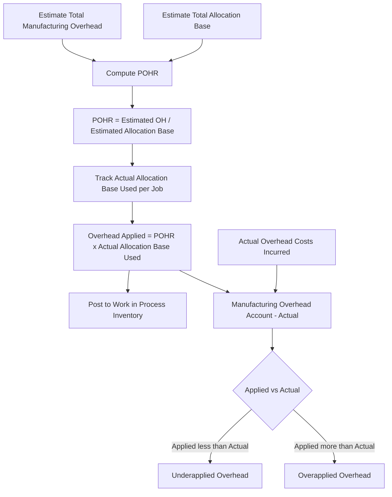

## Predetermined Overhead Rates

### Overview

The predetermined overhead rate (POHR) is a rate calculated before the start of a period, used to apply manufacturing overhead costs to jobs, products, or services throughout that period. Because actual overhead costs and actual activity levels are typically not known until the period ends, companies using job order costing (and other costing systems) rely on the POHR to assign overhead to production in a timely manner — a method known as **normal costing**.

### Why a Predetermined Rate Is Needed

Manufacturing overhead consists of numerous indirect costs (factory utilities, depreciation, indirect labor, indirect materials, property taxes, insurance) that:

1. Cannot be directly and conveniently traced to individual jobs.
2. Often fluctuate month to month due to seasonal patterns, timing of bills, or unrelated factors (e.g., large annual insurance payments occurring in a single month).
3. Are not known with certainty until the accounting period closes.

If companies waited to assign overhead until actual costs were known, job costing and pricing decisions would be delayed and job costs would fluctuate erratically based on unrelated timing issues (e.g., a job produced in a high-utility-cost month would appear artificially more expensive than an identical job produced in a low-utility-cost month). The POHR solves this by using **estimates** made in advance, applied consistently throughout the year.

### Formula

$$POHR = \frac{\text{Estimated Total Manufacturing Overhead Cost}}{\text{Estimated Total Amount of the Allocation Base}}$$

**Key Points**

- The numerator and denominator are both **estimates**, established before the period begins (typically at the start of the fiscal year).
- The rate is then applied throughout the period using the **actual** amount of the allocation base consumed by each job.
- The POHR is generally calculated annually to smooth out seasonal fluctuations in overhead costs and activity levels, though some companies calculate it more frequently.

### Common Allocation Bases

The allocation base (also called a cost driver) should have a plausible cause-and-effect relationship with the incurrence of overhead costs. Common choices include:

- **Direct labor hours (DLH)** — traditional in labor-intensive environments.
- **Direct labor cost** — used when labor rates are relatively uniform.
- **Machine hours (MH)** — common in automated or capital-intensive environments where overhead is driven more by equipment usage than labor.
- **Units of production** — simplest, but only appropriate when a company produces a single, homogeneous product.

**Key Points**

- The choice of allocation base significantly affects how overhead costs are distributed among jobs; a poor choice (one with weak correlation to actual overhead consumption) can distort job costs and pricing decisions.
- [Inference] Companies with increasingly automated production have generally shifted from direct labor-based allocation bases toward machine-hours or activity-based costing systems, since automation reduces labor's correlation with overhead incurrence, though the appropriate base still depends on each company's specific cost structure.

### Step-by-Step Calculation Process

1. **Estimate total manufacturing overhead** for the upcoming period (based on historical data, budgets, and anticipated changes in operations).
2. **Estimate the total amount of the allocation base** expected to be used during the period (e.g., total direct labor hours or machine hours).
3. **Divide** estimated overhead by the estimated allocation base to compute the POHR.
4. **Apply overhead to jobs** throughout the period by multiplying the POHR by the *actual* amount of the allocation base each job consumes.

### Example 1: Basic POHR Calculation

A manufacturing company estimates the following for the upcoming year:

- Estimated total manufacturing overhead: $540,000
- Estimated total direct labor hours: 36,000 DLH

$$POHR = \frac{\$540,000}{36,000 \text{ DLH}} = \$15.00 \text{ per DLH}$$

If Job #522 requires 60 direct labor hours:

$$\text{Overhead Applied to Job \#522} = \$15.00 \times 60 = \$900$$

This $900 is recorded on Job #522's job cost sheet as applied manufacturing overhead, regardless of the actual overhead costs incurred that month.

### Example 2: Machine-Hour-Based POHR

A highly automated plant estimates:

- Estimated total manufacturing overhead: $720,000
- Estimated total machine hours: 24,000 MH

$$POHR = \frac{\$720,000}{24,000 \text{ MH}} = \$30.00 \text{ per machine hour}$$

If Job #630 uses 45 machine hours:

$$\text{Overhead Applied} = \$30.00 \times 45 = \$1,350$$

### Journal Entry for Applying Overhead



```
Dr. Work in Process Inventory     XX  (POHR × actual allocation base used)
    Cr. Manufacturing Overhead         XX
```

This entry occurs throughout the period as each job consumes labor hours or machine hours — it does not wait for actual overhead costs to be finalized.

### Normal Costing vs. Actual Costing

| Feature | Normal Costing | Actual Costing |
| --- | --- | --- |
| Direct materials | Actual cost | Actual cost |
| Direct labor | Actual cost | Actual cost |
| Manufacturing overhead | Applied using POHR (estimated rate × actual activity) | Actual overhead cost, allocated using actual activity |
| Timeliness | Costs available throughout the period | Costs only known after period-end |
| Cost stability | Smooths out period-to-period overhead fluctuations | Subject to fluctuation based on timing of actual costs |
| Requires year-end adjustment | Yes (over/underapplied overhead) | No |

**Key Points**

- Normal costing is the standard approach used in most job order costing systems because it provides timely cost information for pricing and decision-making.
- Actual costing, while theoretically more "accurate" at period-end, is rarely used in practice due to the delay and volatility it introduces into job costs.

### Multiple (Departmental) Predetermined Overhead Rates

Many companies use a **single, plantwide POHR** for simplicity. However, when departments have significantly different cost structures (e.g., one labor-intensive department, one machine-intensive department), a **single rate can distort job costs**, since jobs spending more time in the expensive/overhead-intensive department wouldn't be charged proportionally more.

**Departmental POHR Formula** (applied separately for each department):

$$POHR_{\text{dept}} = \frac{\text{Estimated Overhead for that Department}}{\text{Estimated Allocation Base for that Department}}$$

**Example: Departmental Rates**

| Department | Estimated OH | Estimated Allocation Base | POHR |
| --- | --- | --- | --- |
| Machining (machine hours) | $400,000 | 20,000 MH | $20.00/MH |
| Assembly (direct labor hours) | $210,000 | 30,000 DLH | $7.00/DLH |

If Job #710 uses 15 machine hours in Machining and 25 direct labor hours in Assembly:

$$\text{OH Applied} = (15 \times \$20.00) + (25 \times \$7.00) = \$300 + \$175 = \$475$$

This is more precise than a single plantwide rate would allow, since it reflects the department each cost was actually incurred in.

### Overhead Application Flow Diagram



### POHR Calculation Diagram (svg_diagram)

<svg xmlns="http://www.w3.org/2000/svg" viewBox="0 0 700 320">
<text x="350" y="25" font-size="16" font-weight="bold" text-anchor="middle" fill="#1a1a1a">Predetermined Overhead Rate Calculation (svg_diagram)</text>
<rect x="40" y="60" width="260" height="60" rx="6" fill="#dbe9f6" stroke="#3a6ea5" stroke-width="1.5" />
<text x="170" y="85" font-size="12" text-anchor="middle" fill="#1a3a5c">Estimated Total Manufacturing</text>
<text x="170" y="103" font-size="12" text-anchor="middle" fill="#1a3a5c">Overhead Cost</text>
<rect x="400" y="60" width="260" height="60" rx="6" fill="#dcf0dc" stroke="#3a7a3a" stroke-width="1.5" />
<text x="530" y="85" font-size="12" text-anchor="middle" fill="#1a4a1a">Estimated Total Allocation</text>
<text x="530" y="103" font-size="12" text-anchor="middle" fill="#1a4a1a">Base (DLH, MH, etc.)</text>
<line x1="170" y1="120" x2="330" y2="170" stroke="#555" stroke-width="2" />
<line x1="530" y1="120" x2="370" y2="170" stroke="#555" stroke-width="2" />
<rect x="230" y="170" width="240" height="50" rx="6" fill="#f6e9db" stroke="#a5723a" stroke-width="1.5" />
<text x="350" y="200" font-size="13" font-weight="bold" text-anchor="middle" fill="#5c3a1a">POHR ($ per unit of base)</text>
<line x1="350" y1="220" x2="350" y2="250" stroke="#555" stroke-width="2" marker-end="url(#arrow5)" />
<rect x="180" y="250" width="340" height="50" rx="6" fill="#f6dbdb" stroke="#a53a3a" stroke-width="1.5" />
<text x="350" y="272" font-size="12" text-anchor="middle" fill="#5c1a1a">Applied Overhead = POHR × Actual Base Used</text>
<text x="350" y="290" font-size="11" text-anchor="middle" fill="#5c1a1a">(posted to each job's Job Cost Sheet)</text>
</svg>

### Consequences of Estimation Errors

Because both the numerator (estimated OH) and denominator (estimated activity) are forecasts, errors in either estimate directly affect the accuracy of applied overhead throughout the period:

- **Overestimating overhead or underestimating activity** → POHR is too high → jobs are overcosted → potential overapplied overhead at year-end if actual activity meets or exceeds estimates.
- **Underestimating overhead or overestimating activity** → POHR is too low → jobs are undercosted → potential underapplied overhead at year-end.

These estimation errors are precisely what generates the **over- or underapplied overhead** variance reconciled at period-end (covered in the broader cost flow topic), either by closing the variance to Cost of Goods Sold or by proration across Work in Process, Finished Goods, and Cost of Goods Sold.

### Practical Considerations and Limitations

- The POHR relies on the quality of the estimates used to build it; inaccurate budgeting or forecasting reduces the reliability of job costs throughout the year until the period-end true-up.
- Using a single plantwide rate is simpler to administer but can significantly distort job costs in companies with heterogeneous departments or cost drivers — a key motivation for departmental rates or activity-based costing (ABC).
- [Inference] The appropriate allocation base should be selected based on its cause-and-effect relationship with overhead cost incurrence; a base that correlates poorly with overhead consumption weakens the accuracy of applied costs, though the degree of distortion varies by company and cost structure.
- Some overhead application systems combine multiple allocation bases into more refined ABC costing when a single volume-based driver poorly explains cost incurrence.

### Next Steps

**Related Topics**

- Cost Flows in a Job Order Costing System
- Job Cost Sheets and Subsidiary Ledgers
- Over- and Underapplied Manufacturing Overhead: Disposition Methods
- Normal Costing vs. Actual Costing vs. Standard Costing
- Departmental (Multiple) Overhead Rates
- Activity-Based Costing (ABC)
- Cost Driver Selection and Allocation Base Analysis
- Process Costing vs. Job Order Costing