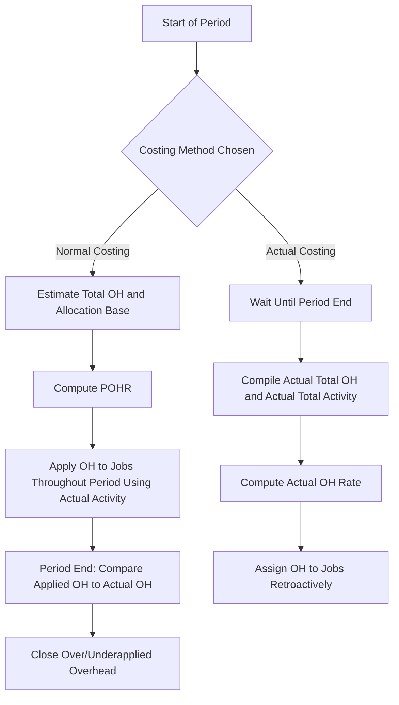

## Normal Costing versus Actual Costing

### Overview

Normal costing and actual costing are two alternative approaches for assigning manufacturing costs — particularly manufacturing overhead — to jobs or products within a job order costing system. Both approaches assign direct materials and direct labor at their actual amounts; they differ specifically in **how manufacturing overhead is applied**.

### The Core Distinction

| Cost Element | Actual Costing | Normal Costing |
| --- | --- | --- |
| Direct Materials | Actual cost | Actual cost |
| Direct Labor | Actual cost | Actual cost |
| Manufacturing Overhead | **Actual** overhead cost, allocated using the **actual** allocation base | **Estimated** rate (POHR) × **actual** allocation base used |

**Key Points**

- Both systems use actual, traceable costs for direct materials and direct labor — the only difference lies in overhead treatment.
- Actual costing waits until the period ends (when actual total overhead is known) to allocate overhead to jobs.
- Normal costing applies overhead throughout the period using a rate calculated in advance from estimates, allowing job costs to be known in a timely manner.

### Actual Costing

**Definition**

Under actual costing, manufacturing overhead is assigned to jobs using the *actual* overhead rate, computed only after actual total overhead costs and actual total activity for the period are known:

$$\text{Actual Overhead Rate} = \frac{\text{Actual Total Manufacturing Overhead}}{\text{Actual Total Allocation Base}}$$

$$\text{Overhead Assigned to a Job} = \text{Actual Overhead Rate} \times \text{Actual Allocation Base Used by the Job}$$

**Key Points**

- Requires waiting until period-end (or at least until actual overhead costs are compiled) before job costs can be finalized.
- Job costs can fluctuate significantly from period to period due to seasonal overhead cost variation (e.g., high heating bills in winter) or seasonal activity variation (e.g., low production in a slow month spreading fixed overhead over fewer units).
- Rarely used in practice for routine job costing because of the delay in cost information and the volatility it introduces.

### Normal Costing

**Definition**

Under normal costing, manufacturing overhead is applied to jobs using a **predetermined overhead rate (POHR)**, calculated before the period begins based on *estimates*, then applied using the *actual* activity each job consumes:

$$POHR = \frac{\text{Estimated Total Manufacturing Overhead}}{\text{Estimated Total Allocation Base}}$$

$$\text{Overhead Applied to a Job} = POHR \times \text{Actual Allocation Base Used by the Job}$$

**Key Points**

- Overhead can be applied to jobs continuously throughout the period, as soon as activity (e.g., labor hours or machine hours) is recorded — no need to wait for period-end.
- Smooths out seasonal or timing-related fluctuations in actual overhead costs, since the rate is fixed for the period.
- Requires a year-end reconciliation process to address the difference between applied overhead (based on estimates) and actual overhead incurred — known as **over- or underapplied overhead**.
- This is the method most commonly used in practice, and the standard approach taught alongside job order costing.

### Example: Comparing Actual and Normal Costing

**Scenario:** A custom cabinetry manufacturer has the following data.

Estimated (budgeted) at start of year:

- Estimated total overhead: $480,000
- Estimated total direct labor hours: 32,000 DLH

Actual results for the year:

- Actual total overhead: $510,000
- Actual total direct labor hours: 30,000 DLH

**Normal Costing POHR (computed at start of year, before actual results are known):**

$$POHR = \frac{\$480,000}{32,000 \text{ DLH}} = \$15.00 \text{ per DLH}$$

**Actual Overhead Rate (computed only after year-end, once actual results are known):**

$$\text{Actual Rate} = \frac{\$510,000}{30,000 \text{ DLH}} = \$17.00 \text{ per DLH}$$

For Job #275, which used 40 direct labor hours:

| Method | Overhead Assigned | When Known |
| --- | --- | --- |
| Normal Costing | $15.00 × 40 = **$600** | Immediately, as labor hours are recorded during the year |
| Actual Costing | $17.00 × 40 = **$680** | Only after year-end, once actual totals are compiled |

This example illustrates the two central trade-offs: normal costing provides timely information ($600 known immediately) at the cost of using an estimate that differs from the true actual rate ($680), which will require a later reconciling adjustment.

### The Reconciliation Problem: Over/Underapplied Overhead

Because normal costing applies overhead using an estimated rate, the total overhead applied to all jobs over the year rarely equals actual overhead incurred. This creates a balance remaining in the Manufacturing Overhead account at period-end:

- **Underapplied overhead**: Applied overhead < Actual overhead (a debit balance remains in Manufacturing Overhead)
- **Overapplied overhead**: Applied overhead > Actual overhead (a credit balance remains in Manufacturing Overhead)

In the example above, if total actual direct labor hours across all jobs equaled 30,000 DLH:

$$\text{Total Applied} = \$15.00 \times 30,000 = \$450,000$$

$$\text{Total Actual} = \$510,000$$

$$\text{Underapplied Overhead} = \$510,000 - \$450,000 = \$60,000$$

This $60,000 underapplied balance must be closed out at year-end, either directly to Cost of Goods Sold (if immaterial) or prorated across Work in Process, Finished Goods, and Cost of Goods Sold (if material) — a step not needed under actual costing, since actual costing has no applied-vs-actual gap by construction.

### Comparative Summary Table

| Criterion | Normal Costing | Actual Costing |
| --- | --- | --- |
| Overhead rate basis | Estimated (POHR), set before the period | Actual, calculated only after the period ends |
| Timeliness of job cost information | Available throughout the period | Delayed until period-end |
| Job cost stability | Stable and predictable (fixed rate) | Volatile (fluctuates with seasonal OH/activity) |
| Year-end adjustment needed | Yes — over/underapplied overhead must be closed | No — costs already reflect actual figures |
| Administrative complexity | Requires estimation process at period start + reconciliation at period end | Simpler conceptually, but delays cost reporting |
| Practical usage | Standard method used by most companies | Rarely used for routine costing; more of a theoretical benchmark |

### Why Normal Costing Is Preferred in Practice

1. **Timeliness** — managers need job cost information for pricing, bidding, and decision-making throughout the year, not just after year-end.
2. **Stability** — normal costing avoids assigning artificially high or low overhead to jobs simply because they happened to be produced in a high-cost or low-activity month.
3. **Comparability** — using a consistent rate throughout the year allows jobs produced in different months to be compared on a level basis.
4. **Practicality** — actual overhead costs (e.g., annual property tax bills, insurance premiums) are often not finalized until well after year-end, making pure actual costing impractical for ongoing operations.

### Decision Flow Diagram

### Cost Assignment Timing Diagram (svg_diagram)

<svg xmlns="http://www.w3.org/2000/svg" viewBox="0 0 720 320">
<text x="360" y="25" font-size="16" font-weight="bold" text-anchor="middle" fill="#1a1a1a">Normal Costing vs. Actual Costing Timing (svg_diagram)</text>
<line x1="60" y1="80" x2="660" y2="80" stroke="#333" stroke-width="2" />
<text x="60" y="65" font-size="11" fill="#333">Period Start</text>
<text x="640" y="65" font-size="11" fill="#333">Period End</text>
<rect x="60" y="100" width="600" height="40" rx="6" fill="#dcf0dc" stroke="#3a7a3a" stroke-width="1.5" />
<text x="360" y="125" font-size="12" text-anchor="middle" fill="#1a4a1a">Normal Costing: OH Applied Continuously (POHR × Actual Activity)</text>
<rect x="500" y="160" width="160" height="40" rx="6" fill="#f6e9db" stroke="#a5723a" stroke-width="1.5" />
<text x="580" y="185" font-size="11" text-anchor="middle" fill="#5c3a1a">Reconcile Variance</text>
<line x1="660" y1="140" x2="660" y2="200" stroke="#888" stroke-width="1.5" stroke-dasharray="3" />
<rect x="500" y="230" width="160" height="40" rx="6" fill="#f6dbdb" stroke="#a53a3a" stroke-width="1.5" />
<text x="580" y="255" font-size="12" text-anchor="middle" fill="#5c1a1a">Actual Costing: OH Assigned Here Only</text>
<line x1="60" y1="250" x2="500" y2="250" stroke="#888" stroke-width="1.5" stroke-dasharray="3" />
<text x="280" y="245" font-size="10" fill="#888">No job cost information available during this period</text>
</svg>

### Practical and Conceptual Limitations

- Normal costing's accuracy depends entirely on the quality of the original estimates used to build the POHR; significant forecasting errors produce large over/underapplied overhead balances requiring adjustment.
- [Inference] In practice, most companies favor normal costing over actual costing because the benefit of timely cost information generally outweighs the cost of periodic reconciliation, though the degree of benefit depends on how volatile a company's actual overhead costs and activity levels are month to month.
- A hybrid conceptual method, **standard costing**, extends normal costing further by assigning standard (predetermined) costs to direct materials and direct labor as well as overhead, enabling variance analysis across all three cost elements — not just overhead.

### Next Steps

**Related Topics**

- Predetermined Overhead Rates: Calculation and Application
- Over- and Underapplied Overhead: Disposition Methods (Direct Write-Off vs. Proration)
- Standard Costing and Variance Analysis
- Cost Flows in a Job Order Costing System
- Job Cost Sheets and Subsidiary Ledgers
- Departmental (Multiple) Overhead Rates
- Activity-Based Costing (ABC)