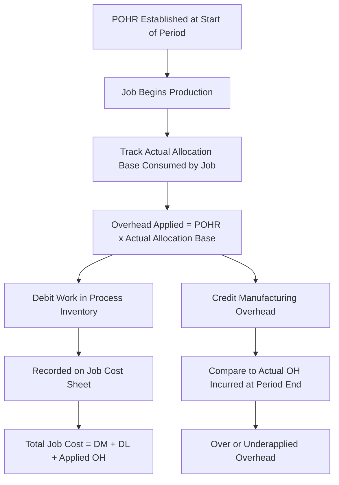

## Applying Manufacturing Overhead to Jobs

### Overview

Applying manufacturing overhead is the process of assigning indirect manufacturing costs to individual jobs using a predetermined overhead rate (POHR), since these costs cannot be traced directly to a specific job the way direct materials and direct labor can. This process is central to job order costing under normal costing, and it directly determines each job's total recorded cost, unit cost, and reported profitability.

### Why Overhead Cannot Be Directly Traced

Manufacturing overhead includes all manufacturing costs other than direct materials and direct labor — for example:

- Indirect materials (glue, lubricants, cleaning supplies)
- Indirect labor (supervisors, maintenance staff, quality control)
- Factory utilities, rent, and insurance
- Depreciation on factory equipment and buildings
- Property taxes on the manufacturing facility

These costs benefit multiple jobs simultaneously and cannot be conveniently or economically traced to any single job. Therefore, they must be **allocated** using a systematic and rational method — the predetermined overhead rate.

### The Application Formula

$$\text{Overhead Applied to a Job} = POHR \times \text{Actual Amount of Allocation Base Used by That Job}$$

Where the POHR itself was established before the period began:

$$POHR = \frac{\text{Estimated Total Manufacturing Overhead}}{\text{Estimated Total Allocation Base}}$$

**Key Points**

- The POHR is fixed for the period (typically a year) and does not change as actual costs come in.
- Only the **actual activity** (e.g., actual direct labor hours or actual machine hours used by a specific job) varies from job to job — this is what drives differences in applied overhead between jobs.

### Step-by-Step Application Process

1. **Determine the POHR** in advance (calculated from estimated overhead and estimated allocation base for the period).
2. **Track the actual allocation base** consumed by each job as it moves through production (e.g., via time tickets for labor hours or machine logs for machine hours).
3. **Multiply** the POHR by the actual allocation base used by that specific job.
4. **Record the applied overhead** on the job cost sheet and in the general ledger.
5. **Repeat** for every job throughout the period — overhead is applied continuously, not just at period-end.

### Example: Applying Overhead to a Single Job

A company's POHR, set at the beginning of the year, is $18 per direct labor hour, based on:

$$POHR = \frac{\$630,000 \text{ estimated overhead}}{35,000 \text{ estimated DLH}} = \$18.00 \text{ per DLH}$$

Job #340 requires 55 direct labor hours to complete.

$$\text{Overhead Applied to Job \#340} = \$18.00 \times 55 = \$990$$

This $990 is recorded as manufacturing overhead applied on Job #340's job cost sheet, added to its direct materials and direct labor costs to determine total job cost.

### Journal Entry for Applying Overhead



```
Dr. Work in Process Inventory     XX  (POHR × actual allocation base)
    Cr. Manufacturing Overhead         XX
```

**Key Points**

- This entry increases (debits) Work in Process Inventory, adding applied overhead to the job's accumulated cost.
- This entry credits the Manufacturing Overhead account — a temporary clearing account that also separately accumulates actual overhead costs on its debit side.
- Applied overhead is **not** the same as actual overhead; the two sides of the Manufacturing Overhead account are populated independently, using different amounts (estimated rate × actual activity, versus actual costs incurred).

### The Manufacturing Overhead Account — Two-Sided Nature

| Manufacturing Overhead (T-Account) |  |
| --- | --- |
| **Debit side (Actual OH incurred)** | **Credit side (Applied OH)** |
| Indirect materials | Applied via POHR × actual activity, posted continuously as jobs consume the allocation base |
| Indirect labor |  |
| Factory utilities |  |
| Depreciation — factory equipment |  |
| Factory insurance, property taxes |  |

At period-end, the difference between the two sides represents **over- or underapplied overhead**:

- If **Debit side > Credit side** → Underapplied overhead (not enough was applied to jobs relative to actual costs incurred).
- If **Credit side > Debit side** → Overapplied overhead (too much was applied to jobs relative to actual costs incurred).

### Example: Applying Overhead Across Multiple Jobs

Assume the POHR is $18.00 per direct labor hour, and three jobs are worked on during the month:

| Job # | Direct Labor Hours Used | Overhead Applied (POHR × DLH) |
| --- | --- | --- |
| 340 | 55 | $990 |
| 341 | 80 | $1,440 |
| 342 | 30 | $540 |
| **Total** | **165 DLH** | **$2,970** |

This $2,970 total is posted as a single credit to Manufacturing Overhead (or as individual postings per job), while also being distributed across the three jobs' cost sheets as part of Work in Process Inventory.

### Applying Overhead with Multiple Allocation Bases (Departmental Rates)

When a company uses departmental POHRs rather than a single plantwide rate, overhead is applied separately for each department a job passes through, then summed for the job's total applied overhead.

**Example**

| Department | POHR | Allocation Base Used by Job #450 | Overhead Applied |
| --- | --- | --- | --- |
| Cutting (machine hours) | $22/MH | 12 MH | $264 |
| Finishing (direct labor hours) | $14/DLH | 20 DLH | $280 |
| **Total Applied Overhead** |  |  | **$544** |

This approach more precisely reflects the overhead actually driven by the specific departments a job utilizes, compared to a single plantwide rate that might over- or under-assign overhead depending on which departments a job spends more time in.

### Relationship to the Job Cost Sheet

Applied overhead is one of the three cost elements recorded on each job cost sheet, alongside direct materials and direct labor:

$$\text{Total Job Cost} = \text{Direct Materials} + \text{Direct Labor} + \text{Applied Manufacturing Overhead}$$

Because applied overhead relies on an *estimated* rate, the total job cost recorded during the year is **not** the job's final "true" cost in an absolute sense — it reflects the normal costing approach and will be part of the year-end reconciliation process if the POHR-based application differs materially from actual overhead incurred.

### Overhead Application Flow Diagram



### Applied Overhead Structure Diagram (svg_diagram)

<svg xmlns="http://www.w3.org/2000/svg" viewBox="0 0 700 330">
<text x="350" y="25" font-size="16" font-weight="bold" text-anchor="middle" fill="#1a1a1a">Applying Overhead to a Job (svg_diagram)</text>
<rect x="40" y="60" width="180" height="50" rx="6" fill="#dbe9f6" stroke="#3a6ea5" stroke-width="1.5" />
<text x="130" y="90" font-size="12" text-anchor="middle" fill="#1a3a5c">POHR ($/unit of base)</text>

<text x="240" y="90" font-size="18" text-anchor="middle" fill="#333">×</text>

<rect x="260" y="60" width="220" height="50" rx="6" fill="#dcf0dc" stroke="#3a7a3a" stroke-width="1.5" />
<text x="370" y="90" font-size="12" text-anchor="middle" fill="#1a4a1a">Actual Allocation Base Used by Job</text>

<text x="500" y="90" font-size="18" text-anchor="middle" fill="#333">=</text>

<rect x="520" y="60" width="150" height="50" rx="6" fill="#f6e9db" stroke="#a5723a" stroke-width="1.5" />
<text x="595" y="90" font-size="12" text-anchor="middle" fill="#5c3a1a">Overhead Applied</text>
<line x1="595" y1="110" x2="595" y2="150" stroke="#555" stroke-width="2" marker-end="url(#arrow6)" />
<rect x="450" y="150" width="220" height="45" rx="6" fill="#f6dbdb" stroke="#a53a3a" stroke-width="1.5" />
<text x="560" y="175" font-size="11" text-anchor="middle" fill="#5c1a1a">Dr. WIP / Cr. Manufacturing OH</text>
<line x1="450" y1="172" x2="280" y2="220" stroke="#555" stroke-width="2" marker-end="url(#arrow6)" />
<rect x="80" y="220" width="300" height="70" rx="6" fill="#eee" stroke="#888" stroke-width="1.5" />
<text x="230" y="245" font-size="12" text-anchor="middle" fill="#333">Job Cost Sheet</text>
<text x="230" y="262" font-size="11" text-anchor="middle" fill="#333">Total Cost = DM + DL + Applied OH</text>
<text x="230" y="279" font-size="10" text-anchor="middle" fill="#333">(feeds into WIP subsidiary ledger)</text>
</svg>

### Common Errors in Applying Overhead

- **Using actual activity from the wrong job** — misassigning labor hours or machine hours to the incorrect job cost sheet distorts both jobs' applied overhead.
- **Applying overhead using the wrong POHR** — relevant particularly when departmental rates exist; using a plantwide-style approach in a departmental system misallocates cost.
- **Confusing applied overhead with actual overhead** — applied overhead is always based on the POHR and actual activity, never on the actual dollar amount of overhead costs incurred during the period; conflating the two undermines the normal costing model.
- **Failing to reconcile at period-end** — neglecting to close out the over/underapplied balance leaves financial statements inconsistent with actual costs incurred.

### Limitations

- The accuracy of applied overhead is only as good as the original estimates used to compute the POHR; a mid-year change in production technology, volume, or cost structure not reflected in the original estimate will widen the gap between applied and actual overhead.
- [Inference] Companies that experience significant, unplanned shifts in overhead costs or activity levels during the year may consider recalculating the POHR mid-period, though doing so is uncommon in practice and sacrifices some of the consistency benefit that a single annual rate is meant to provide.

### Next Steps

**Related Topics**

- Predetermined Overhead Rates: Calculation Methods
- Normal Costing versus Actual Costing
- Over- and Underapplied Overhead: Disposition Methods
- Job Cost Sheets and Subsidiary Ledgers
- Cost Flows in a Job Order Costing System
- Departmental (Multiple) Overhead Rates
- Activity-Based Costing (ABC) as an Alternative Allocation Approach