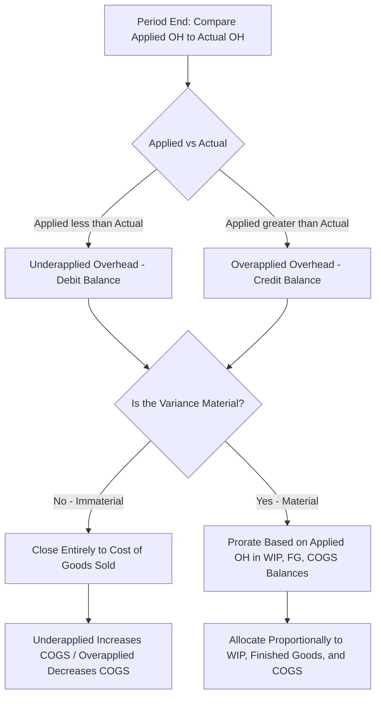

## Overapplied and Underapplied Overhead

### Overview

Overapplied and underapplied overhead refer to the difference between the manufacturing overhead **applied** to jobs during a period (using the predetermined overhead rate) and the **actual** manufacturing overhead costs incurred during that same period. Because normal costing relies on estimates to compute the POHR, this discrepancy is a routine, expected outcome that must be identified and resolved at period-end.

### Why the Discrepancy Occurs

The predetermined overhead rate (POHR) is calculated using **estimated** figures before the period begins:

$$POHR = \frac{\text{Estimated Total Manufacturing Overhead}}{\text{Estimated Total Allocation Base}}$$

Overhead is then applied throughout the period using the **actual** allocation base consumed by each job:

$$\text{Applied Overhead} = POHR \times \text{Actual Allocation Base Used}$$

Since the POHR itself is built from estimates, and actual results (both actual overhead costs and actual total activity) almost never match those estimates exactly, the total overhead applied to all jobs over the period will rarely equal the total actual overhead incurred. This mismatch is the source of over- or underapplied overhead.

### Definitions

**Underapplied Overhead**

Occurs when **Applied Overhead < Actual Overhead**. Not enough overhead was assigned to jobs relative to what was actually incurred. This leaves a **debit balance** remaining in the Manufacturing Overhead account.

**Overapplied Overhead**

Occurs when **Applied Overhead > Actual Overhead**. Too much overhead was assigned to jobs relative to what was actually incurred. This leaves a **credit balance** remaining in the Manufacturing Overhead account.

$$\text{Overhead Variance} = \text{Applied Overhead} - \text{Actual Overhead}$$

- If the result is **negative** → Underapplied
- If the result is **positive** → Overapplied

### The Manufacturing Overhead T-Account

| Manufacturing Overhead |  |
| --- | --- |
| **Debit (Actual OH incurred)** | **Credit (Applied OH)** |
| Indirect materials | POHR × actual activity, posted throughout the period |
| Indirect labor |  |
| Factory utilities, depreciation, insurance, etc. |  |
| **Balance if debit > credit: Underapplied** | **Balance if credit > debit: Overapplied** |

### Example 1: Underapplied Overhead

A company's POHR is $15.00 per direct labor hour, based on estimated overhead of $450,000 and estimated 30,000 DLH.

During the year:

- Actual direct labor hours worked: 30,000 DLH (matches estimate)
- Actual manufacturing overhead incurred: $470,000

$$\text{Applied Overhead} = \$15.00 \times 30,000 = \$450,000$$


$$\text{Overhead Variance} = \$450,000 - \$470,000 = -\$20,000 \rightarrow \text{Underapplied by } \$20,000$$

Actual overhead costs exceeded what was applied to jobs — jobs were undercosted during the year relative to the true cost of running the factory.

### Example 2: Overapplied Overhead

Using the same POHR of $15.00 per DLH:

- Actual direct labor hours worked: 32,000 DLH (higher than estimated)
- Actual manufacturing overhead incurred: $460,000

$$\text{Applied Overhead} = \$15.00 \times 32,000 = \$480,000$$


$$\text{Overhead Variance} = \$480,000 - \$460,000 = \$20,000 \rightarrow \text{Overapplied by } \$20,000$$

Because actual activity exceeded the estimate, more overhead was applied to jobs than was actually incurred — jobs were overcosted relative to the true cost of running the factory.

### Causes of Over/Underapplied Overhead

| Cause | Effect |
| --- | --- |
| Actual overhead costs higher than estimated | Tends toward underapplied |
| Actual overhead costs lower than estimated | Tends toward overapplied |
| Actual activity (allocation base) higher than estimated | Tends toward overapplied (more OH applied than planned) |
| Actual activity (allocation base) lower than estimated | Tends toward underapplied (less OH applied than planned) |
| Poor cost estimation during budgeting | Larger variance in either direction |
| Unexpected changes in production volume or cost structure mid-year | Larger variance in either direction |

**Key Points**

- The variance results from errors or changes in *either* the numerator (estimated overhead) or the denominator (estimated activity) used to build the POHR — or both simultaneously.
- A large fixed-cost component in overhead makes the variance particularly sensitive to changes in actual activity level, since fixed costs don't scale down when volume falls short of estimates.

### Disposition of the Overhead Variance

At period-end, the balance remaining in the Manufacturing Overhead account must be closed out. There are two acceptable approaches:

**Method 1: Direct Write-Off to Cost of Goods Sold**

Used when the variance is **immaterial** (relatively small). The entire balance is closed directly to COGS.

*Underapplied overhead (debit balance) — closing entry:*



```
Dr. Cost of Goods Sold            XX
    Cr. Manufacturing Overhead         XX
```

*Overapplied overhead (credit balance) — closing entry:*



```
Dr. Manufacturing Overhead        XX
    Cr. Cost of Goods Sold             XX
```

**Effect on COGS:**

- Underapplied → COGS **increases** (since jobs were undercosted, this correction adds the shortfall to expense).
- Overapplied → COGS **decreases** (since jobs were overcosted, this correction removes the excess from expense).

**Method 2: Proration Across WIP, Finished Goods, and COGS**

Used when the variance is **material** (large enough to distort financial statements if dumped entirely into COGS). The variance is allocated proportionally among the three accounts that contain applied overhead: Work in Process Inventory, Finished Goods Inventory, and Cost of Goods Sold, based on the **relative balances** of applied overhead in each account.

**Example: Proration**

Assume $20,000 underapplied overhead, and the applied overhead embedded in each account's ending balance is:

| Account | Applied Overhead in Balance | % of Total | Allocated Share of Variance |
| --- | --- | --- | --- |
| Work in Process | $60,000 | 20% | $4,000 |
| Finished Goods | $90,000 | 30% | $6,000 |
| Cost of Goods Sold | $150,000 | 50% | $10,000 |
| **Total** | **$300,000** | **100%** | **$20,000** |

*Proration journal entry (underapplied):*



```
Dr. Work in Process Inventory     \$4,000
Dr. Finished Goods Inventory      \$6,000
Dr. Cost of Goods Sold            \$10,000
    Cr. Manufacturing Overhead         \$20,000
```

For overapplied overhead, the entry reverses (credits to each of the three accounts, debit to Manufacturing Overhead), reducing each account's balance proportionally.

### Direct Write-Off vs. Proration Comparison

| Criterion | Direct Write-Off (to COGS) | Proration (WIP, FG, COGS) |
| --- | --- | --- |
| When used | Variance is immaterial | Variance is material |
| Complexity | Simple, one entry | More complex, requires proportional calculation |
| Accuracy | Less precise — assumes all jobs "sold" the variance | More accurate — reflects actual cost across all inventory stages |
| Effect on financial statements | Concentrated impact on COGS/net income | Distributed impact across inventory and COGS |
| GAAP acceptability | Acceptable for immaterial amounts | Preferred/required for material amounts to fairly present inventory and COGS |

### Disposition Decision Flow



### Variance Structure Diagram (svg_diagram)

<svg xmlns="http://www.w3.org/2000/svg" viewBox="0 0 720 340">
<text x="360" y="25" font-size="16" font-weight="bold" text-anchor="middle" fill="#1a1a1a">Over/Underapplied Overhead Variance (svg_diagram)</text>
<rect x="60" y="60" width="250" height="50" rx="6" fill="#dbe9f6" stroke="#3a6ea5" stroke-width="1.5" />
<text x="185" y="90" font-size="12" text-anchor="middle" fill="#1a3a5c">Applied Overhead (POHR × Actual Base)</text>
<rect x="410" y="60" width="250" height="50" rx="6" fill="#f6e9db" stroke="#a5723a" stroke-width="1.5" />
<text x="535" y="90" font-size="12" text-anchor="middle" fill="#5c3a1a">Actual Overhead Incurred</text>

<text x="360" y="90" font-size="16" text-anchor="middle" fill="#333">vs</text>

<line x1="360" y1="120" x2="360" y2="150" stroke="#555" stroke-width="2" marker-end="url(#arrow7)" />
<rect x="150" y="160" width="200" height="45" rx="6" fill="#f6dbdb" stroke="#a53a3a" stroke-width="1.5" />
<text x="250" y="185" font-size="11" text-anchor="middle" fill="#5c1a1a">Underapplied</text>
<text x="250" y="199" font-size="10" text-anchor="middle" fill="#5c1a1a">(Applied &lt; Actual)</text>
<rect x="370" y="160" width="200" height="45" rx="6" fill="#dcf0dc" stroke="#3a7a3a" stroke-width="1.5" />
<text x="470" y="185" font-size="11" text-anchor="middle" fill="#1a4a1a">Overapplied</text>
<text x="470" y="199" font-size="10" text-anchor="middle" fill="#1a4a1a">(Applied &gt; Actual)</text>
<line x1="250" y1="205" x2="250" y2="235" stroke="#555" stroke-width="2" marker-end="url(#arrow7)" />
<line x1="470" y1="205" x2="470" y2="235" stroke="#555" stroke-width="2" marker-end="url(#arrow7)" />
<rect x="80" y="240" width="270" height="70" rx="6" fill="#eee" stroke="#888" stroke-width="1.5" />
<text x="215" y="262" font-size="10" text-anchor="middle" fill="#333">Immaterial: Dr. COGS / Cr. MOH</text>
<text x="215" y="278" font-size="10" text-anchor="middle" fill="#333">Material: Prorate to WIP, FG, COGS</text>
<text x="215" y="294" font-size="10" text-anchor="middle" fill="#333">(increases each proportionally)</text>
<rect x="370" y="240" width="270" height="70" rx="6" fill="#eee" stroke="#888" stroke-width="1.5" />
<text x="505" y="262" font-size="10" text-anchor="middle" fill="#333">Immaterial: Dr. MOH / Cr. COGS</text>
<text x="505" y="278" font-size="10" text-anchor="middle" fill="#333">Material: Prorate to WIP, FG, COGS</text>
<text x="505" y="294" font-size="10" text-anchor="middle" fill="#333">(decreases each proportionally)</text>
</svg>

### Effect on Financial Statements

- **Underapplied overhead closed to COGS** → increases COGS → decreases gross profit and net income.
- **Overapplied overhead closed to COGS** → decreases COGS → increases gross profit and net income.
- Under proration, the effect is spread across ending inventory balances (Work in Process, Finished Goods) as well as COGS, providing a more theoretically accurate valuation of inventory at approximate actual cost, rather than concentrating the entire adjustment in the income statement.

### Materiality Judgment

**Key Points**

- There is no fixed numerical threshold universally defining "material" — it is a matter of professional judgment, often assessed relative to the size of the variance compared to total manufacturing overhead, total COGS, or net income.
- [Inference] In introductory managerial accounting coursework, direct write-off to COGS is the more commonly emphasized method due to its simplicity, while proration is typically introduced as the theoretically preferred method when the variance is significant, though the specific materiality threshold used will vary by textbook, instructor, or company policy.

### Next Steps

**Related Topics**

- Predetermined Overhead Rates: Calculation and Application
- Applying Manufacturing Overhead to Jobs
- Normal Costing versus Actual Costing
- Job Cost Sheets and Subsidiary Ledgers
- Cost Flows in a Job Order Costing System
- Schedule of Cost of Goods Manufactured and Sold
- Standard Costing and Variance Analysis