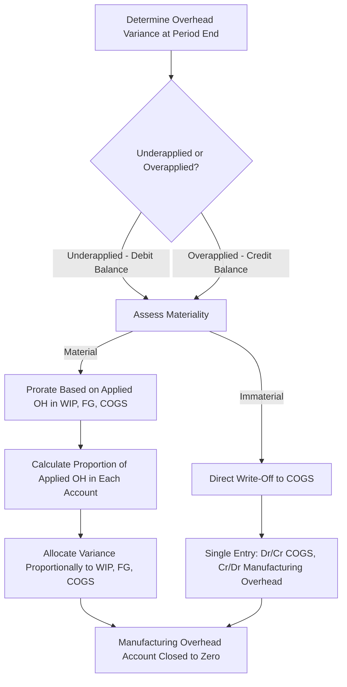

## Disposing of Overhead Variances

### Overview

Disposing of overhead variances refers to the year-end (or period-end) accounting process of closing out the balance remaining in the Manufacturing Overhead account — the over- or underapplied overhead — so that the account has a zero balance heading into the next period. This step is a required part of closing the books under a normal costing system and directly affects the reported values of Work in Process Inventory, Finished Goods Inventory, and Cost of Goods Sold.

### Recap: Why a Variance Exists

Under normal costing, overhead is applied to jobs using a predetermined overhead rate (POHR) based on estimates, while actual overhead costs are recorded separately as they are incurred:

$$\text{Overhead Variance} = \text{Applied Overhead} - \text{Actual Overhead}$$

- **Underapplied** (variance negative) → debit balance remains in Manufacturing Overhead.
- **Overapplied** (variance positive) → credit balance remains in Manufacturing Overhead.

This variance must be disposed of before financial statements are finalized, since the Manufacturing Overhead account is a temporary clearing account that should not carry a balance into the next accounting period.

### Two Acceptable Disposal Methods

There are two generally accepted approaches to disposing of the overhead variance, differentiated by materiality:

1. **Direct write-off (closed entirely to Cost of Goods Sold)**
2. **Proration (allocated proportionally across Work in Process, Finished Goods, and Cost of Goods Sold)**

### Method 1: Direct Write-Off to Cost of Goods Sold

**When Used**

Applied when the variance is **immaterial** — small enough that concentrating the entire adjustment in Cost of Goods Sold does not meaningfully distort the financial statements.

**Journal Entries**

*If underapplied (debit balance in Manufacturing Overhead):*



```
Dr. Cost of Goods Sold            XX
    Cr. Manufacturing Overhead         XX
```

*If overapplied (credit balance in Manufacturing Overhead):*



```
Dr. Manufacturing Overhead        XX
    Cr. Cost of Goods Sold             XX
```

**Effect**

- Underapplied → COGS increases → gross profit and net income decrease.
- Overapplied → COGS decreases → gross profit and net income increase.

**Example**

A company's Manufacturing Overhead account shows a $9,000 debit balance (underapplied) at year-end. Management judges this immaterial relative to total COGS of $1,200,000 (0.75%).



```
Dr. Cost of Goods Sold            \$9,000
    Cr. Manufacturing Overhead         \$9,000
```

After posting, the Manufacturing Overhead account is fully closed (zero balance), and COGS increases from its pre-adjustment balance by $9,000.

### Method 2: Proration Across WIP, Finished Goods, and COGS

**When Used**

Applied when the variance is **material** — large enough that dumping it entirely into COGS would misstate the relative values of ending inventory and cost of goods sold, thereby distorting the financial statements.

**Rationale**

Since applied overhead is embedded within the ending balances of Work in Process Inventory (jobs still in production), Finished Goods Inventory (completed but unsold jobs), and Cost of Goods Sold (jobs sold during the period), a material variance should theoretically be corrected across all three accounts — not just the one representing goods already sold — to better approximate what each account's balance would have been under actual costing.

**Proration Base**

The variance is allocated based on the **relative amount of applied overhead** embedded in each of the three account balances (not the total dollar balance of each account, which would also include direct materials and direct labor).

$$\text{Allocated Share} = \text{Total Variance} \times \frac{\text{Applied OH in Account}}{\text{Total Applied OH in All Three Accounts}}$$

**Example: Proration Calculation**

A company has $30,000 underapplied overhead at year-end. The applied overhead embedded within each account's ending balance is:

| Account | Applied OH in Balance | Proportion | Allocated Variance |
| --- | --- | --- | --- |
| Work in Process Inventory | $45,000 | 15% | $4,500 |
| Finished Goods Inventory | $90,000 | 30% | $9,000 |
| Cost of Goods Sold | $165,000 | 55% | $16,500 |
| **Total** | **$300,000** | **100%** | **$30,000** |

**Proration calculations:**

$$\text{WIP share} = \$30,000 \times \frac{\$45,000}{\$300,000} = \$4,500$$


$$\text{FG share} = \$30,000 \times \frac{\$90,000}{\$300,000} = \$9,000$$


$$\text{COGS share} = \$30,000 \times \frac{\$165,000}{\$300,000} = \$16,500$$

**Journal Entry (underapplied — increases each account)**



```
Dr. Work in Process Inventory     \$4,500
Dr. Finished Goods Inventory      \$9,000
Dr. Cost of Goods Sold            \$16,500
    Cr. Manufacturing Overhead         \$30,000
```

**Journal Entry (if instead overapplied — decreases each account)**



```
Dr. Manufacturing Overhead        \$30,000
    Cr. Work in Process Inventory      \$4,500
    Cr. Finished Goods Inventory       \$9,000
    Cr. Cost of Goods Sold             \$16,500
```

### Effect of Proration on Financial Statements

- **Underapplied, prorated** → each of WIP, Finished Goods, and COGS increases proportionally, more accurately reflecting that actual overhead was higher than what was originally applied throughout all stages of production and sale.
- **Overapplied, prorated** → each of WIP, Finished Goods, and COGS decreases proportionally, reflecting that actual overhead was lower than what was originally applied.
- Compared to direct write-off, proration spreads the financial statement impact more broadly rather than concentrating it entirely in the income statement (via COGS).

### Comparison of the Two Methods

| Criterion | Direct Write-Off | Proration |
| --- | --- | --- |
| Complexity | Low — single journal entry | Higher — requires calculating applied OH proportions in each account |
| Materiality trigger | Immaterial variances | Material variances |
| Accuracy | Approximates actual costing only for COGS | Better approximates actual costing across all three accounts |
| Financial statement effect | Concentrated in net income (via COGS) | Distributed across inventory and net income |
| Common in practice | Yes, especially for small companies or small variances | Yes, especially when variances are large or inventory levels are significant |

### Disposal Decision Process



### Proration Allocation Diagram (svg_diagram)

<svg xmlns="http://www.w3.org/2000/svg" viewBox="0 0 720 340">
<text x="360" y="25" font-size="16" font-weight="bold" text-anchor="middle" fill="#1a1a1a">Prorating the Overhead Variance (svg_diagram)</text>
<rect x="260" y="50" width="200" height="45" rx="6" fill="#f6e9db" stroke="#a5723a" stroke-width="1.5" />
<text x="360" y="78" font-size="12" font-weight="bold" text-anchor="middle" fill="#5c3a1a">Total Variance: \$30,000</text>
<line x1="360" y1="95" x2="150" y2="140" stroke="#555" stroke-width="1.5" />
<line x1="360" y1="95" x2="360" y2="140" stroke="#555" stroke-width="1.5" />
<line x1="360" y1="95" x2="580" y2="140" stroke="#555" stroke-width="1.5" />
<rect x="60" y="140" width="180" height="70" rx="6" fill="#dbe9f6" stroke="#3a6ea5" stroke-width="1.5" />
<text x="150" y="163" font-size="11" text-anchor="middle" fill="#1a3a5c">WIP Inventory</text>
<text x="150" y="180" font-size="10" text-anchor="middle" fill="#1a3a5c">15% of Applied OH</text>
<text x="150" y="196" font-size="11" font-weight="bold" text-anchor="middle" fill="#1a3a5c">\$4,500</text>
<rect x="270" y="140" width="180" height="70" rx="6" fill="#dcf0dc" stroke="#3a7a3a" stroke-width="1.5" />
<text x="360" y="163" font-size="11" text-anchor="middle" fill="#1a4a1a">Finished Goods</text>
<text x="360" y="180" font-size="10" text-anchor="middle" fill="#1a4a1a">30% of Applied OH</text>
<text x="360" y="196" font-size="11" font-weight="bold" text-anchor="middle" fill="#1a4a1a">\$9,000</text>
<rect x="480" y="140" width="180" height="70" rx="6" fill="#f6dbdb" stroke="#a53a3a" stroke-width="1.5" />
<text x="570" y="163" font-size="11" text-anchor="middle" fill="#5c1a1a">Cost of Goods Sold</text>
<text x="570" y="180" font-size="10" text-anchor="middle" fill="#5c1a1a">55% of Applied OH</text>
<text x="570" y="196" font-size="11" font-weight="bold" text-anchor="middle" fill="#5c1a1a">\$16,500</text>

<text x="360" y="250" font-size="12" text-anchor="middle" fill="#333">$4,500 + $9,000 + $16,500 = $30,000 (fully disposed)</text>

</svg>

### Practical Considerations

- **Materiality is a matter of judgment.** Companies typically compare the variance to a benchmark, such as total manufacturing overhead, total COGS, or net income, to decide whether direct write-off or proration is appropriate; there is no single universal numerical threshold.
- **Consistency** — whichever method is chosen should generally be applied consistently period to period, to preserve comparability of financial statements over time.
- **Small companies** with straightforward operations and consistently small variances often default to the direct write-off method for simplicity, since the administrative cost of prorating may not be justified by the resulting precision gain.
- [Inference] Larger manufacturers with significant inventory balances and more volatile overhead-to-activity relationships are more likely to use proration, since the potential distortion from a direct write-off would be more consequential to reported inventory values and gross margin, though the specific practice varies by company policy and auditor judgment.

### Relationship to Financial Statement Presentation

Whichever method is used, the disposal ensures that:

1. The Manufacturing Overhead account carries a zero balance into the next period, ready to accumulate the next period's actual and applied overhead independently.
2. Cost of Goods Sold (and, under proration, WIP and Finished Goods) reflects a more accurate approximation of actual manufacturing costs, correcting for the estimation built into the POHR.
3. Financial statements presented externally (income statement, balance sheet) are not distorted by unresolved application discrepancies from the normal costing process.

### Next Steps

**Related Topics**

- Overapplied and Underapplied Overhead: Causes and Identification
- Predetermined Overhead Rates: Calculation and Application
- Applying Manufacturing Overhead to Jobs
- Normal Costing versus Actual Costing
- Cost Flows in a Job Order Costing System
- Schedule of Cost of Goods Manufactured and Sold
- Materiality Judgments in Managerial Accounting