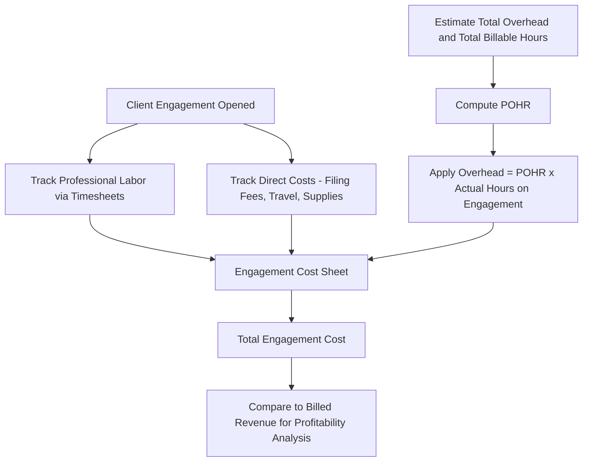

## Job Order Costing in Service and Nonmanufacturing Firms

### Overview

Job order costing is not limited to manufacturing companies. Service firms and other nonmanufacturing organizations — such as law firms, accounting firms, consulting practices, advertising agencies, hospitals, auto repair shops, and construction contractors — also use job order costing principles to accumulate costs for individual clients, engagements, cases, or projects. The underlying logic is identical to manufacturing job order costing: costs are traced or allocated to a specific "job," which in a service context is typically an individual client engagement rather than a physical unit of product.

### Key Conceptual Adaptations for Service Firms

While the framework mirrors manufacturing job order costing, several terminology and structural adjustments are typically made:

| Manufacturing Concept | Service Firm Equivalent |
| --- | --- |
| Job (physical product) | Client engagement, case, project, or contract |
| Direct materials | Often minimal or absent; may include case-specific supplies (e.g., medical supplies, printed materials) |
| Direct labor | Professional labor — hours worked by attorneys, consultants, technicians, nurses, etc., often at billing rates |
| Manufacturing overhead | Often called "overhead" or "indirect costs" — includes office rent, administrative salaries, utilities, insurance, technology costs |
| Work in Process Inventory | Often not tracked as formal inventory since services aren't physically stored; costs accumulate directly against the engagement/project until billed |
| Finished Goods Inventory | Not applicable — services are generally consumed as rendered |
| Cost of Goods Sold | Cost of Services Provided (or Cost of Services Rendered) |
| Job cost sheet | Client/engagement cost sheet, project cost record, or time-and-billing record |

**Key Points**

- Because services are generally intangible and not stored as inventory, service firms typically do not carry Work in Process or Finished Goods inventory accounts on their balance sheets in the same way manufacturers do.
- The absence of physical inventory does not eliminate the need for job costing — firms still need to know the cost of serving each client to support pricing, profitability analysis, and billing decisions.

### Cost Elements in a Service Firm Job Costing System

1. **Direct labor (professional time)** — the largest cost component in most service firms; tracked via timesheets recording hours worked by billable staff on each specific client engagement.
2. **Direct costs/materials** — costs directly traceable to a specific client, such as travel expenses, court filing fees, printing costs, or specialized supplies.
3. **Overhead (indirect costs)** — costs that support the firm's operations generally but cannot be traced to a single client, such as office rent, administrative staff salaries, technology infrastructure, marketing, and professional liability insurance. These are allocated to client engagements using a predetermined overhead rate (POHR), just as in manufacturing.

### Predetermined Overhead Rate in a Service Context

The POHR calculation follows the same structure as in manufacturing, typically using direct labor hours or direct labor cost (professional time) as the allocation base, since labor is usually the dominant cost driver in service businesses.

$$POHR = \frac{\text{Estimated Total Overhead}}{\text{Estimated Total Direct Labor Hours (or Professional Hours)}}$$

$$\text{Overhead Applied to an Engagement} = POHR \times \text{Actual Direct Labor Hours on that Engagement}$$

### Example: Law Firm Job Costing

A law firm estimates the following for the year:

- Estimated total firm overhead (rent, admin salaries, technology, insurance): $960,000
- Estimated total billable attorney hours: 24,000 hours

$$POHR = \frac{\$960,000}{24,000 \text{ hours}} = \$40.00 \text{ per billable hour}$$

A specific client engagement, Case #2024-118, required:

- 45 attorney hours at an average direct labor cost of $85/hour
- $620 in direct costs (filing fees, courier services, expert witness fees)

**Engagement Cost Sheet — Case #2024-118**

| Cost Element | Calculation | Amount |
| --- | --- | --- |
| Direct labor (professional time) | 45 hrs × $85 | $3,825 |
| Direct costs (filing fees, etc.) |  | $620 |
| Applied overhead | 45 hrs × $40 POHR | $1,800 |
| **Total Engagement Cost** |  | **$6,245** |

If the firm billed the client $12,000 for this engagement, the engagement's contribution to firm profitability is:

$$\text{Profit on Engagement} = \$12,000 - \$6,245 = \$5,755$$

### Example: Auto Repair Shop Job Costing

An auto repair shop uses job order costing for each repair order (analogous to a manufacturing "job").

- POHR: $25 per direct labor hour (based on estimated shop overhead ÷ estimated mechanic hours)
- Repair Order #4471: 3.5 mechanic hours at $30/hour, plus $210 in parts (direct materials)

| Cost Element | Calculation | Amount |
| --- | --- | --- |
| Direct materials (parts) |  | $210.00 |
| Direct labor (mechanic time) | 3.5 hrs × $30 | $105.00 |
| Applied overhead | 3.5 hrs × $25 | $87.50 |
| **Total Job Cost** |  | **$402.50** |

This example demonstrates that some service/nonmanufacturing businesses (like repair shops) do retain a direct materials component, unlike pure professional service firms (like law or consulting), where direct materials are typically minimal or nonexistent.

### Example: Hospital / Healthcare Job Costing

Hospitals often use job order costing principles to determine the cost of treating an individual patient (the "job"), particularly for costing and reimbursement analysis purposes.

| Cost Element | Description |
| --- | --- |
| Direct materials | Medical supplies, medications, and disposable items used directly in patient care |
| Direct labor | Nursing hours, physician time (if separately tracked), directly attributable to the patient |
| Applied overhead | Facility costs, equipment depreciation, administrative support, applied via a POHR based on patient days, procedures, or labor hours |

[Inference] Hospitals and other complex service organizations often supplement or replace simple job order costing with more granular activity-based costing (ABC) approaches, since overhead in healthcare settings tends to be driven by multiple distinct activities (e.g., imaging, lab work, room utilization) rather than a single volume-based cost driver, though the appropriate level of costing sophistication depends on the organization's size and reporting needs.

### Comparison: Manufacturing vs. Service Firm Job Order Costing

| Feature | Manufacturing | Service/Nonmanufacturing |
| --- | --- | --- |
| Job unit | Physical product or batch | Client, case, engagement, patient, or project |
| Direct materials | Typically significant | Often minimal or absent (professional services) |
| Direct labor | Production labor | Professional/billable labor (often the dominant cost) |
| Inventory accounts | WIP and Finished Goods tracked | Typically not tracked as formal inventory |
| Overhead allocation base | Machine hours, DLH, units | Usually billable/professional hours |
| Output of the system | Cost of Goods Sold | Cost of Services Provided |
| Primary use | Product costing, pricing, inventory valuation | Client profitability, billing rate-setting, engagement pricing |

### Why Service Firms Use Job Costing

1. **Pricing and billing** — professional service firms need to know the true cost of serving a client to set billing rates or evaluate whether a fixed-fee engagement was profitable.
2. **Client/engagement profitability analysis** — job costing reveals which clients, cases, or service lines generate the most profit relative to resources consumed.
3. **Resource allocation** — understanding cost by engagement helps firms decide where to focus staffing and business development efforts.
4. **Budgeting and overhead recovery** — applying overhead via a POHR ensures that indirect costs (rent, administrative support, technology) are systematically recovered across client engagements rather than ignored.
5. **Bid and proposal preparation** — for project-based firms (construction, consulting), historical job cost data from similar past engagements informs future bids.

### Cost Flow Diagram for a Service Firm Engagement

### Service Firm Job Costing Structure Diagram (svg_diagram)

<svg xmlns="http://www.w3.org/2000/svg" viewBox="0 0 720 320">
<text x="360" y="25" font-size="16" font-weight="bold" text-anchor="middle" fill="#1a1a1a">Job Costing in a Service Firm (svg_diagram)</text>
<rect x="30" y="60" width="180" height="50" rx="6" fill="#dbe9f6" stroke="#3a6ea5" stroke-width="1.5" />
<text x="120" y="90" font-size="12" text-anchor="middle" fill="#1a3a5c">Direct Labor (Timesheets)</text>
<rect x="270" y="60" width="180" height="50" rx="6" fill="#dcf0dc" stroke="#3a7a3a" stroke-width="1.5" />
<text x="360" y="90" font-size="12" text-anchor="middle" fill="#1a4a1a">Direct Costs (Fees, Travel)</text>
<rect x="510" y="60" width="180" height="50" rx="6" fill="#f6e9db" stroke="#a5723a" stroke-width="1.5" />
<text x="600" y="90" font-size="12" text-anchor="middle" fill="#5c3a1a">Applied Overhead (POHR × Hours)</text>
<line x1="120" y1="110" x2="360" y2="160" stroke="#555" stroke-width="1.5" />
<line x1="360" y1="110" x2="360" y2="160" stroke="#555" stroke-width="1.5" />
<line x1="600" y1="110" x2="360" y2="160" stroke="#555" stroke-width="1.5" />
<rect x="230" y="160" width="260" height="50" rx="6" fill="#f6dbdb" stroke="#a53a3a" stroke-width="1.5" />
<text x="360" y="190" font-size="13" font-weight="bold" text-anchor="middle" fill="#5c1a1a">Total Engagement Cost</text>
<line x1="360" y1="210" x2="360" y2="240" stroke="#555" stroke-width="2" marker-end="url(#arrow8)" />
<rect x="230" y="240" width="260" height="50" rx="6" fill="#eee" stroke="#888" stroke-width="1.5" />
<text x="360" y="270" font-size="12" text-anchor="middle" fill="#333">Compare to Billed Revenue</text>
</svg>

### Limitations and Practical Considerations

- Pure professional service firms often lack a meaningful "direct materials" category, so cost structures tend to be dominated by direct labor and overhead — this shifts the analytical focus toward accurate time-tracking as the critical data input.
- Allocating overhead based solely on labor hours can be misleading in firms where certain engagements consume disproportionate amounts of technology, facilities, or specialized equipment relative to time spent; some firms adopt activity-based costing to address this limitation.
- Since services aren't stored as inventory, service firms generally cannot "smooth" profitability across periods the way manufacturers can by building finished goods inventory — engagement costs and revenues are typically recognized as work is performed or billed.
- [Inference] The specific implementation of job costing in service industries varies considerably by sector and firm size — smaller firms may rely on relatively simple time-and-billing systems, while larger firms or those in regulated industries (e.g., healthcare, government contracting) may implement more formal, detailed job costing or activity-based costing systems, depending on reporting and compliance requirements.

### Next Steps

**Related Topics**

- Cost Flows in a Job Order Costing System
- Predetermined Overhead Rates: Calculation and Application
- Activity-Based Costing (ABC) in Service Industries
- Job Cost Sheets and Subsidiary Ledgers
- Client and Engagement Profitability Analysis
- Time-Driven Activity-Based Costing (TDABC)
- Process Costing vs. Job Order Costing