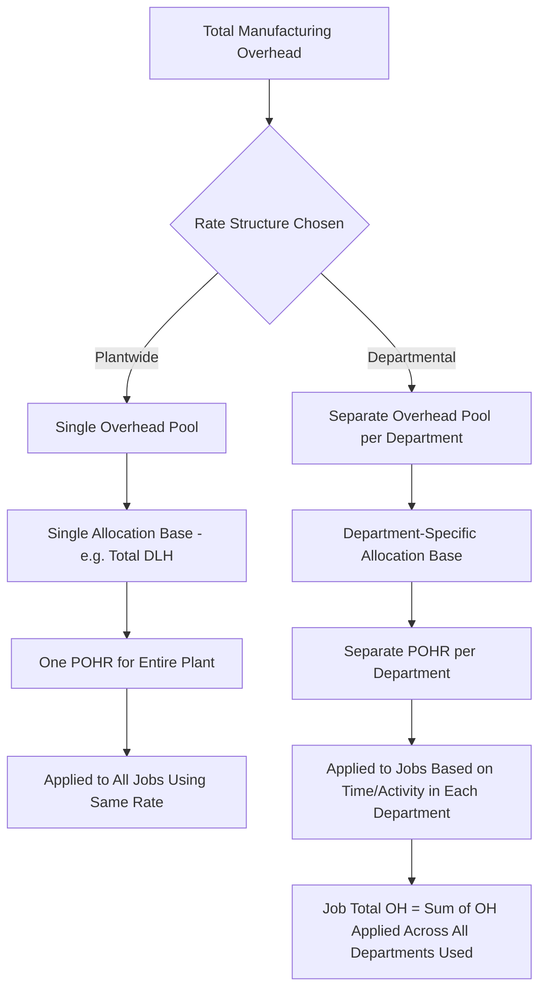

## Plantwide versus Departmental Overhead Rates

### Overview

Plantwide and departmental overhead rates are two alternative structures for applying manufacturing overhead to jobs under normal costing. A **plantwide rate** uses a single predetermined overhead rate for the entire factory, while **departmental rates** use separate predetermined overhead rates for each production department, applied individually as a job passes through each department. The choice between the two significantly affects the accuracy of job costs, particularly in companies with heterogeneous departments.

### Plantwide Overhead Rate

**Definition**

A single POHR calculated for the entire manufacturing facility, using one overhead pool and one allocation base for all overhead costs and all jobs, regardless of which departments those jobs pass through.

**Formula**

$$\text{Plantwide POHR} = \frac{\text{Total Estimated Overhead for the Entire Plant}}{\text{Total Estimated Allocation Base for the Entire Plant}}$$

**Key Points**

- Simple to calculate and administer — only one rate to compute and apply.
- Assumes that overhead costs are driven uniformly by a single allocation base (e.g., direct labor hours) across all departments, regardless of each department's actual cost structure.
- Can significantly distort job costs when departments differ substantially in their overhead intensity or cost drivers (e.g., one highly automated department versus one labor-intensive department).

### Departmental Overhead Rates

**Definition**

Separate predetermined overhead rates calculated for each production department, each potentially using a different allocation base suited to that department's cost structure. A job's total applied overhead is the sum of the overhead applied in each department it passes through.

**Formula (applied per department)**

$$POHR_{\text{dept}} = \frac{\text{Estimated Overhead for that Department}}{\text{Estimated Allocation Base for that Department}}$$

**Key Points**

- More accurately reflects the actual overhead consumption of jobs that spend disproportionate time in high-cost or low-cost departments.
- Requires separate overhead cost pools and allocation base estimates for each department, increasing administrative complexity.
- Allows different departments to use different allocation bases (e.g., machine hours in an automated department, direct labor hours in a labor-intensive department), better matching the cost driver to the actual cause of overhead costs in each area.

### Why the Choice Matters: The Distortion Problem

When a company has multiple departments with significantly different cost structures — for example, one department that is capital/machine-intensive (high overhead per labor hour) and another that is labor-intensive (lower overhead per labor hour) — a single plantwide rate based on one allocation base (commonly direct labor hours) can systematically overcost jobs that spend little time in the expensive department and undercost jobs that spend a lot of time there, or vice versa.

### Example: Plantwide Rate

A manufacturer has two departments: Machining (automated, overhead-intensive) and Assembly (labor-intensive).

**Company-wide estimates:**

- Total estimated overhead: $800,000
- Total estimated direct labor hours: 40,000 DLH

$$\text{Plantwide POHR} = \frac{\$800,000}{40,000 \text{ DLH}} = \$20.00 \text{ per DLH}$$

**Job #501** requires 2 DLH in Machining and 18 DLH in Assembly (total 20 DLH):

$$\text{Overhead Applied (Plantwide)} = \$20.00 \times 20 = \$400$$

### Example: Departmental Rates (Same Company, Same Job)

**Departmental estimates:**

| Department | Estimated OH | Estimated Allocation Base | POHR |
| --- | --- | --- | --- |
| Machining (machine hours) | $600,000 | 15,000 MH | $40.00/MH |
| Assembly (direct labor hours) | $200,000 | 25,000 DLH | $8.00/DLH |

**Job #501** uses 2 machine hours in Machining and 18 direct labor hours in Assembly:

$$\text{OH Applied (Departmental)} = (2 \times \$40.00) + (18 \times \$8.00) = \$80 + \$144 = \$224$$

### Comparing the Two Results

| Method | Overhead Applied to Job #501 |
| --- | --- |
| Plantwide rate | $400 |
| Departmental rates | $224 |
| **Difference** | **$176 overstatement under the plantwide rate** |

This substantial difference ($400 vs. $224) illustrates the distortion problem: under the plantwide rate, Job #501 is charged as if all 20 hours were equally overhead-intensive, even though it spent very little time (2 hours) in the expensive, machine-intensive Machining department. The departmental approach recognizes that most of the job's time (18 hours) was in the lower-overhead Assembly department, producing a more accurate cost.

### When a Plantwide Rate Is Appropriate

- The company has only one department, or multiple departments with similar overhead cost structures and similar cost drivers.
- Jobs move through departments in roughly similar proportions, so any potential distortion tends to average out across jobs.
- The cost and complexity of maintaining departmental rates outweighs the benefit of increased accuracy (a cost-benefit judgment).
- Overhead costs are relatively low as a proportion of total product cost, making the consequences of any distortion less significant.

### When Departmental Rates Are Appropriate

- Departments have significantly different overhead cost structures (e.g., one capital-intensive, one labor-intensive).
- Jobs vary significantly in how much time/resources they consume in each department.
- Overhead represents a large proportion of total product cost, making accuracy more consequential for pricing and profitability decisions.
- Management needs more precise product costs for pricing, bidding, or make-or-buy decisions.

### Plantwide vs. Departmental Rates Comparison Table

| Criterion | Plantwide Rate | Departmental Rates |
| --- | --- | --- |
| Number of rates | One for the entire plant | One per department |
| Allocation base(s) | Single base for all overhead | Can differ by department (e.g., MH in one, DLH in another) |
| Administrative complexity | Low | Higher — requires separate cost pools and tracking by department |
| Accuracy | Lower, especially with heterogeneous departments | Higher — reflects actual departmental cost drivers |
| Risk of cost distortion | Higher | Lower |
| Best suited for | Simple, homogeneous operations | Complex operations with diverse departments |
| Precursor to | — | Activity-Based Costing (ABC), which refines further using multiple activity-level cost pools |

### Relationship to Activity-Based Costing (ABC)

Departmental rates represent a middle ground between a single plantwide rate and full activity-based costing. ABC extends the departmental logic further by creating multiple overhead cost pools based on distinct **activities** (e.g., machine setups, quality inspections, material handling) rather than simply by department, using a unique cost driver for each activity. [Inference] Companies often adopt departmental rates as an intermediate step toward more refined costing, moving to full ABC only when departmental rates still fail to adequately explain overhead cost variation across products, since ABC implementation is generally more costly and complex.

### Overhead Rate Structure Comparison Diagram

### Plantwide vs. Departmental Rate Diagram (svg_diagram)

<svg xmlns="http://www.w3.org/2000/svg" viewBox="0 0 740 380">
<text x="370" y="25" font-size="16" font-weight="bold" text-anchor="middle" fill="#1a1a1a">Plantwide vs. Departmental Overhead Rates (svg_diagram)</text>

<text x="185" y="55" font-size="13" font-weight="bold" text-anchor="middle" fill="`#1a3a5c`">Plantwide Rate</text>

<rect x="60" y="70" width="250" height="45" rx="6" fill="`#dbe9f6`" stroke="`#3a6ea5`" stroke-width="1.5" />

<text x="185" y="97" font-size="11" text-anchor="middle" fill="`#1a3a5c`">Single OH Pool: $800,000 / 40,000 DLH</text>

<line x1="185" y1="115" x2="185" y2="145" stroke="#555" stroke-width="2" marker-end="url(#arrow9)" />
<rect x="60" y="145" width="250" height="40" rx="6" fill="#f6e9db" stroke="#a5723a" stroke-width="1.5" />
<text x="185" y="170" font-size="12" font-weight="bold" text-anchor="middle" fill="#5c3a1a">POHR = \$20.00/DLH</text>
<line x1="185" y1="185" x2="185" y2="215" stroke="#555" stroke-width="2" marker-end="url(#arrow9)" />
<rect x="60" y="215" width="250" height="45" rx="6" fill="#f6dbdb" stroke="#a53a3a" stroke-width="1.5" />
<text x="185" y="242" font-size="12" text-anchor="middle" fill="#5c1a1a">Job #501: \$400 Applied</text>

<text x="555" y="55" font-size="13" font-weight="bold" text-anchor="middle" fill="`#1a4a1a`">Departmental Rates</text>

<rect x="410" y="70" width="130" height="40" rx="6" fill="#dcf0dc" stroke="#3a7a3a" stroke-width="1.5" />
<text x="475" y="95" font-size="10" text-anchor="middle" fill="#1a4a1a">Machining: \$40/MH</text>
<rect x="560" y="70" width="130" height="40" rx="6" fill="#dcf0dc" stroke="#3a7a3a" stroke-width="1.5" />
<text x="625" y="95" font-size="10" text-anchor="middle" fill="#1a4a1a">Assembly: \$8/DLH</text>
<line x1="475" y1="110" x2="550" y2="145" stroke="#555" stroke-width="1.5" />
<line x1="625" y1="110" x2="550" y2="145" stroke="#555" stroke-width="1.5" />
<rect x="410" y="145" width="280" height="40" rx="6" fill="#f6e9db" stroke="#a5723a" stroke-width="1.5" />
<text x="550" y="170" font-size="11" text-anchor="middle" fill="#5c3a1a">Job #501: (2×\$40) + (18×\$8)</text>
<line x1="550" y1="185" x2="550" y2="215" stroke="#555" stroke-width="2" marker-end="url(#arrow9)" />
<rect x="410" y="215" width="280" height="45" rx="6" fill="#f6dbdb" stroke="#a53a3a" stroke-width="1.5" />
<text x="550" y="242" font-size="12" text-anchor="middle" fill="#5c1a1a">Job #501: \$224 Applied</text>

<text x="370" y="300" font-size="12" text-anchor="middle" fill="#333">Difference of $176 illustrates the cost distortion risk</text>

<text x="370" y="320" font-size="12" text-anchor="middle" fill="#333">of using a single plantwide rate on heterogeneous departments</text>

</svg>

### Practical Trade-Offs

- **Cost-benefit analysis** — the decision to implement departmental rates (or go further to ABC) should weigh the value of more accurate job costs (better pricing and decision-making) against the added administrative cost of tracking multiple overhead pools and allocation bases.
- [Inference] Smaller manufacturers with simple, homogeneous production processes may find that a plantwide rate provides "good enough" accuracy at a much lower administrative cost, while larger or more diversified manufacturers are more likely to benefit from departmental or activity-based approaches, though the specific threshold depends on each company's cost structure and the materiality of potential distortions.
- Regardless of which structure is chosen, both approaches still rely on **estimates** to compute their respective POHRs, and both are still subject to over- or underapplied overhead reconciliation at period-end — departmental systems require this reconciliation separately for each department's overhead pool.

### Next Steps

**Related Topics**

- Predetermined Overhead Rates: Calculation and Application
- Applying Manufacturing Overhead to Jobs
- Activity-Based Costing (ABC)
- Overapplied and Underapplied Overhead
- Cost Flows in a Job Order Costing System
- Cost Driver Selection and Allocation Base Analysis
- Job Cost Sheets and Subsidiary Ledgers