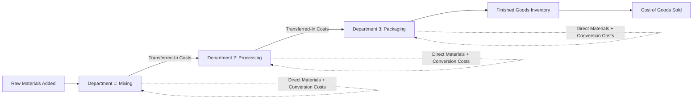

## Characteristics of Process Costing Systems

### Overview

Process costing is a product costing system used by companies that produce large volumes of homogeneous (identical or nearly identical) units through a continuous, standardized production process. Rather than tracking costs by individual job, as in job order costing, process costing accumulates costs by **department or process** over a period of time and then averages those costs across all units produced during that period.

### Defining Characteristics

**1. Homogeneous, Mass-Produced Units**

Process costing is designed for industries producing large quantities of identical or highly similar units, where individual units are not distinguishable from one another. Typical industries include:

- Chemicals, petroleum refining
- Food and beverage processing
- Paper and pulp manufacturing
- Textiles
- Cement and building materials
- Paint manufacturing

**2. Continuous Production Flow**

Production occurs as a continuous or near-continuous flow through one or more processing departments, rather than as discrete, separately identifiable jobs. Units move sequentially through each department, with costs accumulating along the way.

**3. Costs Accumulated by Department, Not by Job**

Instead of a job cost sheet tracking one specific job, process costing uses a **department production report** to accumulate costs for an entire department over a period. All units passing through that department during the period share the department's costs on an average basis.

**4. Averaging of Costs**

The defining computational feature of process costing is that unit costs are calculated by **averaging** total department costs over the number of units produced (adjusted for partially completed units, discussed below):

$$\text{Unit Cost} = \frac{\text{Total Department Costs}}{\text{Equivalent Units of Production}}$$

**5. Sequential (Multi-Department) Processing**

Many process costing environments involve multiple sequential departments, where units move from one department to the next, accumulating additional costs at each stage. Costs transferred from a prior department into the next are called **transferred-in costs**.

### Process Costing vs. Job Order Costing: Fundamental Comparison

| Feature | Job Order Costing | Process Costing |
| --- | --- | --- |
| Product type | Unique, distinguishable jobs or batches | Homogeneous, mass-produced units |
| Cost accumulation | By individual job | By department or process, over a time period |
| Cost tracking document | Job cost sheet | Department production report |
| Cost assignment method | Direct tracing to specific job + overhead applied via POHR | Averaging of total department costs over equivalent units |
| Typical industries | Custom furniture, construction, printing, consulting | Chemicals, food processing, oil refining, textiles |
| Unit cost variability | Can vary significantly between jobs | Relatively uniform across units within a period |
| Key computational tool | Predetermined overhead rate | Equivalent units of production |

### The Three Manufacturing Cost Elements (Same as Job Order Costing)

Process costing still tracks the same three cost categories, just accumulated differently:

1. **Direct Materials** — often added at specific points in the process (e.g., all at the beginning, or at various stages).
2. **Direct Labor** — production labor, typically incurred relatively evenly ("uniformly") throughout the process.
3. **Manufacturing Overhead** — indirect costs, often combined with direct labor into a single "conversion costs" category in process costing (discussed below).

### Conversion Costs

**Definition**

In process costing, direct labor and manufacturing overhead are frequently combined into a single category called **conversion costs**, since both tend to be incurred relatively uniformly throughout the production process (unlike direct materials, which are often added at discrete points).

$$\text{Conversion Costs} = \text{Direct Labor} + \text{Manufacturing Overhead}$$

**Key Points**

- This combination simplifies the equivalent units calculation, since direct materials and conversion costs are frequently added at different rates/points in the process and must be tracked separately for equivalent unit purposes, but direct labor and overhead usually share the same completion pattern.

### The Need for Equivalent Units

Because production is continuous, at the end of any given period, some units will be **fully completed** and transferred out, while others remain **partially completed** (ending Work in Process). Since it would be inaccurate to count a partially completed unit as equal to a fully completed unit for cost-averaging purposes, process costing uses the concept of **equivalent units of production (EUP)** — expressing partially completed units in terms of the equivalent number of fully completed units.

$$\text{Equivalent Units} = \text{Number of Physical Units} \times \text{Percentage of Completion}$$

For example, 1,000 units that are 40% complete represent 400 equivalent units of production.

**Key Points**

- Equivalent units must typically be calculated **separately for direct materials and conversion costs**, since these cost components are often added at different rates/points in the process.
- The two most common methods for calculating equivalent units are the **weighted-average method** and the **FIFO method**, covered as distinct topics within process costing.

### Departmental Production Report Structure

Each processing department typically prepares a report with the following general components:

1. **Physical units reconciliation** — tracks units that entered the department (from a prior department or as new units started), and how they were disposed of (completed and transferred out, or remaining in ending WIP).
2. **Equivalent units calculation** — separately for direct materials and conversion costs.
3. **Cost per equivalent unit calculation** — total costs (from beginning WIP plus costs added this period) divided by equivalent units.
4. **Cost reconciliation/assignment** — assigns total costs to units completed and transferred out, and to units remaining in ending WIP.

### Multi-Department Cost Flow

**Key Points**

- Costs "transferred in" from an upstream department become part of the receiving department's total costs, treated similarly to an additional direct material added at the very start of that department's process.
- Each department maintains its own Work in Process Inventory account, and costs flow sequentially from one WIP account to the next as units move through the production sequence.

### Comparative Cost Flow Diagram (svg_diagram)

<svg xmlns="http://www.w3.org/2000/svg" viewBox="0 0 740 300">
<text x="370" y="25" font-size="16" font-weight="bold" text-anchor="middle" fill="#1a1a1a">Job Order vs. Process Costing Structure (svg_diagram)</text>

<text x="185" y="55" font-size="13" font-weight="bold" text-anchor="middle" fill="`#1a3a5c`">Job Order Costing</text>

<rect x="60" y="70" width="130" height="45" rx="6" fill="`#dbe9f6`" stroke="`#3a6ea5`" stroke-width="1.5" />

<text x="125" y="97" font-size="10" text-anchor="middle" fill="`#1a3a5c`">Job #1</text>

<rect x="200" y="70" width="130" height="45" rx="6" fill="`#dbe9f6`" stroke="`#3a6ea5`" stroke-width="1.5" />

<text x="265" y="97" font-size="10" text-anchor="middle" fill="`#1a3a5c`">Job #2</text>

<text x="195" y="140" font-size="10" text-anchor="middle" fill="#333">Costs traced to each distinct job</text>

<text x="555" y="55" font-size="13" font-weight="bold" text-anchor="middle" fill="`#1a4a1a`">Process Costing</text>

<rect x="410" y="70" width="280" height="45" rx="6" fill="`#dcf0dc`" stroke="`#3a7a3a`" stroke-width="1.5" />

<text x="550" y="97" font-size="11" text-anchor="middle" fill="`#1a4a1a`">Department Cost Pool (all units, averaged)</text>

<text x="550" y="140" font-size="10" text-anchor="middle" fill="#333">Costs averaged across all units in the department</text>

<rect x="60" y="180" width="270" height="60" rx="6" fill="#f6e9db" stroke="#a5723a" stroke-width="1.5" />
<text x="195" y="205" font-size="10" text-anchor="middle" fill="#5c3a1a">Unit Cost = Job Cost Sheet Total</text>
<text x="195" y="222" font-size="10" text-anchor="middle" fill="#5c3a1a">÷ Units Produced for that Job</text>
<rect x="410" y="180" width="280" height="60" rx="6" fill="#f6dbdb" stroke="#a53a3a" stroke-width="1.5" />
<text x="550" y="205" font-size="10" text-anchor="middle" fill="#5c1a1a">Unit Cost = Total Dept. Costs</text>
<text x="550" y="222" font-size="10" text-anchor="middle" fill="#5c1a1a">÷ Equivalent Units of Production</text>
</svg>

### Hybrid Systems: Operation Costing

Some companies use a hybrid approach called **operation costing** (or hybrid costing), which combines elements of both job order and process costing. This is common in industries where products share a common base process but are customized at certain points (e.g., shoe or apparel manufacturing, where the same production line produces different sizes/colors). Direct materials may be traced to specific batches like in job order costing, while conversion costs are accumulated and averaged like in process costing.

### When to Use Process Costing vs. Job Order Costing

| Decision Factor | Favors Process Costing | Favors Job Order Costing |
| --- | --- | --- |
| Product homogeneity | High — units are identical or nearly identical | Low — units are unique or customized |
| Production volume | High volume, continuous flow | Lower volume, discrete batches |
| Cost tracking feasibility | Impractical to trace costs to individual units | Practical and meaningful to trace costs to individual jobs |
| Customer specification | Standard product for general market | Custom order to customer specifications |
| Example industries | Oil refining, cement, soft drinks | Custom homebuilding, shipbuilding, consulting |

### Limitations and Practical Considerations

- Process costing inherently involves **averaging**, which sacrifices some precision compared to the direct tracing possible in job order costing — all units within a department during a period are assumed to have consumed resources at the average rate, even if slight variations exist.
- The accuracy of process costing depends heavily on reasonable estimation of the **percentage of completion** for ending Work in Process units; inaccurate completion estimates distort the equivalent units calculation and, consequently, unit costs.
- [Inference] Process costing is best suited to environments with genuinely homogeneous output; applying it to production with meaningful product variation would understate cost differences between distinct product variants, which is part of why some industries adopt hybrid operation costing instead.

### Next Steps

**Related Topics**

- Equivalent Units of Production
- Weighted-Average Method of Process Costing
- FIFO Method of Process Costing
- Departmental Production Reports
- Conversion Costs and Cost Classification in Process Costing
- Transferred-In Costs and Multi-Department Cost Flow
- Job Order Costing vs. Process Costing
- Hybrid (Operation) Costing Systems