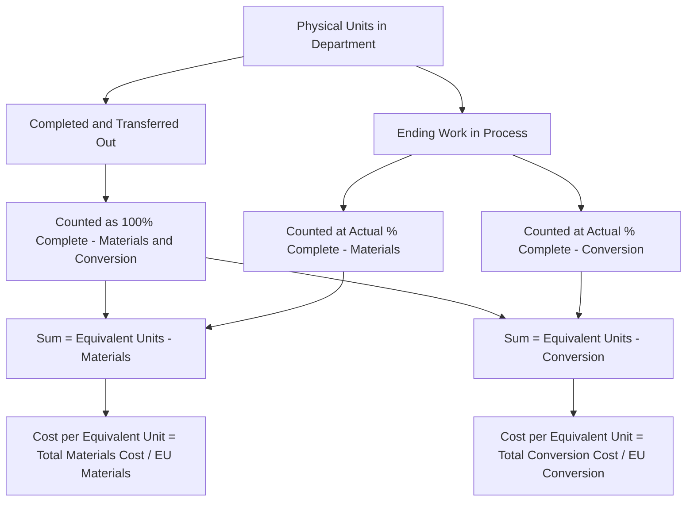

## Equivalent Units of Production

### Overview

Equivalent units of production (EUP) is the core computational concept that allows process costing to allocate costs fairly between units that are fully completed and units that are only partially completed at the end of a period. Because a partially completed unit has not consumed the same amount of materials, labor, and overhead as a fully completed unit, EUP restates partially completed units in terms of an equivalent number of fully completed units, enabling a consistent cost-per-unit calculation.

### The Core Problem EUP Solves

At the end of any production period, a department typically has:

- Units **completed and transferred out** to the next department or to Finished Goods.
- Units remaining in **ending Work in Process (WIP)** — started but not yet finished.

If a company simply divided total department costs by the total number of *physical* units touched during the period (ignoring completion status), the resulting "unit cost" would be distorted — partially completed units would be treated as if they cost the same as fully completed ones, even though they've consumed fewer resources.

### Definition and Formula

**Equivalent units of production** convert partially completed units into the equivalent number of fully completed units, based on their percentage of completion.

$$\text{Equivalent Units} = \text{Number of Physical Units} \times \text{Percentage of Completion}$$

**Example (Basic Concept)**

If 2,000 units in ending WIP are 30% complete with respect to conversion costs:

$$\text{Equivalent Units (Conversion)} = 2,000 \times 30\% = 600 \text{ equivalent units}$$

This means the resources consumed by those 2,000 partially completed units are equivalent to what would have been consumed by 600 fully completed units.

### Why Equivalent Units Are Calculated Separately for Materials and Conversion Costs

Direct materials and conversion costs (direct labor + manufacturing overhead) are frequently added to production at **different rates or points** in the process:

- **Direct materials** are often added entirely at the **beginning** of the process (e.g., raw materials issued at the start of a batch), or sometimes at multiple discrete points.
- **Conversion costs** are typically incurred **uniformly** throughout the process, since labor and overhead are consumed continuously as the unit progresses through production.

Because of this difference, a unit that is 40% complete overall might be:

- 100% complete with respect to direct materials (if all materials are added at the start), but
- Only 40% complete with respect to conversion costs (since labor/overhead accumulate gradually).

**Key Points**

- Equivalent units must almost always be computed **separately** for direct materials and for conversion costs, since their completion percentages typically differ.
- If direct materials are added at multiple points, additional care is needed to determine what percentage of materials has been added based on where the unit is in the process.

### Example: Equivalent Units Calculation (Weighted-Average Method)

A department has the following data for the month:

- Units completed and transferred out: 8,000 units
- Ending Work in Process: 2,000 units, 100% complete as to materials, 25% complete as to conversion costs

**Equivalent Units — Direct Materials**

$$EU_{\text{materials}} = 8,000 \text{ (completed)} + (2,000 \times 100\%) = 8,000 + 2,000 = 10,000 \text{ equivalent units}$$

**Equivalent Units — Conversion Costs**

$$EU_{\text{conversion}} = 8,000 \text{ (completed)} + (2,000 \times 25\%) = 8,000 + 500 = 8,500 \text{ equivalent units}$$

**Key Points**

- Completed and transferred-out units are always counted as 100% complete for both materials and conversion costs, since by definition they have received all inputs needed to be finished.
- Ending WIP units are counted at their actual percentage of completion for each cost category.

### Two Methods for Calculating Equivalent Units

There are two accepted approaches to computing equivalent units when a department has **beginning** Work in Process (units partially completed from the prior period, in addition to units added and completed this period):

1. **Weighted-Average Method** — blends beginning WIP costs and current period costs together, treating all units (whether started last period or this period) as if they were all worked on evenly during the current period.
2. **FIFO Method** — separates beginning WIP costs from current period costs, tracking the equivalent units required to *finish* beginning WIP units separately from units started and completed entirely within the current period.

### Weighted-Average Method: Equivalent Units Formula

$$EU_{\text{weighted-average}} = \text{Units Completed and Transferred Out} + (\text{Ending WIP Units} \times \text{\% Complete})$$

This method does **not** separately consider the completion percentage of beginning WIP units — it treats the entire beginning WIP as if all its costs were incurred in the current period, blended together with current period costs.

### FIFO Method: Equivalent Units Formula

$$EU_{\text{FIFO}} = \left[\text{Beginning WIP Units} \times (100\% - \text{\% Complete at Start of Period})\right] + \text{Units Started and Completed This Period} + (\text{Ending WIP Units} \times \text{\% Complete})$$

This method isolates the *additional* work needed to complete beginning WIP units this period, separately from units that were both started and completed entirely within the current period.

### Example: Comparing Weighted-Average and FIFO Equivalent Units

**Data:**

- Beginning WIP: 1,500 units, 60% complete as to conversion costs (materials 100% complete)
- Units started during the period: 9,000 units
- Units completed and transferred out: 8,500 units
- Ending WIP: 2,000 units, 100% complete as to materials, 30% complete as to conversion costs

**Step 1: Reconcile physical units**

$$\text{Beginning WIP} + \text{Units Started} = \text{Units Completed} + \text{Ending WIP}$$

$$1,500 + 9,000 = 8,500 + 2,000 = 10,500 \text{ (both sides check)}$$

**Weighted-Average Equivalent Units (Conversion Costs)**

$$EU_{\text{WA, conversion}} = 8,500 + (2,000 \times 30\%) = 8,500 + 600 = 9,100 \text{ equivalent units}$$

**FIFO Equivalent Units (Conversion Costs)**

Units started and completed this period = Units completed − Beginning WIP = 8,500 − 1,500 = 7,000

$$EU_{\text{FIFO, conversion}} = \left[1,500 \times (100\% - 60\%)\right] + 7,000 + (2,000 \times 30\%)$$

$$EU_{\text{FIFO, conversion}} = (1,500 \times 40\%) + 7,000 + 600 = 600 + 7,000 + 600 = 8,200 \text{ equivalent units}$$

**Comparison**

| Method | Equivalent Units (Conversion) |
| --- | --- |
| Weighted-Average | 9,100 |
| FIFO | 8,200 |

The difference (900 units) reflects the work already completed on beginning WIP in the *prior* period (1,500 units × 60% = 900 equivalent units), which the weighted-average method blends into the current period's total, while FIFO excludes it since that work was already accounted for last period.

### Equivalent Units Reconciliation Table (Weighted-Average Example)

|  | Physical Units | Materials (% Complete) | Materials EU | Conversion (% Complete) | Conversion EU |
| --- | --- | --- | --- | --- | --- |
| Completed & Transferred Out | 8,500 | 100% | 8,500 | 100% | 8,500 |
| Ending WIP | 2,000 | 100% | 2,000 | 30% | 600 |
| **Total Equivalent Units** | **10,500** |  | **10,500** |  | **9,100** |

### Equivalent Units Flow Diagram

### Equivalent Units Concept Diagram (svg_diagram)

<svg xmlns="http://www.w3.org/2000/svg" viewBox="0 0 700 320">
<text x="350" y="25" font-size="16" font-weight="bold" text-anchor="middle" fill="#1a1a1a">Equivalent Units of Production (svg_diagram)</text>

<text x="150" y="60" font-size="12" text-anchor="middle" fill="#333">4 units, each 50% complete</text>

<rect x="40" y="75" width="60" height="60" fill="`#dbe9f6`" stroke="`#3a6ea5`" stroke-width="1.5" />

<rect x="40" y="105" width="60" height="30" fill="`#3a6ea5`" />

<rect x="110" y="75" width="60" height="60" fill="`#dbe9f6`" stroke="`#3a6ea5`" stroke-width="1.5" />

<rect x="110" y="105" width="60" height="30" fill="`#3a6ea5`" />

<rect x="180" y="75" width="60" height="60" fill="`#dbe9f6`" stroke="`#3a6ea5`" stroke-width="1.5" />

<rect x="180" y="105" width="60" height="30" fill="`#3a6ea5`" />

<rect x="250" y="75" width="60" height="60" fill="`#dbe9f6`" stroke="`#3a6ea5`" stroke-width="1.5" />

<rect x="250" y="105" width="60" height="30" fill="`#3a6ea5`" />

<text x="350" y="105" font-size="20" text-anchor="middle" fill="#333">=</text>

<text x="500" y="60" font-size="12" text-anchor="middle" fill="#333">2 fully completed equivalent units</text>

<rect x="440" y="75" width="60" height="60" fill="`#dcf0dc`" stroke="`#3a7a3a`" stroke-width="1.5" />

<rect x="440" y="75" width="60" height="60" fill="`#3a7a3a`" />

<rect x="510" y="75" width="60" height="60" fill="`#dcf0dc`" stroke="`#3a7a3a`" stroke-width="1.5" />

<rect x="510" y="75" width="60" height="60" fill="`#3a7a3a`" />

<text x="350" y="165" font-size="12" text-anchor="middle" fill="#333">4 physical units × 50% complete = 2 equivalent units</text>

<rect x="80" y="210" width="540" height="80" rx="6" fill="#f6e9db" stroke="#a5723a" stroke-width="1.5" />
<text x="350" y="235" font-size="12" font-weight="bold" text-anchor="middle" fill="#5c3a1a">Key Formula</text>
<text x="350" y="258" font-size="12" text-anchor="middle" fill="#5c3a1a">Equivalent Units = Physical Units × % Complete</text>
<text x="350" y="278" font-size="10" text-anchor="middle" fill="#5c3a1a">(calculated separately for materials and conversion costs)</text>
</svg>

### Determining Percentage of Completion

**Key Points**

- Percentage of completion is typically estimated by production supervisors or engineers based on physical inspection of units in process, and represents an approximation rather than a precise measurement.
- For direct materials, if all materials are added at the very start of the process, ending WIP units are automatically 100% complete as to materials (since they already have all the material they will ever receive), even if only 20% complete as to conversion costs.
- If materials are added at multiple stages (e.g., 50% at the start, 50% at the midpoint), completion percentages must reflect how far along the unit is relative to those addition points.

### Practical Uses of Equivalent Units

1. **Cost per equivalent unit calculation** — the primary use; enables computing an accurate average cost per unit despite the presence of partially completed inventory.
2. **Cost assignment** — once cost per equivalent unit is known, it is used to assign total costs to units completed and transferred out, and to units remaining in ending WIP.
3. **Performance evaluation** — equivalent unit data can support evaluating departmental efficiency and production throughput over time.

### Limitations

- Equivalent units rely on completion percentage **estimates**, which are inherently judgmental and may not perfectly reflect actual resource consumption, particularly for conversion costs where the relationship between physical completion and actual cost incurred may not be perfectly linear.
- [Inference] The weighted-average method is generally considered simpler to apply but less precise for period-over-period cost analysis, while FIFO is more precise in isolating current-period costs and efficiency but more complex to compute — the appropriate choice often depends on how much fluctuation exists in per-unit costs from period to period and the specific reporting needs of the company.

### Next Steps

**Related Topics**

- Characteristics of Process Costing Systems
- Weighted-Average Method of Process Costing
- FIFO Method of Process Costing
- Departmental Production Reports
- Conversion Costs and Cost Classification
- Cost per Equivalent Unit Calculations
- Transferred-In Costs in Multi-Department Processing