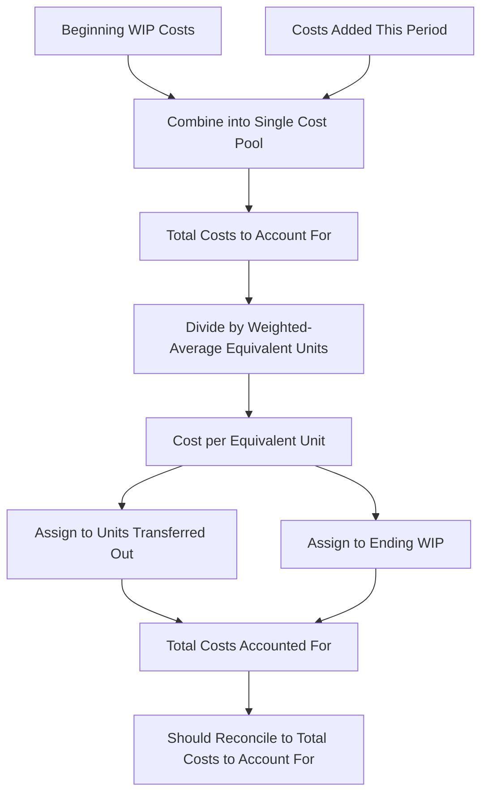

## Weighted Average Method of Process Costing

### Overview

The weighted-average method is one of two primary approaches (alongside the FIFO method) for calculating equivalent units and unit costs in a process costing system. It combines costs from beginning Work in Process (WIP) with costs incurred during the current period, treating them as one blended pool, and assigns an average cost to all units — regardless of whether they were started last period or this period.

### Core Concept

Under the weighted-average method, no distinction is made between units (or costs) that were already in process at the beginning of the period and units (or costs) added during the current period. All costs — beginning WIP costs plus current period costs — are pooled together and divided by total equivalent units (which also blend beginning WIP progress with current period activity) to compute a single, blended cost per equivalent unit.

**Key Points**

- This is the defining feature that distinguishes weighted-average from FIFO: weighted-average does **not** separately track how much work was done on beginning WIP last period versus this period.
- Because of this blending, the weighted-average method is generally simpler to compute than FIFO.
- The trade-off is a loss of precision: if costs per unit fluctuate meaningfully between periods (e.g., due to changing material prices or labor rates), weighted-average smooths those fluctuations together, which may obscure current-period efficiency or cost trends.

### The Five-Step Process (Production Cost Report)

The weighted-average method is typically applied through a five-step process, often organized into a **production cost report**:

1. **Summarize the flow of physical units.**
2. **Compute equivalent units of production** (for materials and conversion costs).
3. **Compute the cost per equivalent unit.**
4. **Assign total costs** to units completed and transferred out, and to ending WIP.
5. **Reconcile total costs** (costs to account for = costs accounted for).

### Step 1: Physical Units Reconciliation

$$\text{Beginning WIP Units} + \text{Units Started This Period} = \text{Units Completed and Transferred Out} + \text{Ending WIP Units}$$

**Example Data**

- Beginning WIP: 2,000 units (70% complete as to conversion; 100% complete as to materials)
- Units started during the period: 10,000 units
- Units completed and transferred out: 9,500 units
- Ending WIP: 2,500 units (100% complete as to materials; 40% complete as to conversion)

**Check:**

$$2,000 + 10,000 = 12,000 = 9,500 + 2,500 \checkmark$$

### Step 2: Equivalent Units of Production (Weighted-Average)

Under weighted-average, equivalent units are computed **without** regard to how much work was done on beginning WIP in the *prior* period:

$$EU = \text{Units Completed and Transferred Out} + (\text{Ending WIP} \times \text{\% Complete})$$

**Equivalent Units — Direct Materials**

$$EU_{\text{materials}} = 9,500 + (2,500 \times 100\%) = 9,500 + 2,500 = 12,000 \text{ equivalent units}$$

**Equivalent Units — Conversion Costs**

$$EU_{\text{conversion}} = 9,500 + (2,500 \times 40\%) = 9,500 + 1,000 = 10,500 \text{ equivalent units}$$

### Step 3: Cost per Equivalent Unit

The **weighted-average cost per equivalent unit** combines beginning WIP costs with current period costs added:

$$\text{Cost per EU} = \frac{\text{Beginning WIP Costs} + \text{Costs Added This Period}}{\text{Equivalent Units (Weighted-Average)}}$$

**Example Cost Data**

|  | Direct Materials | Conversion Costs |
| --- | --- | --- |
| Beginning WIP costs | $18,000 | $9,800 |
| Costs added this period | $102,000 | $115,000 |
| **Total costs to account for** | **$120,000** | **$124,800** |

**Cost per Equivalent Unit — Direct Materials**

$$\frac{\$120,000}{12,000 \text{ EU}} = \$10.00 \text{ per equivalent unit}$$

**Cost per Equivalent Unit — Conversion Costs**

$$\frac{\$124,800}{10,500 \text{ EU}} = \$11.886 \text{ per equivalent unit (rounded)}$$

**Total Cost per Equivalent Unit**

$$\$10.00 + \$11.886 = \$21.886 \text{ per equivalent unit}$$

### Step 4: Assigning Costs to Units

**Cost of Units Completed and Transferred Out**

$$\text{Cost Transferred Out} = \text{Units Completed} \times \text{Total Cost per EU}$$

$$= 9,500 \times \$21.886 = \$207,917 \text{ (rounded)}$$

**Cost of Ending Work in Process**

Ending WIP cost is calculated by applying the cost per equivalent unit separately to the equivalent units remaining in ending WIP for materials and conversion costs:

$$\text{Ending WIP — Materials} = 2,500 \times \$10.00 = \$25,000$$

$$\text{Ending WIP — Conversion} = 1,000 \times \$11.886 = \$11,886 \text{ (rounded)}$$

$$\text{Total Ending WIP Cost} = \$25,000 + \$11,886 = \$36,886$$

### Step 5: Cost Reconciliation

$$\text{Total Costs to Account For} = \text{Beginning WIP Costs} + \text{Costs Added This Period}$$

$$= (\$18,000 + \$9,800) + (\$102,000 + \$115,000) = \$27,800 + \$217,000 = \$244,800$$

$$\text{Total Costs Accounted For} = \text{Cost Transferred Out} + \text{Ending WIP Cost}$$

$$= \$207,917 + \$36,886 = \$244,803 \text{ (minor rounding difference)}$$

These two totals should match (subject to minor rounding), confirming the cost assignment is complete and accurate.

### Summary Production Cost Report (Weighted-Average)

|  | Physical Units | Materials EU | Conversion EU |
| --- | --- | --- | --- |
| Completed & Transferred Out | 9,500 | 9,500 | 9,500 |
| Ending WIP | 2,500 | 2,500 (100%) | 1,000 (40%) |
| **Total Equivalent Units** |  | **12,000** | **10,500** |

| Cost Summary | Materials | Conversion | Total |
| --- | --- | --- | --- |
| Beginning WIP Costs | $18,000 | $9,800 | $27,800 |
| Costs Added This Period | $102,000 | $115,000 | $217,000 |
| **Total Costs to Account For** | **$120,000** | **$124,800** | **$244,800** |
| Cost per Equivalent Unit | $10.00 | $11.886 | $21.886 |

| Cost Assignment | Amount |
| --- | --- |
| Transferred Out (9,500 × $21.886) | $207,917 |
| Ending WIP (Materials: 2,500 × $10.00) | $25,000 |
| Ending WIP (Conversion: 1,000 × $11.886) | $11,886 |
| **Total Costs Accounted For** | **$244,803*** |

*Small variance due to rounding of the per-unit conversion cost; in practice, rounding differences are typically immaterial and may be absorbed into the transferred-out cost.

### Weighted-Average vs. FIFO: Key Structural Difference

| Feature | Weighted-Average | FIFO |
| --- | --- | --- |
| Treatment of beginning WIP | Blended entirely with current period costs and activity | Kept separate; only *additional* work this period is counted |
| Equivalent units formula | Completed + (Ending WIP × % complete) | (Beginning WIP × remaining % to complete) + Units started & completed + (Ending WIP × % complete) |
| Cost per EU basis | Beginning WIP costs + current costs, divided by blended EU | Only current period costs divided by current period EU |
| Complexity | Simpler | More complex |
| Precision for current-period analysis | Lower — blends prior and current period costs | Higher — isolates current period cost and efficiency |

### Process Flow Diagram

### Weighted-Average Cost Flow Diagram (svg_diagram)

<svg xmlns="http://www.w3.org/2000/svg" viewBox="0 0 700 340">
<text x="350" y="25" font-size="16" font-weight="bold" text-anchor="middle" fill="#1a1a1a">Weighted-Average Method: Cost Blending (svg_diagram)</text>
<rect x="40" y="60" width="260" height="50" rx="6" fill="#dbe9f6" stroke="#3a6ea5" stroke-width="1.5" />
<text x="170" y="90" font-size="12" text-anchor="middle" fill="#1a3a5c">Beginning WIP Costs: \$27,800</text>

<text x="330" y="90" font-size="18" text-anchor="middle" fill="#333">+</text>

<rect x="360" y="60" width="280" height="50" rx="6" fill="#dcf0dc" stroke="#3a7a3a" stroke-width="1.5" />
<text x="500" y="90" font-size="12" text-anchor="middle" fill="#1a4a1a">Costs Added This Period: \$217,000</text>
<line x1="350" y1="110" x2="350" y2="150" stroke="#555" stroke-width="2" marker-end="url(#arrow10)" />
<rect x="200" y="150" width="300" height="50" rx="6" fill="#f6e9db" stroke="#a5723a" stroke-width="1.5" />
<text x="350" y="180" font-size="13" font-weight="bold" text-anchor="middle" fill="#5c3a1a">Total: \$244,800 (blended pool)</text>
<line x1="350" y1="200" x2="350" y2="230" stroke="#555" stroke-width="2" marker-end="url(#arrow10)" />
<rect x="150" y="230" width="400" height="50" rx="6" fill="#f6dbdb" stroke="#a53a3a" stroke-width="1.5" />
<text x="350" y="260" font-size="12" text-anchor="middle" fill="#5c1a1a">÷ Weighted-Average Equivalent Units = Cost per EU</text>
<line x1="350" y1="280" x2="200" y2="310" stroke="#555" stroke-width="1.5" />
<line x1="350" y1="280" x2="500" y2="310" stroke="#555" stroke-width="1.5" />

<text x="200" y="320" font-size="11" text-anchor="middle" fill="#333">Transferred Out</text>

<text x="500" y="320" font-size="11" text-anchor="middle" fill="#333">Ending WIP</text>

</svg>

### When the Weighted-Average Method Is Preferred

- **Simplicity is prioritized** — it requires fewer calculations than FIFO, since it doesn't separately track beginning WIP's prior-period completion status.
- **Cost stability** — when material prices and conversion costs are relatively stable period to period, the blending inherent in weighted-average introduces minimal distortion, since there's little difference between prior and current period costs to blend.
- **Regulatory or industry convention** — some industries or company policies simply adopt weighted-average as the standard method for consistency and ease of use.

### Limitations

- Because weighted-average blends beginning WIP costs (which reflect prior-period cost levels) with current-period costs, it can distort the current period's true cost per unit when there have been significant cost changes (e.g., a spike in raw material prices) between periods.
- [Inference] This blending effect means the weighted-average method is generally considered less suitable for detailed period-over-period cost control and variance analysis compared to FIFO, though the practical significance of this limitation depends on how much cost levels actually fluctuate from period to period for a given company.
- Rounding of cost-per-equivalent-unit figures (as seen in the example) can create small reconciliation discrepancies between "costs to account for" and "costs accounted for," which are typically resolved by adjusting the transferred-out cost figure.

### Next Steps

**Related Topics**

- Equivalent Units of Production
- FIFO Method of Process Costing
- Characteristics of Process Costing Systems
- Departmental Production Reports
- Conversion Costs and Cost Classification
- Transferred-In Costs in Multi-Department Processing
- Cost Reconciliation in Process Costing