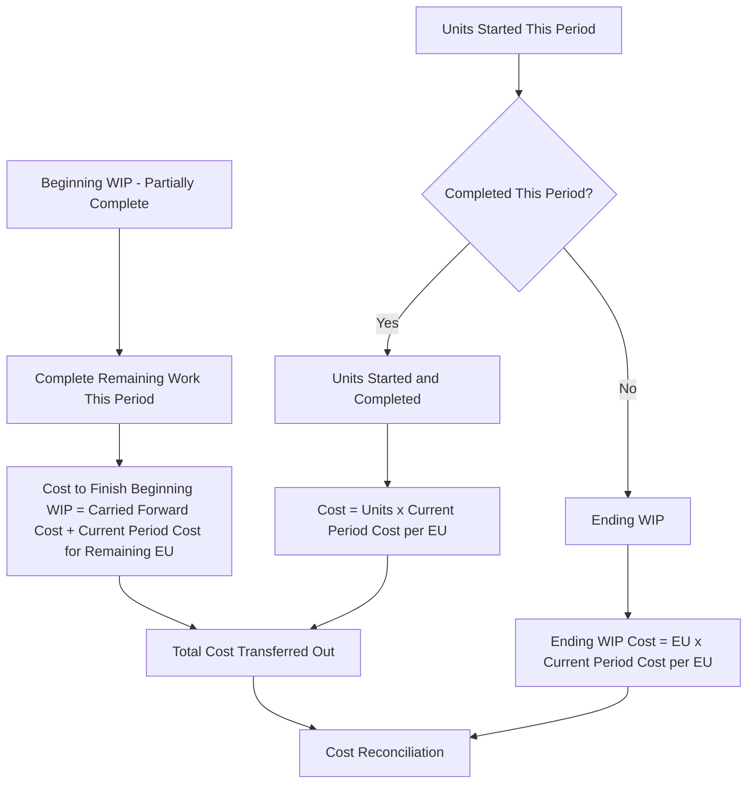

## FIFO Method of Process Costing

### Overview

The FIFO (first-in, first-out) method is one of two primary approaches (alongside the weighted-average method) for calculating equivalent units and unit costs in a process costing system. Unlike weighted-average, FIFO keeps beginning Work in Process (WIP) costs **separate** from current period costs, and assumes that units in beginning WIP are the first to be completed during the current period, followed by units started and completed within the current period.

### Core Concept

Under the FIFO method, the equivalent units and costs associated with beginning WIP (which were incurred in the *prior* period) are tracked and reported separately from the equivalent units and costs incurred during the *current* period. This produces a **current-period-only cost per equivalent unit**, which more precisely isolates the cost and efficiency of the current period's production activity.

**Key Points**

- The FIFO assumption in process costing means that beginning WIP units are assumed to be finished first, before any new units started this period are completed.
- FIFO separately identifies three physical unit groups: (1) beginning WIP units completed this period, (2) units both started and completed this period, and (3) ending WIP units still in process.
- Because it isolates current-period costs and activity, FIFO is more useful than weighted-average for period-over-period cost control and efficiency analysis, though at the cost of increased computational complexity.

### The Five-Step Process (FIFO Production Cost Report)

1. **Summarize the flow of physical units**, distinguishing beginning WIP completion, units started and completed, and ending WIP.
2. **Compute equivalent units of production** using the FIFO approach (separating out work needed to finish beginning WIP).
3. **Compute the cost per equivalent unit** using only current period costs.
4. **Assign total costs** — to beginning WIP units completed, to units started and completed, and to ending WIP.
5. **Reconcile total costs.**

### Step 1: Physical Units Reconciliation

$$\text{Beginning WIP Units} + \text{Units Started This Period} = \text{Units Completed and Transferred Out} + \text{Ending WIP Units}$$

**Example Data**

- Beginning WIP: 2,000 units (70% complete as to conversion costs; 100% complete as to materials)
- Units started during the period: 10,000 units
- Units completed and transferred out: 9,500 units
- Ending WIP: 2,500 units (100% complete as to materials; 40% complete as to conversion costs)

**Units Started and Completed This Period**

$$\text{Units Started and Completed} = \text{Units Completed} - \text{Beginning WIP Units} = 9,500 - 2,000 = 7,500 \text{ units}$$

### Step 2: Equivalent Units of Production (FIFO)

The FIFO equivalent units formula separately accounts for the work needed to complete beginning WIP, work on units started and completed, and work on ending WIP:

$$EU_{\text{FIFO}} = \left[\text{Beginning WIP} \times (100\% - \text{\% Complete at Start})\right] + \text{Units Started and Completed} + (\text{Ending WIP} \times \text{\% Complete})$$

**Equivalent Units — Direct Materials**

Since beginning WIP was already 100% complete as to materials at the start of the period, no additional material equivalent units are needed to finish it:

$$EU_{\text{materials}} = \left[2,000 \times (100\% - 100\%)\right] + 7,500 + (2,500 \times 100\%)$$

$$EU_{\text{materials}} = 0 + 7,500 + 2,500 = 10,000 \text{ equivalent units}$$

**Equivalent Units — Conversion Costs**

Beginning WIP was 70% complete as to conversion at the start, so 30% of work remained to finish it this period:

$$EU_{\text{conversion}} = \left[2,000 \times (100\% - 70\%)\right] + 7,500 + (2,500 \times 40\%)$$

$$EU_{\text{conversion}} = (2,000 \times 30\%) + 7,500 + 1,000 = 600 + 7,500 + 1,000 = 9,100 \text{ equivalent units}$$

### Step 3: Cost per Equivalent Unit (Current Period Costs Only)

Under FIFO, the cost per equivalent unit uses **only costs added during the current period** — beginning WIP costs are excluded from this calculation, since they relate to work performed in the prior period.

$$\text{Cost per EU} = \frac{\text{Costs Added This Period Only}}{\text{Equivalent Units (FIFO)}}$$

**Example Cost Data**

|  | Direct Materials | Conversion Costs |
| --- | --- | --- |
| Beginning WIP costs (from prior period) | $18,000 | $9,800 |
| Costs added this period | $100,000 | $109,200 |

**Cost per Equivalent Unit — Direct Materials**

$$\frac{\$100,000}{10,000 \text{ EU}} = \$10.00 \text{ per equivalent unit}$$

**Cost per Equivalent Unit — Conversion Costs**

$$\frac{\$109,200}{9,100 \text{ EU}} = \$12.00 \text{ per equivalent unit}$$

**Total Current-Period Cost per Equivalent Unit**

$$\$10.00 + \$12.00 = \$22.00 \text{ per equivalent unit}$$

### Step 4: Assigning Costs to Units

FIFO cost assignment involves three separate components:

**A. Cost to Complete Beginning WIP**

This equals the beginning WIP's carried-forward cost (from the prior period) plus the current-period cost required to finish it:

$$\text{Cost to Complete Beginning WIP} = \text{Beginning WIP Costs (carried forward)} + \left[\text{Additional EU Needed} \times \text{Current Cost per EU}\right]$$

Beginning WIP carried-forward cost = $18,000 (materials) + $9,800 (conversion) = $27,800

Additional conversion EU needed to finish beginning WIP = 600 (calculated in Step 2)

Additional materials EU needed = 0 (already 100% complete)

$$\text{Additional Cost to Finish Beginning WIP} = (0 \times \$10.00) + (600 \times \$12.00) = \$0 + \$7,200 = \$7,200$$

$$\text{Total Cost of Beginning WIP Units Completed} = \$27,800 + \$7,200 = \$35,000$$

**B. Cost of Units Started and Completed This Period**

$$\text{Cost} = \text{Units Started and Completed} \times \text{Total Current Cost per EU}$$

$$= 7,500 \times \$22.00 = \$165,000$$

**C. Total Cost Transferred Out**

$$\text{Total Transferred Out} = \text{Cost to Complete Beginning WIP} + \text{Cost of Units Started and Completed}$$

$$= \$35,000 + \$165,000 = \$200,000$$

**D. Cost of Ending Work in Process**

$$\text{Ending WIP — Materials} = 2,500 \times \$10.00 = \$25,000$$

$$\text{Ending WIP — Conversion} = 1,000 \times \$12.00 = \$12,000$$

$$\text{Total Ending WIP Cost} = \$25,000 + \$12,000 = \$37,000$$

### Step 5: Cost Reconciliation

$$\text{Total Costs to Account For} = \text{Beginning WIP Costs} + \text{Costs Added This Period}$$

$$= \$27,800 + (\$100,000 + \$109,200) = \$27,800 + \$209,200 = \$237,000$$

$$\text{Total Costs Accounted For} = \text{Total Transferred Out} + \text{Ending WIP Cost}$$

$$= \$200,000 + \$37,000 = \$237,000 \checkmark$$

The two totals reconcile exactly, confirming the FIFO cost assignment is complete and accurate.

### Summary Production Cost Report (FIFO)

|  | Physical Units | Materials EU | Conversion EU |
| --- | --- | --- | --- |
| Beginning WIP completed (additional work) | 2,000 | 0 (already 100%) | 600 (30% remaining) |
| Started and Completed | 7,500 | 7,500 | 7,500 |
| Ending WIP | 2,500 | 2,500 (100%) | 1,000 (40%) |
| **Total FIFO Equivalent Units** |  | **10,000** | **9,100** |

| Cost Assignment | Amount |
| --- | --- |
| Beginning WIP costs (carried forward) | $27,800 |
| + Cost to finish beginning WIP (600 × $12.00) | $7,200 |
| = Total cost of beginning WIP units completed | $35,000 |
| + Cost of units started and completed (7,500 × $22.00) | $165,000 |
| **= Total Transferred Out** | **$200,000** |
| Ending WIP (2,500 × $10.00 + 1,000 × $12.00) | $37,000 |
| **Total Costs Accounted For** | **$237,000** |

### FIFO vs. Weighted-Average: Side-by-Side Comparison (Same Data)

| Metric | Weighted-Average | FIFO |
| --- | --- | --- |
| Equivalent units (materials) | Includes all units regardless of prior-period status | Excludes materials work already done on beginning WIP |
| Equivalent units (conversion) | 10,500 (blended) | 9,100 (current period only) |
| Cost per equivalent unit basis | Beginning WIP + current costs combined | Current period costs only |
| Isolates current-period efficiency | No | Yes |
| Computational complexity | Lower | Higher |

**Key Points**

- The FIFO method's equivalent units are always **less than or equal to** the weighted-average method's equivalent units, because weighted-average includes the equivalent units already completed on beginning WIP in the *prior* period, while FIFO does not.
- When beginning WIP is small relative to total production, or when cost levels are stable across periods, the difference between FIFO and weighted-average results tends to be relatively minor.

### FIFO Process Flow Diagram

### FIFO Cost Flow Diagram (svg_diagram)

<svg xmlns="http://www.w3.org/2000/svg" viewBox="0 0 740 340">
<text x="370" y="25" font-size="16" font-weight="bold" text-anchor="middle" fill="#1a1a1a">FIFO Method: Separated Cost Layers (svg_diagram)</text>
<rect x="40" y="60" width="200" height="60" rx="6" fill="#dbe9f6" stroke="#3a6ea5" stroke-width="1.5" />
<text x="140" y="85" font-size="11" text-anchor="middle" fill="#1a3a5c">Beginning WIP</text>
<text x="140" y="102" font-size="10" text-anchor="middle" fill="#1a3a5c">Carried Forward: \$27,800</text>
<rect x="270" y="60" width="200" height="60" rx="6" fill="#dcf0dc" stroke="#3a7a3a" stroke-width="1.5" />
<text x="370" y="85" font-size="11" text-anchor="middle" fill="#1a4a1a">Complete Beg. WIP</text>
<text x="370" y="102" font-size="10" text-anchor="middle" fill="#1a4a1a">+ \$7,200 (600 EU × \$12)</text>
<rect x="500" y="60" width="200" height="60" rx="6" fill="#f6e9db" stroke="#a5723a" stroke-width="1.5" />
<text x="600" y="85" font-size="11" text-anchor="middle" fill="#5c3a1a">Started &amp; Completed</text>
<text x="600" y="102" font-size="10" text-anchor="middle" fill="#5c3a1a">7,500 × \$22 = \$165,000</text>
<line x1="140" y1="120" x2="370" y2="150" stroke="#555" stroke-width="1.5" />
<line x1="370" y1="120" x2="370" y2="150" stroke="#555" stroke-width="1.5" />
<line x1="600" y1="120" x2="370" y2="150" stroke="#555" stroke-width="1.5" />
<rect x="220" y="150" width="300" height="45" rx="6" fill="#f6dbdb" stroke="#a53a3a" stroke-width="1.5" />
<text x="370" y="178" font-size="13" font-weight="bold" text-anchor="middle" fill="#5c1a1a">Total Transferred Out: \$200,000</text>
<rect x="220" y="230" width="300" height="50" rx="6" fill="#eee" stroke="#888" stroke-width="1.5" />
<text x="370" y="255" font-size="11" text-anchor="middle" fill="#333">Ending WIP: \$37,000</text>
<text x="370" y="270" font-size="10" text-anchor="middle" fill="#333">(current period cost per EU only)</text>

<text x="370" y="315" font-size="12" text-anchor="middle" fill="#333">$200,000 + $37,000 = $237,000 Total Costs Accounted For</text>

</svg>

### When FIFO Is Preferred

- **Current-period performance evaluation** — because FIFO isolates current-period costs from prior-period costs, it provides a cleaner measure of the current period's manufacturing efficiency and cost control.
- **Volatile cost environments** — when material prices, labor rates, or overhead costs change significantly between periods, FIFO avoids blending stale prior-period costs into current decision-making, unlike weighted-average.
- **Detailed variance and trend analysis** — companies that want to compare cost per equivalent unit across successive periods benefit from FIFO's separation, since weighted-average's blending can mask period-over-period cost trends.

### Limitations

- FIFO requires more detailed calculations than weighted-average, since it separately tracks the completion status of beginning WIP, units started and completed, and ending WIP.
- The added complexity may not be justified in industries where costs are highly stable from period to period, in which case FIFO and weighted-average produce very similar results despite FIFO's greater computational burden.
- [Inference] Because FIFO is more precise but also more labor-intensive to compute, many organizations may adopt weighted-average as a practical default unless the additional analytical precision from FIFO — such as isolating current-period cost trends — provides a meaningful benefit relative to the added effort, though this trade-off depends on each company's specific reporting needs and the degree of cost volatility it experiences.

### Next Steps

**Related Topics**

- Weighted-Average Method of Process Costing
- Equivalent Units of Production
- Characteristics of Process Costing Systems
- Departmental Production Reports
- Conversion Costs and Cost Classification
- Transferred-In Costs in Multi-Department Processing
- Standard Costing and Variance Analysis