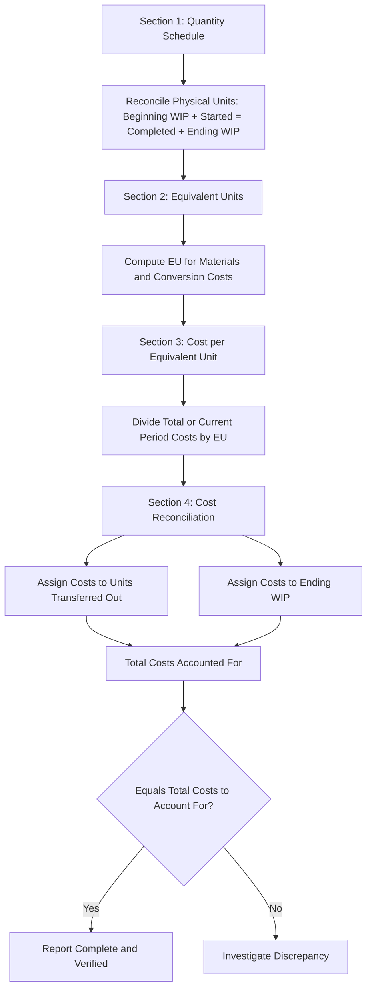

## Cost of Production Reports


### Overview

A cost of production report (also called a production cost report or departmental production report) is the primary managerial accounting document used in process costing to summarize the flow of units and costs through a production department during a specific period. It consolidates the equivalent units calculation, cost per equivalent unit calculation, and cost assignment into a single, comprehensive report, and serves as the formal output of the process costing procedure.

### Purpose of the Cost of Production Report

The report serves several key functions:

1. **Tracks physical unit flow** through a department — how many units entered, how many were completed and transferred out, and how many remain in ending Work in Process (WIP).
2. **Calculates equivalent units of production** for direct materials and conversion costs.
3. **Determines cost per equivalent unit** for each cost category.
4. **Assigns total costs** to units transferred out and to ending WIP.
5. **Reconciles total costs** to verify that "costs to account for" equal "costs accounted for."
6. **Supports management decisions** regarding cost control, pricing, and departmental performance evaluation.

### The Four Standard Sections of a Cost of Production Report

Most cost of production reports are organized into four sections:

**Section 1: Quantity Schedule (Physical Units)**

Reconciles the physical flow of units into and out of the department.



```
Units to Account For:
  Beginning Work in Process          X
  Units Started/Received This Period X
  Total Units to Account For         X

Units Accounted For:
  Units Completed and Transferred Out X
  Ending Work in Process              X
  Total Units Accounted For           X
```

**Section 2: Equivalent Units of Production**

Computed separately for direct materials and conversion costs, using either the weighted-average or FIFO method.

**Section 3: Cost per Equivalent Unit**

Computed by dividing total costs (weighted-average) or current-period costs only (FIFO) by the respective equivalent units.

**Section 4: Cost Reconciliation (Cost Assignment)**

Assigns total costs to units transferred out and to ending WIP, then verifies that total costs assigned equal total costs to account for.

### Example: Complete Cost of Production Report (Weighted-Average Method)

**Company:** Riverstone Chemical Co. — Mixing Department, Month of March

**Physical Unit Data**

- Beginning WIP: 3,000 units (100% complete as to materials, 60% complete as to conversion)
- Units started this period: 17,000 units
- Units completed and transferred out: 16,000 units
- Ending WIP: 4,000 units (100% complete as to materials, 25% complete as to conversion)

**Cost Data**

|  | Direct Materials | Conversion Costs |
| --- | --- | --- |
| Beginning WIP costs | $21,000 | $14,400 |
| Costs added this period | $119,000 | $155,600 |

**Section 1: Quantity Schedule**

| Units to Account For | Units |
| --- | --- |
| Beginning WIP | 3,000 |
| Started this period | 17,000 |
| **Total units to account for** | **20,000** |

| Units Accounted For | Units |
| --- | --- |
| Completed and transferred out | 16,000 |
| Ending WIP | 4,000 |
| **Total units accounted for** | **20,000** |

**Section 2: Equivalent Units (Weighted-Average)**

|  | Physical Units | Materials EU | Conversion EU |
| --- | --- | --- | --- |
| Completed & transferred out | 16,000 | 16,000 | 16,000 |
| Ending WIP | 4,000 | 4,000 (100%) | 1,000 (25%) |
| **Total Equivalent Units** |  | **20,000** | **17,000** |

**Section 3: Cost per Equivalent Unit**

$$\text{Materials: } \frac{\$21,000 + \$119,000}{20,000} = \frac{\$140,000}{20,000} = \$7.00 \text{ per EU}$$


$$\text{Conversion: } \frac{\$14,400 + \$155,600}{17,000} = \frac{\$170,000}{17,000} = \$10.00 \text{ per EU}$$


$$\text{Total cost per EU} = \$7.00 + \$10.00 = \$17.00$$

**Section 4: Cost Reconciliation**

$$\text{Total Costs to Account For} = (\$21,000 + \$14,400) + (\$119,000 + \$155,600) = \$35,400 + \$274,600 = \$310,000$$

| Cost Assignment | Calculation | Amount |
| --- | --- | --- |
| Transferred out | 16,000 × $17.00 | $272,000 |
| Ending WIP — Materials | 4,000 × $7.00 | $28,000 |
| Ending WIP — Conversion | 1,000 × $10.00 | $10,000 |
| **Total Costs Accounted For** |  | **$310,000** |

$$\$310,000 \text{ (to account for)} = \$310,000 \text{ (accounted for)} \checkmark$$

The report reconciles perfectly, confirming the accuracy of the cost flow through the Mixing Department for March.

### Full Cost of Production Report — Consolidated View

| **Riverstone Chemical Co. — Mixing Department — March Production Cost Report** |  |
| --- | --- |
| **Quantity Schedule** |  |
| Beginning WIP | 3,000 |
| Started this period | 17,000 |
| Total to account for | 20,000 |
| Completed & transferred out | 16,000 |
| Ending WIP | 4,000 |
| Total accounted for | 20,000 |
| **Equivalent Units** | Materials: 20,000 / Conversion: 17,000 |
| **Costs** | Materials: $140,000 / Conversion: $170,000 / Total: $310,000 |
| **Cost per EU** | Materials: $7.00 / Conversion: $10.00 / Total: $17.00 |
| **Cost Assignment** | Transferred out: $272,000 / Ending WIP: $38,000 |
| **Reconciliation** | $310,000 = $310,000 ✓ |

### Multi-Department Reports and Transferred-In Costs

When a company has sequential processing departments, the cost of production report for any department **after the first** must include an additional cost category: **transferred-in costs** — the costs carried forward from the prior department, treated similarly to an additional material added at the very beginning of the receiving department's process.

**Adjusted Cost Categories for a Downstream Department**

$$\text{Total Costs} = \text{Transferred-In Costs} + \text{Department's Own Direct Materials} + \text{Department's Own Conversion Costs}$$

Transferred-in costs are always considered 100% complete for equivalent units purposes in the receiving department, since they arrived as a complete package from the upstream department.

**Example: Downstream Department Cost of Production Report Excerpt**

|  | Transferred-In | Materials | Conversion |
| --- | --- | --- | --- |
| Equivalent Units | 18,000 | 18,000 | 15,500 |
| Total Costs | $272,000 | $63,000 | $93,000 |
| Cost per EU | $15.111 | $3.50 | $6.00 |

### Cost of Production Report Structure Diagram



### Cost of Production Report Flow Diagram (svg_diagram)

<svg xmlns="http://www.w3.org/2000/svg" viewBox="0 0 740 380">
<text x="370" y="25" font-size="16" font-weight="bold" text-anchor="middle" fill="#1a1a1a">Cost of Production Report: Four Sections (svg_diagram)</text>
<rect x="40" y="55" width="160" height="60" rx="6" fill="#dbe9f6" stroke="#3a6ea5" stroke-width="1.5" />
<text x="120" y="80" font-size="11" font-weight="bold" text-anchor="middle" fill="#1a3a5c">1. Quantity</text>
<text x="120" y="96" font-size="10" text-anchor="middle" fill="#1a3a5c">Schedule (Units)</text>
<rect x="220" y="55" width="160" height="60" rx="6" fill="#dcf0dc" stroke="#3a7a3a" stroke-width="1.5" />
<text x="300" y="80" font-size="11" font-weight="bold" text-anchor="middle" fill="#1a4a1a">2. Equivalent</text>
<text x="300" y="96" font-size="10" text-anchor="middle" fill="#1a4a1a">Units</text>
<rect x="400" y="55" width="160" height="60" rx="6" fill="#f6e9db" stroke="#a5723a" stroke-width="1.5" />
<text x="480" y="80" font-size="11" font-weight="bold" text-anchor="middle" fill="#5c3a1a">3. Cost per</text>
<text x="480" y="96" font-size="10" text-anchor="middle" fill="#5c3a1a">Equivalent Unit</text>
<rect x="580" y="55" width="160" height="60" rx="6" fill="#f6dbdb" stroke="#a53a3a" stroke-width="1.5" />
<text x="660" y="80" font-size="11" font-weight="bold" text-anchor="middle" fill="#5c1a1a">4. Cost</text>
<text x="660" y="96" font-size="10" text-anchor="middle" fill="#5c1a1a">Reconciliation</text>
<line x1="200" y1="85" x2="220" y2="85" stroke="#555" stroke-width="2" marker-end="url(#arrow11)" />
<line x1="380" y1="85" x2="400" y2="85" stroke="#555" stroke-width="2" marker-end="url(#arrow11)" />
<line x1="560" y1="85" x2="580" y2="85" stroke="#555" stroke-width="2" marker-end="url(#arrow11)" />
<rect x="150" y="160" width="440" height="150" rx="6" fill="#f5f5f5" stroke="#888" stroke-width="1.5" />
<text x="370" y="185" font-size="12" font-weight="bold" text-anchor="middle" fill="#333">Example: Mixing Department, March</text>
<text x="370" y="210" font-size="11" text-anchor="middle" fill="#333">Total Units to Account For: 20,000</text>
<text x="370" y="230" font-size="11" text-anchor="middle" fill="#333">EU (Materials/Conversion): 20,000 / 17,000</text>
<text x="370" y="250" font-size="11" text-anchor="middle" fill="#333">Cost per EU: \$7.00 / \$10.00 = \$17.00 total</text>
<text x="370" y="270" font-size="11" text-anchor="middle" fill="#333">Transferred Out: \$272,000</text>
<text x="370" y="290" font-size="11" text-anchor="middle" fill="#333">Ending WIP: \$38,000 → Total: \$310,000 ✓</text>
</svg>

### Weighted-Average vs. FIFO Cost of Production Reports

The overall four-section structure remains the same regardless of which method is used, but the specific calculations within Sections 2, 3, and 4 differ:

| Section | Weighted-Average | FIFO |
| --- | --- | --- |
| Equivalent units | Blends beginning WIP with current activity | Separates beginning WIP completion from current activity |
| Cost per EU | Uses beginning WIP costs + current costs combined | Uses current period costs only |
| Cost assignment | Single blended rate applied to transferred-out units | Separate cost layers for beginning WIP completion vs. units started and completed |

### Uses of the Cost of Production Report in Management

1. **Departmental performance evaluation** — comparing cost per equivalent unit across periods helps identify cost trends, efficiency improvements, or emerging problems within a department.
2. **Inventory valuation** — the report directly supports the valuation of ending WIP and the cost transferred to the next department (or Finished Goods), both of which appear on the balance sheet and support Cost of Goods Sold calculations.
3. **Cost control** — significant unexplained increases in cost per equivalent unit period-over-period can prompt investigation into materials price changes, labor inefficiency, or overhead cost overruns.
4. **Pricing support** — understanding the true cost per unit of output supports pricing decisions for products moving through process costing environments.

### Limitations

- The accuracy of the entire report depends on the accuracy of the underlying equivalent units calculation, which in turn depends on reasonably accurate estimates of the percentage of completion for ending (and, under FIFO, beginning) WIP.
- Rounding of cost-per-equivalent-unit figures can create small reconciliation discrepancies between "total costs to account for" and "total costs accounted for," typically resolved through minor adjustment to the transferred-out cost.
- [Inference] Multi-department reports involving transferred-in costs add a layer of complexity, since any errors or estimation issues in an upstream department's report will propagate into every downstream department's report, though the extent of this propagation risk depends on the number of sequential departments involved in a given company's production process.

### Next Steps

**Related Topics**

- Equivalent Units of Production
- Weighted-Average Method of Process Costing
- FIFO Method of Process Costing
- Transferred-In Costs in Multi-Department Processing
- Characteristics of Process Costing Systems
- Conversion Costs and Cost Classification
- Spoilage in Process Costing (Normal vs. Abnormal Spoilage)