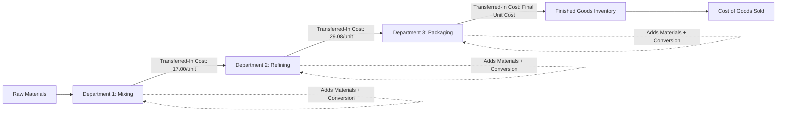

## Process Costing with Sequential Departments

### Overview

Sequential (multi-department) process costing extends single-department process costing to environments where a product passes through two or more production departments in a fixed order, with each department performing a distinct stage of the manufacturing process. As units move from one department to the next, the accumulated cost of the units — called **transferred-in cost** — moves with them, becoming an additional cost element in the receiving department's cost of production report.

### The Sequential Production Concept

In many manufacturing environments (chemicals, food processing, textiles, paper production), a product does not become finished in a single department. Instead, it progresses through a series of departments, each adding its own direct materials, direct labor, and overhead, until the product emerges as a finished good from the final department.

**Example Sequence**



```
Raw Materials → Department 1 (Mixing) → Department 2 (Refining) → Department 3 (Packaging) → Finished Goods
```

Each department maintains its own Work in Process Inventory account and its own cost of production report, but the departments are linked: the output (and accumulated cost) of one department becomes the input of the next.

### Transferred-In Costs

**Definition**

Transferred-in costs (also called prior department costs) are the costs a unit has already accumulated in an upstream department by the time it enters the current (downstream) department. These costs are treated as a distinct cost category in the receiving department's cost of production report — conceptually similar to an additional direct material added at the very beginning of the receiving department's process.

**Key Points**

- Transferred-in costs are always considered **100% complete** with respect to equivalent units in the receiving department, since the units arrived as a complete, finished package from the standpoint of the upstream department's work.
- The receiving department then adds its own direct materials, direct labor, and overhead on top of the transferred-in cost base.
- A unit's *total* cost by the time it exits the final department equals the sum of costs added in every department it passed through.

### Cost Categories in a Downstream Department

A department that is not the first in the sequence tracks **three** cost categories (rather than the usual two of materials and conversion costs):

1. **Transferred-in costs** — carried forward from the prior department.
2. **Direct materials** — added within this department.
3. **Conversion costs** (direct labor + overhead) — incurred within this department.

$$\text{Total Unit Cost (at exit of this department)} = \text{Transferred-In Cost per Unit} + \text{This Department's Materials Cost per Unit} + \text{This Department's Conversion Cost per Unit}$$

### Example: Two-Department Sequential Process

**Department 1 (Mixing) — Completed First**

Assume Department 1's cost of production report (using weighted-average) determined:

- Units completed and transferred to Department 2: 15,000 units
- Total cost transferred out: $255,000
- Cost per unit transferred out: $255,000 ÷ 15,000 = $17.00 per unit

**Department 2 (Refining) — Receives Units from Department 1**

Department 2 begins its own cost of production report, now including transferred-in costs as a new category.

**Physical Unit Data (Department 2)**

- Beginning WIP: 2,000 units (100% complete as to transferred-in, 100% complete as to materials, 50% complete as to conversion)
- Units transferred in from Department 1 this period: 15,000 units
- Units completed and transferred to Finished Goods: 14,500 units
- Ending WIP: 2,500 units (100% complete as to transferred-in, 60% complete as to materials, 30% complete as to conversion)

**Cost Data (Department 2)**

|  | Transferred-In | Materials | Conversion |
| --- | --- | --- | --- |
| Beginning WIP costs | $34,000 | $8,000 | $6,500 |
| Costs added this period | $255,000 | $72,500 | $101,000 |

**Equivalent Units (Weighted-Average)**

|  | Physical Units | Transferred-In EU | Materials EU | Conversion EU |
| --- | --- | --- | --- | --- |
| Completed & transferred out | 14,500 | 14,500 | 14,500 | 14,500 |
| Ending WIP | 2,500 | 2,500 (100%) | 1,500 (60%) | 750 (30%) |
| **Total EU** |  | **17,000** | **16,000** | **15,250** |

**Cost per Equivalent Unit**

$$\text{Transferred-In: } \frac{\$34,000 + \$255,000}{17,000} = \frac{\$289,000}{17,000} = \$17.00 \text{ per EU}$$


$$\text{Materials: } \frac{\$8,000 + \$72,500}{16,000} = \frac{\$80,500}{16,000} = \$5.03 \text{ per EU (rounded)}$$


$$\text{Conversion: } \frac{\$6,500 + \$101,000}{15,250} = \frac{\$107,500}{15,250} = \$7.05 \text{ per EU (rounded)}$$

**Total Cost per Equivalent Unit (Department 2)**

$$\$17.00 + \$5.03 + \$7.05 = \$29.08 \text{ per unit}$$

**Cost Assignment**

$$\text{Cost Transferred to Finished Goods} = 14,500 \times \$29.08 = \$421,660$$


$$\text{Ending WIP — Transferred-In} = 2,500 \times \$17.00 = \$42,500$$


$$\text{Ending WIP — Materials} = 1,500 \times \$5.03 = \$7,545$$


$$\text{Ending WIP — Conversion} = 750 \times \$7.05 = \$5,288$$


$$\text{Total Ending WIP} = \$42,500 + \$7,545 + \$5,288 = \$55,333$$

**Reconciliation**

$$\text{Total Costs to Account For} = \$289,000 + \$80,500 + \$107,500 = \$477,000$$

Wait — this should include beginning WIP: ($34,000+$8,000+$6,500) + ($255,000+$72,500+$101,000) = $48,500 + $428,500 = $477,000

$$\text{Total Costs Accounted For} = \$421,660 + \$55,333 = \$476,993 \text{ (minor rounding difference)}$$

### Multi-Department Cost Flow Summary

| Department | Input | Cost Elements Tracked | Output |
| --- | --- | --- | --- |
| Department 1 (First) | Raw materials started | Direct Materials + Conversion Costs | Transferred to Department 2 |
| Department 2 (Middle) | Units transferred in from Dept. 1 | Transferred-In + Direct Materials + Conversion Costs | Transferred to Department 3 (or Finished Goods) |
| Department 3 (Last, if applicable) | Units transferred in from Dept. 2 | Transferred-In + Direct Materials + Conversion Costs | Transferred to Finished Goods |

**Key Points**

- Only the **first** department in the sequence lacks a transferred-in cost category, since no prior department precedes it.
- Every department **after** the first must include transferred-in costs as an additional cost element, always 100% complete for equivalent units purposes.
- The final department's "completed and transferred out" units become the amount recorded in Finished Goods Inventory (and eventually Cost of Goods Sold upon sale).

### Sequential Department Cost Flow Diagram



### Sequential Departments Structure Diagram (svg_diagram)

<svg xmlns="http://www.w3.org/2000/svg" viewBox="0 0 760 340">
<text x="380" y="25" font-size="16" font-weight="bold" text-anchor="middle" fill="#1a1a1a">Sequential Departments and Transferred-In Costs (svg_diagram)</text>
<rect x="30" y="60" width="200" height="80" rx="6" fill="#dbe9f6" stroke="#3a6ea5" stroke-width="1.5" />
<text x="130" y="85" font-size="12" font-weight="bold" text-anchor="middle" fill="#1a3a5c">Department 1</text>
<text x="130" y="102" font-size="10" text-anchor="middle" fill="#1a3a5c">Materials + Conversion only</text>
<text x="130" y="120" font-size="10" text-anchor="middle" fill="#1a3a5c">Output: \$17.00/unit</text>
<line x1="230" y1="100" x2="280" y2="100" stroke="#555" stroke-width="2" marker-end="url(#arrow12)" />
<rect x="280" y="60" width="220" height="80" rx="6" fill="#dcf0dc" stroke="#3a7a3a" stroke-width="1.5" />
<text x="390" y="85" font-size="12" font-weight="bold" text-anchor="middle" fill="#1a4a1a">Department 2</text>
<text x="390" y="102" font-size="10" text-anchor="middle" fill="#1a4a1a">Transferred-In + Materials + Conversion</text>
<text x="390" y="120" font-size="10" text-anchor="middle" fill="#1a4a1a">Output: \$29.08/unit</text>
<line x1="500" y1="100" x2="550" y2="100" stroke="#555" stroke-width="2" marker-end="url(#arrow12)" />
<rect x="550" y="60" width="180" height="80" rx="6" fill="#f6e9db" stroke="#a5723a" stroke-width="1.5" />
<text x="640" y="85" font-size="12" font-weight="bold" text-anchor="middle" fill="#5c3a1a">Finished Goods</text>
<text x="640" y="102" font-size="10" text-anchor="middle" fill="#5c3a1a">Final Accumulated</text>
<text x="640" y="120" font-size="10" text-anchor="middle" fill="#5c3a1a">Unit Cost</text>
<rect x="130" y="180" width="500" height="90" rx="6" fill="#f5f5f5" stroke="#888" stroke-width="1.5" />
<text x="380" y="205" font-size="12" font-weight="bold" text-anchor="middle" fill="#333">Key Principle</text>
<text x="380" y="228" font-size="11" text-anchor="middle" fill="#333">Transferred-in cost = 100% complete in receiving department</text>
<text x="380" y="248" font-size="11" text-anchor="middle" fill="#333">Total unit cost accumulates across every department the unit passes through</text>
</svg>

### FIFO in a Sequential Department Context

When using FIFO in a downstream department, the transferred-in cost layer must also be split between:

- **Beginning WIP's transferred-in cost** (carried from a prior period, associated with units that were already in the department's WIP at the start of this period), and
- **Current period's transferred-in cost** (associated with units that entered the department during the current period).

This adds an additional layer of complexity beyond single-department FIFO, since the transferred-in cost per unit may **differ** between the prior period's transferred-in batch and the current period's transferred-in batch, if the upstream department's cost per unit changed between periods.

**Key Points**

- [Inference] This is one of the more computationally demanding aspects of multi-department process costing under FIFO, since it requires tracking potentially different transferred-in unit costs by "layer" or batch, though the specific complexity encountered depends on how much the upstream department's cost per unit fluctuates period to period.

### Why Sequential Department Costing Matters

1. **Accurate inventory valuation** — ending WIP in each department, and the cost of units moving into Finished Goods, must reflect the cumulative cost incurred across all departments a unit has passed through.
2. **Departmental cost control** — separating costs by department allows management to pinpoint exactly which stage of production is experiencing cost increases or inefficiencies.
3. **Transfer pricing and internal accountability** — in decentralized organizations, tracking transferred-in costs department by department can support internal performance evaluation of each department as a discrete cost center.
4. **Accurate Cost of Goods Sold** — since the final department's transferred-out cost becomes Finished Goods Inventory (and eventually COGS), errors or omissions anywhere in the sequential chain propagate through to the income statement.

### Limitations

- Errors in an upstream department's cost of production report propagate into every downstream department's report, since transferred-in cost is directly dependent on the accuracy of the prior department's calculations.
- The complexity of the system increases with the number of sequential departments, particularly under FIFO, where multiple cost layers may need to be tracked simultaneously.
- [Inference] Companies with many sequential departments may find the administrative burden of maintaining detailed department-by-department cost of production reports substantial, which is part of the reason some organizations use standard costing in conjunction with process costing to simplify ongoing cost tracking, though the appropriate level of detail depends on each company's specific reporting and control needs.

### Next Steps

**Related Topics**

- Cost of Production Reports
- Equivalent Units of Production
- Weighted-Average Method of Process Costing
- FIFO Method of Process Costing
- Transferred-In Costs: Special Considerations
- Characteristics of Process Costing Systems
- Spoilage in Process Costing (Normal vs. Abnormal)
- Standard Costing in Process Costing Environments