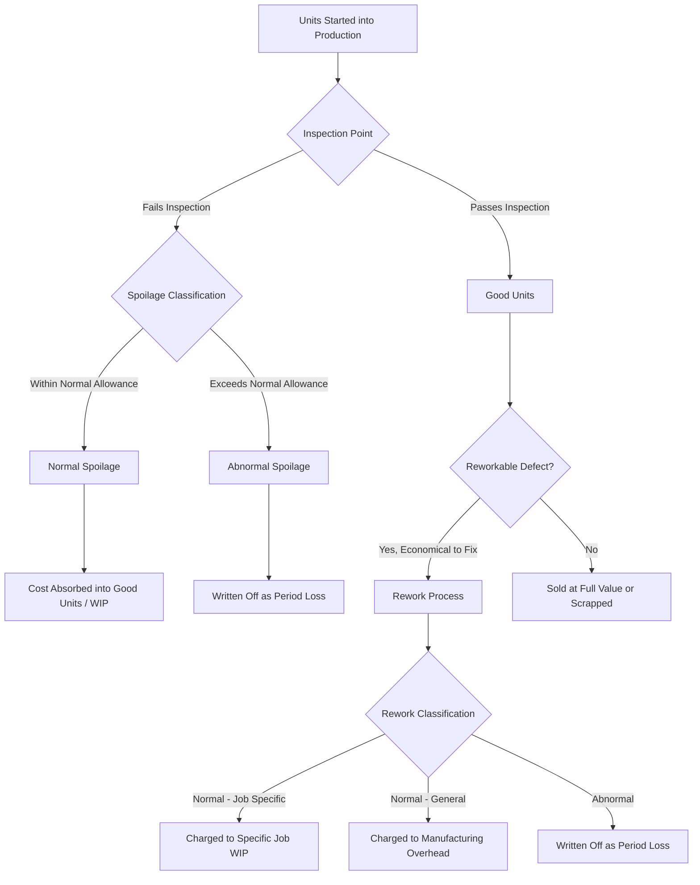

## Accounting for Spoilage, Waste, and Rework

### Overview

Spoilage, waste, and rework are byproducts of imperfect production processes that arise commonly in process costing environments (though they occur in job costing too). Each requires distinct accounting treatment because each represents a different economic event: units that fail inspection, material that disappears entirely, or defective units that are salvageable through additional work.

### Key Definitions

**Spoilage**

Units of production that do not meet quality specifications and are discarded or sold at reduced (disposal) value, rather than being reworked into good units.

**Waste**

Input material that is lost, evaporates, shrinks, or is a residual byproduct of the production process, with little or no recoverable value. Unlike spoilage, waste is not a discrete "unit" — it is typically measured in material terms (e.g., kilograms of sawdust, evaporated liquid).

**Rework**

Defective units that fail inspection but are subsequently repaired through additional material, labor, and overhead so that they can be sold as good units (either at full price or a reduced price).

### Normal vs. Abnormal Spoilage

This distinction is the central concept in spoilage accounting because it determines whether the cost is capitalized into inventory or expensed immediately.

**Normal Spoilage**

- Spoilage inherent to a particular production process, arising even under efficient operating conditions
- Expected and planned for, given the technology and processes currently used
- Cost is added to the cost of good units produced (i.e., "absorbed" by good output), because it is considered an unavoidable cost of producing those good units
- Typically expressed as a percentage of good units passing inspection (or of units started, depending on company policy)

**Abnormal Spoilage**

- Spoilage that is not expected to arise under efficient operating conditions
- Considered controllable and avoidable — usually a signal of inefficiency, equipment malfunction, or human error
- Cost is **not** included in inventory; it is written off as a period expense (typically a separate line item, "Loss from Abnormal Spoilage," on the income statement) so management can see the cost of inefficiency clearly
- Because it is deemed avoidable, capitalizing it into inventory would understate the inefficiency and overstate asset values

**Key Points**

- Only normal spoilage within the allowed tolerance is capitalized; any spoilage beyond the normal allowance is treated as abnormal, even if the cause seems similar
- The classification is a management/company policy decision, informed by historical experience and engineering standards, not a bright-line accounting rule
- Normal spoilage rates should be periodically reviewed — an outdated "normal" rate can mask deteriorating efficiency

### The Five-Step Process-Costing Framework with Spoilage

When spoilage is present, the standard five-step process-costing procedure (used with weighted-average or FIFO methods) is extended to explicitly account for spoiled units:

1. **Summarize the flow of physical units**, including spoiled units as a separate category
2. **Compute output in equivalent units**, including equivalent units for normal and abnormal spoilage (spoiled units are usually assumed to be 100% complete for the inspection point's relevant costs, since they've passed through that point)
3. **Compute cost per equivalent unit**
4. **Summarize total costs to account for**
5. **Assign total costs to:** units completed and transferred out, units in ending work-in-process, **normal spoilage (allocated to good units)**, and **abnormal spoilage (written off)**

### Inspection Points and Their Effect on Spoilage Costing

The **point of inspection** — where in the production process defective units are identified — determines how much cost has been incurred on the spoiled units and therefore how spoilage cost is calculated and allocated.

- If inspection occurs at the **end of the process**, spoiled units are assumed to be 100% complete for all cost elements (direct materials, conversion costs)
- If inspection occurs at an **intermediate point** (e.g., 50% through conversion), spoiled units are assigned equivalent units based on their degree of completion at that inspection point
- Normal spoilage costs are allocated **only to units that have passed the inspection point** (both units completed and transferred out, and units still in ending WIP that have passed inspection) — units in ending WIP that have not yet reached the inspection point should not absorb normal spoilage cost, since they haven't been "tested" yet

**Example**

A company inspects units at the 75% completion stage of conversion costs. During the period:

- 10,000 units started
- 8,000 units completed and transferred out
- 500 units spoiled (400 normal, 100 abnormal), identified at the 75% inspection point
- 1,500 units in ending WIP, 40% complete (has NOT yet reached the 75% inspection point)

Because ending WIP is only 40% complete — before the 75% inspection point — none of the normal spoilage cost is allocated to it. The full normal spoilage cost is allocated instead to the 8,000 completed units (the only units that have passed inspection this period).

### Weighted-Average vs. FIFO with Spoilage

**Weighted-Average Method**

- Beginning WIP costs are blended with current period costs
- Equivalent units for spoilage are computed using total units that reached the inspection point, without separating beginning-inventory layers

**FIFO Method**

- Beginning WIP units and costs are kept separate from current-period work
- Equivalent units for spoilage consider only the work done in the current period
- More precise for tracking whether spoilage arose from beginning WIP carried in from the prior period versus units started and inspected in the current period

**Key Points**

- The choice of method changes the *mechanics* of the equivalent-unit calculation for spoilage but does not change the underlying normal/abnormal classification logic
- In practice, differences between FIFO and weighted-average spoilage costing are usually small unless spoilage rates or costs fluctuate significantly period to period [Inference — magnitude depends on company-specific cost volatility]

### Accounting for Waste

Waste differs from spoilage in that it is typically a **continuous material loss** rather than discrete defective units.

- **Normal waste**: treated similarly to normal spoilage — absorbed into the cost of good production, often through a materials yield or shrinkage factor built into standard costs
- **Abnormal waste**: expensed as a period loss, similar to abnormal spoilage
- If waste has residual **scrap value** (e.g., metal shavings sold to a recycler), the accounting treatment depends on materiality:
  - **Immaterial scrap value**: recognized as other income when sold, or used to offset overhead costs, without complicating the job/process cost records
  - **Material scrap value**: tracked more rigorously, sometimes reducing the cost of materials or work-in-process to reflect the net cost of production

### Accounting for Rework

Rework accounting depends on whether the rework is normal or abnormal, and — in job costing environments — whether it is attributable to a specific job or is a general characteristic of the process.

**Normal Rework (attributable to a specific job)**

- Additional costs (materials, labor, overhead) charged directly to that specific job

**Normal Rework (common to all jobs / process)**

- Additional rework costs are charged to a manufacturing overhead control account and spread to all products/jobs through the overhead allocation rate, since the rework is considered a normal characteristic of the overall process rather than a specific job's failure

**Abnormal Rework**

- Considered avoidable and controllable
- Cost is written off as a period expense (a "Loss from Abnormal Rework" line), separate from inventoriable costs, so it's visible to management as an efficiency loss

**Example**

A furniture manufacturer reworks 200 chairs due to a paint defect at a cost of $15 per chair ($3,000 total).

- If this level of rework is expected and normal, and the defect isn't traceable to one specific batch: $3,000 is charged to manufacturing overhead and spread across all production
- If it's normal but traceable to a specific job (e.g., a rushed custom order that caused the defect): $3,000 is charged directly to that job
- If the defect resulted from a machine malfunction that is not typical: $3,000 is treated as abnormal rework and expensed immediately as a period loss

### Journal Entries — Illustrative Summary

**Normal spoilage (absorbed into cost of good units)**

No separate journal entry is needed beyond the normal WIP-to-Finished-Goods cost flow; the cost is simply not separated out — it stays embedded in the cost per equivalent unit assigned to good output.

**Abnormal spoilage (written off)**



```
Loss from Abnormal Spoilage      XXX
    Work-in-Process Inventory         XXX
```

**Rework — normal, job-specific**



```
Work-in-Process Inventory (Job #)   XXX
    Materials / Wages Payable / MOH Applied   XXX
```

**Rework — normal, common to all jobs**



```
Manufacturing Overhead Control      XXX
    Materials / Wages Payable / MOH Applied   XXX
```

**Rework — abnormal**



```
Loss from Abnormal Rework           XXX
    Materials / Wages Payable / MOH Applied   XXX
```

**Disposal/scrap value received on spoiled units**



```
Cash / Accounts Receivable          XXX
    Work-in-Process Inventory (or Loss from Abnormal Spoilage)   XXX
```

(The credit account depends on whether the spoilage being disposed of was classified as normal or abnormal — proceeds reduce the normal-spoilage cost pool or offset the abnormal loss.)

### Process Flow Diagram



### Disposal Value and Net Cost of Spoilage

When spoiled units have some resale/disposal value (scrap value), the **net cost of spoilage** is what matters for costing purposes:

$$\text{Net Cost of Spoilage} = \text{Total Cost Assigned to Spoiled Units} - \text{Disposal Value}$$

- For **normal spoilage**, the net cost (after subtracting disposal proceeds) is what gets absorbed into good unit costs
- For **abnormal spoilage**, the net cost (after subtracting disposal proceeds) is what gets expensed as the period loss

**Example**

400 units of normal spoilage carry a total cost of $4,000 (materials + conversion), and can be sold as scrap for $1 per unit ($400 total).

- Net cost of normal spoilage = $4,000 − $400 = $3,600
- This $3,600 is spread across the good units that passed inspection, increasing their unit cost
- The $400 disposal value is recorded as a reduction to WIP inventory (or as an increase to a Disposal Value Recovered account, per company policy)

### Cost Allocation Formula for Normal Spoilage

When normal spoilage cost must be allocated to units completed and transferred out and to qualifying ending WIP units (those that have passed the inspection point):

$$\text{Normal Spoilage Cost per Unit Allocated} = \frac{\text{Total Normal Spoilage Cost}}{\text{Units Completed} + \text{Ending WIP Units (Past Inspection Point)}}$$

This is typically done implicitly in the five-step method by including normal spoilage equivalent units in the denominator used to compute cost-per-equivalent-unit, then reallocating the calculated spoilage cost proportionally.

### Common Pitfalls

- **Conflating waste and spoilage**: waste generally has no discrete "units" and no separate inspection point in the same sense; treating waste like spoiled units can distort equivalent-unit calculations
- **Ignoring the inspection point when allocating normal spoilage cost to ending WIP**: allocating spoilage cost to WIP units that haven't yet reached inspection overstates their cost and misstates income
- **Treating all rework as normal**: management may be tempted to classify recurring rework as "normal" to avoid reporting a period loss, obscuring real operational problems [Inference — a judgment/incentive risk noted in managerial accounting practice, not a specific documented case]
- **Failing to update the normal spoilage rate** as process improvements reduce inherent defect rates, causing genuinely avoidable spoilage to be miscategorized as normal

### Managerial Implications

- Because abnormal spoilage and rework are visible as separate period losses, they provide management with a direct signal of production inefficiency, supporting root-cause investigation and continuous improvement initiatives
- Normal spoilage rates function as informal benchmarks; a rising trend (even while staying under the "normal" ceiling) may indicate emerging quality issues before they cross into abnormal territory
- Rework costing decisions (job-specific vs. general overhead) affect job profitability reporting — misclassifying job-specific rework as general overhead can hide which specific customers/jobs are actually most costly to serve

**Related Topics**

- Job Costing and Spoilage in Job-Order Environments
- Standard Costing and Variance Analysis for Scrap and Waste
- Equivalent Units of Production (FIFO vs. Weighted-Average)
- Quality Costing (Prevention, Appraisal, Internal Failure, External Failure Costs)
- Cost Allocation at Multiple Inspection Points
- By-Product and Joint Product Costing