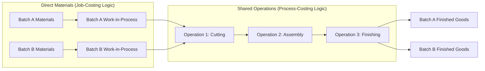

## Hybrid and Operation Costing

### Overview

Hybrid costing systems (also called **operation costing**) combine features of both job-order costing and process costing. They are used when products share common characteristics and pass through standardized processes, but also incorporate distinct, customized components or specifications — meaning neither a pure job-costing nor a pure process-costing system fits the production reality well.

### Why Hybrid Systems Exist

- **Pure job costing** fits environments where each unit or batch is unique and costs must be traced individually (e.g., custom furniture, construction projects, consulting engagements)
- **Pure process costing** fits environments where mass-produced, homogeneous units flow continuously through identical processes (e.g., chemicals, oil refining, cement)
- Many real production environments fall **between these extremes**: products are batched and processed in standardized ways for some steps, but customized for others — most commonly seen in **batch manufacturing** of variant products (e.g., different sizes, colors, or models of an otherwise similar item)

**Key Points**

- Hybrid/operation costing is not a single rigid method — it is a category of costing approaches tailored to fit a specific hybrid production environment
- The design of the system depends on where in the production process customization occurs and where standardization occurs

### Core Concept: Operations

An **operation** is a standardized method or technique that is performed repetitively, often on different materials, producing different finished goods. Products are grouped into **batches**, and each batch may require a different combination of operations, but any single operation is performed the same way for every batch passing through it.

**Example**

A shoe manufacturer produces both canvas sneakers and leather boots. Both product lines pass through a common "cutting" operation and a common "sole-attachment" operation, but only leather boots go through an additional "leather-tanning-finish" operation. Sneakers use canvas materials; boots use leather materials. This is a classic hybrid/operation-costing scenario:

- **Materials** are traced to specific batches (like job costing) because canvas and leather costs differ significantly by product line
- **Conversion costs** (labor and overhead for cutting, sole-attachment) are assigned using process-costing logic (an average cost per unit passing through each operation) because the operations are performed identically regardless of which product batch passes through

### Costing Mechanics in Operation Costing

**Direct Materials**

- Traced directly to each batch or job, exactly as in job-order costing
- Different batches often use different types or quantities of materials, so materials cost cannot be averaged across dissimilar batches without distorting product costs

**Conversion Costs (Direct Labor + Manufacturing Overhead)**

- Accumulated by **operation** (or department) and assigned using process-costing logic — an average conversion cost per unit is computed for each operation, based on units (or equivalent units) passing through it
- All batches passing through a given operation absorb the same per-unit conversion cost, **regardless of which specific batch or product variant they belong to**, because the operation itself does not vary in how it is performed

**Formula for conversion cost assignment within an operation:**

$$\text{Conversion Cost per Unit (Operation)} = \frac{\text{Total Conversion Costs Incurred in Operation}}{\text{Total Equivalent Units Passing Through Operation}}$$

Each batch's total product cost is then:

$$\text{Total Batch Cost} = \text{Direct Materials Traced to Batch} + \sum (\text{Conversion Cost per Unit} \times \text{Units in Batch, for each operation used})$$

### Worked Example

A furniture company produces two chair models — Model A (wood frame, fabric seat) and Model B (wood frame, leather seat) — using a shared "frame assembly" operation and a shared "finishing" operation, but distinct upholstery materials.

**Given:**

- Frame assembly operation: total conversion cost $60,000; 3,000 total units (both models) pass through
- Finishing operation: total conversion cost $45,000; 3,000 total units pass through
- Model A: 2,000 units; direct materials (wood + fabric) = $16 per unit
- Model B: 1,000 units; direct materials (wood + leather) = $28 per unit

**Step 1 — Compute conversion cost per unit for each operation:**

$$\text{Frame Assembly Rate} = \frac{\$60{,}000}{3{,}000} = \$20 \text{ per unit}$$


$$\text{Finishing Rate} = \frac{\$45{,}000}{3{,}000} = \$15 \text{ per unit}$$

**Step 2 — Assign total cost per unit, by model:**

| Cost Component | Model A (per unit) | Model B (per unit) |
| --- | --- | --- |
| Direct Materials | $16 | $28 |
| Frame Assembly Conversion | $20 | $20 |
| Finishing Conversion | $15 | $15 |
| **Total Cost per Unit** | **$51** | **$63** |

**Step 3 — Total batch costs:**

- Model A: 2,000 units × $51 = $102,000
- Model B: 1,000 units × $63 = $63,000

Notice that both models absorb the **same** conversion cost per unit ($20 + $15 = $35), since both pass through the same operations identically, but their **materials** cost differs, reflecting the customization in inputs.

### Comparison Table: Job Costing vs. Process Costing vs. Operation Costing

| Feature | Job Costing | Operation (Hybrid) Costing | Process Costing |
| --- | --- | --- | --- |
| Product homogeneity | Unique, customized units | Batches of variant products sharing common operations | Homogeneous, mass-produced units |
| Direct materials | Traced to specific job | Traced to specific batch | Averaged across all units (equivalent units) |
| Conversion costs | Traced/applied to specific job | Averaged per operation, applied across batches | Averaged across all units in a department |
| Cost accumulation document | Job cost sheet | Combination: job cost sheet for materials + operation cost record for conversion | Department production cost report |
| Typical industries | Construction, consulting, custom manufacturing | Apparel, footwear, electronics assembly, food processing with variants | Chemicals, petroleum, cement, paper |

### Flow of Costs Diagram



### Recording Transactions in an Operation-Costing System

Journal entries mirror a blend of job-order and process-costing entries:

**Materials requisitioned to a specific batch (job-costing style)**



```
Work-in-Process — Batch A     XXX
    Materials Inventory              XXX
```

**Conversion costs applied by operation (process-costing style)**



```
Work-in-Process — Batch A     XXX
Work-in-Process — Batch B     XXX
    Conversion Costs Applied         XXX
```

(The amount applied to each batch = operation's per-unit conversion rate × number of units in that batch passing through the operation.)

**Transfer between operations**



```
Work-in-Process — Operation 2    XXX
    Work-in-Process — Operation 1     XXX
```

**Completion and transfer to finished goods**



```
Finished Goods Inventory — Batch A    XXX
    Work-in-Process — Batch A               XXX
```

### When to Use Operation Costing

**Key Points**

- Appropriate when products are manufactured in batches, and the batches differ mainly in **materials/components** rather than in the **process/technique** applied
- Common in industries such as textiles and apparel (different fabrics, same stitching/cutting operations), footwear, consumer electronics assembly (different components, same assembly line), and certain food-processing settings (different flavors/recipes, same mixing/packaging line)
- Provides more accurate product costing than pure process costing (which would incorrectly average materials cost across dissimilar products) while avoiding the excessive administrative burden of tracing conversion costs to each unique batch individually, as pure job costing would require

### Advantages and Limitations

**Advantages**

- Reduces recordkeeping cost compared to full job costing, since conversion costs are pooled by operation rather than tracked per batch
- Improves costing accuracy compared to pure process costing, since materials — often the most variable cost component across product variants — are traced specifically
- Aligns cost accounting with the actual production flow, making cost reports more intuitive for operations managers organized around operations/workstations

**Limitations**

- Requires careful operation definition; if operations are too broadly or too narrowly defined, the averaging of conversion costs can still distort individual batch costs
- Assumes conversion cost consumption is genuinely uniform per unit within an operation — if certain batches actually require more machine time or labor effort within the "same" operation (e.g., due to complexity differences), the flat per-unit rate misrepresents actual resource consumption [Inference — a recognized theoretical limitation of any averaging-based allocation, not tied to a specific dataset]
- Still requires equivalent-unit calculations if batches are not fully complete at period-end, adding the complexity of process costing on top of job-costing-style materials tracing

### Common Pitfalls

- Misclassifying a cost as "operation-level conversion cost" when it actually varies significantly by batch (should instead be traced directly, job-costing style)
- Failing to recompute the per-unit operation rate when the batch mix changes significantly, leading to stale or distorted rates
- Overlooking equivalent-unit adjustments for partially completed batches within an operation at period-end, which can materially misstate WIP valuation

### Managerial Implications

- Operation costing supports environments where firms want the **cost accuracy benefits of materials tracing** without the **administrative cost of full job costing** for the conversion process
- Because conversion costs are pooled by operation, this system naturally supports operation-level performance evaluation (e.g., cost per unit in the "cutting" operation over time), useful for identifying efficiency trends at a granular process level
- Supports pricing decisions for variant products by ensuring materials cost differences are reflected in reported product cost, avoiding cross-subsidization between high-cost-material and low-cost-material variants that a pure process-costing average would create

**Related Topics**

- Job-Order Costing Fundamentals
- Process Costing and Equivalent Units of Production
- Activity-Based Costing (ABC) as an Alternative Refinement
- Batch-Level Costing in Cost Hierarchies
- Standard Costing within Operation Costing Systems
- Backflush Costing in Just-in-Time (JIT) Environments