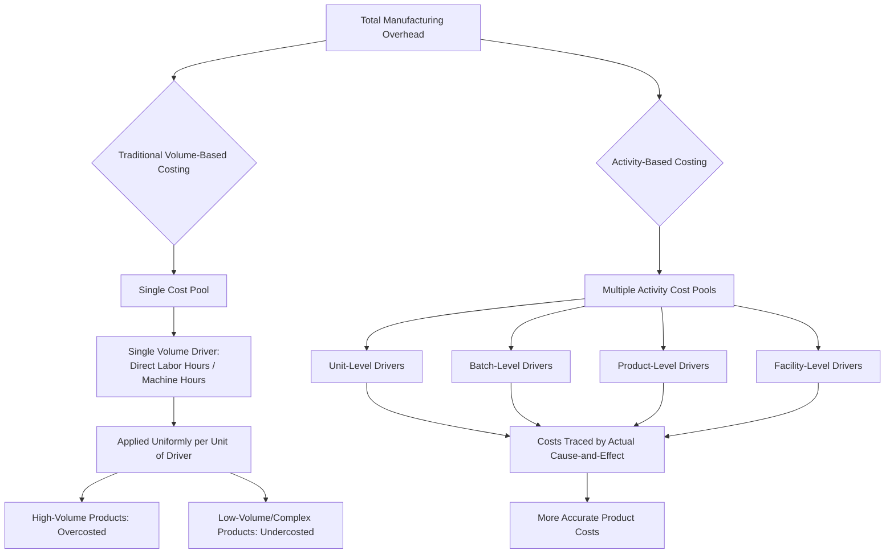

## Limitations of Traditional Volume-Based Costing

### Overview

Traditional volume-based costing (also called conventional or traditional absorption costing) allocates manufacturing overhead to products using a single, volume-related cost driver — typically direct labor hours, direct labor cost, or machine hours. This approach was designed for manufacturing environments dominated by direct labor and simple product lines. As production environments have grown more complex, this method has revealed systematic weaknesses that distort product costs and misinform managerial decisions.

### Core Mechanism (Why the Limitations Arise)

Traditional costing applies overhead using a single predetermined overhead rate:

$$\text{Predetermined Overhead Rate} = \frac{\text{Total Estimated Overhead Costs}}{\text{Total Estimated Volume-Based Driver}}$$

Overhead assigned to a product is then:

$$\text{Overhead Applied} = \text{Predetermined Overhead Rate} \times \text{Actual Driver Units Consumed}$$

Because the denominator is a single volume-related measure, the method implicitly assumes **all overhead costs vary in proportion to production volume**. This assumption is the root cause of nearly every limitation discussed below.

### 1. Assumes Overhead Is Driven Only by Volume

**Key Points**

- Traditional costing lumps together costs with fundamentally different behavior patterns: unit-level, batch-level, product-level, and facility-level costs.
- Only unit-level costs (e.g., direct material handling per unit) genuinely correlate with production volume.
- Batch-level costs (setups, inspections, material ordering) vary with the *number of batches*, not units produced.
- Product-level costs (engineering changes, design maintenance) vary with the *number of distinct products*, not volume.
- Facility-level costs (plant depreciation, security) support the organization as a whole and are not caused by any specific product.

**Example**

A machine setup costs $500 regardless of whether the batch produced is 100 units or 10,000 units. Under a volume-based system using machine hours, a low-volume product run in small batches absorbs *less* setup cost than it actually causes, while a high-volume product absorbs *more* than it causes.

### 2. Product Cost Distortion — Undercosting and Overcosting

**Key Points**

- High-volume, simple products tend to be **overcosted**, because they absorb a disproportionate share of overhead simply due to consuming more of the volume-based driver.
- Low-volume, complex/customized products tend to be **undercosted**, because they consume disproportionate batch-level and product-level resources (setups, engineering support, special handling) that the volume-based driver fails to capture.
- This is known as the **cross-subsidization problem**: high-volume products subsidize the true cost of low-volume products.

**Illustrative Comparison**

| Factor | High-Volume Standard Product | Low-Volume Custom Product |
| --- | --- | --- |
| Units produced | 50,000 | 500 |
| Setups required | 5 | 20 |
| Engineering hours | Low | High |
| Overhead allocated (traditional, by labor hours) | High (overstated) | Low (understated) |
| True overhead consumption | Lower per unit | Higher per unit |

[Inference] The direction and magnitude of distortion depends on the specific cost structure and driver mix of a given firm; the pattern above reflects the general tendency documented in cost accounting literature rather than a universal rule for every company.

### 3. Ignores Product Diversity and Complexity

**Key Points**

- Modern manufacturers often produce multiple products with varying volumes, batch sizes, and complexity levels on shared production lines.
- Traditional costing cannot distinguish between a simple, high-volume product and a complex, low-volume product if both consume similar volume-based driver hours.
- Complexity drivers — number of components, number of engineering changes, number of customer specifications — are invisible to a single-driver system.

### 4. Growing Overhead, Shrinking Direct Labor Base

**Key Points**

- Traditional systems evolved when direct labor was the dominant cost and a reliable proxy for overhead consumption.
- Automation, technology investment, and outsourcing have shrunk direct labor's share of total cost while overhead (depreciation on automated equipment, IT systems, quality control, logistics) has grown substantially.
- Allocating a large, heterogeneous overhead pool using a small, shrinking labor base produces increasingly arbitrary and unreliable per-unit overhead rates.

$$\text{Overhead Rate} = \frac{\text{Overhead (large and growing)}}{\text{Direct Labor Hours (small and shrinking)}}$$

As the denominator shrinks and the numerator grows, small errors or shifts in labor hours cause disproportionately large swings in the overhead rate, amplifying distortion.

### 5. Encourages Poor Managerial Decisions

**Key Points**

- **Mispriced products**: Overcosted products may be priced too high, losing competitive bids; undercosted products may be priced too low, silently eroding margins.
- **Flawed product mix decisions**: Managers may drop seemingly "unprofitable" high-volume products (which are actually profitable but overcosted) and expand "profitable" low-volume products (which are actually loss-making but undercosted).
- **Misleading make-or-buy and outsourcing decisions**: Distorted costs can make in-house production of a complex part look more expensive than it truly is, prompting unnecessary outsourcing, or vice versa.
- **Poor performance evaluation**: Managers of product lines with disproportionate overhead allocation may be unfairly judged as underperforming or overperforming.

### 6. Lack of Traceability and Transparency

**Key Points**

- A single overhead rate obscures *why* overhead was incurred, offering no diagnostic insight into which activities actually drive cost.
- Managers cannot see which specific processes (setups, inspections, order processing) are consuming resources, limiting their ability to manage or reduce those costs.
- This opacity conflicts with continuous improvement and cost management initiatives that require activity-level visibility.

### 7. Inappropriate for Service and Support Cost Allocation

**Key Points**

- Traditional costing was designed for factory floor manufacturing overhead and does not extend well to support department costs (customer service, order processing, quality assurance, procurement).
- These support costs are often driven by transaction counts, number of customers, or number of orders — not by production volume — making volume-based allocation especially inappropriate here.

### 8. Batch-Size and Setup Cost Distortion (Detailed Case)

**Example**

| Product | Annual Volume | Batch Size | # Batches | Machine Hours/Unit | Setup Cost/Batch |
| --- | --- | --- | --- | --- | --- |
| A (Standard) | 20,000 | 1,000 | 20 | 1.0 | $1,000 |
| B (Custom) | 2,000 | 100 | 20 | 1.0 | $1,000 |

Under traditional costing (machine hours as the driver):

- Product A: 20,000 machine hours → absorbs 10x the overhead of Product B
- Product B: 2,000 machine hours → absorbs 1/10th the overhead of Product A

But both products require the **same number of setups (20)** and therefore cause **identical total setup cost ($20,000 each)**. Traditional costing assigns Product A ten times more setup cost than Product B, even though they consume setup resources equally — a direct illustration of how batch-level costs get distorted when spread by volume.

### 9. Why This Matters: The Case for Activity-Based Costing (ABC)

**Key Points**

- These limitations are the primary motivation for Activity-Based Costing, which assigns overhead based on multiple activity cost pools and cost drivers that reflect actual cause-and-effect relationships (unit-, batch-, product-, and facility-level).
- ABC does not eliminate allocation (facility-level costs are still allocated somewhat arbitrarily) but substantially reduces distortion for batch- and product-level costs.
- The decision to adopt ABC involves a cost-benefit tradeoff: ABC systems are more expensive to design and maintain, so they are most beneficial when overhead is large, product diversity is high, and competition punishes cost distortion (e.g., through lost bids on overcosted products).

### Visual Summary: Volume-Based vs. Activity-Based Allocation Logic

### Conclusion

Traditional volume-based costing's core weakness is its assumption that a single volume-related measure adequately explains all overhead consumption. In reality, overhead costs arise from a hierarchy of activities — units, batches, products, and facility support — many of which have no direct relationship to production volume. This mismatch produces systematic cost distortion (overcosting high-volume/simple products, undercosting low-volume/complex products), obscures the true drivers of cost, and can lead managers into flawed pricing, product mix, and outsourcing decisions. These shortcomings directly motivate the shift toward Activity-Based Costing.

**Next Steps**

- Activity-Based Costing (ABC): Overview and Design Principles
- Identifying Activity Cost Pools and Cost Drivers
- Unit-, Batch-, Product-, and Facility-Level Cost Hierarchy
- Comparing Traditional Costing vs. ABC: Numerical Case Study
- Activity-Based Management (ABM) and Process Improvement
- Time-Driven Activity-Based Costing (TDABC)
- Cost-Benefit Considerations in Adopting ABC