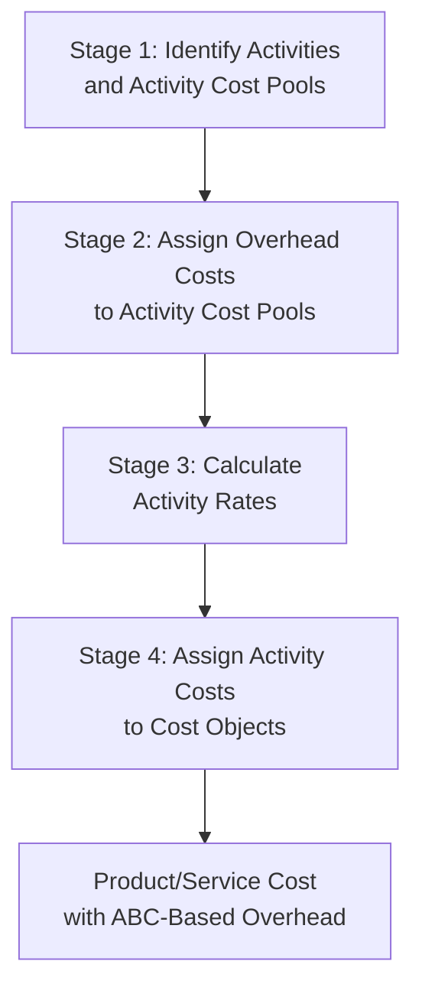
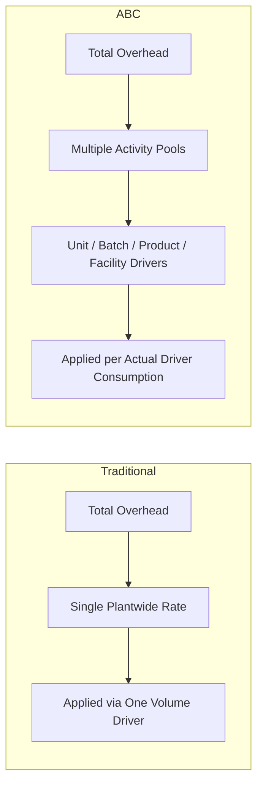

## Designing an Activity-Based Costing System

### Overview

Designing an Activity-Based Costing (ABC) system is a structured, multi-stage process that replaces a single volume-based overhead rate with multiple activity cost pools, each assigned to products using a cost driver that reflects genuine cause-and-effect resource consumption. The design process moves from identifying activities, through tracing costs to those activities, to selecting drivers and computing activity rates, and finally to assigning costs to cost objects (products, services, or customers).

### The Four-Stage ABC Design Process

### Stage 1: Identify Activities and Activity Cost Pools

**Key Points**

- An **activity** is any discrete task or process that consumes resources (e.g., machine setup, purchase order processing, quality inspection, product design).
- Activities are grouped into **activity cost pools** — collections of individual costs associated with a single activity measure.
- Activities are typically classified using the **cost hierarchy**:
  - **Unit-level**: performed each time a unit is produced (e.g., direct machining per unit)
  - **Batch-level**: performed each time a batch is processed (e.g., setups, purchase orders, inspections)
  - **Product-level (product-sustaining)**: performed to support a specific product line regardless of units/batches (e.g., engineering changes, maintaining a bill of materials)
  - **Facility-level (facility-sustaining)**: performed to support the overall production process (e.g., plant management, building depreciation, security)
- Practical guidance: limit the number of activity pools to a manageable set (commonly 5–15 in practice) — too many pools raises design/maintenance cost without proportional accuracy gains; too few reintroduces volume-based-style distortion.

**Example**

| Activity | Cost Hierarchy Level | Typical Cost Driver |
| --- | --- | --- |
| Machine operation | Unit-level | Machine hours |
| Setups | Batch-level | Number of setups |
| Purchase order processing | Batch-level | Number of purchase orders |
| Quality inspections | Batch-level | Number of inspections |
| Engineering changes | Product-level | Number of engineering change orders |
| Product design maintenance | Product-level | Number of active products |
| Plant management/security | Facility-level | Not allocated to products, or allocated arbitrarily |

### Stage 2: Assign Overhead Costs to Activity Cost Pools

**Key Points**

- Costs are traced to activity pools using **first-stage allocation**, based on interviews, time studies, surveys, or direct tracing where possible.
- Common technique: employees estimate the percentage of time/resources spent on each activity (used heavily in Time-Driven ABC as well).
- Costs that cannot be traced to any activity in a cause-and-effect manner (e.g., general facility depreciation) remain in an **"organization-sustaining" or unallocated pool** — under ABC's theoretically pure form, these are *not* assigned to products, since assigning them would reintroduce arbitrary allocation.

**Example**

A company estimates the percentage of total indirect labor and overhead cost attributable to each activity via an internal survey:

| Cost Category | Setups (%) | Purchase Orders (%) | Inspections (%) | Facility (%) | Total |
| --- | --- | --- | --- | --- | --- |
| Indirect labor ($400,000) | 30% | 25% | 20% | 25% | 100% |
| Factory overhead ($200,000) | 20% | 10% | 15% | 55% | 100% |

Amounts are then computed by multiplying each percentage against the total cost category and summing across categories to build each activity cost pool total.

### Stage 3: Calculate Activity Rates

**Key Points**

- For each activity cost pool, an **activity rate** is computed by dividing the pool's total cost by the total quantity of its cost driver, i.e., $\text{Activity Rate} = \dfrac{\text{Total Activity Cost Pool}}{\text{Total Driver Quantity}}$

**Example**

| Activity Cost Pool | Total Cost | Total Driver Quantity | Activity Rate |
| --- | --- | --- | --- |
| Setups | $160,000 | 400 setups | $400 per setup |
| Purchase order processing | $70,000 | 1,000 orders | $70 per order |
| Inspections | $110,000 | 2,200 inspections | $50 per inspection |

### Stage 4: Assign Activity Costs to Cost Objects

**Key Points**

- Each product (or other cost object) is assigned overhead based on its **actual consumption of each activity driver**, multiplied by the corresponding activity rate.
- Formula: $\text{Overhead Assigned} = \sum_i (\text{Activity Rate}_i \times \text{Driver Quantity Consumed by Product}_i)$
- Unit-level costs are then divided by units produced to get overhead cost per unit; batch- and product-level costs are typically better analyzed on a total or per-batch basis rather than force-averaged per unit, to avoid reintroducing the distortion ABC was designed to eliminate.

**Example**

Product X requires 15 setups, 40 purchase orders, and 80 inspections, and produces 3,000 units:

$$\text{Overhead} = (15 \times \$400) + (40 \times \$70) + (80 \times \$50) = \$6{,}000 + \$2{,}800 + \$4{,}000 = \$12{,}800$$

$$\text{Overhead per Unit} = \frac{\$12{,}800}{3{,}000} \approx \$4.27 \text{ per unit}$$

### Selecting Cost Drivers

**Key Points**

- A good cost driver satisfies three criteria:
  1. **Causal relationship** — the driver plausibly causes the cost (not merely correlated with it)
  2. **Measurability** — data on driver consumption is reasonably available or collectible
  3. **Behavioral effects** — the driver should encourage desirable managerial behavior (e.g., a driver that discourages unnecessary setups or excessive inspections)
- Drivers are typically categorized as:
  - **Transaction drivers**: count of times an activity occurs (e.g., number of setups) — simplest but least precise if activities vary in complexity/duration
  - **Duration drivers**: time required to perform an activity (e.g., setup hours) — more accurate, more costly to measure
  - **Intensity drivers**: direct charge for actual resources used each time an activity is performed — most accurate, most expensive to implement

### System Design Considerations and Tradeoffs

**Key Points**

- **Cost-benefit tradeoff**: designing and maintaining an ABC system requires investment in data collection (time studies, transaction tracking systems) — most beneficial when overhead is large, products are diverse, and competitive pricing pressure punishes cost distortion.
- **Behavioral/organizational buy-in**: employees providing time/activity estimates may face incentives to misstate data (e.g., self-preservation from cost-cutting); management should design data collection to minimize this bias.
- **Data granularity vs. maintenance cost**: more activity pools and drivers increase accuracy but raise the cost and complexity of updating the system as operations change.
- **Integration with existing systems**: ERP and manufacturing execution systems (MES) can automate data capture for drivers like machine hours, number of orders, and number of inspections, reducing ongoing survey-based data collection.
- **Periodic review**: activity rates and driver relationships should be revisited periodically (e.g., annually) as processes, technology, and product mix evolve; stale ABC data can reintroduce the very distortions ABC was designed to correct.

### Traditional Costing vs. ABC Design: Structural Comparison

### Common Pitfalls in ABC System Design

**Key Points**

- Selecting too many or too few activities, undermining either usability or accuracy
- Using survey-based time estimates that sum to 100% of capacity (ignoring idle/unused capacity) — a limitation directly addressed by Time-Driven ABC
- Allocating facility-sustaining costs to products anyway, reintroducing arbitrary allocation and blending ABC's precision with traditional-style distortion
- Failing to update activity rates as processes change, causing "rate drift" and stale product costs
- Treating ABC implementation as a one-time project rather than an ongoing system requiring maintenance

### Conclusion

Designing an ABC system requires methodically identifying activities across the cost hierarchy, tracing overhead costs to those activities, computing driver-based activity rates, and assigning costs to products based on actual consumption. The result is a more accurate, transparent view of product profitability than volume-based costing provides — at the cost of greater implementation and maintenance effort. Success depends on selecting the right number and type of cost drivers, securing reliable data, and committing to ongoing system maintenance.

**Next Steps**

- Time-Driven Activity-Based Costing (TDABC): Simplifying Data Collection
- Activity-Based Management (ABM): Using ABC Data for Process Improvement
- Calculating and Interpreting Activity Rates: Extended Numerical Examples
- ABC in Service Industries vs. Manufacturing
- Customer Profitability Analysis Using ABC
- Capacity Cost Management and Unused Capacity in ABC