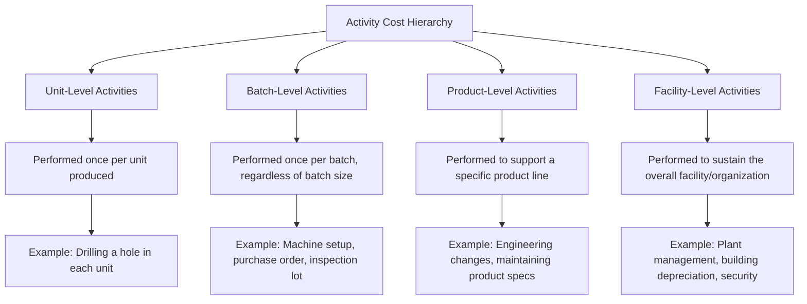

## Identifying Activities and Cost Pools

### Overview

Identifying activities and grouping them into activity cost pools is the foundational first stage of designing an Activity-Based Costing system. This stage determines how precisely overhead costs will ultimately be traced to products, so the quality of activity identification directly bounds the accuracy of the entire ABC system.

### What Is an Activity?

**Key Points**

- An **activity** is a specific task, action, or unit of work performed within an organization that consumes resources (labor, equipment, supplies) and, in turn, is consumed by products, services, or customers.
- Activities describe *what people and equipment do*, not the resources themselves — "processing purchase orders" is an activity; "indirect labor" is a resource consumed by that activity.
- Activities are typically identified through:
  - Interviews with department supervisors and employees
  - Direct observation of work processes
  - Review of process documentation, job descriptions, and workflow diagrams
  - Time-and-motion studies

### The Cost Hierarchy: Classifying Activities

Activities are classified into four levels based on what causes them to be performed. This hierarchy is central to why ABC corrects the distortions of volume-based costing.

**Key Points**

- **Unit-level activities**: consumed in direct proportion to the number of units produced. Cost varies with volume. *(e.g., direct machining, direct material handling per unit)*
- **Batch-level activities**: performed once for each batch or production run, regardless of how many units are in the batch. Cost varies with the *number of batches*, not units. *(e.g., setups, material movement between processes, quality inspections performed per batch)*
- **Product-level (product-sustaining) activities**: performed to support the existence of a distinct product line, independent of units or batches produced. *(e.g., product design, engineering change orders, maintaining bills of materials)*
- **Facility-level (facility-sustaining) activities**: support the general operation of the plant or organization as a whole and cannot be causally traced to any specific product. *(e.g., plant management salaries, property taxes, general building depreciation)*

**Example**

| Activity | Hierarchy Level | Why |
| --- | --- | --- |
| Cutting fabric for each garment | Unit-level | Occurs once per unit produced |
| Setting up the cutting machine for a new fabric batch | Batch-level | Occurs once per batch, regardless of batch size |
| Updating a garment's technical spec sheet | Product-level | Supports a specific product line, not tied to volume or batches |
| Plant security and grounds maintenance | Facility-level | Supports the whole facility, not traceable to any product |

### Building Activity Cost Pools

**Key Points**

- An **activity cost pool** is an aggregation of all the costs associated with performing a particular activity across the organization.
- Individual costs (indirect labor, indirect materials, utilities, depreciation on equipment used for that activity) are combined into a single pool if they are driven by the same underlying activity.
- Activities with the same cost driver and similar cost behavior can be **combined into a single pool** to reduce system complexity, provided this does not sacrifice meaningful accuracy — this is a key practical simplification step.
- Conversely, activities that appear similar on the surface but have genuinely different cost drivers should be **kept separate** (e.g., "inspecting incoming materials" vs. "inspecting finished goods" may warrant separate pools if driven by different factors).

**Example: Consolidating Related Activities**

A company initially identifies these granular activities in its receiving department:

- Unloading trucks
- Verifying shipment quantities
- Entering receiving data into the system
- Routing materials to storage

**Key Points**

- If all four activities are driven by the same underlying event (a "receiving transaction") and consumed similarly by all products, they can reasonably be consolidated into a single **"Material Receiving"** activity cost pool, using *number of shipments received* as the common driver.
- This reduces the system from four separate tracking efforts to one, without a material loss of accuracy — illustrating the cost-benefit judgment inherent in ABC design.

### Practical Framework for Identifying Activities

**Key Points**

1. **Interview process owners**: Ask employees and supervisors to describe what they do and estimate the proportion of time/resources spent on each task.
2. **List all significant activities**: Compile a comprehensive list before attempting to consolidate — starting broad avoids prematurely omitting a cost driver.
3. **Classify each activity by hierarchy level**: Assign unit/batch/product/facility classification to clarify true cost behavior.
4. **Evaluate materiality**: Activities consuming a small percentage of total overhead may be combined into a general/miscellaneous pool rather than tracked individually — the benefit of separate tracking must exceed its cost.
5. **Consolidate similar activities**: Combine activities sharing a common, plausible cost driver into a single pool.
6. **Assign a cost driver to each remaining pool**: Each finalized activity cost pool needs one measurable driver that reflects genuine consumption (covered in depth in "Designing an Activity-Based Costing System").

### Example: A Manufacturing Company's Activity List

| Department | Identified Activity | Hierarchy Level | Candidate Pool |
| --- | --- | --- | --- |
| Production | Machine operation | Unit-level | Machining |
| Production | Machine setup for new batch | Batch-level | Setups |
| Materials | Receiving incoming shipments | Batch-level | Material Receiving |
| Materials | Issuing materials to production | Batch-level | Material Handling |
| Quality | Inspecting finished batches | Batch-level | Quality Inspection |
| Engineering | Processing engineering change orders | Product-level | Product Engineering |
| Administration | Plant management and administration | Facility-level | Facility Support (often unallocated) |

### Facility-Level Activities: A Special Case

**Key Points**

- Facility-level costs pose a design decision: under a theoretically pure ABC model, these costs are **not allocated** to individual products because no causal driver connects them to specific products — allocating them would reintroduce the arbitrary assignment ABC seeks to eliminate.
- In practice, many organizations still allocate facility-level costs (e.g., using square footage or total units) for external financial reporting purposes (full absorption costing under GAAP/IFRS), while excluding them from internal decision-making analyses.
- [Inference] Whether a given firm allocates facility-level costs to products in its internal ABC reports is a policy choice that varies by organization and reporting purpose, rather than a fixed rule of ABC methodology itself.

### Common Pitfalls in Activity Identification

**Key Points**

- **Over-granularity**: listing every minor task separately creates an unwieldy system with excessive data collection costs relative to the accuracy gained.
- **Under-granularity**: combining activities with genuinely different cost drivers into one pool reintroduces the distortion ABC is meant to fix.
- **Ignoring product-level activities**: focusing only on unit- and batch-level activities while omitting engineering/design support costs understates the true cost of product complexity.
- **Static activity lists**: activities and their relative significance change as processes evolve (automation, outsourcing, new product lines); activity lists should be periodically revisited.

### Conclusion

Identifying activities and cost pools requires classifying organizational work into the unit-, batch-, product-, and facility-level hierarchy, then aggregating related costs into cost pools that share a common, measurable driver. This step determines the diagnostic power of the entire ABC system: activities that are too coarse reintroduce volume-based distortion, while activities that are too granular create unsustainable data collection burdens. The goal is a balanced set of activity cost pools that meaningfully reflects how resources are actually consumed.

**Related Topics**

- Cost Hierarchy: Unit, Batch, Product, and Facility-Level Costs (Deep Dive)
- Selecting and Evaluating Cost Drivers
- First-Stage vs. Second-Stage Cost Allocation in ABC
- Time-Driven Activity-Based Costing (TDABC) as a Data Collection Alternative
- Activity Dictionaries and Process Mapping Techniques