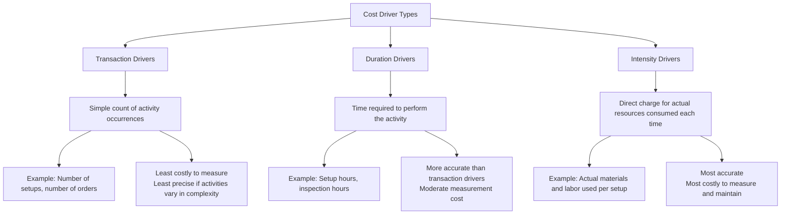

## Selecting Activity Cost Drivers

### Overview

Selecting activity cost drivers is the process of choosing a measurable factor for each activity cost pool that reflects how products, services, or customers actually consume that activity's resources. This selection determines how accurately ABC traces overhead to cost objects, making it one of the most consequential design decisions in the entire ABC system.

### What Is a Cost Driver?

**Key Points**

- A **cost driver** is a factor that causes, or is closely associated with, the incurrence of cost in an activity.
- In ABC terminology, a distinction is often drawn between a **resource driver** (used in Stage 2: allocating resource costs to activity pools) and an **activity driver** (used in Stage 4: allocating activity pool costs to products) — this section focuses on activity drivers.
- The activity driver becomes the basis for computing the **activity rate**:

$$\text{Activity Rate} = \frac{\text{Total Cost of Activity Pool}}{\text{Total Quantity of Cost Driver}}$$

### Criteria for Selecting a Good Cost Driver

**Key Points**

1. **Causal (cause-and-effect) relationship**: the driver should have a plausible, direct link to why the cost is incurred — correlation alone is insufficient. A driver chosen purely because data is available, without a causal link, can reproduce the very distortions ABC intends to fix.
2. **Measurability and data availability**: the organization must be able to reliably measure and track driver quantities per cost object, ideally through existing systems (ERP, MES, time-tracking).
3. **Cost of measurement**: highly precise drivers (e.g., actual time logged per transaction) may be more accurate but more expensive to collect than simpler count-based drivers — the benefit of increased accuracy must be weighed against the incremental measurement cost.
4. **Behavioral consequences**: a well-chosen driver can encourage managers to reduce non-value-added activity (e.g., a "number of setups" driver incentivizes batch-size optimization and setup reduction), while a poorly chosen driver can create perverse incentives.

### Types of Cost Drivers

**Key Points**

- **Transaction drivers** (event counts): the simplest and least expensive to implement, but assume every occurrence of the activity consumes roughly the same resources. Appropriate when activity instances are relatively homogeneous.
- **Duration drivers** (time-based): capture the fact that some instances of an activity take longer than others (e.g., a complex setup vs. a simple one), improving accuracy over a flat transaction count.
- **Intensity (direct charging) drivers**: the most granular — resources are charged based on actual usage each time the activity occurs, similar to a work-order costing approach. Reserved for high-value or highly variable activities where precision materially affects decisions.

**Example**

| Activity | Transaction Driver | Duration Driver | Intensity Driver |
| --- | --- | --- | --- |
| Machine setups | Number of setups | Setup hours | Actual labor + materials per setup |
| Customer order processing | Number of orders | Order processing hours | Actual staff time + system resources per order |
| Quality inspection | Number of inspections | Inspection hours | Actual technician time and testing materials used |

### Matching Driver Type to Activity Cost Pool

**Key Points**

- Unit-level activities typically use drivers such as machine hours, direct labor hours, or units produced — these vary directly with output.
- Batch-level activities typically use drivers such as number of setups, number of purchase orders, or number of inspections — these vary with the number of batches/transactions, not units.
- Product-level activities typically use drivers such as number of engineering change orders, number of active bills of materials, or number of distinct components — these vary with product complexity/diversity, not volume.
- Facility-level activities generally have **no meaningful driver** connecting them causally to individual products; they are either left unallocated for internal decision-making or allocated using an arbitrary basis (e.g., square footage, total units) strictly for external financial reporting.

### Worked Example: Comparing Driver Choices

A company is deciding how to assign the cost of its **Quality Inspection** activity pool ($220,000 total).

**Option A — Transaction Driver (Number of Inspections)**

| Product | Inspections | Share of Driver |
| --- | --- | --- |
| Standard | 300 | 60% |
| Custom | 200 | 40% |

$\text{Rate} = \$220{,}000 / 500 \text{ inspections} = \$440 \text{ per inspection}$

**Option B — Duration Driver (Inspection Hours)**

| Product | Inspection Hours | Share of Driver |
| --- | --- | --- |
| Standard | 150 (simple checks, 0.5 hr each) | 30% |
| Custom | 350 (detailed checks, 1.75 hr each) | 70% |

$\text{Rate} = \$220{,}000 / 500 \text{ hours} = \$440 \text{ per hour}$

**Key Points**

- Under Option A, Standard and Custom are assigned cost in proportion to inspection *count* (60/40 split), understating the true cost burden of Custom's more time-intensive inspections.
- Under Option B, cost is assigned in proportion to actual time consumed (30/70 split), better reflecting that Custom inspections are more resource-intensive per instance.
- [Inference] Whether the added accuracy of a duration driver is worth its higher measurement cost depends on the materiality of the difference and the decisions the cost information will support — this is a case-by-case cost-benefit judgment rather than a fixed rule.

### Common Driver Selection Pitfalls

**Key Points**

- **Choosing a driver for convenience rather than causality**: using an easily available metric (e.g., direct labor hours) for an activity it doesn't actually drive reintroduces volume-based distortion under an ABC label.
- **Over-engineering driver precision**: implementing intensity drivers for low-value or infrequent activities can cost more to maintain than the accuracy gained justifies.
- **Ignoring capacity/idle time**: transaction and duration drivers based on survey estimates that always sum to 100% of available time/capacity ignore unused capacity, inflating activity rates — a limitation directly addressed by Time-Driven ABC's capacity-based formula.
- **Driver instability over time**: as processes automate or change, previously valid drivers may lose their causal relationship to cost, requiring periodic reassessment.

### Time-Driven ABC's Refinement to Driver Selection

**Key Points**

- Time-Driven Activity-Based Costing (TDABC) replaces the survey/interview-based percentage estimates for driver quantities with two direct estimates: (1) the **cost per time unit of capacity** for a resource, and (2) the **time required** per unit of each activity, often expressed through time equations.
- This approach avoids the problem of employees' self-reported time estimates summing to 100% of capacity, since it uses **practical capacity** as the denominator, explicitly surfacing unused capacity as a separate cost. [Inference] The degree of accuracy improvement from TDABC relative to conventional ABC depends on how well the underlying time equations are calibrated and maintained, which is an implementation-specific outcome rather than a guaranteed result.

### Conclusion

Selecting activity cost drivers requires balancing causal accuracy, measurement cost, and behavioral impact. Transaction drivers offer simplicity at the cost of precision; duration and intensity drivers offer greater accuracy at higher measurement cost. The right choice for each activity cost pool depends on how much resource consumption actually varies across instances of that activity and how much decision quality improves from the added precision — a deliberate cost-benefit tradeoff central to effective ABC system design.

**Related Topics**

- Time-Driven Activity-Based Costing (TDABC): Time Equations and Capacity Cost Rates
- Calculating Activity Rates and Assigning Costs to Products
- Cost Hierarchy: Unit, Batch, Product, and Facility-Level Activities
- Practical Capacity vs. Theoretical Capacity in Cost Driver Analysis
- Behavioral Effects of Cost Driver Choice on Manager Decision-Making