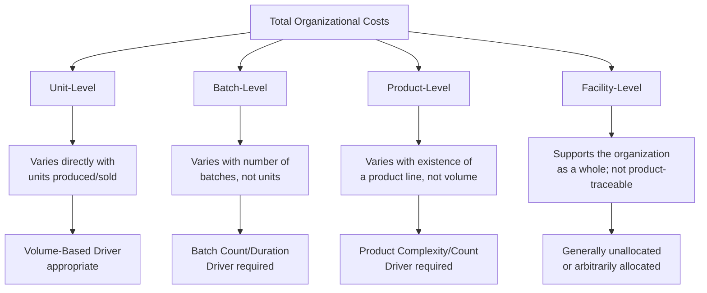

## Unit Level, Batch Level, Product Level, and Facility Level Activities

### Overview

The four-tier cost hierarchy — unit-level, batch-level, product-level, and facility-level activities — is the conceptual backbone of Activity-Based Costing. It classifies organizational activities according to *what causes them to occur*, distinguishing activities that scale with production volume from those that scale with batches, product lines, or the organization as a whole. This classification directly explains why traditional volume-based costing distorts product costs and is the structural basis for correctly assigning overhead under ABC.

### The Cost Hierarchy Framework

### Unit-Level Activities

**Key Points**

- Performed **once for every unit** of product manufactured or every unit of service delivered.
- Total cost of a unit-level activity scales directly and proportionally with production/sales volume.
- These are the *only* activities for which a traditional volume-based driver (direct labor hours, machine hours, units produced) is theoretically appropriate.
- Costs are typically variable in the short run relative to output.

**Example**

| Activity | Description | Cost Driver |
| --- | --- | --- |
| Direct machining | Machine runs on each individual unit | Machine hours |
| Direct assembly labor | Labor applied to each individual unit | Direct labor hours |
| Power to run production equipment | Energy consumed per unit processed | Machine hours or kWh per unit |
| Direct material insertion | Component added to each unit | Units produced |

### Batch-Level Activities

**Key Points**

- Performed **once for each batch or production run**, regardless of how many units are in that batch.
- Total cost varies with the **number of batches**, not the number of units — a batch of 10 units and a batch of 1,000 units incur the same batch-level cost.
- This is the category most severely distorted by traditional volume-based costing, since a single large batch of a high-volume product absorbs far more "volume-based" overhead than the batch-level resources it actually consumes.

**Example**

| Activity | Description | Cost Driver |
| --- | --- | --- |
| Machine setup | Reconfiguring equipment for a new production run | Number of setups (or setup hours) |
| Purchase order processing | Placing and processing a materials order | Number of purchase orders |
| First-article/batch inspection | Quality check performed once per batch | Number of inspections |
| Material movement between stages | Moving a batch from one work center to the next | Number of moves |

**Illustrative Contrast**

$$\text{Setup Cost per Unit (Batch of 100)} = \frac{\$1{,}000}{100} = \$10/\text{unit} \qquad \text{Setup Cost per Unit (Batch of 1{,}000)} = \frac{\$1{,}000}{1{,}000} = \$1/\text{unit}$$

Products manufactured in small batches bear a much higher batch-level cost per unit than products manufactured in large batches — a relationship that volume-based drivers (which spread setup cost by machine hours or labor hours) fail to capture.

### Product-Level (Product-Sustaining) Activities

**Key Points**

- Performed to support the **existence of a specific product line**, independent of how many units or batches of that product are produced.
- Total cost varies with the **number of distinct products** or the complexity of the product line, not with volume or batch count.
- These costs are often the most invisible under traditional costing, since engineering, design, and product-management overhead has no natural link to labor or machine hours.

**Example**

| Activity | Description | Cost Driver |
| --- | --- | --- |
| Product design and engineering | Designing and refining a specific product | Number of active products / design hours |
| Engineering change orders (ECOs) | Modifying specifications for a product | Number of ECOs |
| Maintaining bills of materials (BOM) | Keeping product component lists current | Number of active BOMs |
| Regulatory/compliance testing per product | Certifying a specific product for sale | Number of products requiring certification |

### Facility-Level (Facility-Sustaining) Activities

**Key Points**

- Performed to support the **overall operation of the plant or organization**, not traceable in a cause-and-effect sense to any specific unit, batch, or product.
- Costs at this level remain relatively fixed regardless of product mix, volume, or number of products offered.
- Under a theoretically pure ABC model, these costs are typically **not allocated to products** for internal decision-making, since no genuine driver links them to specific cost objects; allocating them anyway (often required for external financial reporting under absorption costing rules) reintroduces an element of arbitrariness.

**Example**

| Activity | Description | Typical Treatment |
| --- | --- | --- |
| Plant management and administration | General oversight of the facility | Unallocated (internal) / allocated by square footage or total cost (external reporting) |
| Building depreciation and property taxes | Cost of owning/using the facility | Unallocated (internal) / allocated by square footage (external reporting) |
| Plant security and grounds maintenance | General facility upkeep | Unallocated (internal) |
| General accounting and HR overhead | Organization-wide administrative support | Unallocated (internal) |

### Comparative Summary Table

| Level | Driven By | Varies With | Example Driver | Distortion Risk Under Traditional Costing |
| --- | --- | --- | --- | --- |
| Unit-level | Each unit produced | Production volume | Machine hours, labor hours | Low — volume drivers are appropriate here |
| Batch-level | Each batch/run | Number of batches | Number of setups, orders | High — especially for products made in small batches |
| Product-level | Each distinct product | Product complexity/diversity | Number of ECOs, active BOMs | Very high — often entirely ignored by volume drivers |
| Facility-level | Overall facility operation | Not causally traceable | (Typically unallocated) | N/A — any allocation basis is inherently arbitrary |

### Why the Hierarchy Matters for Costing Accuracy

**Key Points**

- Traditional volume-based costing implicitly treats **all** costs as if they were unit-level, spreading batch-, product-, and facility-level costs using a single volume-related driver.
- This causes **cross-subsidization**: high-volume, large-batch, simple products (which consume relatively little batch- and product-level resources per unit) absorb more cost than they cause, while low-volume, small-batch, complex products absorb less cost than they cause.
- ABC corrects this by assigning batch-level costs based on batch-related drivers, product-level costs based on product-related drivers, and (in its purest form) excluding facility-level costs from product cost calculations entirely — aligning cost assignment with actual cause-and-effect resource consumption at each level.

### Worked Example: Cost Assignment Across All Four Levels

A company manufactures Product Alpha: 10,000 units in 10 batches, involving 2 active engineering change orders this year, operating within a facility with $500,000 in general overhead.

| Level | Activity | Driver Quantity | Rate | Cost Assigned to Alpha |
| --- | --- | --- | --- | --- |
| Unit-level | Machining | 10,000 machine hrs | $8/hr | $80,000 |
| Batch-level | Setups | 10 setups | $1,200/setup | $12,000 |
| Product-level | Engineering changes | 2 ECOs | $5,000/ECO | $10,000 |
| Facility-level | Plant admin | N/A | N/A | Not allocated (internal analysis) |

$$\text{Total ABC Overhead Assigned to Alpha (excl. facility)} = \$80{,}000 + \$12{,}000 + \$10{,}000 = \$102{,}000$$

$$\text{Overhead per Unit} = \frac{\$102{,}000}{10{,}000} = \$10.20 \text{ per unit}$$

### Conclusion

The unit-, batch-, product-, and facility-level hierarchy provides the conceptual scaffolding for accurate overhead assignment under ABC. Recognizing that different costs are driven by fundamentally different factors — units produced, batches run, products offered, or the facility's mere existence — allows ABC to assign costs based on genuine cause-and-effect relationships rather than a single volume proxy. This hierarchy is the direct explanation for why traditional costing systematically overcosts high-volume products and undercosts low-volume, complex ones.

**Related Topics**

- Identifying Activities and Cost Pools (Practical Application of the Hierarchy)
- Selecting Activity Cost Drivers by Hierarchy Level
- Cross-Subsidization and Product Cost Distortion Under Traditional Costing
- Treatment of Facility-Sustaining Costs: Internal Decision-Making vs. External Reporting
- Customer-Level and Channel-Level Cost Hierarchies (Extensions Beyond Products)