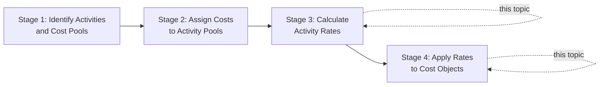

## Calculating and Applying Activity Rates

### Overview

Calculating and applying activity rates is the mechanical bridge between identifying activity cost pools/drivers and arriving at a final, ABC-based product cost. This stage converts the total cost of each activity pool into a per-driver-unit rate, then applies that rate to each product based on its actual consumption of the driver — completing the second-stage allocation in the ABC process.

### Position in the ABC Process

### The Activity Rate Formula

**Key Points**

- An **activity rate** expresses the cost of an activity per unit of its cost driver:

$$\text{Activity Rate} = \frac{\text{Total Cost of Activity Cost Pool}}{\text{Total Quantity of Cost Driver (Estimated or Actual)}}$$

- The denominator can be based on:
  - **Budgeted/estimated activity** — used for setting standard costs and pricing in advance (analogous to a predetermined overhead rate in traditional costing)
  - **Actual activity** — used for retrospective analysis and performance evaluation
- Whether budgeted or actual driver quantities are used affects whether unused capacity is captured (see "Practical Capacity and Unused Capacity" below) — using **practical capacity** rather than budgeted usage prevents overstating activity rates when demand falls short of available capacity.

### Step-by-Step Calculation Process

**Key Points**

1. Determine the total cost assigned to each activity cost pool (from Stage 2 of the ABC design process).
2. Determine the total quantity of the chosen cost driver, either budgeted, actual, or practical-capacity-based.
3. Divide the pool's total cost by the driver quantity to compute the activity rate.
4. Determine each product's (or cost object's) actual or expected consumption of each driver.
5. Multiply each product's driver consumption by the corresponding activity rate.
6. Sum across all activity pools to determine total overhead assigned to the product.
7. Divide by units produced (for unit-level presentation) if a per-unit cost is required — while retaining batch- and product-level totals separately for decision-making purposes.

### Worked Example: Full Calculation

A manufacturer has identified three activity cost pools:

| Activity Cost Pool | Total Cost | Total Driver Quantity | Cost Driver |
| --- | --- | --- | --- |
| Machining | $450,000 | 30,000 machine hours | Machine hours |
| Setups | $180,000 | 300 setups | Number of setups |
| Order processing | $96,000 | 800 orders | Number of orders |

**Step 1 — Calculate Activity Rates**

$$\text{Machining Rate} = \frac{\$450{,}000}{30{,}000} = \$15 \text{ per machine hour}$$

$$\text{Setup Rate} = \frac{\$180{,}000}{300} = \$600 \text{ per setup}$$

$$\text{Order Processing Rate} = \frac{\$96{,}000}{800} = \$120 \text{ per order}$$

**Step 2 — Determine Product Consumption**

Product Zeta consumes: 2,500 machine hours, 12 setups, 40 orders; annual production is 5,000 units.

**Step 3 — Apply Rates**

$$\text{Overhead}_{\text{Zeta}} = (2{,}500 \times \$15) + (12 \times \$600) + (40 \times \$120)$$

$$\text{Overhead}_{\text{Zeta}} = \$37{,}500 + \$7{,}200 + \$4{,}800 = \$49{,}500$$

**Step 4 — Convert to Per-Unit Cost**

$$\text{Overhead per Unit} = \frac{\$49{,}500}{5{,}000} = \$9.90 \text{ per unit}$$

### Comparing Activity Rates Across Products

**Example**

Extending the case above with a second product, Product Omega (2,000 units; 800 machine hours, 18 setups, 60 orders):

| Component | Zeta | Omega |
| --- | --- | --- |
| Machining ($15/hr) | $37,500 | $12,000 |
| Setups ($600/setup) | $7,200 | $10,800 |
| Order processing ($120/order) | $4,800 | $7,200 |
| **Total overhead** | **$49,500** | **$30,000** |
| Units produced | 5,000 | 2,000 |
| **Overhead per unit** | **$9.90** | **$15.00** |

**Key Points**

- Despite Zeta having far higher total production volume, Omega bears a substantially higher overhead cost *per unit*, driven by its disproportionate consumption of setups and order processing relative to its volume.
- Under a traditional volume-based system using machine hours alone, Omega's higher batch-level resource consumption would have been invisible, and its per-unit overhead would have been understated — illustrating the practical payoff of applying activity rates by driver rather than a single volume measure.

### Practical Capacity and Unused Capacity

**Key Points**

- If the driver quantity used in the denominator reflects **budgeted or theoretical capacity** rather than what the resource can practically supply, activity rates can be distorted by demand fluctuations unrelated to actual efficiency.
- Best practice (particularly emphasized in Time-Driven ABC) is to use **practical capacity** — the resource capacity realistically available after normal downtime, breaks, and maintenance — as the denominator.

$$\text{Activity Rate (Capacity-Based)} = \frac{\text{Total Cost of Resource Supplied}}{\text{Practical Capacity of Resource}}$$

- Under this approach, if actual driver consumption falls short of practical capacity, the **unused capacity cost** is calculated separately rather than being absorbed into products:

$$\text{Cost of Unused Capacity} = (\text{Practical Capacity} - \text{Actual Usage Consumed}) \times \text{Activity Rate}$$

- This separation gives management direct visibility into idle capacity costs, which a survey-based rate (assuming 100% of time is "used") would otherwise hide within product costs.

### Applying Rates to Multiple Cost Objects Beyond Products

**Key Points**

- Activity rates are not limited to products — the same technique extends to **customers** (customer profitability analysis), **channels** (distribution channel costing), and **services** (service line costing), using drivers such as number of sales calls, number of returns processed, or number of service requests.
- The mechanics remain identical: total activity pool cost divided by total driver quantity, then applied based on each cost object's actual consumption.

### Sensitivity of Product Cost to Rate Assumptions

**Key Points**

- Because activity rates are ratios, they are sensitive to both the numerator (cost pool total) and denominator (driver quantity) assumptions.
- Small changes in estimated driver volume (e.g., a shift from budgeted to actual setups) can meaningfully change the computed rate and, in turn, every product's assigned cost — reinforcing the need for periodic rate updates as actual activity levels diverge from original estimates.
- [Unverified] The specific threshold at which a change in driver volume becomes "material" enough to warrant recalculating rates is a matter of organizational policy and judgment rather than a fixed accounting standard.

### Common Errors in Calculating and Applying Rates

**Key Points**

- **Mixing budgeted and actual data inconsistently**: using a budgeted rate but multiplying by actual driver consumption (or vice versa) without a clear, consistent policy can produce misleading over/under-applied overhead, analogous to over/under-applied overhead in traditional costing.
- **Failing to isolate unused capacity**: absorbing 100% of resource cost into the rate regardless of actual utilization overstates the cost of products actually produced.
- **Applying a single rate across dissimilar activity instances**: if an activity pool actually contains meaningfully different sub-activities (e.g., "simple setups" vs. "complex setups"), a single blended rate can misrepresent true cost for either type.
- **Neglecting to update rates**: activity rates calculated once and never revisited become increasingly inaccurate as costs, processes, and driver volumes evolve.

### Conclusion

Calculating and applying activity rates translates the structural design of an ABC system — its activity pools and chosen drivers — into concrete product costs. The core mechanics (total pool cost divided by driver quantity, then multiplied by each product's consumption) are straightforward, but the quality of the result depends heavily on using consistent, well-calibrated driver quantities, ideally based on practical capacity rather than assumed full utilization. Careful rate calculation is what ultimately delivers ABC's promised improvement in cost accuracy over traditional volume-based methods.

**Next Steps**

- Over-Applied and Under-Applied Overhead in ABC Systems
- Time-Driven ABC: Capacity Cost Rates and Time Equations
- Customer Profitability Analysis Using Activity Rates
- Using ABC Data for Pricing and Product Mix Decisions
- Activity-Based Budgeting