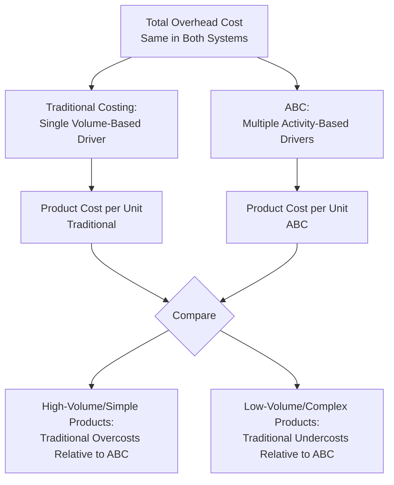
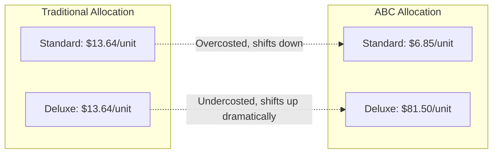

## Comparing Activity Based and Traditional Costing Results

### Overview

Comparing ABC results against traditional volume-based costing results is the analytical step that makes the practical value of ABC visible: placing the two sets of product costs side by side reveals which products were overcosted, which were undercosted, and how those distortions would have affected pricing, product mix, and profitability decisions. This comparison is often the centerpiece of case studies and exams on ABC because it consolidates the mechanics of both systems into a single, decision-relevant analysis.

### Why a Direct Comparison Is Necessary

**Key Points**

- The purpose of building an ABC system is not accuracy for its own sake — it is to reveal **cost distortion** that a single volume-based driver creates and to show its consequences for decisions.
- A side-by-side comparison isolates the effect of allocation method alone, holding total overhead cost constant, so any difference in per-unit product cost is attributable purely to *how* overhead was assigned, not to a change in total spending.

### General Comparison Framework

### Step-by-Step Comparison Method

**Key Points**

1. Compute the traditional cost per unit using a single volume-based driver (e.g., direct labor hours) and the standard predetermined overhead rate formula.
2. Compute the ABC cost per unit using multiple activity pools and their respective activity rates (as covered in "Calculating and Applying Activity Rates").
3. Present both figures side by side for each product, along with the dollar and percentage difference.
4. Interpret the direction and magnitude of distortion, connecting it back to the cost hierarchy (unit/batch/product/facility) driving the gap.
5. Discuss the decision implications: pricing, product mix, make-or-buy, and performance evaluation consequences of relying on the distorted figures.

### Full Worked Example

A company manufactures two products: **Standard** (high-volume, simple) and **Deluxe** (low-volume, complex). Total manufacturing overhead is $600,000, applied traditionally using direct labor hours.

**Production and Cost Data**

| Item | Standard | Deluxe | Total |
| --- | --- | --- | --- |
| Units produced | 40,000 | 4,000 | 44,000 |
| Direct labor hours per unit | 0.5 | 0.5 | — |
| Total direct labor hours | 20,000 | 2,000 | 22,000 |
| Number of setups | 20 | 60 | 80 |
| Number of purchase orders | 100 | 300 | 400 |
| Engineering change orders | 2 | 18 | 20 |

**Activity Cost Pools (ABC)**

| Activity Pool | Total Cost | Driver | Driver Total |
| --- | --- | --- | --- |
| Machining/Assembly (unit-level) | $220,000 | Direct labor hours | 22,000 |
| Setups (batch-level) | $160,000 | Number of setups | 80 |
| Purchasing (batch-level) | $80,000 | Number of orders | 400 |
| Engineering (product-level) | $140,000 | Number of ECOs | 20 |
| **Total** | **$600,000** |  |  |

**Traditional Costing Calculation**

$$\text{Predetermined Overhead Rate} = \frac{\$600{,}000}{22{,}000 \text{ DLH}} = \$27.27 \text{ per DLH}$$

| Product | DLH per Unit | Overhead per Unit (Traditional) |
| --- | --- | --- |
| Standard | 0.5 | $0.5 \times \$27.27 = \$13.64$ |
| Deluxe | 0.5 | $0.5 \times \$27.27 = \$13.64$ |

**Key Points**

- Under traditional costing, both products receive the **identical** overhead cost per unit, because both consume direct labor hours at the same rate — despite Deluxe consuming three times the setups per unit, three times the purchase orders, and nine times the engineering changes.

**ABC Costing Calculation**

Activity rates:

$$\text{Machining Rate} = \frac{\$220{,}000}{22{,}000} = \$10.00/\text{DLH} \qquad \text{Setup Rate} = \frac{\$160{,}000}{80} = \$2{,}000/\text{setup}$$

$$\text{Purchasing Rate} = \frac{\$80{,}000}{400} = \$200/\text{order} \qquad \text{Engineering Rate} = \frac{\$140{,}000}{20} = \$7{,}000/\text{ECO}$$

| Component | Standard | Deluxe |
| --- | --- | --- |
| Machining (DLH × rate) | $20{,}000 \times \$10 = \$200{,}000$ | $2{,}000 \times \$10 = \$20{,}000$ |
| Setups (setups × rate) | $20 \times \$2{,}000 = \$40{,}000$ | $60 \times \$2{,}000 = \$120{,}000$ |
| Purchasing (orders × rate) | $100 \times \$200 = \$20{,}000$ | $300 \times \$200 = \$60{,}000$ |
| Engineering (ECOs × rate) | $2 \times \$7{,}000 = \$14{,}000$ | $18 \times \$7{,}000 = \$126{,}000$ |
| **Total overhead** | **$274,000** | **$326,000** |
| Units produced | 40,000 | 4,000 |
| **Overhead per unit (ABC)** | **$6.85** | **$81.50** |

### Side-by-Side Comparison

| Product | Traditional Cost/Unit | ABC Cost/Unit | Difference ($) | Difference (%) | Direction |
| --- | --- | --- | --- | --- | --- |
| Standard | $13.64 | $6.85 | -$6.79 | -49.8% | **Overcosted** under traditional |
| Deluxe | $13.64 | $81.50 | +$67.86 | +497.4% | **Undercosted** under traditional |

**Key Points**

- Standard, the high-volume product, was overcosted by traditional costing by nearly 50% relative to its ABC-determined cost, since it was assigned a "fair share" of batch- and product-level costs it barely consumes.
- Deluxe, the low-volume product, was dramatically undercosted — its true overhead burden is nearly six times what traditional costing indicated — because its heavy consumption of setups, purchase orders, and engineering changes was invisible to a labor-hour-based driver.
- The totals still reconcile: $\$274{,}000 + \$326{,}000 = \$600{,}000$, confirming that ABC redistributes the *same* total overhead rather than changing it — the comparison isolates allocation method as the sole variable.

### Interpreting the Comparison: Decision Implications

**Key Points**

- **Pricing**: If Standard was priced to cover a $13.64 traditional overhead cost, it was likely priced too high relative to its true $6.85 cost, potentially losing competitive bids unnecessarily. If Deluxe was priced based on a $13.64 assumed cost, it was almost certainly priced far below its true $81.50 cost, silently destroying margin on every unit sold.
- **Product mix**: Management might have been tempted to de-emphasize Standard (seen as "high volume, low margin") and expand Deluxe (seen as "premium, high margin") — precisely the wrong direction once true costs are revealed.
- **Make-or-buy and outsourcing**: A supplier's quote for Deluxe might look expensive compared to the distorted $13.64 internal cost but perfectly reasonable compared to the true $81.50 internal cost — traditional costing could have caused a poor outsourcing decision.
- **Cross-subsidization**: Standard's true profitability was being used to mask Deluxe's true unprofitability (or vice versa, depending on selling prices) — a classic ABC case-study finding.

### Visualizing the Cost Shift

### Guidance for Interpreting Comparison Results Generally

**Key Points**

- The **direction** of distortion (over- vs. undercosting) generally follows a predictable pattern: products with high volume relative to their batch/product-level activity consumption tend to be overcosted by traditional methods, while products with low volume relative to their batch/product-level consumption tend to be undercosted.
- [Inference] The *magnitude* of distortion in any real-world comparison depends heavily on the specific cost structure, product diversity, and driver mix of the firm in question, and can vary substantially — the pattern illustrated above is representative of commonly cited textbook cases rather than a fixed numeric relationship.
- A useful diagnostic ratio for anticipating distortion direction is comparing a product's **share of the volume-based driver** to its **share of batch/product-level activity drivers** — a large gap between these shares signals likely distortion under traditional costing.

### Common Pitfalls When Comparing Results

**Key Points**

- **Comparing costs computed from different total overhead bases**: ensure both systems allocate the same total overhead figure so the comparison isolates allocation method.
- **Ignoring reconciliation**: always confirm that ABC totals sum back to the same total overhead as the traditional system; a mismatch signals a calculation error.
- **Overgeneralizing from a single case**: a two-product illustrative comparison (as above) is pedagogically useful but should not be read as proof that ABC always produces large swings — the effect size depends on how heterogeneous the product mix and activity consumption actually are.
- **Treating ABC results as automatically "more correct" without caveat**: ABC still relies on estimated driver quantities and cost pool assignments; its accuracy is *relatively* better at capturing cause-and-effect relationships, not perfectly precise.

### Conclusion

Comparing ABC and traditional costing results side by side is the step that converts ABC's technical machinery into a decision-relevant insight: it quantifies exactly how much traditional volume-based allocation over- or undercosts each product, and ties that distortion back to differences in batch- and product-level resource consumption. This comparison is what typically justifies the investment in building and maintaining an ABC system, since it directly demonstrates the pricing, product-mix, and profitability risks of relying on distorted traditional cost figures.

**Related Topics**

- Using ABC Results for Pricing Decisions
- Cross-Subsidization and Its Effect on Competitive Bidding
- Customer Profitability Analysis Using ABC
- Limitations and Criticisms of Activity-Based Costing
- Transitioning from Traditional Costing to ABC: Implementation Challenges