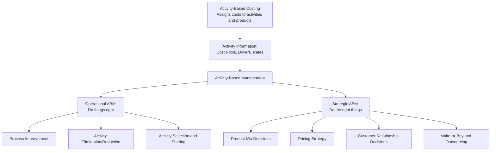

## Activity Based Management

### Overview

Activity-Based Management (ABM) extends Activity-Based Costing beyond product costing into an organization-wide management discipline focused on improving processes, eliminating non-value-added activities, and using activity information to drive strategic and operational decisions. Where ABC answers "what does this product cost?", ABM answers "how can we manage our activities to reduce cost and increase value?"

### Relationship Between ABC and ABM

**Key Points**

- ABC is the **information-generating** system; ABM is the **decision-making and action-taking** discipline that uses that information.
- ABM is commonly divided into two complementary dimensions: **operational ABM** (improving efficiency and reducing cost of existing activities — "doing things right") and **strategic ABM** (changing the demand for activities through better decisions about products, customers, and processes — "doing the right things").

### Value-Added vs. Non-Value-Added Activity Analysis

**Key Points**

- A central ABM technique is classifying activities as:
  - **Value-added activities**: necessary to meet customer requirements and that a customer would be willing to pay for (e.g., actual machining of a part to specification).
  - **Non-value-added activities**: consume resources but do not contribute to customer-perceived value and could, in principle, be reduced or eliminated without affecting the product's usefulness (e.g., excess material handling, rework, waiting time, redundant inspections).
- Value-added analysis is often paired with **process value analysis (PVA)**, which maps the sequence of activities a product or service undergoes to identify inefficiencies.

**Example**

| Activity | Classification | Rationale |
| --- | --- | --- |
| Machining a part to spec | Value-added | Directly required to produce the customer's product |
| Moving work-in-process between stations | Non-value-added | Customer does not value internal movement |
| Storing inventory awaiting the next process step | Non-value-added | Reflects delay/inefficiency, not customer value |
| Reworking a defective unit | Non-value-added | Exists only because of a prior quality failure |
| Final quality inspection required by contract | Value-added (context-dependent) | May be value-added if customer specifically requires/pays for it |

### The Four Ways to Manage Activities

**Key Points**

ABM identifies four general strategies for managing non-value-added or excess-cost activities:

1. **Activity elimination**: removing non-value-added activities entirely (e.g., redesigning a process to avoid a redundant inspection step).
2. **Activity reduction**: decreasing the time or resources consumed by a necessary activity without eliminating it (e.g., reducing setup time through SMED — Single-Minute Exchange of Die — techniques).
3. **Activity selection**: choosing among alternative sets of activities that accomplish the same objective at different costs (e.g., choosing a product design that requires fewer distinct components, thereby reducing purchasing and inspection activity).
4. **Activity sharing**: achieving economies of scale by using a common resource or activity across multiple products or product lines (e.g., a shared engineering team supporting several product families instead of dedicated teams per product).

### Root Cause Analysis: Cost Drivers as Management Levers

**Key Points**

- Because ABC identifies specific cost drivers for each activity (number of setups, number of purchase orders, number of ECOs), managers gain direct visibility into *what actions* would reduce cost — a level of actionable detail traditional costing's single volume driver cannot provide.
- Reducing the driver quantity (e.g., cutting the number of setups through batch-size optimization, or reducing the number of purchase orders through supplier consolidation) directly reduces the resources required for that activity over time.
- [Inference] The degree to which reducing a driver's *quantity* translates into an actual, realized cost *reduction* depends on whether the underlying resources (staff, equipment) are subsequently redeployed or eliminated — merely reducing activity volume does not automatically reduce spending unless capacity is also adjusted.

### Strategic ABM Applications

**Key Points**

- **Customer profitability analysis**: applying activity-based costing logic to customers (using drivers like number of orders, number of returns, special service requests) to identify which customers are genuinely profitable versus which consume disproportionate service resources relative to revenue generated.
- **Product mix and pricing decisions**: using accurate ABC-based product costs (rather than distorted traditional costs) to guide which products to promote, reprice, or discontinue.
- **Target costing integration**: using activity cost driver information during product design to estimate and manage the cost implications of design choices before production begins.
- **Supplier and outsourcing decisions**: comparing the true activity-based cost of in-house production against external quotes, avoiding the errors that traditional-cost-based make-or-buy analysis can produce.

### Example: Using ABM to Reduce Setup Costs

A company identifies, through its ABC system, that setups cost $2,000 each and that the company incurs 300 setups annually ($600,000 total).

**Key Points**

- **Operational ABM (activity reduction)**: implementing SMED techniques reduces average setup time by 40%, cutting the setup cost per instance to approximately $1,200 — an operational efficiency improvement without changing production volume.
- **Strategic ABM (activity selection)**: redesigning the production schedule to run fewer, larger batches reduces the number of setups from 300 to 180 annually, directly reducing total setup-driven cost exposure — assuming the underlying capacity is not otherwise needed.
- Both approaches are visible and actionable specifically *because* the ABC system isolated setups as a distinct, costed activity — a traditional labor-hour-based system would not have surfaced this opportunity.

### ABM and Continuous Improvement / Benchmarking

**Key Points**

- Activity rates provide a natural basis for **benchmarking** — comparing the cost per unit of an activity (e.g., cost per purchase order, cost per inspection) across internal departments, business units, or against external/industry benchmarks.
- Tracking activity rates over time supports **continuous improvement (kaizen-style) initiatives**, where the objective is a sustained reduction in the cost per unit of activity output through incremental process refinement.
- [Unverified] The specific benchmark values considered "industry standard" for a given activity (e.g., typical cost per purchase order) vary substantially by industry, geography, and company scale, and are not fixed constants — comparisons should be made against a firm's own relevant peer set.

### Balanced Scorecard Integration

**Key Points**

- ABM information is often integrated into a **Balanced Scorecard** framework, connecting activity cost and efficiency metrics (internal process perspective) with financial outcomes, customer satisfaction, and learning/growth measures.
- This integration helps ensure that activity reduction efforts do not inadvertently harm quality, customer service, or long-term capability in pursuit of short-term cost savings.

### Limitations and Implementation Challenges of ABM

**Key Points**

- **Behavioral resistance**: employees whose activities are identified as "non-value-added" may resist the analysis, fearing job elimination, which can bias data collection and slow adoption.
- **Capacity adjustment lag**: eliminating or reducing an activity does not immediately reduce cost if the associated resources (staff, equipment) are not simultaneously redeployed or removed — a common gap between theoretical ABM savings and realized savings.
- **Over-focus on cost-cutting**: aggressive elimination of activities without regard to their contribution to quality, flexibility, or customer relationships can harm long-term competitiveness even while reducing measured activity cost.
- **Requires accurate, current ABC data**: ABM decisions are only as good as the underlying ABC cost pools, drivers, and rates — stale or poorly designed ABC data undermines ABM's effectiveness.

### Conclusion

Activity-Based Management uses the activity and cost driver information generated by ABC to drive concrete process improvement and strategic decision-making. Through value-added analysis, the four activity management strategies (eliminate, reduce, select, share), and integration with customer profitability and target costing analyses, ABM converts ABC's diagnostic cost visibility into actionable management practice — bridging the gap between "knowing what something costs" and "doing something about it."

**Related Topics**

- Process Value Analysis and Value-Added vs. Non-Value-Added Classification
- Customer Profitability Analysis Using Activity-Based Costing
- Time-Driven Activity-Based Costing and Capacity Management
- Target Costing and Design-Stage Cost Management
- Balanced Scorecard and Performance Measurement Systems
- Kaizen Costing and Continuous Improvement Methods