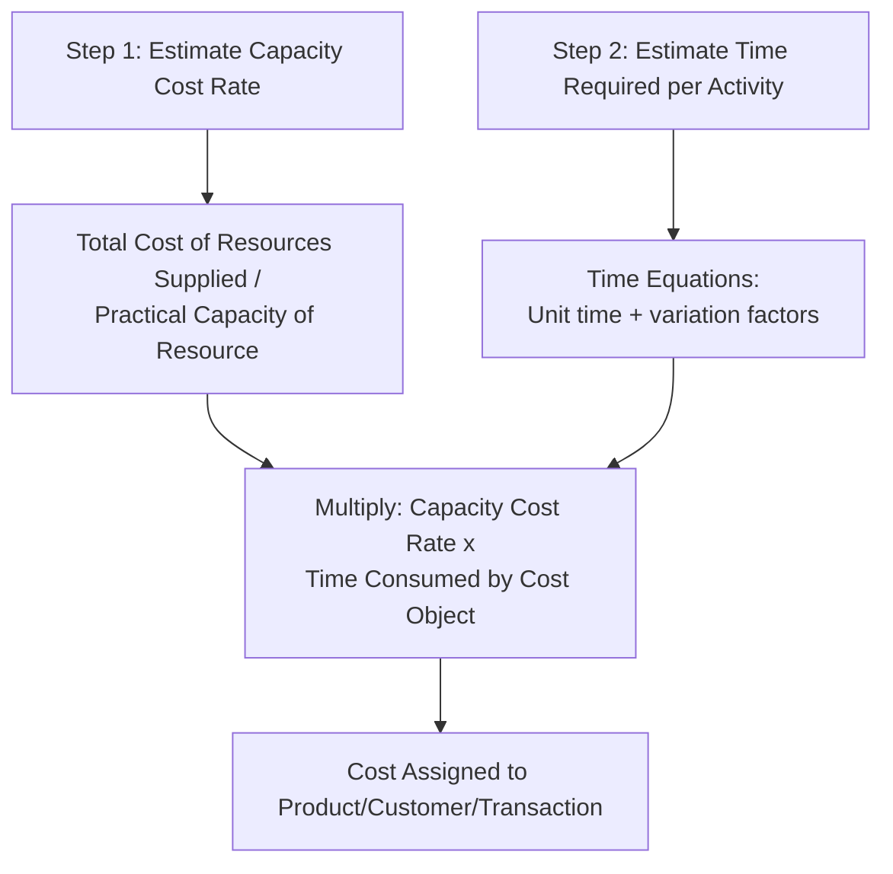

## Time Driven Activity Based Costing

### Overview

Time-Driven Activity-Based Costing (TDABC) is a refinement of conventional ABC, developed primarily by Robert Kaplan and Steven Anderson, that simplifies data collection and directly incorporates unused capacity into the costing model. Instead of relying on employee interviews and percentage-of-time survey estimates to assign costs to activities, TDABC estimates costs using two parameters: the **capacity cost rate** of a resource and the **time required** to perform each transaction or activity, often expressed through **time equations**.

### Motivation: Why TDABC Was Developed

**Key Points**

- Conventional ABC's first-stage allocation (assigning resource costs to activity pools) typically relies on employee-reported percentage-of-time estimates, which tend to **sum to 100% of available time**, implicitly assuming no idle or unused capacity exists.
- This survey-based approach is costly and time-consuming to build and maintain, especially in organizations with many activities, employees, and departments, and requires frequent re-interviewing as processes change.
- TDABC addresses both issues: it replaces subjective percentage estimates with objective time-per-transaction estimates and explicitly separates **used capacity cost** from **unused capacity cost**.

### Core Formula Structure

**Key Points**

- **Step 1 — Capacity Cost Rate**:

$$\text{Capacity Cost Rate} = \frac{\text{Total Cost of Resources Supplied}}{\text{Practical Capacity of the Resource (in time units)}}$$

- **Step 2 — Time Estimate per Transaction**: rather than a single average time per activity, TDABC often uses a **time equation** that adjusts the base time estimate for specific characteristics of the transaction.
- **Step 3 — Cost Assignment**:

$$\text{Cost Assigned} = \text{Capacity Cost Rate} \times \text{Time Required for the Specific Transaction}$$

### Practical Capacity: The Key Denominator Difference

**Key Points**

- **Practical capacity** is the realistically available working time of a resource after subtracting normal downtime — breaks, meetings, training, equipment maintenance — from theoretical (100%) capacity.
- A widely cited rule of thumb in TDABC literature suggests practical capacity is often approximated at roughly **80–85% of theoretical capacity**, though [Unverified] the appropriate percentage varies by organization, resource type, and industry, and should ideally be based on the organization's own operational data rather than assumed as a universal constant.
- Using practical capacity (rather than theoretical capacity or budgeted usage) as the denominator is what allows TDABC to explicitly surface unused capacity cost.

**Example**

An employee is theoretically available 40 hours/week (2,080 hours/year). After accounting for breaks, training, and administrative time, practical capacity is estimated at 1,650 hours/year (approximately 79%). If this employee's fully loaded annual cost is $82,500:

$$\text{Capacity Cost Rate} = \frac{\$82{,}500}{1{,}650 \text{ hours}} = \$50 \text{ per hour}$$

### Time Equations

**Key Points**

- A **time equation** is a formula that estimates the time required for an activity as a function of a base (standard) time plus incremental adjustments for specific order or transaction characteristics, rather than assuming every instance of the activity takes the same amount of time.
- General form:

$$\text{Time} = \beta_0 + \beta_1 X_1 + \beta_2 X_2 + \dots + \beta_n X_n$$

where $\beta_0$ is the base time for a standard transaction and each $\beta_i X_i$ term adjusts time for a specific complicating factor $X_i$ (e.g., rush order, special packaging, number of line items).

**Example**

Order processing time equation:

$$\text{Order Processing Time (minutes)} = 10 + (5 \times \text{Number of Line Items}) + (15 \text{ if Rush Order}) + (8 \text{ if Custom Packaging})$$

For a standard order with 3 line items, no rush, no custom packaging:

$$\text{Time} = 10 + (5 \times 3) = 25 \text{ minutes}$$

For a rush order with 5 line items and custom packaging:

$$\text{Time} = 10 + (5 \times 5) + 15 + 8 = 58 \text{ minutes}$$

**Key Points**

- Time equations allow TDABC to capture cost variation *within* a single activity pool without needing to define a separate activity cost pool for every possible transaction variant — a significant simplification over defining dozens of discrete conventional-ABC activity pools to capture the same variation.

### Cost Assignment Example Using TDABC

Continuing the order processing example, with a capacity cost rate of $1.20/minute (derived from total order-processing department cost divided by practical capacity in minutes):

| Order Type | Time Required | Cost Assigned |
| --- | --- | --- |
| Standard order, 3 line items | 25 minutes | $25 \times \$1.20 = \$30.00$ |
| Rush order, 5 line items, custom packaging | 58 minutes | $58 \times \$1.20 = \$69.60$ |

### Capturing and Reporting Unused Capacity

**Key Points**

- Because the capacity cost rate is based on total resource cost divided by *practical* capacity, if actual time consumed by all transactions is less than practical capacity, a residual — **unused capacity cost** — is explicitly quantified rather than silently absorbed into product costs.

$$\text{Unused Capacity Cost} = (\text{Practical Capacity} - \text{Total Time Used}) \times \text{Capacity Cost Rate}$$

**Example**

A department has practical capacity of 10,000 hours/year at a capacity cost rate of $40/hour (total resource cost = $400,000). Actual time consumed by all processed transactions totals 8,700 hours.

$$\text{Unused Capacity Cost} = (10{,}000 - 8{,}700) \times \$40 = 1{,}300 \times \$40 = \$52{,}000$$

**Key Points**

- This $52,000 represents committed resource cost not consumed by any product or transaction — a figure invisible in conventional ABC's survey-based approach (where reported time percentages are forced to sum to 100%) and invisible in traditional volume-based costing entirely.
- This visibility directly supports capacity management decisions: redeploying underutilized staff, right-sizing headcount, or identifying room to accept additional volume without added capacity investment.

### TDABC vs. Conventional ABC: Comparison

| Dimension | Conventional ABC | Time-Driven ABC |
| --- | --- | --- |
| Data collection method | Interviews/surveys; % of time by activity | Direct time estimates via time equations |
| Assumption about capacity | Implicitly assumes 100% utilization | Explicitly models practical capacity and idle time |
| Handling of activity complexity | Requires separate cost pools per activity variant | Time equations capture variation within one pool |
| Maintenance/update effort | High — requires re-interviewing as processes change | Lower — update time equation parameters and capacity rate |
| Scalability to large transaction volumes | More difficult; many pools become unwieldy | Better suited to high transaction volume settings (e.g., banking, logistics, healthcare) |
| Visibility of unused capacity | Generally not captured | Explicitly quantified |

### Common Application Domains

**Key Points**

- TDABC has been widely applied in **service industries with high transaction volume and variability**, including banking, logistics/distribution, healthcare, and insurance claims processing — settings where conventional ABC's activity-pool proliferation becomes impractical.
- In healthcare specifically, TDABC has been used to map patient care processes end-to-end, assigning time-based costs to each step of a care pathway to identify cost-reduction and process-improvement opportunities. [Inference] The extent of TDABC adoption varies significantly by industry and organization size; it is best supported as a technique with documented case applications rather than a universally adopted standard.

### Limitations of TDABC

**Key Points**

- **Time equation complexity**: for genuinely complex processes with many variation factors, time equations can become as complex to build and maintain as conventional ABC's pool structure, partially eroding the simplification benefit.
- **Estimation reliability**: time estimates, even when "direct" rather than survey-based, still rely on management judgment or limited observation samples and are subject to estimation error.
- **Requires reliable transaction-level data**: TDABC's benefits depend on having (or being able to build) systems that capture transaction volume and characteristics (e.g., number of line items, rush status) at a granular level — organizations without such data infrastructure face an implementation barrier.
- **Practical capacity estimation is itself judgmental**: [Unverified] there is no single universally accepted method for calculating practical capacity percentages; different consulting and academic sources propose different rules of thumb.

### Conclusion

Time-Driven Activity-Based Costing streamlines conventional ABC by replacing survey-based percentage allocations with direct time estimates and capacity cost rates, using time equations to capture cost variation within an activity without proliferating separate cost pools. Its most distinctive contribution is making unused capacity cost explicitly visible, supporting more informed capacity management decisions alongside the product- and customer-costing benefits shared with conventional ABC. TDABC is particularly well suited to high-volume, variable-transaction service environments where conventional ABC's data collection burden becomes impractical.

**Related Topics**

- Practical Capacity vs. Theoretical Capacity: Estimation Methods
- Time Equations: Building and Calibrating Multi-Factor Models
- Unused Capacity Analysis and Resource Redeployment Decisions
- TDABC Applications in Healthcare and Financial Services
- Activity-Based Management: Turning Capacity Insights into Action
- Conventional ABC vs. TDABC: Selecting the Right Approach for Your Organization