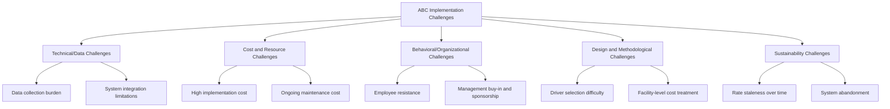

## Implementation Challenges of Activity Based Costing

### Overview

Despite its theoretical advantages over traditional volume-based costing, Activity-Based Costing frequently encounters substantial obstacles during design and rollout. Implementation challenges span technical, organizational, behavioral, and financial dimensions, and a meaningful share of ABC initiatives are reported in the accounting literature to stall, be abandoned, or fail to deliver expected benefits. Understanding these challenges is essential both for designing a more successful implementation and for critically evaluating when ABC is — and is not — the right costing approach for an organization.

### Categories of Implementation Challenges

### 1. High Cost and Time Investment

**Key Points**

- Building an ABC system requires substantial upfront investment: interviewing employees, mapping processes, identifying activities, selecting drivers, and building data collection mechanisms.
- Costs include both **direct costs** (consultant fees, software, training) and **indirect costs** (employee time diverted from operational work to participate in interviews and data validation).
- For organizations with simple product lines, low overhead relative to direct costs, or limited competitive pressure on pricing accuracy, the cost of implementing ABC may exceed the decision-making benefit it provides — a central cost-benefit judgment management must make before committing to implementation.

### 2. Data Collection Burden

**Key Points**

- Conventional ABC's reliance on employee interviews and percentage-of-time estimates is time-consuming to conduct initially and **must be repeated periodically** as processes evolve, creating an ongoing administrative burden.
- Organizations often lack existing systems (ERP, time-tracking, MES) capable of automatically capturing driver-quantity data (e.g., number of setups, number of purchase orders per product), requiring new data infrastructure to be built.
- [Inference] The severity of this challenge is generally lower for organizations that already operate integrated ERP/MES systems capable of capturing transactional driver data automatically, and higher for organizations relying on manual or fragmented record-keeping.

### 3. Employee Resistance and Behavioral Bias

**Key Points**

- Employees participating in activity-percentage surveys may perceive the exercise as a precursor to downsizing or performance scrutiny, creating an incentive to **overstate or understate** time allocations defensively.
- Department managers may resist providing accurate data if they anticipate that ABC results will make their department appear inefficient or costly relative to others.
- Overcoming this resistance typically requires clear communication about the purpose of ABC (process improvement, not blame), management sponsorship, and, where possible, framing the initiative around opportunities rather than performance evaluation.

### 4. Selecting Appropriate Activities and Drivers

**Key Points**

- Determining the right level of granularity for activities is inherently a judgment call: too many activities create an unwieldy, expensive-to-maintain system; too few activities reintroduce the very cost distortion ABC is meant to eliminate.
- Identifying cost drivers with a genuine causal relationship to cost (rather than merely correlated or conveniently available data) requires deep operational knowledge that may not reside with the accounting/finance function alone, requiring cross-functional collaboration that can be difficult to coordinate.
- Different departments or product lines may have genuinely different appropriate drivers, complicating standardization across a large organization.

### 5. Treatment of Facility-Sustaining Costs

**Key Points**

- Facility-level costs (plant management, depreciation, general administration) have no causal driver connecting them to individual products, creating a persistent design tension: excluding them entirely (theoretically correct for decision-making) versus allocating them somehow (often required for external financial reporting compliance under full absorption costing).
- Organizations frequently must maintain **two parallel costing views** — an ABC-based view for internal decisions and a traditional/absorption-based view for external financial statements — adding complexity and potential confusion about which "cost" figure to use for a given purpose.

### 6. System Integration with Existing Accounting Infrastructure

**Key Points**

- Many organizations' general ledger and ERP systems are architected around traditional cost center and account-based structures, not activity-based structures, requiring either significant system customization or the maintenance of a separate ABC model outside the core accounting system.
- Running ABC as a standalone spreadsheet-based or bolt-on system (common in early implementations) increases the risk of data inconsistency, version control problems, and eventual abandonment as the model becomes difficult to maintain outside the "official" system of record.

### 7. Rate Staleness and the Need for Ongoing Maintenance

**Key Points**

- Activity rates calculated at one point in time become progressively less accurate as production processes, technology, product mix, and cost structures change.
- Because updating an ABC model (re-surveying employees, recalculating driver quantities and rates) is resource-intensive, many organizations update ABC data **infrequently**, resulting in cost information that lags actual operations — sometimes referred to informally as the ABC system becoming "out of date."
- This creates a paradox: the very characteristic that makes ABC valuable (reflecting genuine, current cause-and-effect cost relationships) is also what makes it expensive to sustain over time.

### 8. Risk of Abandonment

**Key Points**

- A substantial body of management accounting literature and survey research has documented that a significant proportion of organizations that adopt ABC subsequently **abandon or significantly scale back** their systems within a few years, often citing high maintenance cost, complexity, and insufficient perceived benefit relative to effort.
- [Unverified] Precise abandonment rates cited in various academic surveys differ depending on survey methodology, industry, time period, and geographic scope, so any single statistic should be treated as illustrative of a documented pattern rather than a universally applicable figure.
- Common triggers for abandonment include leadership turnover (loss of the original ABC sponsor), failure to translate ABC insights into actual operational changes, and the emergence of simpler alternatives such as Time-Driven ABC.

### 9. Behavioral and Decision-Quality Risks After Implementation

**Key Points**

- Even after successful implementation, ABC information can be **misused** if managers treat allocated costs (including any facility-level costs that are still allocated) as if they were all avoidable in the short run for decision-making purposes, when in fact many allocated costs are fixed and will not change based on a single product or customer decision.
- Overreliance on ABC-derived per-unit costs for short-term pricing decisions, without considering relevant/incremental cost analysis, can lead to the same category of flawed decision-making ABC was meant to prevent — just with a different (more granular but still potentially misapplied) set of numbers.

### Success Factors Commonly Cited to Mitigate These Challenges

**Key Points**

- **Strong management sponsorship**: visible, sustained commitment from senior leadership signals the initiative's importance and helps secure employee cooperation.
- **Cross-functional design teams**: involving operations, engineering, and department managers (not just accounting/finance) improves the accuracy and credibility of activity and driver selection.
- **Starting with a pilot or limited scope**: implementing ABC for a subset of high-overhead, high-diversity product lines first can demonstrate value before committing to an organization-wide rollout.
- **Investing in automated data capture**: leveraging existing ERP/MES data (rather than purely survey-based estimates) reduces ongoing maintenance burden — a core motivation behind Time-Driven ABC's design.
- **Linking ABC results to concrete action (ABM)**: implementations that translate cost insights into visible process improvements and decisions tend to sustain organizational buy-in better than those that produce reports without follow-through.

### Conclusion

Implementing ABC successfully requires managing a wide range of challenges beyond the technical mechanics of activity identification and cost driver selection: securing adequate resources, overcoming employee resistance, integrating with existing systems, and sustaining the system through ongoing maintenance. Organizations that underestimate these challenges — particularly the behavioral and maintenance dimensions — are more prone to abandoning ABC after initial investment. Careful scoping, strong sponsorship, and a clear link between ABC insights and operational action are widely cited as key factors distinguishing sustained ABC implementations from abandoned ones.

**Related Topics**

- Time-Driven ABC as a Response to Conventional ABC's Maintenance Burden
- Change Management and Employee Buy-In in Accounting System Implementations
- Cost-Benefit Analysis of Adopting a New Costing System
- Integrating ABC with ERP and Enterprise Systems
- Relevant Costs and Avoidable Costs in Short-Term Decision-Making
- Case Studies in ABC Implementation Success and Failure