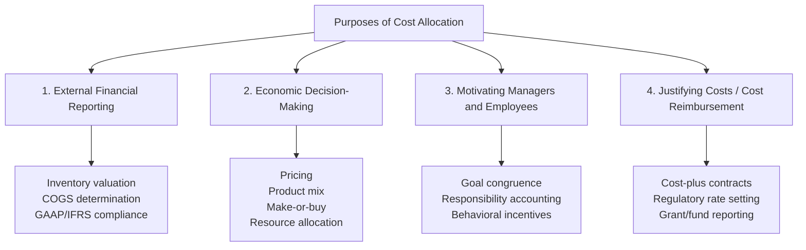

## Purposes of Cost Allocation

### Overview

Cost allocation is the process of assigning indirect or shared costs to cost objects — products, departments, services, customers, or projects — that benefit from or cause those costs, even when no direct, unambiguous cause-and-effect relationship exists. Understanding *why* organizations allocate costs (rather than simply how) is foundational to evaluating whether a given allocation method is appropriate for a specific decision.

### The Four Primary Purposes of Cost Allocation

### 1. External Financial Reporting

**Key Points**

- Financial accounting standards (GAAP and IFRS) require **full absorption costing** for external inventory valuation and cost of goods sold reporting — meaning all manufacturing costs, including indirect manufacturing overhead, must be allocated to units of production.
- This purpose is driven by **compliance requirements**, not managerial usefulness — costs must be allocated even when no meaningful cause-and-effect relationship exists (e.g., facility-level costs), simply because financial reporting rules require a full unit cost figure.
- Under absorption costing, unsold inventory carries a share of fixed manufacturing overhead on the balance sheet, while under variable/direct costing (used for internal reporting), fixed overhead is expensed entirely in the period incurred — creating a divergence between reported income under the two methods that reconciles based on changes in inventory levels.

### 2. Economic Decision-Making

**Key Points**

- Allocated costs inform a wide range of internal decisions:
  - **Pricing decisions**: understanding the full cost of a product supports setting prices that ensure adequate margin coverage.
  - **Product mix decisions**: comparing the profitability of different products or services, incorporating their fair share of shared/indirect costs.
  - **Make-or-buy decisions**: comparing internal production costs (including allocated overhead) against external supplier quotes.
  - **Resource allocation and capital budgeting**: understanding which business units or product lines generate returns sufficient to justify continued or expanded investment.
- For this purpose, the **accuracy** of the allocation method matters significantly, since a poorly designed allocation (e.g., traditional volume-based costing under conditions of high product diversity) can lead directly to flawed decisions — this is the central motivation behind more sophisticated allocation approaches such as ABC.
- [Inference] For decisions that are genuinely short-term and incremental (e.g., accepting a one-time special order using existing idle capacity), allocated *fixed* costs are typically irrelevant to the decision and should be excluded from the analysis — a distinction (allocated vs. relevant cost) that is important to maintain even when a full-cost allocation exists for other purposes.

### 3. Motivating Managers and Employees (Behavioral/Motivational Purpose)

**Key Points**

- Allocating shared costs to responsibility centers (departments, divisions, product lines) can motivate managers to use shared resources more efficiently, since the cost of that resource now appears on their performance reports.
- This supports **goal congruence** — aligning individual/departmental incentives with overall organizational objectives — by making managers accountable for the costs their activities impose on the organization, including costs of shared support functions they consume.
- **Example**: Allocating IT department costs to user departments based on number of support tickets or devices supported can discourage excessive, low-value IT service requests, since departments now bear a visible cost for consuming that shared resource.
- **Key tension**: costs allocated purely for motivational purposes may not need to be as precisely "accurate" (in a cause-and-effect sense) as costs allocated for decision-making — what matters most for this purpose is that the allocation is perceived as **fair** and that it influences behavior in the desired direction. An allocation that is technically accurate but perceived as arbitrary or unfair can undermine motivation rather than support it.

### 4. Cost Justification and Reimbursement

**Key Points**

- Some external parties require a documented cost allocation basis to determine reimbursement or compliance, independent of internal decision-making needs:
  - **Cost-plus government contracts**: contractors are reimbursed for allowable costs plus a margin, requiring a defensible allocation of indirect/overhead costs to the specific contract.
  - **Regulated utility rate-setting**: regulators may require utilities to allocate costs across services or customer classes to justify the rates charged for regulated services.
  - **Grant and fund accounting** (nonprofits, universities, government agencies): funders often require indirect costs to be allocated to specific grants or programs according to an approved allocation methodology, to demonstrate appropriate use of restricted funds.
- This purpose emphasizes **defensibility and consistency** of the allocation method as much as decision-usefulness, since the allocation may be subject to external audit or regulatory review.

### Comparative Summary of the Four Purposes

| Purpose | Primary Driver | Key Requirement | Accuracy Emphasis |
| --- | --- | --- | --- |
| External financial reporting | Regulatory compliance (GAAP/IFRS) | Full absorption of manufacturing costs | Compliance-consistent, not necessarily decision-optimal |
| Economic decision-making | Internal managerial usefulness | Reflects genuine cause-and-effect where possible | High — inaccurate allocation directly harms decisions |
| Motivating managers | Behavioral alignment | Perceived fairness, influences desired behavior | Moderate — fairness may matter more than precision |
| Cost justification/reimbursement | External contractual/regulatory requirement | Defensibility, consistency, auditability | High — but "accuracy" defined by approved methodology, not necessarily cause-and-effect |

### Tension Between Purposes

**Key Points**

- A single allocation method rarely serves all four purposes equally well, creating a recurring practical tension: the method required for GAAP-compliant external reporting (e.g., full absorption costing with a simple volume-based overhead rate) may actively mislead internal decision-making if used without adjustment.
- Many organizations maintain **separate costing views** for different purposes — for example, a traditional absorption-based system for external financial statements and an ABC-based system for internal decision support — explicitly acknowledging that no single allocation serves every purpose optimally.
- **Example**: A company's external financial statements might report Product A's cost using a plantwide labor-hour-based overhead rate for GAAP compliance, while its internal management reports show Product A's ABC-based cost for pricing and product-mix decisions — these two figures can differ substantially for the same product, each being "correct" for its respective purpose.

### Implications for Choosing an Allocation Method

**Key Points**

- Before selecting or evaluating a cost allocation method, it is necessary to first identify **which purpose(s)** the allocation is meant to serve, since the "best" method depends on the purpose.
- A method optimized purely for cause-and-effect decision accuracy (like a fully-developed ABC system) may be unnecessarily costly to build and maintain if the organization's primary need is external reporting compliance, where a simpler traditional allocation may suffice.
- Conversely, relying solely on a simplistic, compliance-oriented allocation for internal pricing and product-mix decisions risks the cost distortions discussed extensively in the context of traditional volume-based costing.

### Conclusion

Cost allocation serves four distinct purposes — external financial reporting, economic decision-making, motivating managers, and cost justification/reimbursement — each with different requirements for accuracy, defensibility, and behavioral effect. Recognizing which purpose a particular allocation is meant to serve is a prerequisite for evaluating whether a given allocation method (traditional, activity-based, or otherwise) is appropriate, and explains why many organizations maintain multiple, purpose-specific costing views rather than relying on a single allocation for every use.

**Related Topics**

- Allocating Support Department Costs: Direct, Step-Down, and Reciprocal Methods
- Absorption Costing vs. Variable Costing for External Reporting
- Responsibility Accounting and Controllability in Cost Allocation
- Relevant Costs vs. Allocated Costs in Short-Term Decision-Making
- Cost Allocation in Nonprofit and Government Grant Accounting
- Criteria for Selecting a Cost Allocation Base