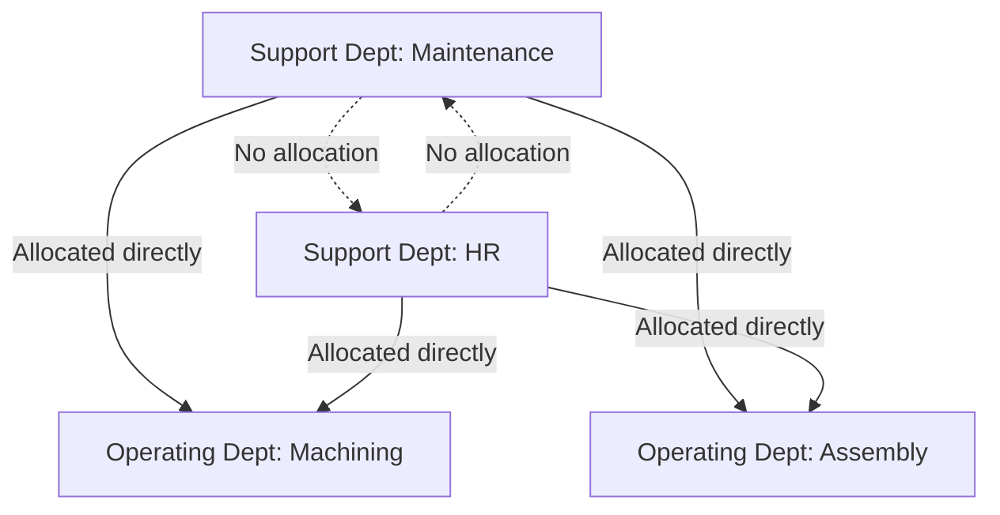

## Direct Method of Support Department Allocation

### Overview

The direct method is the simplest of the three principal approaches (direct, step-down, and reciprocal) used to allocate support department (service department) costs to operating (production) departments. It allocates each support department's costs directly to operating departments only, completely ignoring any services that support departments provide to one another.

### Organizational Context: Support vs. Operating Departments

**Key Points**

- **Support departments** (also called service departments) do not directly work on the product but provide services that enable operating departments to function — examples include maintenance, human resources, IT, cafeteria services, and janitorial services.
- **Operating departments** (also called production departments) directly work on the product or service delivered to customers — examples include machining, assembly, and finishing departments.
- Because support department costs are indirect with respect to the final product, they must ultimately be allocated to operating departments (and from there, typically, to products) so that products bear their full share of the organization's cost of operating, consistent with the purposes of cost allocation (particularly external reporting and decision-making).

### The Direct Method Mechanism

**Key Points**

- Under the direct method, **support department costs are allocated only to operating departments**, based on each operating department's relative consumption of the support department's services.
- **Interactions between support departments are ignored entirely** — even if Maintenance services the HR department's equipment, or HR provides recruiting support to the Maintenance department, none of that inter-support-department cost flow is recognized.
- The allocation base used for each support department should reflect its underlying cost driver (e.g., square footage for janitorial services, number of employees for HR, machine hours or maintenance requests for maintenance).

### Step-by-Step Calculation Process

**Key Points**

1. Identify total costs within each support department to be allocated.
2. Identify an appropriate allocation base for each support department (e.g., number of employees, square footage, machine hours).
3. Determine each operating department's usage of that base, **excluding** any usage by other support departments.
4. Compute each operating department's proportion of the *total operating-department-only* usage.
5. Multiply each support department's total cost by each operating department's proportion to determine the allocated amount.

### Worked Example

A company has two support departments (Maintenance and Human Resources) and two operating departments (Machining and Assembly).

**Cost and Usage Data**

| Department | Costs to Allocate | Maintenance Hours Used | Number of Employees |
| --- | --- | --- | --- |
| Maintenance (support) | $120,000 | — | 5 |
| Human Resources (support) | $80,000 | 200 | — |
| Machining (operating) | — | 1,200 | 60 |
| Assembly (operating) | — | 800 | 40 |

**Step 1 — Allocate Maintenance (using maintenance hours, operating departments only)**

Total operating-department maintenance hours: $1{,}200 + 800 = 2{,}000$ (the 200 hours used by HR are **excluded** under the direct method)

$$\text{Machining share} = \frac{1{,}200}{2{,}000} = 60\% \qquad \text{Assembly share} = \frac{800}{2{,}000} = 40\%$$

$$\text{Maintenance to Machining} = 0.60 \times \$120{,}000 = \$72{,}000$$

$$\text{Maintenance to Assembly} = 0.40 \times \$120{,}000 = \$48{,}000$$

**Step 2 — Allocate HR (using number of employees, operating departments only)**

Total operating-department employees: $60 + 40 = 100$ (Maintenance department's own 5 employees are **excluded**)

$$\text{Machining share} = \frac{60}{100} = 60\% \qquad \text{Assembly share} = \frac{40}{100} = 40\%$$

$$\text{HR to Machining} = 0.60 \times \$80{,}000 = \$48{,}000$$

$$\text{HR to Assembly} = 0.40 \times \$80{,}000 = \$32{,}000$$

**Step 3 — Total Allocated Support Costs**

| Operating Department | From Maintenance | From HR | Total Allocated |
| --- | --- | --- | --- |
| Machining | $72,000 | $48,000 | $120,000 |
| Assembly | $48,000 | $32,000 | $80,000 |
| **Total** | **$120,000** | **$80,000** | **$200,000** |

**Key Points**

- The full $200,000 in support department costs is allocated entirely to the two operating departments; the totals reconcile because the direct method allocates 100% of each support department's cost, just without recognizing inter-support-department service flows.

### Advantages of the Direct Method

**Key Points**

- **Simplicity**: the direct method is the easiest of the three methods to understand, calculate, and explain to non-accounting stakeholders.
- **Lower implementation cost**: requires less data (no need to track or estimate inter-support-department service flows) and involves no simultaneous equations, unlike the reciprocal method.
- **Widely used in practice**: [Inference] due to its simplicity, the direct method is commonly cited in management accounting textbooks and surveys as the most frequently used of the three methods in practice, though the exact prevalence varies by source and industry.

### Disadvantages of the Direct Method

**Key Points**

- **Ignores reciprocal services**: by disregarding services support departments provide to one another, the direct method can produce less accurate operating department cost figures than the step-down or reciprocal methods, especially when inter-support-department service flows are significant.
- **Potential cost distortion**: if one support department heavily services another (e.g., IT services HR extensively), that consumption is invisible under the direct method, and the cost of running IT is not appropriately reflected as partly attributable to the burden HR places on it.
- **Allocation base sensitivity**: because operating-department-only usage is used as the denominator, small support departments with disproportionately large inter-support usage can have distorted allocation bases relative to their actual total service provision.

### Comparison to Step-Down and Reciprocal Methods

| Method | Recognizes Support-to-Support Services? | Complexity | Accuracy |
| --- | --- | --- | --- |
| Direct | No | Low | Lowest of the three |
| Step-down (sequential) | Partially (one direction only) | Moderate | Improved over direct |
| Reciprocal | Fully (simultaneous, bidirectional) | Highest (requires simultaneous equations) | Highest of the three |

**Key Points**

- The direct method sits at the simplicity end of a clear complexity-accuracy tradeoff among the three methods; organizations select a method based on the materiality of inter-support-department service flows relative to the cost of implementing a more complex method.
- [Inference] Whether the accuracy improvement from the step-down or reciprocal method is material enough to justify the added complexity depends on how much support departments actually service one another in a given organization — this is a case-specific judgment rather than a fixed rule favoring any one method universally.

### When the Direct Method Is Most Appropriate

**Key Points**

- Inter-support-department service consumption is minimal or immaterial relative to total support department costs.
- The organization prioritizes simplicity and ease of communication over marginal gains in allocation precision.
- The primary purpose of the allocation is external financial reporting compliance, where the specific inter-departmental allocation mechanics matter less than arriving at a defensible, consistently applied total product cost.

### Conclusion

The direct method allocates support department costs solely to operating departments, ignoring any services support departments provide to each other. Its principal advantage is simplicity — it is the easiest of the three standard allocation methods to compute and explain — while its principal limitation is reduced accuracy when support departments meaningfully service one another. It remains a common and often perfectly adequate choice, particularly for external reporting purposes or organizations with immaterial inter-support-department service flows, and it stands at one end of a clear complexity-accuracy continuum relative to the step-down and reciprocal methods.

**Related Topics**

- Step-Down (Sequential) Method of Support Department Allocation
- Reciprocal Method of Support Department Allocation (Simultaneous Equations)
- Selecting an Appropriate Allocation Base for Support Departments
- Single-Rate vs. Dual-Rate Support Department Cost Allocation
- Support Department Cost Allocation and Its Effect on Segment Performance Evaluation