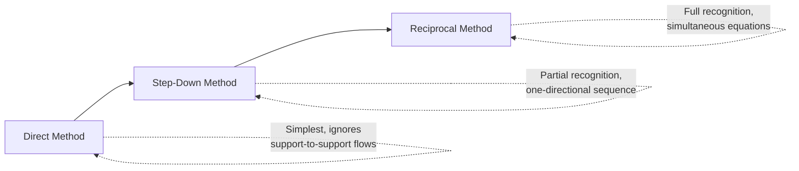
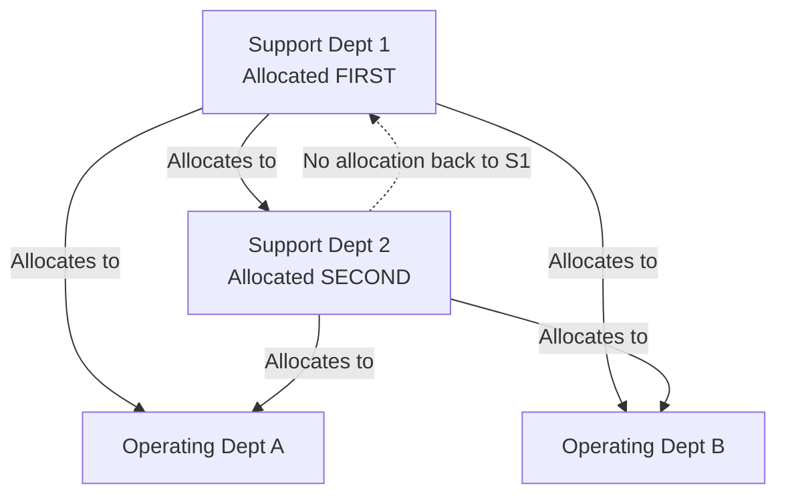

## Step Down Method of Support Department Allocation

### Overview

The step-down method (also called the sequential method) is a support department cost allocation approach that partially recognizes services support departments provide to one another. Unlike the direct method, which ignores inter-support-department service flows entirely, the step-down method allocates support department costs in a specific sequence, allowing costs to flow from one support department to both other support departments and operating departments — but only in one direction, never back to a department already closed out.

### Position Among the Three Allocation Methods

### The Step-Down Mechanism

**Key Points**

- Support departments are allocated in a **specific sequence**, typically determined by ranking departments from the one that provides the **most service to other support departments** (allocated first) to the one that provides the **least** (allocated last).
- Once a support department's costs have been allocated ("stepped down" and closed out), **no costs are ever allocated back to it**, even if it received services from a support department allocated later in the sequence.
- The **last** support department in the sequence has its costs allocated only to operating departments, since all other support departments have already been closed out — functionally identical to the direct method for that one department.

### Determining the Allocation Sequence

**Key Points**

- The most common sequencing rule allocates support departments in order of **the percentage of their services provided to other support departments**, from highest to lowest — the department that serves other support departments the most is allocated first, so that as much of its cost as possible flows through the system before being "trapped" by the closing-out rule.
- An alternative sequencing rule ranks by the **total dollar amount of costs** in each support department, allocating the department with the highest total costs first.
- [Inference] Different textbooks and organizations may specify slightly different tie-breaking or sequencing conventions; the general principle — allocate the department with the greatest service impact on other support departments first — is consistent across sources, but the precise ranking metric used can vary.

### Step-by-Step Calculation Process

**Key Points**

1. Determine the allocation sequence (rank support departments, typically by service provided to other support departments).
2. Allocate the first-ranked support department's total costs to **all** other departments (remaining support departments plus all operating departments) based on their relative usage of its services.
3. Close out the first department; it now has a zero balance and receives no further allocations.
4. Allocate the second-ranked support department's total costs (its own original costs **plus** any costs it received from the first department) to all **remaining** departments (excluding the department already closed out).
5. Repeat until all support departments have been allocated, with the final support department's costs going only to operating departments.

### Worked Example

Using the same base data as the direct method illustration, with Maintenance and Human Resources as support departments, Machining and Assembly as operating departments — but now also tracking Maintenance's service to HR and HR's service to Maintenance.

**Cost and Usage Data**

| Department | Costs to Allocate | Maintenance Hours Used | Number of Employees |
| --- | --- | --- | --- |
| Maintenance (support) | $120,000 | — | 5 |
| Human Resources (support) | $80,000 | 200 | — |
| Machining (operating) | — | 1,200 | 60 |
| Assembly (operating) | — | 800 | 40 |

**Step 1 — Determine Sequence**

Maintenance provides services to HR (200 of its hours go to HR), while HR provides services to Maintenance (5 of its "employee-service" base goes to Maintenance). Suppose it is determined that Maintenance provides a larger relative share of service to other support departments; Maintenance is therefore allocated **first**.

**Step 2 — Allocate Maintenance (first) to ALL other departments**

Total maintenance hours used by all other departments: $200 \text{ (HR)} + 1{,}200 \text{ (Machining)} + 800 \text{ (Assembly)} = 2{,}200$

$$\text{HR share} = \frac{200}{2{,}200} = 9.09\% \qquad \text{Machining share} = \frac{1{,}200}{2{,}200} = 54.55\% \qquad \text{Assembly share} = \frac{800}{2{,}200} = 36.36\%$$

$$\text{Maintenance to HR} = 0.0909 \times \$120{,}000 = \$10{,}909$$

$$\text{Maintenance to Machining} = 0.5455 \times \$120{,}000 = \$65{,}455$$

$$\text{Maintenance to Assembly} = 0.3636 \times \$120{,}000 = \$43{,}636$$

Maintenance is now closed out (its $120,000 fully allocated); no costs will ever flow back to it.

**Step 3 — Allocate HR (second) to REMAINING departments only**

HR's cost pool now includes its original $80,000 **plus** the $10,909 received from Maintenance:

$$\text{HR Total Cost Pool} = \$80{,}000 + \$10{,}909 = \$90{,}909$$

Because Maintenance is already closed out, HR's cost is allocated **only** to Machining and Assembly (its usage by Maintenance, the 5 employees, is excluded since Maintenance can no longer receive allocations):

Total employees in remaining departments: $60 + 40 = 100$

$$\text{Machining share} = \frac{60}{100} = 60\% \qquad \text{Assembly share} = \frac{40}{100} = 40\%$$

$$\text{HR to Machining} = 0.60 \times \$90{,}909 = \$54{,}545$$

$$\text{HR to Assembly} = 0.40 \times \$90{,}909 = \$36{,}364$$

**Step 4 — Total Allocated Support Costs**

| Operating Department | From Maintenance | From HR (incl. Maintenance's contribution) | Total Allocated |
| --- | --- | --- | --- |
| Machining | $65,455 | $54,545 | $120,000 |
| Assembly | $43,636 | $36,364 | $80,000 |
| **Total** |  |  | **$200,000** |

**Key Points**

- As with the direct method, the full $200,000 in support costs is entirely allocated to the operating departments; the difference lies in *how* that $200,000 flows through the system — HR's effective cost pool grew to $90,909 because it absorbed a share of Maintenance's cost before passing its own costs onward.
- Compare to the direct method result (Machining: $72,000 + $48,000 = $120,000 allocated as $72,000/$48,000 split from each support department separately) — the step-down method produces a different distribution between Machining and Assembly ($120,000 to Machining vs. $118,182 combined... note the totals for each operating department still sum to the same $120,000/$80,000 totals due to conservation of total cost, but the split between the two support-cost sources differs).

### Advantages of the Step-Down Method

**Key Points**

- **Improved accuracy over the direct method**: by recognizing at least some inter-support-department service flows, it produces operating department cost figures that better reflect actual resource consumption than the direct method.
- **Moderate complexity**: more involved than the direct method but avoids the simultaneous equations required by the reciprocal method, making it more tractable to calculate manually or in a simple spreadsheet.
- **Widely taught and used as a middle-ground approach** balancing accuracy and practicality.

### Disadvantages of the Step-Down Method

**Key Points**

- **Asymmetric/incomplete recognition**: only the *first-allocated* support department's service to *other* support departments is recognized; any service the *later* support department(s) provide back to the *earlier* one(s) is never recognized, since costs never flow backward in the sequence.
- **Sequence sensitivity**: the choice of which support department to allocate first can materially affect the resulting operating department costs — different sequencing rules or judgment calls can produce different results for the same underlying data, introducing an element of allocation-method arbitrariness.
- **Still less accurate than the reciprocal method**, which fully recognizes bidirectional service flows through simultaneous equations.

### Choosing the Sequence: Practical Considerations

**Key Points**

- Because sequence choice affects the final allocated amounts, the method used to determine sequence should be applied **consistently** across periods to preserve comparability of allocated costs over time.
- [Inference] In practice, the "percentage of services provided to other support departments" ranking method is commonly presented as the preferred/most defensible sequencing approach in management accounting coursework, though the "total costs" ranking method is also presented as an acceptable alternative in some texts — the specific convention taught can vary by course or textbook.

### Conclusion

The step-down method occupies a middle ground between the direct and reciprocal methods: it improves on the direct method's accuracy by recognizing some (but not all) inter-support-department service flows, allocating support departments sequentially so that once a department is closed out, no costs flow back to it. Its main drawback is the asymmetric treatment inherent in the one-directional sequence and the resulting sensitivity of final costs to the chosen allocation order — limitations fully addressed only by the reciprocal method's simultaneous-equation approach.

**Related Topics**

- Reciprocal Method of Support Department Allocation (Simultaneous Equations)
- Direct Method of Support Department Allocation (Comparison Baseline)
- Determining Allocation Sequence: Ranking Methods and Their Implications
- Single-Rate vs. Dual-Rate Cost Allocation Approaches
- Effects of Allocation Method Choice on Segment Profitability Reporting