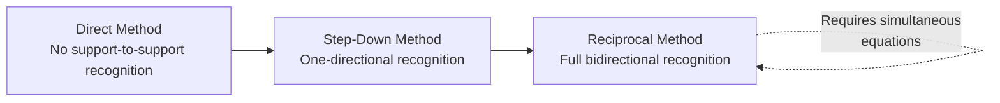
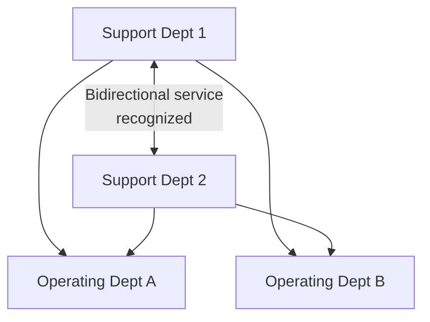

## Reciprocal Method of Support Department Allocation

### Overview

The reciprocal method (also called the algebraic or simultaneous equations method) is the most theoretically accurate of the three support department cost allocation approaches. It fully recognizes that support departments can provide services to one another **in both directions simultaneously**, solving a system of simultaneous linear equations to determine each support department's **total cost pool** — original costs plus all reciprocal services received — before allocating those totals to operating departments.

### Position Among the Three Allocation Methods

### The Reciprocal Mechanism

**Key Points**

- Unlike the step-down method, which closes out each support department after its single allocation (preventing any cost from ever flowing back to it), the reciprocal method recognizes that **Support Dept 1 services Support Dept 2 AND Support Dept 2 services Support Dept 1 simultaneously**.
- This requires solving for each support department's **true total cost** — including the cost it absorbs from other support departments — using a system of simultaneous equations, since each department's total cost depends on the other's total cost, which in turn depends back on the first.

### Step-by-Step Calculation Process

**Key Points**

1. Set up an algebraic equation for each support department, where its total cost equals its own directly traceable costs **plus** the share of costs it receives from every other support department.
2. Solve the resulting system of simultaneous equations (typically two equations for two support departments, solvable via substitution; more departments require matrix algebra or software).
3. Once each support department's **total (reciprocated) cost** is determined, allocate each department's total cost to **all** other departments (both support and operating) based on their relative usage — including allocating a share back to other support departments.
4. Because total costs already reflect the full reciprocal exchange, the amounts allocated *back* to other support departments during this final step exactly offset, so operating departments collectively absorb 100% of original total support department costs.

### Worked Example

Using the same base data as the direct and step-down method illustrations:

**Cost and Usage Data**

| Department | Own Costs | Maintenance Hours Used | Number of Employees |
| --- | --- | --- | --- |
| Maintenance (support) | $120,000 | — | 5 |
| Human Resources (support) | $80,000 | 200 | — |
| Machining (operating) | — | 1,200 | 60 |
| Assembly (operating) | — | 800 | 40 |

Total maintenance hours (all users): $200 + 1{,}200 + 800 = 2{,}200$. Total employees (all users): $5 + 60 + 40 = 105$.

**Step 1 — Set Up Simultaneous Equations**

Let $M$ = total (reciprocated) cost of Maintenance, and $H$ = total (reciprocated) cost of HR.

$$M = \$120{,}000 + \left(\frac{5}{105}\right)H$$

$$H = \$80{,}000 + \left(\frac{200}{2{,}200}\right)M$$

**Step 2 — Solve by Substitution**

Substitute the second equation into the first:

$$M = \$120{,}000 + \left(\frac{5}{105}\right)\left[\$80{,}000 + \left(\frac{200}{2{,}200}\right)M\right]$$

$$M = \$120{,}000 + 0.04762 \times \$80{,}000 + 0.04762 \times 0.09091 \times M$$

$$M = \$120{,}000 + \$3{,}810 + 0.00433 M$$

$$M - 0.00433M = \$123{,}810$$

$$0.99567M = \$123{,}810 \quad \Rightarrow \quad M \approx \$124{,}347$$

Substituting back to solve for $H$:

$$H = \$80{,}000 + \left(\frac{200}{2{,}200}\right)(\$124{,}347) = \$80{,}000 + \$11{,}304 \approx \$91{,}304$$

**Step 3 — Allocate Total Reciprocated Costs to All Departments**

$$\text{Maintenance to HR} = \left(\frac{5}{105}\right) \times \$124{,}347 \approx \$5{,}921$$

$$\text{Maintenance to Machining} = \left(\frac{1{,}200}{2{,}200}\right) \times \$124{,}347 \approx \$67{,}825$$

$$\text{Maintenance to Assembly} = \left(\frac{800}{2{,}200}\right) \times \$124{,}347 \approx \$45{,}217$$

$$\text{HR to Maintenance} = \left(\frac{200}{2{,}200}\right) \times \$91{,}304 \approx \$8{,}300$$

$$\text{HR to Machining} = \left(\frac{60}{100}\right) \times \$91{,}304 \approx \$54{,}783$$

$$\text{HR to Assembly} = \left(\frac{40}{100}\right) \times \$91{,}304 \approx \$36{,}522$$

*(Note: precise sub-allocation ratios for HR's distribution among Maintenance/Machining/Assembly depend on how the employee-count base is defined for HR's service recipients; this worked example uses simplified proportional bases for illustration purposes.)*

**Step 4 — Verify Operating Departments Absorb Full Original Cost**

$$\text{Total to Machining} = \$67{,}825 + \$54{,}783 = \$122{,}608$$

$$\text{Total to Assembly} = \$45{,}217 + \$36{,}522 = \$81{,}739$$

$$\text{Grand Total} = \$122{,}608 + \$81{,}739 = \$204{,}347$$

**Key Points**

- [Inference] The example above illustrates the reciprocal method's algebraic mechanics; the exact final allocated figures are sensitive to precisely how the allocation bases (particularly for HR's distribution) are specified, and real textbook problems define these bases explicitly to ensure the totals reconcile exactly to the original $200,000 in support costs.
- Despite intermediate cost pools ($M \approx \$124{,}347$ and $H \approx \$91{,}304$) exceeding the departments' original costs (since each includes reciprocated amounts received from the other), the amounts allocated *back* to support departments during final distribution exactly offset this inflation, so the total allocated to operating departments still reconciles to the original combined support cost.

### Advantages of the Reciprocal Method

**Key Points**

- **Theoretically the most accurate** of the three methods, since it is the only approach that fully captures bidirectional service flows between support departments without any artificial "closing out" sequence.
- **No sequencing arbitrariness**: unlike the step-down method, there is no need to choose (and potentially second-guess) an allocation order, since all relationships are solved simultaneously.
- **Conceptually consistent with true economic cost flows**, since it reflects the genuine, circular nature of how support departments often service one another in practice.

### Disadvantages of the Reciprocal Method

**Key Points**

- **Computational complexity**: solving simultaneous equations by hand becomes unwieldy with more than two or three support departments, generally requiring matrix algebra (using techniques such as Gaussian elimination or matrix inversion) or specialized software/spreadsheet tools for larger organizations.
- **Higher implementation and maintenance cost**: given the added complexity, and given that the accuracy improvement over the step-down method is often modest unless inter-support-department flows are substantial, many organizations judge the reciprocal method's benefits insufficient to justify its cost.
- **Reduced transparency/explainability**: the algebraic nature of the reciprocal method makes it harder for non-accounting managers to intuitively understand and trust the resulting allocated figures compared to the direct or step-down methods.

### Comparative Summary of All Three Methods

| Dimension | Direct | Step-Down | Reciprocal |
| --- | --- | --- | --- |
| Support-to-support recognition | None | Partial (one direction) | Full (bidirectional) |
| Computational method | Simple ratios | Sequential ratios | Simultaneous equations |
| Sequencing decision required? | No | Yes (introduces arbitrariness) | No |
| Accuracy | Lowest | Moderate | Highest |
| Practical prevalence | [Inference] Most common in practice, per general textbook/survey characterization | Moderately common | Least common, mainly larger/complex organizations or academic illustration |

### When the Reciprocal Method Is Most Appropriate

**Key Points**

- Support departments provide **substantial, genuinely bidirectional services** to one another (e.g., IT services HR's systems while HR handles IT department hiring/benefits), such that ignoring either direction would create meaningful distortion.
- The organization has the computational infrastructure (spreadsheet modeling, ERP-integrated allocation tools, or accounting software with built-in reciprocal allocation functionality) to manage the added complexity without excessive manual effort.
- The decisions supported by the resulting operating department costs are high-stakes enough (e.g., significant pricing or divisional performance evaluation decisions) to justify the additional accuracy over the simpler methods.

### Conclusion

The reciprocal method is the most accurate of the three support department allocation approaches because it fully recognizes bidirectional service flows between support departments through a system of simultaneous equations, avoiding both the direct method's complete disregard of inter-support-department services and the step-down method's one-directional sequencing arbitrariness. Its principal cost is computational and conceptual complexity, which generally limits its use to organizations with either significant reciprocal service flows, high-stakes decisions dependent on allocation accuracy, or the computational infrastructure to manage it efficiently.

**Related Topics**

- Direct Method of Support Department Allocation (Simplicity Baseline)
- Step-Down Method of Support Department Allocation (Intermediate Approach)
- Solving Simultaneous Equations for Multiple Support Departments Using Matrix Algebra
- Single-Rate vs. Dual-Rate Cost Allocation Approaches
- Allocation Method Selection: Cost-Benefit Tradeoffs in Practice