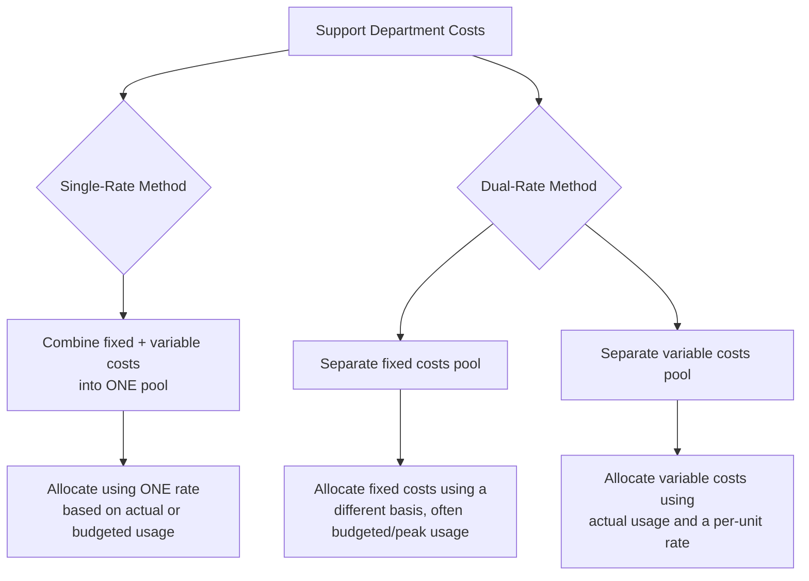

## Single Rate versus Dual Rate Allocation

### Overview

Single-rate and dual-rate allocation are two distinct approaches to how support department (or shared resource) costs are charged to using departments, independent of which allocation method (direct, step-down, or reciprocal) is used to distribute those costs across departments. This distinction addresses a different question than the direct/step-down/reciprocal choice: rather than "how do we handle inter-support-department flows," it addresses "should fixed and variable costs of a shared resource be allocated using the same rate, or separated and allocated differently?"

### The Core Distinction

**Key Points**

- The **single-rate method** combines all costs of a shared resource or support department — both fixed and variable — into a single cost pool and allocates them to using departments through one uniform rate, based on either budgeted or actual usage of a single allocation base.
- The **dual-rate method** separates the shared resource's costs into two distinct pools — a **fixed cost pool** and a **variable cost pool** — and allocates each using a method appropriate to its underlying cost behavior.

### Why the Distinction Matters: Cost Behavior

**Key Points**

- **Variable costs** of a shared resource (e.g., per-transaction processing costs, energy consumed per unit of service) genuinely increase with usage, so allocating them based on **actual usage** by each department reflects genuine cause-and-effect.
- **Fixed costs** of a shared resource (e.g., the cost of maintaining capacity to serve peak demand, equipment depreciation) do not vary with short-term usage — they represent capacity provided in advance, often based on departments' **long-run planned or peak demand**, not their actual usage in a given period.
- Combining these two fundamentally different cost behaviors into a single rate (as the single-rate method does) can create a mismatch: a department that reduces its usage in a period still "causes" the organization to bear the same fixed capacity cost, yet under single-rate allocation using actual usage, its allocated cost would fall — inaccurately suggesting it saved the organization fixed cost that was, in fact, still incurred.

### Single-Rate Method: Mechanics and Example

**Key Points**

- Formula:

$$\text{Single Rate} = \frac{\text{Total Fixed + Variable Costs of Resource}}{\text{Total Usage (Budgeted or Actual)}}$$

**Example**

An IT department has total annual costs of $500,000 ($350,000 fixed infrastructure costs + $150,000 variable, usage-driven costs), and total usage across departments is 10,000 support hours.

$$\text{Single Rate} = \frac{\$500{,}000}{10{,}000 \text{ hours}} = \$50 \text{ per hour}$$

If Department X uses 1,200 hours: $\text{Allocated Cost} = 1{,}200 \times \$50 = \$60{,}000$, blending both fixed and variable cost recovery into one per-hour charge.

### Dual-Rate Method: Mechanics and Example

**Key Points**

- **Fixed cost pool**: allocated based on each department's **budgeted long-run usage** or **peak-period demand** — the level of usage that determined how much capacity needed to be built or maintained in the first place. This reflects the principle that fixed capacity costs are caused by the decision to provide for peak/planned demand, not by short-term actual consumption.
- **Variable cost pool**: allocated based on **actual usage** during the period, using a per-unit variable rate — reflecting genuine incremental cost caused by that department's actual consumption.

**Example (Same IT Department)**

Suppose the $350,000 fixed cost is allocated based on each department's **budgeted peak-period usage** (used to determine required IT capacity), while the $150,000 variable cost is allocated based on **actual usage**.

| Department | Budgeted Peak Usage (for fixed allocation) | Actual Usage (for variable allocation) |
| --- | --- | --- |
| Department X | 1,000 hours (10% of 10,000 total budgeted peak) | 1,200 hours (12% of 10,000 total actual) |
| Department Y | 9,000 hours (90%) | 8,800 hours (88%) |

$$\text{Fixed Cost to X} = 0.10 \times \$350{,}000 = \$35{,}000$$

$$\text{Variable Rate} = \frac{\$150{,}000}{10{,}000 \text{ actual hours}} = \$15/\text{hour} \quad \Rightarrow \quad \text{Variable Cost to X} = 1{,}200 \times \$15 = \$18{,}000$$

$$\text{Total Dual-Rate Allocation to X} = \$35{,}000 + \$18{,}000 = \$53{,}000$$

**Key Points**

- Compare to the single-rate result for Department X ($60,000) — the dual-rate method produces a different (in this case lower) allocated cost, because it charges Department X for fixed capacity based on its *planned* usage share (10%) rather than its *actual* usage share (12%), preventing a department that happened to use more capacity in this period from being charged as if it had caused proportionally more fixed capacity to be built.

### Advantages of the Dual-Rate Method

**Key Points**

- **More accurate cost behavior matching**: charges departments for fixed costs based on the demand that drove capacity decisions, and for variable costs based on actual short-term consumption — aligning allocation with genuine cost causation for each cost type.
- **Better decision-making support**: separating fixed and variable components allows managers to see the incremental (variable) cost of additional usage distinctly from the sunk/committed (fixed) cost of capacity, supporting more accurate short-term decision analysis (e.g., evaluating a request to use more of a shared resource temporarily).
- **Discourages capacity-related gaming**: prevents departments from being penalized (via inflated allocated cost) for using more of a resource in a given period when that usage doesn't actually drive additional fixed capacity investment, and conversely prevents departments from appearing to "save" fixed costs merely by using less in a single period.

### Disadvantages of the Dual-Rate Method

**Key Points**

- **Added complexity**: requires separately classifying and tracking fixed and variable cost components of a shared resource, as well as maintaining both a budgeted/peak-usage base for fixed costs and an actual-usage base for variable costs.
- **Requires reliable cost classification**: some resource costs are not cleanly fixed or variable (mixed/semi-variable costs), requiring cost estimation techniques (e.g., high-low method, regression analysis) to separate them — introducing estimation complexity and potential error.
- **Budgeted-usage basis can create its own behavioral issues**: if departments influence or negotiate their "budgeted peak usage" figures (which determine their fixed cost allocation), there may be an incentive to understate anticipated peak needs to reduce allocated fixed cost — a behavioral risk that must be managed through governance around how budgeted usage figures are set.

### Comparative Summary

| Dimension | Single-Rate Method | Dual-Rate Method |
| --- | --- | --- |
| Cost pools | One combined pool | Separate fixed and variable pools |
| Allocation basis | One usage measure (often actual) | Fixed: budgeted/peak usage; Variable: actual usage |
| Complexity | Lower | Higher |
| Accuracy for cost behavior | Lower — blends fixed and variable | Higher — matches allocation basis to cost behavior |
| Risk of behavioral distortion | Departments can appear to reduce cost merely by reducing usage, even though fixed costs are unaffected | Reduced, but budgeted-usage negotiation risk remains |

### Interaction with Direct, Step-Down, and Reciprocal Methods

**Key Points**

- The single-rate/dual-rate choice is **independent of, and can be combined with**, any of the three support department allocation methods (direct, step-down, reciprocal) — an organization could, for example, use the reciprocal method to handle inter-support-department flows while also applying dual-rate treatment to separate each support department's fixed and variable costs before those flows are calculated.
- [Inference] In practice, combining dual-rate treatment with the more complex reciprocal method significantly increases implementation effort, so organizations more commonly pair dual-rate allocation with the simpler direct or step-down methods unless inter-support-department flows and fixed/variable cost separation are both individually material.

### Conclusion

The single-rate versus dual-rate distinction addresses how a shared resource's fixed and variable costs are allocated, separately from the question of how inter-support-department flows are handled. Single-rate allocation is simpler but risks distorting departmental incentives by charging fixed capacity costs based on short-term actual usage. Dual-rate allocation better matches allocation basis to underlying cost behavior — fixed costs to planned/peak demand, variable costs to actual usage — improving decision-relevance at the cost of additional complexity and the need for reliable fixed/variable cost classification.

**Related Topics**

- Fixed, Variable, and Mixed Cost Behavior and Estimation Techniques
- Budgeted vs. Actual Usage as an Allocation Basis
- Direct, Step-Down, and Reciprocal Methods of Support Department Allocation
- Responsibility Accounting and Controllability in Allocated Cost Design
- Capacity Planning and Peak-Demand-Based Cost Allocation