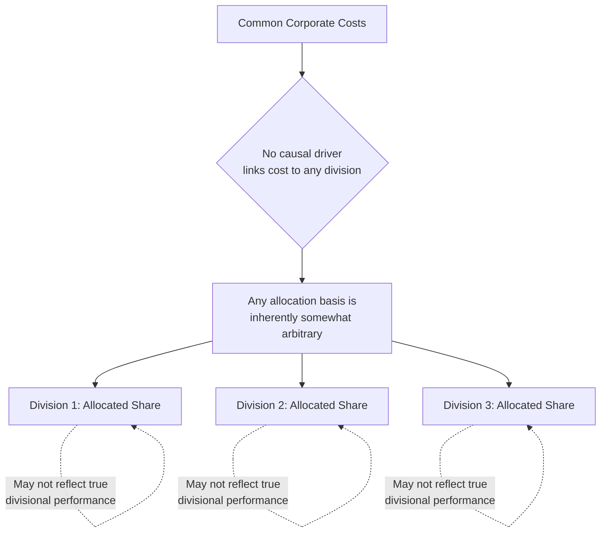

## Allocating Common Corporate Costs

### Overview

Common corporate costs are costs incurred at the highest organizational level — corporate headquarters, executive leadership, general legal, treasury, and similar functions — that benefit the organization as a whole rather than any single division, segment, or product line. Allocating these costs to divisions or business units raises distinct conceptual and practical challenges beyond those involved in allocating support department costs to operating departments, because common corporate costs often have **no plausible cause-and-effect relationship** to any individual segment's activities.

### What Are Common Corporate Costs?

**Key Points**

- Common corporate costs (also called corporate overhead or corporate-sustaining costs) include: executive salaries, corporate legal and compliance functions, corporate treasury and investor relations, corporate headquarters building costs, general corporate advertising/branding, and enterprise-wide IT infrastructure not tied to any specific division.
- These costs exist because the organization operates as a consolidated entity — they would likely persist even if any single division or product line were discontinued, distinguishing them from divisional or segment-specific costs.
- This places common corporate costs at the top of the cost hierarchy: analogous to **facility-sustaining costs** in the ABC unit/batch/product/facility hierarchy, but at the **organizational** rather than plant level.

### Why Allocating Common Corporate Costs Is Especially Challenging

**Key Points**

- Unlike support department costs (maintenance, HR) that at least have plausible operational usage-based drivers (machine hours, number of employees), common corporate costs frequently have **no genuine causal relationship** to any specific division's activity level.
- Because no true cause-and-effect basis exists, any allocation method chosen is to some degree **arbitrary** — the goal shifts from "accuracy" to selecting a basis that is **reasonable, consistent, and defensible** for its intended purpose.

### Common Allocation Bases Used in Practice

**Key Points**

- **Revenue-based allocation**: allocating corporate costs in proportion to each division's sales revenue. Simple and widely used, but can penalize high-revenue, low-margin divisions disproportionately relative to their actual resource consumption or their ability to absorb the allocated cost.
- **Asset-based allocation**: allocating in proportion to each division's total assets or net assets employed. Reflects capital intensity but not necessarily corporate resource consumption.
- **Headcount-based allocation**: allocating in proportion to the number of employees in each division. Useful for costs plausibly related to workforce size (e.g., corporate HR, payroll administration) but weak for costs unrelated to headcount (e.g., treasury, investor relations).
- **Operating income-based allocation**: allocating in proportion to each division's operating income before corporate charges. Can penalize the most profitable divisions with the largest allocated share, which some view as consistent with "ability to bear" cost, though others view it as punishing strong performance.
- **Equal allocation across divisions**: allocating corporate costs in equal dollar amounts regardless of division size. Simple and avoids penalizing larger or more successful divisions but can be seen as unfair to smaller divisions bearing a disproportionate cost relative to their size.

**Example**

| Division | Revenue | Assets | Headcount | Equal Split |
| --- | --- | --- | --- | --- |
| Division A | $40M (40%) | $100M (50%) | 400 (33%) | 33.3% |
| Division B | $35M (35%) | $60M (30%) | 500 (42%) | 33.3% |
| Division C | $25M (25%) | $40M (20%) | 300 (25%) | 33.3% |

**Key Points**

- With $3,000,000 in common corporate costs, the allocated amount to Division A ranges from $750,000 (equal split) to $1,500,000 (asset-based) to $1,200,000 (revenue-based) to $990,000 (headcount-based) — illustrating how dramatically the choice of allocation basis can change a division's reported cost and, consequently, its reported profitability, purely as a function of which basis is selected.

### Conceptual Frameworks for Handling Common Corporate Costs

**Key Points**

- **Do not allocate at all for internal performance evaluation**: many organizations report divisional performance using **controllable contribution margin** or **segment margin before corporate charges**, explicitly excluding common corporate costs from divisional evaluation on the grounds that division managers cannot control or influence them, aligning with the **controllability principle** in responsibility accounting.
- **Allocate only for external reporting or specific analytical purposes**: consistent with the "purposes of cost allocation" framework, if the goal is understanding total company-wide profitability by segment (e.g., for external segment reporting under accounting standards) or supporting a divestiture/acquisition analysis, allocating common corporate costs may be necessary even though it introduces arbitrariness.
- **Two-tier reporting**: present both a "segment margin" (excluding corporate allocation, used for performance evaluation) and a "fully allocated" or "total segment income" figure (including corporate allocation, used for overall profitability assessment) — allowing each figure to serve its appropriate purpose without conflating the two.

### The Controllability Principle and Common Corporate Costs

**Key Points**

- The **controllability principle** in responsibility accounting holds that managers should be evaluated only on costs and outcomes they can meaningfully influence.
- Because divisional managers typically have little to no control over decisions such as executive compensation, corporate legal strategy, or headquarters lease terms, allocating these costs to their divisions and then judging their performance based on post-allocation profit can create **misleading and demotivating performance signals**.
- **Example**: A division manager who successfully grows revenue and controls all controllable costs might still show declining "fully allocated" profit if corporate costs (e.g., a new executive hire, a corporate litigation settlement) rise — a result entirely outside that manager's control, undermining the diagnostic and motivational value of the allocated profit figure for evaluation purposes.

### External Reporting Requirements for Common Costs

**Key Points**

- Accounting standards for **segment reporting** (e.g., under U.S. GAAP's ASC 280 or IFRS 8) generally require disclosure of segment results but do not necessarily mandate that every common corporate cost be allocated down to the segment level — many companies report segment operating income *before* certain unallocated corporate items, with a reconciliation to consolidated net income.
- [Unverified] The precise treatment and disclosure requirements for common/unallocated corporate costs can vary based on the specific accounting framework, jurisdiction, and how a company defines its reportable segments, so a company's segment reporting policy should be reviewed for specifics rather than assumed to follow a single universal rule.

### Common Corporate Cost Allocation and Transfer Pricing Considerations

**Key Points**

- In multinational organizations, common corporate cost allocation intersects with **transfer pricing** rules, since tax authorities in different jurisdictions may scrutinize how much corporate overhead is allocated to subsidiaries operating in their jurisdiction, affecting the subsidiary's reported taxable income.
- [Inference] This creates a compliance dimension to common corporate cost allocation beyond pure managerial accounting concerns, requiring coordination between accounting/finance and tax functions in organizations with cross-border operations — though specific requirements are jurisdiction-dependent and beyond the scope of a general allocation basis discussion.

### Advantages and Disadvantages Summary

| Approach | Advantage | Disadvantage |
| --- | --- | --- |
| Revenue-based | Simple, widely understood | Penalizes low-margin, high-revenue divisions |
| Asset-based | Reflects capital intensity | Weak link to actual corporate resource use |
| Headcount-based | Intuitive for people-related corporate costs | Weak for non-labor-related corporate functions |
| Operating income-based | Reflects "ability to pay" | Can penalize strong performers; discourages profit growth optics |
| Equal split | Simple, doesn't penalize scale | Disproportionate burden on smaller divisions |
| No allocation (segment margin only) | Preserves controllability principle; clean performance evaluation | Understates true "fully burdened" profitability for company-wide analysis |

### Conclusion

Allocating common corporate costs presents a more acute version of the arbitrariness problem seen with facility-sustaining costs in ABC, since no plausible cause-and-effect driver typically connects headquarters-level costs to individual divisions. Organizations must choose among imperfect allocation bases (revenue, assets, headcount, operating income, or equal split) when allocation is required, while many best practices favor excluding common corporate costs from divisional performance evaluation altogether in favor of controllable segment margin, reserving fully allocated figures for external reporting or company-wide profitability analysis where their purpose differs from internal performance measurement.

**Related Topics**

- Controllability Principle in Responsibility Accounting
- Segment Reporting Requirements Under GAAP and IFRS
- Controllable Margin vs. Segment Margin vs. Divisional Net Income
- Transfer Pricing and Multinational Cost Allocation
- Purposes of Cost Allocation (Foundational Framework)
- Evaluating Divisional Performance: ROI, Residual Income, and EVA