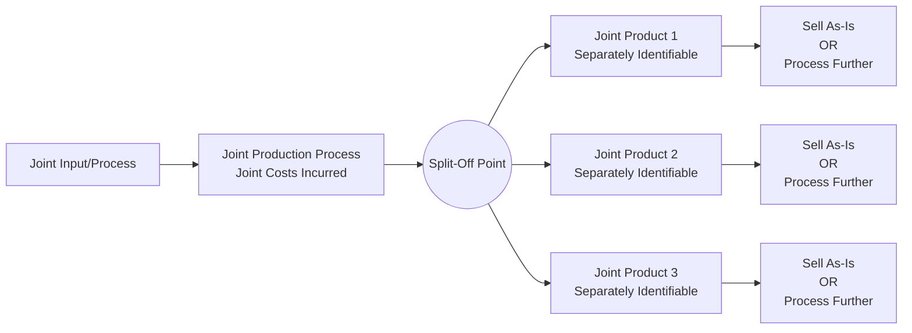

## Joint Cost Characteristics and the Split Off Point

### Overview

Joint costs arise in production processes where a single input or process simultaneously yields two or more distinct products that cannot be separately identified until a specific point in production. Understanding the characteristics of joint costs and the significance of the split-off point is foundational to all subsequent joint cost allocation methods and joint-product decision-making (such as sell-or-process-further decisions).

### Defining Joint Costs

**Key Points**

- **Joint costs** are the costs of a single production process that simultaneously yields multiple products, incurred **before** those products can be separately identified as distinct outputs.
- Joint costs typically include raw materials, direct labor, and manufacturing overhead incurred up to the point where the products become separately identifiable.
- The defining feature of a joint cost is that it **cannot be traced or attributed to any individual product** using a cause-and-effect relationship, because at the point the cost is incurred, the individual products do not yet exist as distinguishable outputs — this is fundamentally different from the allocation challenges of overhead or support department costs, where at least some causal link is often identifiable.

### The Split-Off Point

**Key Points**

- The **split-off point** is the specific point in the production process at which the joint products become **separately identifiable** as distinct outputs — prior to this point, all costs incurred are joint costs applicable to the combined mass of products; after this point, costs can be traced to individual products.
- Costs incurred **before** the split-off point (joint costs) must be allocated across the joint products using one of the joint cost allocation methods, since no direct tracing is possible.
- Costs incurred **after** the split-off point are called **separable costs** (or further processing costs) and **can** be directly and unambiguously traced to the specific product for which they were incurred, since the products are now distinguishable.

### Characteristics of Joint Costs

**Key Points**

1. **Simultaneous production**: joint products emerge together from the same process; producing more of one joint product inherently means producing more of the other(s), at least within the initial joint process (e.g., processing more crude oil yields more of both gasoline and other refined products simultaneously).
2. **Indivisibility before split-off**: the joint cost cannot be decomposed into a "cost of Product A" and a "cost of Product B" component prior to split-off, because the underlying production process does not distinguish between them at that stage.
3. **Irrelevance to sell-or-process-further decisions**: because joint costs are incurred regardless of what happens to the products afterward, they are **sunk costs** with respect to any decision made at or after the split-off point (such as whether to sell a product as-is or process it further) — a critical principle covered in depth in sell-or-process-further analysis.
4. **Allocation is inherently somewhat arbitrary**: since no cause-and-effect relationship links joint costs to individual products before split-off, any joint cost allocation method is, to some degree, an approximation chosen for a specific purpose (inventory valuation, profitability reporting) rather than a precise causal assignment.

### Classifying Outputs: Joint Products, By-Products, and Scrap

**Key Points**

- **Joint products**: two or more products from a joint process that each have significant relative sales value, such that management considers them primary outputs of the process (e.g., gasoline and diesel from crude oil refining).
- **By-products**: outputs of a joint process that have relatively minor sales value compared to the main joint product(s) — produced incidentally rather than as a primary objective of the process (e.g., sawdust from lumber milling).
- **Scrap**: material residue from production with minimal or negligible sales value, sometimes essentially worthless or requiring disposal cost.
- The distinction between joint products, by-products, and scrap is generally based on **relative sales value**, and this classification determines which accounting treatment applies (full joint cost allocation methods for joint products; simplified treatments for by-products, discussed separately).
- [Inference] The specific sales-value threshold used to distinguish a "joint product" from a "by-product" is a matter of managerial judgment and is not defined by a universal numeric standard — different companies and even different textbook problems may apply this classification differently based on the relative magnitudes involved.

### Example: Petroleum Refining

**Key Points**

- Crude oil enters a refining process (the joint process) and, at the split-off point, yields several separately identifiable outputs: gasoline, diesel fuel, jet fuel, and various petrochemical feedstocks.
- The cost of crude oil, refinery operation, and processing up to the split-off point constitutes the **joint cost** — this cost cannot be traced to "the gasoline portion" versus "the diesel portion" of the crude oil, since the refining process transforms the crude oil into multiple products simultaneously.
- After split-off, each product may undergo **further processing** (e.g., additional refining of gasoline to different octane grades) — costs incurred at this stage are separable costs, directly traceable to the specific product.

### Example: Meat Processing

**Key Points**

- A meatpacking company processes livestock, and at a certain point in the process, several distinct cuts of meat (and by-products such as hides) become separately identifiable.
- All costs incurred up to that point — livestock purchase cost, initial processing labor, overhead — are joint costs, since the process does not distinguish "cost of the sirloin" from "cost of the ground beef" until the animal is processed to the point of separation.
- Costs incurred after this split-off point, such as specialized packaging for premium cuts or additional processing to create sausage from certain cuts, are separable costs traceable to those specific products.

### Why the Split-Off Point Concept Matters

**Key Points**

- **Cost allocation boundary**: the split-off point defines exactly which costs must be allocated using joint cost allocation methods (physical measure, sales value at split-off, NRV, or constant gross-margin percentage NRV) versus which costs can be directly assigned.
- **Decision-making boundary**: the split-off point is the critical reference point for **sell-or-process-further decisions** — since joint costs are sunk by the time products reach split-off, the decision to process a product further should be based solely on comparing the **incremental revenue** from further processing against the **incremental (separable) cost** of that further processing, entirely ignoring the joint cost already incurred.
- **Inventory valuation boundary**: for external reporting, all joint costs allocated to a product (regardless of allocation method chosen) become part of that product's inventoriable cost; separable costs incurred after split-off are added to whichever product they are traceable to.

### Multiple Split-Off Points

**Key Points**

- Some production processes involve **more than one split-off point** — an initial joint process may yield an intermediate joint product that, after some further joint processing, splits again into additional distinct products.
- In such cases, each split-off point marks a boundary at which costs incurred up to that point (from the prior split-off point or the start of the process) are treated as joint costs relative to the products separated at that specific point, and the joint cost allocation process may need to be applied sequentially or in stages.

### Common Misconceptions

**Key Points**

- **Misconception**: joint cost allocation determines which products are "more profitable." In reality, because joint cost allocation is arbitrary by construction, the resulting per-unit "cost" and implied profitability of each joint product should not be used to conclude that one product is inherently more or less worth producing — the joint process typically must be run in its entirety to obtain any of the joint products, so individual product "profitability" figures derived from allocated joint costs are largely an artifact of the allocation method chosen, not an indicator of true economic desirability.
- **Misconception**: joint costs are relevant to the sell-or-process-further decision. As sunk costs, joint costs are **never relevant** to this decision regardless of which allocation method was used to assign them to products.

### Conclusion

Joint costs arise when a single process yields multiple products that cannot be distinguished until the split-off point, at which point they become separately identifiable and any further costs incurred are directly traceable separable costs. The defining characteristics of joint costs — simultaneous production, indivisibility prior to split-off, and irrelevance to post-split-off decisions as sunk costs — underpin both how joint costs must be allocated (necessarily using approximation methods, since no true cause-and-effect basis exists) and how sell-or-process-further decisions should be analyzed (based solely on incremental revenues and separable costs, ignoring joint costs entirely).

**Related Topics**

- Physical Measure Method of Joint Cost Allocation
- Sales Value at Split-Off Method of Joint Cost Allocation
- Net Realizable Value (NRV) Method of Joint Cost Allocation
- Constant Gross-Margin Percentage NRV Method
- Sell-or-Process-Further Decisions and Relevant Cost Analysis
- Accounting for By-Products and Scrap